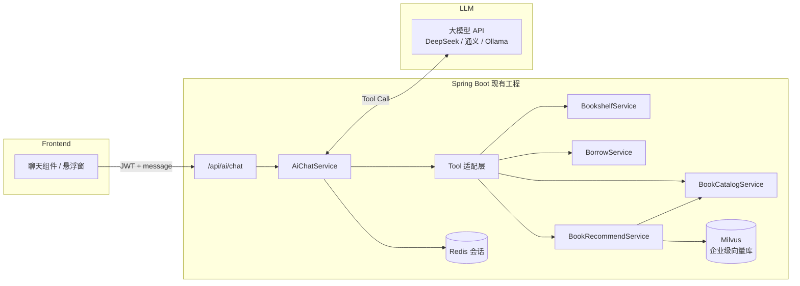

# 智慧书城 AI 客服 — 技术方案


> **项目**：smart_bookstore（智慧书城） · **文档类型**：学习文档  
> **关联**：`com.zx.ai` — AI 方案总览，配合 AI 模块学习文档  
> **索引**：[学习文档中心](./README.md)

> 项目：`smart_bookstore`  
> 目标：在现有书城系统上增加 **AI 客服**，回答「有没有这本书」「书在哪里」「能不能借」等问题，并支持 **智能推荐阅读**  
> 原则：**复用现有业务数据与接口**，不重复造一套图书查询逻辑  
> 最后更新：2026-07

---

## 一、为什么要做 AI 客服

读者到馆或线上咨询时，高频问题集中在：

| 问题类型 | 示例 | 现有数据是否可答 |
|----------|------|------------------|
| 藏书查询 | 「有《Redis 设计与实现》吗？」 | ✅ `book` 表 + 关键字搜索 |
| 架位导航 | 「这本书在几楼几层？」 | ✅ `bookshelf` + `shelf_layer` → `shelfLocation` |
| 可借/可买 | 「能借吗？还剩几本？」 | ✅ `borrow_stock` / `sale_stock` |
| 业务规则 | 「怎么预约座位？签到送券吗？」 | ✅ 项目 `docs/` 文档 + 固定 FAQ |
| 个人状态 | 「我借了哪些书？订单到哪了？」 | ✅ 需登录后查 `borrow_order` / `trade_order` |
| **智能推荐** | 「想学 Redis 推荐什么？」「看了 Java 书还读啥？」 | ✅ 分类 + 描述 + 借阅/购书行为 + 可选语义检索 |

AI 客服的价值不是替代搜索框，而是把 **自然语言 → 查库/推荐 → 组织成口语化回答** 串起来，降低使用门槛，答辩/简历上也能讲「LLM + Tool Calling + 推荐策略 + 业务闭环」。

---

## 二、推荐架构：Tool Calling 为主，推荐引擎 + 轻量 RAG 为辅

### 2.1 为什么不建议「纯 RAG」做查书

把全部图书导入向量库，用 Embedding 检索后让大模型回答，存在：

- **数据滞后**：上架、下架、库存、架位变更后，向量库需同步
- **精确性差**：「第几楼第几层」这类结构化字段，SQL 比语义检索更可靠
- **成本高**：图书量不大时，维护向量索引性价比低

你们已有 **MySQL 结构化数据 + Redis 缓存 + 书架定位字段**，更适合让 AI **调用现有 Service**，而不是让模型「背」书目。

**但推荐阅读不同**：用户说「想学后端」「类似红楼梦的书」，带有语义模糊性，适合 **推荐 Tool 内部组合 SQL 规则 + 可选 Embedding 语义匹配**，再由 LLM 解释「为什么推荐」。

### 2.2 推荐方案（MVP 可 1～2 周落地）

```text
用户提问（自然语言）
    ↓
前端聊天窗口 → POST /api/ai/chat（SSE 流式可选）
    ↓
AiChatService
    ├─ 会话上下文（Redis，最近 N 轮）
    ├─ System Prompt（书城客服人设 + 可答范围）
    └─ LLM（带 Function / Tool Calling）
           ├─ searchBooks(keyword)        → 精确查书
           ├─ getBookById(id)             → 架位、库存
           ├─ recommendBooks(context)     → 【新增】智能推荐阅读
           ├─ getUserReadingProfile()     → 【新增】用户借阅/购书画像（需登录）
           ├─ listBookshelves(floor)      → 书架列表
           ├─ getBorrowRules()            → FAQ
           └─ getMyBorrowOrders()         → 个人借阅
    ↓
模型根据 Tool 返回的 JSON，生成自然语言回复（推荐须说明理由）
    ↓
返回用户（cards 含 type=recommend 的图书列表，最多 3～5 本）
```

**RAG / Embedding 用于**：

1. FAQ（借阅、签到、预约规则）— 文档量小  
2. **推荐阅读的语义匹配** — 将 `title + author + category + description` 向量化，匹配「想学缓存」「入门 Java」类模糊意图（图书量 <500 时性价比合适）

**不推荐**让 LLM 凭空编造书名；推荐结果 **必须来自 `recommendBooks` Tool 返回的书目 ID 列表**。

### 2.3 架构图



---

## 2A、智能推荐阅读（扩展能力）

### 2A.1 推荐场景分类

| 场景 | 用户说法 | 推荐策略 | 是否需要登录 |
|------|----------|----------|--------------|
| 兴趣探索 | 「有什么技术书推荐？」 | 分类热门 + 可借优先 | 否 |
| 语义学习 | 「想学 Redis / 入门 Spring」 | Embedding 语义检索 + 分类过滤 | 否 |
| 相似扩展 | 「和《Java 核心技术》类似的书」 | 同分类 + 同作者优先 + 语义近邻 | 否 |
| 个性化 | 「根据我借过的书推荐」 | 用户画像：借阅/购书历史 → 协同过滤 | **是** |
| 场景组合 | 「想借一本小说放松」 | 分类=文学 + borrowStock>0 + 随机/热门 | 否 |
| 读完续读 | 「刚还了 Spring Boot，接下来读啥？」 | 最近归还书 → 同分类进阶书目 | **是** |

### 2A.2 三层推荐引擎（由简到难，可分期做）

```text
┌─────────────────────────────────────────────────────────┐
│  Layer 3：LLM 编排（只解释理由，不凭空造书名）           │
├─────────────────────────────────────────────────────────┤
│  Layer 2：recommendBooks Tool（Spring Service 聚合）      │
│    ├─ 规则召回：categoryId、borrowStock>0、status=1    │
│    ├─ 行为召回：borrow_order / trade_order 共现 TopN    │
│    ├─ 语义召回：Spring AI Embedding + **Milvus VectorStore** │
│    └─ 重排序：可借 > 有架位 > 热度 > 语义分              │
├─────────────────────────────────────────────────────────┤
│  Layer 1：现有业务数据（零新增表即可 MVP）                │
│    book、book_category、borrow_order、trade_order、cart  │
└─────────────────────────────────────────────────────────┘
```

**MVP（P-AI-R0，约 2 天）**：只做 Layer 1 + 规则召回，不做向量库。  
**增强（P-AI-R1）**：加 Embedding 语义召回。  
**完整（P-AI-R2）**：登录用户个性化 + 推荐日志统计。

### 2A.3 推荐技术选型

| 能力 | 技术 | 说明 |
|------|------|------|
| 规则/热门推荐 | **MySQL 聚合 SQL** | `GROUP BY book_id` 统计借阅/购书次数，零依赖 |
| 同分类/同作者 | **BookRepository** | `category_id`、`author` 过滤 |
| 语义「想学 XX」 | **Spring AI Embedding** + **Milvus** | 企业级向量库；Spring AI 官方 starter；持久化、可扩展 |
| Embedding 模型 | **通义 text-embedding-v3** 或 **DeepSeek embedding** | 与 Chat 同厂商；**dimension 须与 Milvus collection 一致** |
| Milvus 部署 | Docker standalone / K8s / **Zilliz Cloud** | 开发用 standalone；生产可上云托管 |
| 个性化 | **Item-Based CF（简化版）** | 「借过 A 的人也借 B」；demo 数据少时可降级为「同分类未借过」 |
| 去重/过滤 | Java 代码 | 排除用户已借未还、已下架、库存为 0（可借场景） |
| 缓存 | **Redis** | Key: `ai:recommend:hot:{categoryId}`，TTL 10min |

**不推荐**一上来做 Spark/大数据推荐；你们书目规模用 **SQL + Embedding + 简单共现** 即可答辩。

### 2A.4 `recommendBooks` Tool 设计

**入参**：

```json
{
  "intent": "EXPLORE | LEARN | SIMILAR | PERSONALIZED | RELAX",
  "query": "想学 Redis",
  "categoryId": null,
  "seedBookId": null,
  "preferBorrowable": true,
  "limit": 5
}
```

| 字段 | 说明 |
|------|------|
| `intent` | 推荐意图，由 LLM 从用户话术中解析 |
| `query` | 自然语言主题，语义召回用 |
| `seedBookId` | 「和某书类似」时传入 |
| `preferBorrowable` | true 时优先 `borrow_stock > 0` |
| `limit` | 返回条数，建议 3～5 |

**内部召回逻辑（伪代码）**：

```text
candidates = []

if intent == PERSONALIZED and userId != null:
    candidates += 用户借过/买过的分类下未接触的书
    candidates += 共现推荐（borrow_order 同用户其他书）

if intent == SIMILAR and seedBookId != null:
    candidates += 同 category_id、同 author
    candidates += vectorSearch(query=seedBook.title + description)

if intent == LEARN and query != null:
    candidates += vectorSearch(query)
    candidates += searchBooks(keyword=extractKeywords(query))

if intent == EXPLORE:
    candidates += hotBooksByCategory(categoryId)  -- 借阅+购书次数 Top

candidates = dedupe + filter(status=1) + filter(已借未还)
candidates = rerank(可借权重, 热度, 语义分)
return top(limit)  -- 每条含 recommendReason 字段
```

**返回示例**：

```json
{
  "recommendations": [
    {
      "bookId": 13,
      "title": "Redis 设计与实现",
      "author": "黄健宏",
      "categoryName": "技术",
      "borrowStock": 5,
      "shelfLocation": "2楼 A-02 第4层",
      "recommendReason": "语义匹配「Redis」；本馆借阅热度 Top2",
      "score": 0.92
    },
    {
      "bookId": 12,
      "title": "Spring Boot 实战",
      "author": "Craig Walls",
      "borrowStock": 8,
      "shelfLocation": "2楼 A-01 第2层",
      "recommendReason": "与 Java/Spring 技术栈衔接；可借 8 册",
      "score": 0.85
    }
  ]
}
```

`recommendReason` 给 LLM 组织话术，**禁止模型自己编推荐理由**。

### 2A.5 用户阅读画像 Tool（个性化）

**`getUserReadingProfile`**（需 JWT）：

```json
{
  "borrowedCategories": ["技术", "文学"],
  "recentBooks": [
    { "bookId": 11, "title": "Java 核心技术", "status": "RETURNED" }
  ],
  "preferredAuthors": ["Cay S. Horstmann"],
  "totalBorrowed": 3,
  "totalPurchased": 1
}
```

数据来源：

- `borrow_order` + `book` + `book_category`（历史借阅）
- `trade_order` + 订单项（购书偏好）
- 可选：`cart_item`（加购未买，权重较低）

### 2A.6 图书语义索引（Milvus，P-AI-R1）

**向量库选型：Milvus（企业级）**

| 项 | 说明 |
|----|------|
| 为何不用 Redis Vector | Redis 适合缓存；Milvus 为 **专用向量库**，持久化与规模更适合 RAG/推荐 |
| 与 MySQL 关系 | MySQL 存书目事实；Milvus 只存 embedding + metadata；检索后 **回查 MySQL** 拿架位/库存 |
| 与 Redis 关系 | Redis 继续负责会话、限流、图书详情缓存，**不存向量** |

**索引内容**（每条图书一条 Document）：

```text
{title} | {author} | 分类:{categoryName} | {description}
```

**Collection 规划**：

| Collection | 用途 |
|------------|------|
| `bookstore_book` | 图书语义推荐 |
| `bookstore_faq` | FAQ / 业务规则 RAG（可选） |

**何时重建**：

- 管理端上架/更新图书后，按 `bookId` 删除 Milvus 旧向量并重新 embed
- 或 nightly 从 MySQL 全量同步（书量少时可行）

**依赖与配置**：

```xml
<dependency>
    <groupId>org.springframework.ai</groupId>
    <artifactId>spring-ai-starter-vector-store-milvus</artifactId>
</dependency>
<dependency>
    <groupId>org.springframework.ai</groupId>
    <artifactId>spring-ai-starter-model-openai</artifactId>
</dependency>
```

```yaml
spring:
  ai:
    vectorstore:
      milvus:
        client:
          host: ${MILVUS_HOST:localhost}
          port: ${MILVUS_PORT:19530}
        collection-name: bookstore_book
        embedding-dimension: 1536    # 与 Embedding 模型一致
        initialize-schema: true
        metric-type: COSINE
```

**本地启动（Docker）**：

```bash
docker run -d --name milvus-standalone \
  -p 19530:19530 -p 9091:9091 \
  -v milvus_data:/var/lib/milvus \
  milvusdb/milvus:v2.4.4 milvus run standalone
```

### 2A.7 可选：推荐日志表（P-AI-R2）

便于答辩展示「推荐点击率」：

```sql
CREATE TABLE ai_recommend_log (
  id            BIGINT UNSIGNED PRIMARY KEY AUTO_INCREMENT,
  user_id       BIGINT UNSIGNED NULL,
  session_id    VARCHAR(64) NOT NULL,
  query_text    VARCHAR(512) NOT NULL,
  intent        VARCHAR(32) NOT NULL,
  book_ids      JSON NOT NULL COMMENT '推荐结果 ID 数组',
  clicked_book_id BIGINT UNSIGNED NULL,
  created_at    DATETIME NOT NULL DEFAULT CURRENT_TIMESTAMP
);
```

前端图书卡片点击时 `POST /api/ai/recommend/click` 回写 `clicked_book_id`。

---

## 三、技术栈选型

### 3.1 方案对比

| 方案 | 后端集成 | 模型 | 适用场景 | 难度 |
|------|----------|------|----------|------|
| **A. Spring AI + 云 API（推荐）** | `spring-ai-starter-model-openai` 兼容 DeepSeek/通义 | DeepSeek-V3、Qwen-Plus | 毕设/答辩/demo，中文好、按量付费 | ⭐⭐ |
| **B. LangChain4j** | `langchain4j-spring-boot-starter` | 同上 | 喜欢显式 Chain、Tool 注解 | ⭐⭐⭐ |
| **C. 本地 Ollama** | Spring AI `ollama` starter | Qwen2.5:7b | 无 API 费用、离线、效果略弱 | ⭐⭐ |
| **D. 纯规则 + 关键词（无 LLM）** | 自研 Intent 分类 | 无 | 仅演示「智能」外观，简历亮点弱 | ⭐ |

**本项目推荐：方案 A（Spring AI + DeepSeek 或阿里通义千问）**

理由：

1. 与现有 **Spring Boot 4.1 + Java 21** 栈一致，一个 `pom` 依赖即可
2. 官方支持 **Function Calling / Tool**，正好对接 `BookCatalogService`
3. DeepSeek / 通义 **中文便宜**，适合学生项目
4. 后期可无缝换 Ollama 做本地化

### 3.2 推荐技术栈清单

| 层级 | 技术 | 说明 |
|------|------|------|
| 大模型 | **DeepSeek API** 或 **通义千问（DashScope）** | OpenAI 兼容接口；答辩演示够用 |
| Java 框架 | **Spring AI 1.x** | `ChatClient`、Tool、SSE |
| 会话 | **Redis** | Key: `ai:chat:{userId}:{sessionId}`，TTL 30min |
| 限流 | 复用 `auth.rate-limit` 思路 | 每用户每分钟 N 次，防刷 Token |
| 鉴权 | 现有 **JWT** | 查个人借阅单需登录；查书目可匿名或弱登录 |
| 前端 | Vue3 聊天组件 | 悬浮按钮 + 消息列表；`fetch` + SSE 流式 |
| 可选 RAG | **Spring AI + Milvus** | FAQ 片段 + 图书 description 语义推荐 |
| 监控 | 日志 + 可选 `ai_chat_log` 表 | 记录 question、tools 调用、token 用量 |

### 3.3 Maven 依赖示例（Spring AI + OpenAI 兼容）

```xml
<!-- Spring AI BOM 需在 dependencyManagement 中引入，版本以官方文档为准 -->
<dependency>
    <groupId>org.springframework.ai</groupId>
    <artifactId>spring-ai-starter-model-openai</artifactId>
</dependency>
```

`application.yaml` 配置 DeepSeek 示例：

```yaml
spring:
  ai:
    openai:
      api-key: ${DEEPSEEK_API_KEY}
      base-url: https://api.deepseek.com
      chat:
        options:
          model: deepseek-chat
          temperature: 0.3   # 客服场景偏低，减少胡编
```

---

## 四、核心 Tool 设计（对接现有模块）

### 4.1 Tool 列表

| Tool 名称 | 入参 | 调用现有代码 | 回答的问题 |
|-----------|------|--------------|------------|
| `searchBooks` | `keyword` | `BookRepository.pageEnabled(...)` | 有没有某书、模糊搜书名/作者 |
| `getBookDetail` | `bookId` | `BookCatalogService.getBookDetail(id)` | 详情、价格、库存、**架位** |
| **`recommendBooks`** | `intent, query?, categoryId?, seedBookId?, limit?` | **`BookRecommendService`** | **智能推荐阅读** |
| **`getUserReadingProfile`** | — | 聚合 `borrow_order` / `trade_order` | 个性化推荐前置画像 |
| `listBookshelves` | `floor?` | `BookshelfService.listEnabled(floor)` | 2 楼有哪些书架 |
| `getBookCategories` | — | `BookCatalogService.listCategories()` | 有哪些分类 |
| `searchFaq` | `query` | 静态 Map 或小型 RAG | 怎么借书、签到规则 |
| `getMyBorrowOrders` | `status?` | `BorrowService.listMine(userId)` | 我借了哪些、待取书架位 |

### 4.2 Tool 返回示例（给模型看的 JSON）

**searchBooks** 返回：

```json
{
  "total": 1,
  "books": [
    {
      "id": 13,
      "title": "Redis 设计与实现",
      "author": "黄健宏",
      "borrowStock": 5,
      "saleStock": 20,
      "shelfLocation": "2楼 A-02 第4层",
      "status": 1
    }
  ]
}
```

模型据此生成：

> 有的！《Redis 设计与实现》目前可借 5 册、可售 20 册，取书位置在 **2楼 A-02 第4层**。需要我帮您申请借阅吗？

### 4.3 System Prompt 要点

```text
你是智慧书城 AI 客服，可回答图书查询、架位导航、借阅购书规则，并可 **根据本馆真实书目进行推荐阅读**。
规则：
1. 涉及「有没有书」「在哪里」，必须先调用 searchBooks 或 getBookDetail，禁止编造书名和架位。
2. 涉及「推荐读什么」「类似 XX 的书」「学什么技术」，必须先调用 recommendBooks 或 getUserReadingProfile，只推荐 Tool 返回的书目。
3. 推荐时用 1～2 句话说明每本书的 recommendReason，并注明架位与是否可借。
4. 个性化推荐（「根据我借过的」）须用户已登录，先 getUserReadingProfile 再 recommendBooks(intent=PERSONALIZED)。
5. 架位以 shelfLocation 为准；库存以 borrowStock、saleStock 为准。
6. 无法回答时，引导 /books 搜索或联系人工客服。
7. 回答简洁友好，推荐列表不超过 5 本。
```

---

## 五、后端模块规划

### 5.1 包结构

```text
com.zx.ai
├── config/
│   └── AiProperties.java          # apiKey、model、maxTurns、rateLimit
├── controller/
│   └── AiChatController.java      # POST /api/ai/chat、GET /api/ai/sessions
├── dto/
│   ├── ChatRequest.java           # { sessionId?, message }
│   └── ChatResponse.java          # { reply, sessionId, cards? }
├── service/
│   ├── AiChatService.java
│   ├── AiSessionRedisService.java
│   └── BookRecommendService.java  # 规则/语义/行为召回 + 重排序
├── tool/
│   ├── BookSearchTool.java
│   ├── BookDetailTool.java
│   ├── BookRecommendTool.java     # recommendBooks
│   ├── UserReadingProfileTool.java
│   ├── BookshelfTool.java
│   ├── FaqTool.java
│   └── MyBorrowTool.java
├── recommend/
│   ├── HotBookRecaller.java       # 热门（借阅+购书次数）
│   ├── SimilarBookRecaller.java   # 同分类/同作者/向量近邻
│   ├── PersonalizedRecaller.java  # 用户画像
│   └── BookEmbeddingIndexer.java  # 图书向量索引维护
└── support/
    └── AiRateLimiter.java         # 按 userId / IP 限流
```

### 5.2 API 设计草案

| 方法 | 路径 | 鉴权 | 说明 |
|------|------|------|------|
| POST | `/api/ai/chat` | 可选 Bearer（查个人订单需登录） | 同步返回完整回复 |
| POST | `/api/ai/chat/stream` | 同上 | SSE 流式打字效果 |
| GET | `/api/ai/sessions/{id}` | USER | 拉历史消息（可选） |
| DELETE | `/api/ai/sessions/{id}` | USER | 清空会话 |
| POST | `/api/ai/recommend/click` | USER | 推荐卡片点击埋点（可选） |

**请求体**：

```json
{
  "sessionId": "uuid-optional",
  "message": "有没有红楼梦，在几楼？"
}
```

**响应体**：

```json
{
  "code": 0,
  "data": {
    "sessionId": "uuid",
    "reply": "根据您的需求，为您推荐 2 本技术书：",
    "cards": [
      {
        "type": "recommend",
        "bookId": 13,
        "title": "Redis 设计与实现",
        "shelfLocation": "2楼 A-02 第4层",
        "borrowStock": 5,
        "recommendReason": "与「想学 Redis」高度相关，本馆借阅热度较高"
      }
    ]
  }
}
```

`cards` 类型说明：

| type | 用途 |
|------|------|
| `book` | 单本查询结果 |
| `recommend` | 推荐阅读列表（可横向滑动展示 3～5 张卡片） |

### 5.3 安全与成本控制

| 项 | 做法 |
|----|------|
| 防 Prompt 注入 | System 限定工具范围；Tool 内校验参数 |
| 防刷接口 | Redis 计数：每用户 20 次/小时 |
| 隐私 | 个人订单 Tool 必须带 `userId`，禁止查他人 |
| Token 成本 | `maxTokens` 限制；历史消息只保留最近 6 轮 |
| 幻觉 | **强制**书目类问题走 Tool；temperature ≤ 0.3 |

---

## 六、前端交互建议

### 6.1 页面形态

- 全局右下角 **悬浮客服按钮**（所有 USER 页可见）
- 点击展开抽屉/弹层聊天窗
- 支持 **快捷问题 chips**：「有什么技术书？」「推荐一本小说」「怎么借书？」「签到送券吗？」

### 6.2 与业务联动

| AI 回复 | 前端动作 |
|---------|----------|
| 返回 `cards[].type=recommend` | 横向推荐书单，每卡显示理由 + 架位 +「借阅」「详情」 |
| 返回 `cards[].type=book` | 展示单本图书卡，按钮跳转 `/books/{id}` |
| 提到可借阅 | 按钮「申请借阅」→ `POST /api/borrow/orders` |
| 未登录问「我的借阅」 | 提示登录后重试 |

### 6.3 流式体验（可选）

```text
POST /api/ai/chat/stream
Accept: text/event-stream

data: {"delta":"有的！"}
data: {"delta":"《红楼梦》在"}
data: {"delta":"3楼 B-01 第2层"}
data: {"done":true,"cards":[...]}
```

---

## 七、典型对话流程

### 7.1 「有没有这本书」

```text
用户：店里有没有 Spring Boot 实战？

→ LLM 调用 searchBooks("Spring Boot 实战")
→ 返回 1 条：title、borrowStock=8、shelfLocation=2楼 A-01 第2层

AI：有的！《Spring Boot 实战》目前可借 8 册，在 2楼 A-01 第2层。
    售价 79 元，也可直接购买。需要帮您申请借阅吗？
```

### 7.2 「书在哪里」

```text
用户：Redis 那本书在哪？

→ searchBooks("Redis")
→ 若多条，AI 追问「您是指《Redis 设计与实现》吗？」
→ getBookDetail(13) 确认 shelfLocation

AI：《Redis 设计与实现》在 2楼 A-02 第4层。
```

### 7.3 「我借的书在哪取」

```text
用户：我申请的借书到哪取？

→ 需 JWT → getMyBorrowOrders(status=APPLIED)
→ 返回 bookTitle + shelfLocation

AI：您有一笔待取书订单：《Java 核心技术》，请到 2楼 A-01 第3层 取书，
    出示订单号 BR... 给馆员确认即可。
```

### 7.4 规则类（FAQ Tool）

```text
用户：连续签到 7 天送什么？

→ searchFaq("签到 7 天")
→ 返回文档摘要

AI：连续到馆签到满 7 天，系统会自动发放 CHECKIN_7 优惠券，可用于购书抵扣。
```

### 7.5 智能推荐阅读

```text
用户：想学 Redis，推荐几本？

→ recommendBooks(intent=LEARN, query="想学 Redis", preferBorrowable=true)
→ 返回 Redis 设计与实现、Spring Boot 实战（技术栈衔接）等

AI：为您推荐：
    1.《Redis 设计与实现》— 与 Redis 直接相关，可借 5 册，在 2楼 A-02 第4层
    2.《Spring Boot 实战》— 后端实战衔接，可借 8 册，在 2楼 A-01 第2层
    需要帮您申请借阅吗？
```

```text
用户：和我刚借的 Java 书类似的还有吗？（已登录）

→ getUserReadingProfile() → 最近借阅 Java 核心技术
→ recommendBooks(intent=SIMILAR, seedBookId=11)

AI：您读过《Java 核心技术》，建议继续读《Spring Boot 实战》巩固实战，
    位置 2楼 A-01 第2层，目前可借 8 册。
```

```text
用户：有什么轻松的小说推荐？

→ recommendBooks(intent=RELAX, categoryId=文学分类ID)

AI：文学区推荐《红楼梦》《三国演义》，均在 3楼 B-01，可借册数充足。
```

---

## 八、分阶段实施计划

| 阶段 | 周期 | 内容 | 可演示 |
|------|------|------|--------|
| **P-AI-0** | 2～3 天 | Spring AI 接入、单轮对话、`searchBooks` Tool | 「有 XX 书吗」 |
| **P-AI-1** | 2～3 天 | `getBookDetail` 架位、Redis 多轮会话、限流 | 「书在几楼」 |
| **P-AI-2** | 2 天 | FAQ Tool、前端聊天窗、图书卡片 | 规则问答 + UI |
| **P-AI-3** | 2 天 | `getMyBorrowOrders`、SSE 流式、会话历史 | 个人借阅 + 流式 |
| **P-AI-4** | 按需 | 对话日志表、管理端统计、RAG 扩 FAQ | 运维与答辩数据 |
| **P-AI-R0** | 2 天 | `recommendBooks` 规则召回（分类+热门+可借） | 「推荐技术书」 |
| **P-AI-R1** | 2～3 天 | 图书 Embedding 索引 + 语义「想学 XX」 | 模糊学习意图推荐 |
| **P-AI-R2** | 2 天 | 个性化画像 + 共现推荐 + 推荐卡片埋点 | 「根据我借过的推荐」 |

建议挂在 [书城系统分阶段实施指南](./书城系统分阶段实施指南.md) 的 **P6 可选增强** 之后，作为独立 **P-AI** 子线，不阻塞现有 P0～P5。

---

## 九、简历 / 答辩可讲亮点

1. **Tool Calling 而非裸 Chat**：书目、架位走 MySQL 实时查询，避免 LLM 幻觉  
2. **与书架定位联动**：AI 回答「2楼 A-01 第3层」，推荐结果同样带架位  
3. **推荐可解释**：`recommendReason` 来自引擎，非模型胡编  
4. **分层召回**：规则热门 → 语义 Embedding → 行为个性化，可渐进落地  
5. **会话 + 限流**：Redis 多轮上下文 + 防刷，工程化完整  
6. **安全边界**：个人订单/画像 Tool 绑定 JWT `userId`  

**一句话**：智慧书城 AI 客服 = **大模型理解意图 + Tool 查真实数据 + 推荐引擎召回书目 + 自然语言回复**。

---

## 十、环境准备

```text
□ 申请 DeepSeek 或通义 API Key（学生额度通常够用）
□ pom 引入 Spring AI
□ application.yaml 配置 base-url、api-key（环境变量，勿提交仓库）
□ Redis 已有，直接复用
□ 前端增加聊天组件路由或全局组件
```

本地无网可选：

```text
□ 安装 Ollama
□ ollama pull qwen2.5:7b
□ spring.ai.ollama.base-url=http://localhost:11434
```

---

## 十一、相关文档

| 文档 | 关联 |
|------|------|
| [项目介绍](./项目介绍.md) | 现有模块与书架能力 |
| [前端生成提示词](./前端生成提示词.md) | 前端聊天组件可追加到 §10 提示词 |
| [接口文档](./接口文档.md) | Tool 底层复用的图书/借阅 API |
| [AI模块分板块实施流程](./AI模块分板块实施流程.md) | G 板块 Milvus 部署与接入步骤 |
| [书城系统分阶段实施指南](./书城系统分阶段实施指南.md) | 主业务 P0～P5，AI 为 P-AI 子线 |

---

## 十二、结论

| 问题 | 建议 |
|------|------|
| 用什么做？ | **Spring AI + DeepSeek/通义**（云 API）；本地用 **Ollama + Qwen2.5** |
| 怎么查书？ | **Tool Calling** 调 `BookCatalogService`，不用纯向量检索 |
| 怎么答架位？ | Tool 返回 `shelfLocation`，模型只负责「说人话」 |
| **怎么推荐阅读？** | **`recommendBooks` Tool**：规则热门 → **Milvus 语义召回** → 借阅行为个性化 |
| **向量库用什么？** | **Milvus**（企业级）；MySQL=书目事实；Redis=会话/缓存，不存向量 |
| **推荐会瞎编吗？** | **不会**，只推荐 Tool 返回的 `bookId` 列表，理由用 `recommendReason` |
| 怎么控成本？ | 限流 + 短上下文 + 低 temperature + Milvus 仅索引图书+FAQ |
| 先做啥？ | P-AI-0 查书 + P-AI-R0 规则推荐，约 1.5 周可演示完整客服 |

下一步若需要落地代码，可按 **P-AI-0 + P-AI-R0** 在 `com.zx.ai` 包新增模块，与现有 `bookstore.catalog`、`bookstore.borrow` 对接即可。
