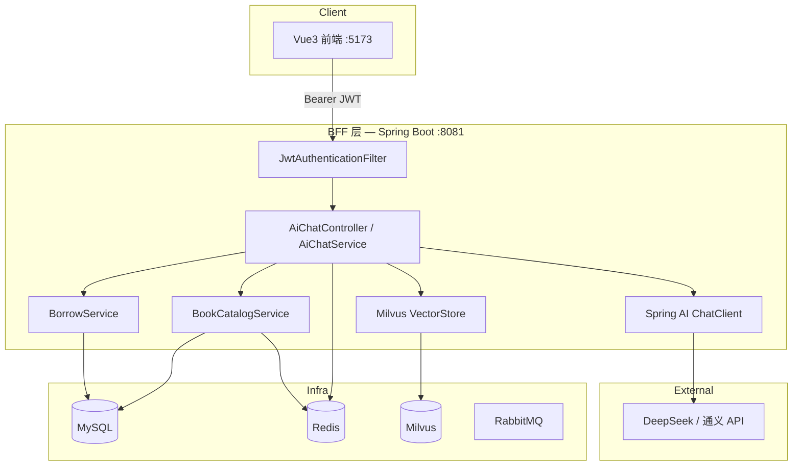

# BFF 架构实战 — 智慧书城场景指南


> **项目**：smart_bookstore（智慧书城） · **文档类型**：学习文档  
> **关联**：`API 聚合层思路` — 前后端边界  
> **索引**：[学习文档中心](./README.md)

> 项目：`smart_bookstore`  
> 主题：**BFF（Backend for Frontend）** 是什么、为什么常见、如何在本项目中落地  
> 典型场景：前端只调 Java；Java 统一鉴权后编排 **Spring AI + Milvus + 书城业务 Service**  
> 关联文档：[AI客服技术方案](./AI客服技术方案.md) · [双Token登录学习文档](./双Token登录学习文档.md) · [项目介绍](./项目介绍.md)  
> 最后更新：2026-07

---

## 一、写在前面

做全栈或微服务时，常会听到几个相似概念：

- **API Gateway（API 网关）**
- **BFF（Backend for Frontend）**
- **单体 Spring Boot**

它们都涉及「请求先经过一层再进业务」，但职责不同。本文聚焦 **BFF**：它是什么、业界为何常用、以及在本 **智慧书城 + 全 Java AI** 项目里怎么设计。

> 说明：BFF 正确英文是 **Backend for Frontend**（为前端服务的后端），不是 BBF。

---

## 二、BFF 是什么

### 2.1 一句话定义

**BFF 是专门为某一类前端（Web / App / 管理端）定制的后端聚合层**，对前端暴露「好用的一套 API」，对内再调用多个领域服务或第三方能力。

```text
         ┌─────────────┐
  前端 ──→│     BFF     │──→ 领域服务 A（图书）
         │  （Java）   │──→ 领域服务 B（借阅）
         └─────────────┘──→ Spring AI / Milvus（同进程）
```

### 2.2 和单体、网关的区别

| 概念 | 定位 | 典型职责 |
|------|------|----------|
| **单体应用** | 一个进程包含全部业务 | 简单、部署快；模块变大后耦合 |
| **API Gateway** | 基础设施层，所有流量入口 | 路由、SSL、全局限流、WAF；**一般不写复杂业务** |
| **BFF** | 应用层，**为前端量身定制** | 鉴权、DTO 聚合、裁剪字段、编排多服务、适配前端交互 |

可以组合使用：

```text
用户 → API Gateway（可选）→ BFF（Java 8081）→ MySQL / Redis / Milvus / LLM API
```

对学生项目而言：**Spring Boot 主工程本身就常扮演 BFF**——前端只调 `/api/**`，Java 里再调 MySQL、Redis、RabbitMQ、Milvus 与大模型 API。

### 2.3 BFF 解决什么问题

| 痛点 | 没有 BFF | 有 BFF |
|------|----------|--------|
| 前端调多个后端 | 要记多套 URL、鉴权、错误码 | 只对接 BFF 一套 |
| 移动端 / Web 字段不同 | 各端各自拼数据 | 可为 Web / Admin 各做一个 BFF（进阶） |
| AI 能力分散 | 前端直连 LLM、向量库，密钥暴露 | Java BFF 统一编排 Tool + 会话 |
| 安全暴露面 | 多个服务对外 | 仅 BFF 对外，Milvus / MySQL 内网 |

---

## 三、本项目的 BFF 思路：全 Java 编排

在 [AI 客服方案](./AI客服技术方案.md) 里，推荐架构是：

```text
前端 ──JWT──→ Java /api/ai/chat（BFF）
                  │
                  ├─ JwtAuthenticationFilter 完整鉴权
                  ├─ AiChatService 编排 Tool / 会话
                  ├─ BookCatalogService / BorrowService（查事实）
                  ├─ Spring AI → DeepSeek / 通义（LLM API）
                  └─ Milvus VectorStore（语义召回，G 阶段）
```

这就是典型 **单体 BFF 模式**：

1. **对外唯一入口**：前端只认 `8081`
2. **鉴权在 BFF 完成**：双 Token、session、Redis 黑名单已在 `JwtAuthenticationFilter` 实现
3. **AI 同进程集成**：Spring AI + Tool Calling + Milvus，**不引入 Python 内网服务**
4. **编排与聚合**：Java 先查 `BookCatalogService` 拿真实书目，再调 LLM 组织回复；语义推荐走 Milvus

### 3.1 架构图



---

## 四、BFF 在本项目中的职责划分

### 4.1 对外（前端可见）

| 职责 | 现有实现 | 说明 |
|------|----------|------|
| 统一 API 前缀 | `/api/**` | 图书、借阅、预约、认证 |
| JWT 鉴权 | `JwtAuthenticationFilter` | Access Token + session + 黑名单 |
| 统一响应 | `ApiResponse<T>` | `{ code, message, data }` |
| RBAC | `@PreAuthorize` | USER / ADMIN |
| 限流 | `auth.rate-limit` | 发码、登录失败锁定 |
| AI 聊天入口 | `/api/ai/chat`（规划） | 会话、SSE、推荐卡片 |

### 4.2 对内（前端不可见）

| 职责 | 实现方式 |
|------|----------|
| LLM 对话与 Tool Calling | Spring AI `ChatClient` + `@Tool` |
| 语义向量检索 | `spring-ai-starter-vector-store-milvus` |
| 调现有 Service 查书、架位 | 直接注入 `BookCatalogService`，不走 HTTP |
| 会话与限流 | Redis |
| 超时与降级 | LLM / Milvus 不可用时回规则推荐 + 固定话术 |

### 4.3 不该放在 BFF 的事

- 前端直连 MySQL / Milvus / LLM API
- 在 BFF 里写大段 LLM Prompt 以外的 **图书 CRUD 核心逻辑**（应仍在 `bookstore` 模块 Service）
- 为 AI 单独拆 Python 微服务（本项目不采用，增加部署与鉴权复杂度）

---

## 五、BFF 请求链路示例

### 5.1 普通业务（纯 Java BFF）

```text
GET /api/books/13
Authorization: Bearer <accessToken>

1. JwtAuthenticationFilter 验签、查 session、塞 AuthPrincipal
2. BookController.getBookDetail
3. BookCatalogService.getBookDetail → MySQL + Redis
4. 返回 BookResponse（含 shelfLocation）
```

前端无感知后面是 MySQL 还是缓存，只面对 BFF 一种 API。

### 5.2 AI 客服 — Tool 查书 + LLM 组织回复

```text
POST /api/ai/chat
{ "message": "Redis 那本书在哪？" }

1. BFF 鉴权
2. AiChatService → Tool searchBooks("Redis")
3. BookCatalogService 查库
4. Spring AI 调 DeepSeek 组织回复
5. 返回 reply + cards
```

此时 BFF = **鉴权 + 编排 + 对外 API**，LLM 是外部 HTTP API，向量检索在同进程通过 Milvus 客户端完成。

### 5.3 AI 客服 — Milvus 语义推荐

```text
POST /api/ai/chat
{ "message": "推荐几本技术书" }

1. BFF 鉴权，得到 userId=1001
2. Java 侧 Tool：recommendBooks（规则 + 热门，MySQL）
3. SemanticBookRecaller → Milvus 向量 TopK
4. 合并去重，Spring AI 生成推荐理由
5. 统一封装 ApiResponse 给前端
```

**要点**：书目、架位等 **事实来自 MySQL Tool**；Milvus 只做召回；LLM 只组织自然语言，不编造库存。

---

## 六、BFF 与 JWT / 外部 API

你们使用 **JWT 双 Token + session 有状态校验**（见 `JwtAuthenticationFilter`），AI 相关外部依赖如下：

| 层级 | 谁验 JWT | 说明 |
|------|----------|------|
| 前端 → Java BFF | **Java 完整校验** | 签名 + jti 黑名单 + session + 用户状态 |
| Java BFF → LLM API | **API Key** | 环境变量注入，不暴露给前端 |
| Java BFF → Milvus | **内网连接串** | Docker 内网或 localhost，不对公网 |
| 前端 → LLM / Milvus | ❌ 禁止 | 密钥与业务 Tool 必须在 BFF |

---

## 七、BFF 的常见实现形态

### 7.1 单体 BFF（本项目现状 + 推荐）

```text
一个 Spring Boot JAR
├── auth/          认证
├── bookstore/     书城
├── reservation/   预约
└── ai/            AI 客服（Spring AI + Milvus）
```

- 优点：部署简单、事务与鉴权统一、适合毕设答辩  
- 缺点：代码量增大后需严格分包（你们已按领域分包）

### 7.2 多 BFF（多端时使用）

```text
Web BFF（/api/user/**）  ─┐
Admin BFF（/api/admin/**）─┼→ 共享领域服务 / 同一数据库
Mobile BFF（/api/app/**） ─┘
```

管理端与用户端字段、权限不同，可拆两个 BFF；**小项目一个 BFF + RBAC 即可**。

### 7.3 何时才考虑独立 AI 微服务（本项目不采用）

若团队必须用 Python 生态（LangChain 实验、独立 GPU 推理），可拆 `ai-python:8000` 并由 Java BFF 内网代理。  
**智慧书城当前方案不采用此路径**，见 [AI模块分板块实施流程](./AI模块分板块实施流程.md)。

---

## 八、BFF 设计原则（落地 checklist）

### 8.1 API 设计

- 面向 **前端页面**，而不是 1:1 暴露数据库表  
  例：借阅单列表直接返回 `bookTitle + shelfLocation`，而不是让前端再查书  
- 统一错误码与分页格式（你们已有 `PageResult`、`ApiResponse`）  
- 减少前端请求次数：结算页所需「购物车 + 可用券」可做一个 BFF 聚合接口（进阶）

### 8.2 安全

- 仅 BFF 端口对公网开放；Milvus、MySQL、Redis 绑定内网  
- LLM API Key 仅配置在 BFF 环境变量  
- 不在 BFF 日志中打印完整 JWT  

### 8.3 Resilience（韧性）

| 场景 | BFF 处理 |
|------|----------|
| LLM API 超时 | 返回「智能客服繁忙」；书目类问题降级为纯 Java Tool 固定话术 |
| Milvus 不可用 | 跳过语义召回，仅用规则推荐 |
| 限流 | AI 接口单独 Redis 计数，防止刷 Token |

### 8.4 不要过度 BFF

- 不要为了 BFF 而 BFF：只有 **一个前端 + 一个后端** 时，单体 + 清晰分包就够  
- 不要把所有逻辑堆在 Controller；编排仍在 Service（与 [四层架构](./四层架构学习文档.md) 一致）

---

## 九、与本项目模块的映射

| 前端页面 | BFF 入口 | 后端能力 |
|----------|----------|----------|
| 登录 / 个人中心 | `/api/auth/**`、`/api/user/me` | auth |
| 图书 / 架位 | `/api/books/**` | catalog + bookshelf |
| 借阅 | `/api/borrow/**` | borrow |
| 预约 / 签到 | `/api/reservation/**`、`/api/checkin/**` | reservation + checkin |
| AI 客服（规划） | `/api/ai/chat` | ai（Spring AI + Milvus） |

**答辩叙事建议**：

> 智慧书城采用 **BFF 架构**：Vue 前端只对接 Spring Boot 统一 API；认证、图书、借阅、预约、AI 客服均在 BFF 层编排；AI 使用 Spring AI Tool Calling + Milvus 向量检索，全 Java 栈，对外仍是一套 JWT 与响应规范。

---

## 十、BFF vs 其他方案对比（AI 场景）

| 方案 | 架构 | 适合你们吗 |
|------|------|------------|
| 前端直连 LLM | 前端 → DeepSeek | ❌ API Key 暴露、无法 Tool 查库 |
| 独立 Python AI 服务 | 前端 → Java → Python | ❌ 本项目不采用，部署与鉴权更复杂 |
| **Java 单体 BFF + Spring AI + Milvus** | 前端 → Java | ✅ **本项目方案** |
| Java + API Gateway + 多微服务 | 过重 | ⚠️ 毕设一般不必 |

---

## 十一、分阶段落地建议

| 阶段 | 内容 | BFF 角色 |
|------|------|----------|
| 现状 | 书城 + 预约 + JWT | Spring Boot 已是 BFF |
| P-AI-0 | `/api/ai/chat` + Java Tool 查书 | BFF 编排 LLM + 业务 Service |
| P-AI-1 | Milvus 向量检索 + 语义推荐 | BFF 内嵌 VectorStore，同进程召回 |
| 进阶 | SSE 流式、推荐卡片聚合 | BFF 转流式响应给前端 |

详见 [AI模块分板块实施流程](./AI模块分板块实施流程.md) 板块 A～J。

---

## 十二、相关文档

| 文档 | 说明 |
|------|------|
| [AI客服技术方案](./AI客服技术方案.md) | Tool Calling、推荐、Milvus RAG |
| [AI模块分板块实施流程](./AI模块分板块实施流程.md) | 分板块实施 A～J |
| [双Token登录学习文档](./双Token登录学习文档.md) | BFF 鉴权实现细节 |
| [四层架构学习文档](./四层架构学习文档.md) | BFF 内部分层 |
| [前端生成提示词](./前端生成提示词.md) | 前端只调 BFF 的约定 |
| [项目介绍](./项目介绍.md) | 整体模块一览 |

---

## 十三、结论

| 问题 | 答案 |
|------|------|
| BFF 是什么？ | **为前端定制的后端聚合层**，统一 API、鉴权、编排 |
| 常见吗？ | **非常常见**；Spring Boot 单体对外服务本质上就是 BFF |
| 本项目 AI 怎么做？ | **全 Java**：Spring AI + Tool + Milvus，不拆 Python 服务 |
| 本项目怎么做？ | 前端只调 `8081`；JWT 在 Java 验；LLM / Milvus 由 BFF 内网调用 |
| 何时不必拆 BFF？ | 仅一个前端、一个后端时，保持单体即可 |

下一步：按 [AI模块分板块实施流程](./AI模块分板块实施流程.md) 在 `com.zx.ai` 实现 `/api/ai/chat` 作为 BFF 入口。
