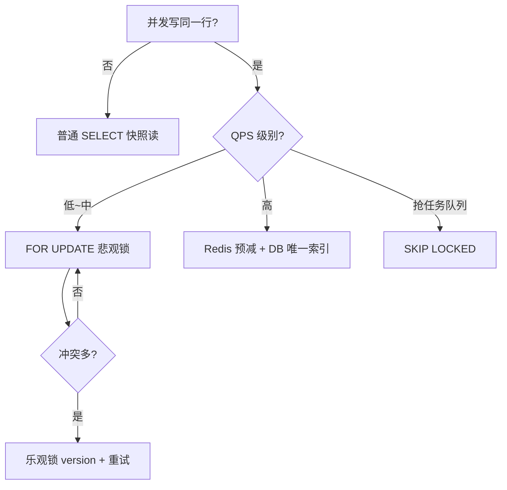

# 书城高并发场景下的 MySQL 锁选型

> **项目**：smart_bookstore（智慧书城）  
> **文档类型**：学习文档 · 关联本仓库业务代码  
> **关联包 / 模块**：`com.zx.reservation.service / com.zx.bookstore`  
> **建议前置**：[InnoDB 锁机制学习文档](./InnoDB锁机制学习文档.md)、[乐观锁学习文档](./乐观锁学习文档.md)

## 学习目标

1. 按业务场景选择行锁、乐观锁、唯一约束等策略
2. 分析预约、借阅、下单中的锁粒度与死锁风险
3. 理解 DB 锁与 Redis / Lua 在秒杀路径上的分工

## 与本仓库的对应关系

| 路径 | 说明 |
| --- | --- |
| `src/main/java/com/zx/reservation/service/ReservationService.java` | 对照阅读 |
| `src/main/java/com/zx/bookstore/borrow/service/BorrowService.java` | 对照阅读 |
| `src/main/java/com/zx/bookstore/trade/service/TradeService.java` | 对照阅读 |
| `src/main/java/com/zx/bookstore/seckill/service/SeckillService.java` | 对照阅读 |

读理论时请打开上表文件对照；改代码前先跑通 `docker compose up -d` 与 `local` profile。

---

## 导读
面试里常问：「库存超卖怎么防？」「转账怎么保证一致？」  
答案往往离不开 **锁**，但 MySQL 里锁的种类和写法不少，并不是所有场景都该 `SELECT ... FOR UPDATE`。

本文按 **业务场景 → 推荐锁策略 → 示例 SQL → 注意点** 组织，帮助你在设计时快速选型。

---

## 一、先认清：InnoDB 里常见的锁

### 1.1 按「怎么加」分（开发者直接写的）

| 写法 | 锁模式 | 典型用途 |
|------|--------|----------|
| `SELECT ... FOR UPDATE` | 排他锁（X） | 占库存、改余额、防并发写 |
| `SELECT ... FOR SHARE` | 共享锁（S） | 读期间不允许别人改，允许别人也 S 读 |
| `SELECT ... LOCK IN SHARE MODE` | 共享锁（S） | 8.0 前写法，同 FOR SHARE |
| `UPDATE` / `DELETE` | 隐式 X 锁 | 改状态、扣减、删除 |
| `INSERT` | 插入意向锁 + 可能间隙锁 | 新增记录、唯一键冲突检测 |
| 普通 `SELECT`（RC/RR） | **不加锁**（快照读） | 列表、报表、只读查询 |

**MySQL 8.0+ 扩展：**

| 写法 | 行为 |
|------|------|
| `FOR UPDATE NOWAIT` | 拿不到锁立即失败，不阻塞 |
| `FOR UPDATE SKIP LOCKED` | 跳过已锁行，抢下一条 |
| `FOR SHARE NOWAIT` / `SKIP LOCKED` | 共享锁版 |

### 1.2 按「锁什么」分（引擎内部）

| 类型 | 说明 |
|------|------|
| **Record Lock** | 锁索引上的一条记录 |
| **Gap Lock** | 锁索引记录之间的间隙 |
| **Next-Key Lock** | Record + Gap（RR 隔离级别下常见） |
| **Insert Intention Lock** | INSERT 时在间隙上声明插入意图 |

### 1.3 两个必记规则

```text
① 行锁在事务 commit / rollback 时释放，不是单条 SQL 执行完就释放。
② InnoDB 锁的是「索引记录」；WHERE 不走索引，可能锁全表扫描过的行。
```

所有下面场景都默认：**InnoDB + 事务包裹**（`BEGIN` / `@Transactional`）。

---

## 二、场景速查表

| 业务场景 | 推荐策略 | 核心 SQL / 手段 |
|----------|----------|-----------------|
| 库存扣减 / 防超卖 | 悲观锁 或 乐观锁 | `FOR UPDATE` / `UPDATE ... WHERE stock >= ?` |
| 秒杀 / 高并发抢 | Redis 预减 + DB 兜底 | 应用层 + 唯一索引 |
| 账户转账 | 按 id 顺序 `FOR UPDATE` | 锁两条账户行，再改余额 |
| 订单状态流转 | 条件 UPDATE | `UPDATE ... WHERE status = '待支付'` |
| 任务队列抢单 | `SKIP LOCKED` | 多 worker 各取一行 |
| 对账 / 只读统计 | 快照读 | 普通 `SELECT`，不加锁 |
| 读时禁止别人改 | 共享锁 | `FOR SHARE` |
| 强一致报表（少写） | `SERIALIZABLE` 或快照时间点 | 慎用，性能差 |
| 防重复提交 / 重复单 | 唯一索引 | DB 层兜底 |
| 并发 INSERT 同业务键 | 唯一索引 + 捕获冲突 | `Duplicate entry` 转业务码 |

---

## 三、场景详解

### 场景 1：电商库存扣减（防超卖）

**问题**：100 件商品，200 个请求同时下单，不能卖出 101 件。

#### 方案 A：悲观锁（中等并发，实现简单）

```sql
START TRANSACTION;

SELECT stock FROM product WHERE id = 1001 FOR UPDATE;

-- 应用判断 stock > 0 后
UPDATE product SET stock = stock - 1 WHERE id = 1001 AND stock > 0;

INSERT INTO order_item (product_id, qty) VALUES (1001, 1);

COMMIT;
```

| 点 | 说明 |
|----|------|
| 锁什么 | `FOR UPDATE` 锁住 `product.id = 1001` 这一行 |
| 优点 | 逻辑直观，强一致 |
| 缺点 | 热点 SKU 排队，TPS 受限于单行锁 |

#### 方案 B：乐观锁（冲突少、读多写少）

```sql
UPDATE product
SET stock = stock - 1, version = version + 1
WHERE id = 1001 AND stock > 0 AND version = 5;
-- 影响行数 = 0 表示失败，提示重试或售罄
```

| 点 | 说明 |
|----|------|
| 锁什么 | UPDATE 时对命中行加 X 锁，靠 `version` 防 lost update |
| 优点 | 无显式 `FOR UPDATE`，不长时间占锁 |
| 缺点 | 冲突高时要重试 |

#### 方案 C：秒杀（万级 QPS）

```text
Redis DECR 预减 → 成功再异步 / 同步写 MySQL
MySQL 唯一索引 (user_id, activity_id) 防一人多单
```

DB 行锁扛不住热点时，**锁上移**到 Redis，MySQL 作最终账本。

---

### 场景 2：账户 A 转 100 元给账户 B

**问题**：不能扣了 A 没加 B，也不能并发转导致余额为负。

```sql
START TRANSACTION;

-- 按 account_id 从小到大加锁，避免死锁
SELECT balance FROM account WHERE id = 100 FOR UPDATE;
SELECT balance FROM account WHERE id = 200 FOR UPDATE;

UPDATE account SET balance = balance - 100 WHERE id = 100 AND balance >= 100;
UPDATE account SET balance = balance + 100 WHERE id = 200;

INSERT INTO transfer_log (from_id, to_id, amount) VALUES (100, 200, 100);

COMMIT;
```

| 注意点 | 说明 |
|--------|------|
| **固定加锁顺序** | 始终先锁小 id 再锁大 id，避免 A 锁 100→200、B 锁 200→100 死锁 |
| **WHERE balance >= 100** | 防止透支 |
| **日志表** | 审计与对账 |

---

### 场景 3：订单状态机（待支付 → 已支付 → 已发货）

**问题**：支付回调和用户取消同时到达，状态不能乱。

```sql
UPDATE orders
SET status = 'PAID', paid_at = NOW()
WHERE id = 9001 AND status = 'PENDING';
-- 影响行数 0 → 已被取消或已支付，按业务处理
```

| 点 | 说明 |
|----|------|
| 锁什么 | UPDATE 对命中行隐式 X 锁 |
| 关键 | **`WHERE status = 期望旧状态`**，天然 CAS，无需先 SELECT |
| 适用 | 状态流转、幂等更新 |

比「先 SELECT 再 UPDATE」少一次往返，且 UPDATE 本身原子。

---

### 场景 4：工单 / 任务队列（多 Worker 抢任务）

**问题**：10 个 worker 同时拉「待处理」任务，同一条不能被两个 worker 执行。

#### 方案：`SKIP LOCKED`（MySQL 8.0+）

```sql
START TRANSACTION;

SELECT id, payload
FROM job_queue
WHERE status = 'PENDING'
ORDER BY id
LIMIT 1
FOR UPDATE SKIP LOCKED;

UPDATE job_queue SET status = 'PROCESSING', worker = 'node-1' WHERE id = ?;

COMMIT;
```

| 点 | 说明 |
|----|------|
| 行为 | 已被别的 worker 锁住的行直接跳过，各取各的 |
| vs `FOR UPDATE` | 普通 FOR UPDATE 会阻塞排队，SKIP LOCKED 不等待 |
| 适用 | 异步任务、消息消费、派单系统 |

#### 变体：`NOWAIT`

```sql
SELECT ... FOR UPDATE NOWAIT;
-- 拿不到锁立刻报错，适合「只尝试一次」
```

---

### 场景 5：运营后台导出报表（读多，允许略旧数据）

**问题**：导出 100 万行订单，不能锁表 10 分钟。

```sql
-- 普通 SELECT，RC/RR 下走 MVCC 快照读，不加行锁
SELECT id, amount, status FROM orders
WHERE created_at BETWEEN '2026-01-01' AND '2026-01-31';
```

| 点 | 说明 |
|----|------|
| 不加锁 | 不阻塞写入，读到的是快照时间点数据 |
| 注意 | 长事务 + RR 可能拖慢 undo log；大导出可用 **只读从库** 或 **按主键分批** |

**不要**对大表做 `SELECT ... FOR SHARE` 扫全表——会严重阻塞写入。

---

### 场景 6：审批流：读详情时不想被改 half-way

**问题**：财务打开一张报销单核对，希望打开期间单据不被修改（或至少知道有人在看）。

```sql
START TRANSACTION;

SELECT * FROM expense WHERE id = 500 FOR SHARE;

-- 核对逻辑 ...

COMMIT;
```

| 点 | 说明 |
|----|------|
| 锁模式 | S 锁：他人可读，不能 UPDATE/DELETE/FOR UPDATE |
| 适用 | 短事务、少量行 |
| 慎用 | 长事务持 S 锁仍会阻塞别人的写 |

多数系统用 **版本号 / updated_at** 乐观提示「数据已变更请刷新」，而不是长时间 FOR SHARE。

---

### 场景 7：优惠券「每人限领 1 张」

**问题**：并发点击「领取」，同用户不能插入两条。

#### 方案 A：唯一索引（推荐兜底）

```sql
UNIQUE KEY uk_user_coupon (user_id, coupon_id)
```

```sql
INSERT INTO user_coupon (user_id, coupon_id) VALUES (100, 200);
-- Duplicate entry → 转业务码「已领取」
```

#### 方案 B：先查再插（需配合锁或唯一索引）

```sql
START TRANSACTION;
SELECT 1 FROM user_coupon WHERE user_id = 100 AND coupon_id = 200 FOR UPDATE;
-- 无行时 FOR UPDATE 锁不住「空」；可锁 parent 行或依赖唯一索引
INSERT ...
COMMIT;
```

**教训**：防重复插入，**唯一索引比单纯 SELECT 可靠**；`FOR UPDATE` 对不存在的行锁不住 gap 时，并发 INSERT 仍可能穿透。

---

### 场景 8：座位 / 时段 / 资源「同一格子只能占一次」

**问题**：同一航班同一座位、同一会议室同一时段，只能有一条有效预订。

```sql
START TRANSACTION;

SELECT * FROM seat_inventory
WHERE flight_id = 1 AND seat_no = '12A' FOR UPDATE;

SELECT COUNT(*) FROM booking
WHERE flight_id = 1 AND seat_no = '12A' AND status = 'CONFIRMED';
-- 为 0 则
INSERT INTO booking (...) VALUES (...);

COMMIT;
```

| 加强 | 说明 |
|------|------|
| 唯一索引 | `UNIQUE (flight_id, seat_no, status)` 或 partial unique（仅 CONFIRMED） |
| 锁粒度 | `FOR UPDATE` 锁 inventory 行或 seat 行，WHERE 走主键 |

与「库存扣减」同源：**先锁 → 再查 → 再写**，事务包住全程。

---

### 场景 9：库存预占 + 15 分钟未支付释放

**问题**：下单占库存，超时未支付要释放；支付和超时任务可能并发。

```sql
-- 占库存
UPDATE product SET reserved = reserved + 1, stock = stock - 1
WHERE id = 1 AND stock > 0;

-- 超时释放（定时任务）
UPDATE product SET reserved = reserved - 1, stock = stock + 1
WHERE id = 1 AND reserved > 0;

-- 支付成功
UPDATE orders SET status = 'PAID' WHERE id = ? AND status = 'PENDING';
UPDATE product SET reserved = reserved - 1 WHERE id = 1;
```

| 点 | 说明 |
|----|------|
| 锁 | 多次 UPDATE 同一 product 行，隐式 X 锁 |
| 关键 | 每条 UPDATE 带 **状态 / 数量条件**，防重复释放或重复扣减 |

---

## 四、四种策略怎么选



| 策略 | 适合 | 不适合 |
|------|------|--------|
| **快照读** | 列表、报表、只读 | 需要最新值且立刻写入 |
| **FOR UPDATE** | 转账、占库存、占座 | 热点单行、超高 QPS |
| **乐观锁 version** | 更新少、冲突低 | 秒杀级冲突 |
| **条件 UPDATE** | 状态机 | 需要先读复杂逻辑再决定 |
| **SKIP LOCKED** | 任务队列 | 必须严格 FIFO 且不能跳过 |
| **唯一索引** | 防重复、幂等 | 不能代替所有业务校验 |
| **Redis 锁 / 预减** | 秒杀、抢券 | 要解决与 DB 一致性问题 |

---

## 五、跨场景通用注意点

### 5.1 事务边界

```java
@Transactional
public void transfer() {
    // 锁 + 业务 + 写库 全在这里
    // 不要：锁内 call HTTP、Thread.sleep、发 MQ 再慢慢写库
}
```

锁持有时间 ≈ 事务时间，越长越阻塞别人。

### 5.2 索引

```sql
-- ✅ 走主键，锁一行
SELECT * FROM account WHERE id = 1 FOR UPDATE;

-- ❌ 无索引，可能锁全表扫描行
SELECT * FROM account WHERE nickname = '张三' FOR UPDATE;
```

### 5.3 死锁

多行加锁：**按固定顺序**（如 id 升序）。  
捕获 `1213 Deadlock`，有限重试。

### 5.4 隔离级别

| 级别 | 选用 |
|------|------|
| **RR（默认）** | 大多数 OLTP |
| **RC** | 减少间隙锁、Oracle 习惯（部分公司生产用 RC） |
| **Serializable** | 极少，性能差 |

### 5.5 不要用表锁替代行锁

```sql
LOCK TABLES orders WRITE;  -- 业务代码里避免
```

InnoDB 行锁 + 事务才是正路。

---

## 六、反模式清单

| 反模式 | 为什么错 |
|--------|----------|
| 无事务的 `FOR UPDATE` | 自动提交，锁立刻释放，防不住并发 |
| 锁内调外部接口 | 长事务占锁，吞吐暴跌 |
| 大事务扫全表 `FOR UPDATE` | 相当于锁大量行 |
| 只靠 SELECT 判断再 INSERT，无唯一索引 | 并发 INSERT 双写 |
| 所有查询都 `FOR UPDATE` | 完全没必要，快照读即可 |
| 热点单行悲观锁扛秒杀 | 应 Redis + 异步落库 |

---

## 七、面试 / 设计题标准答法模板

**问：库存超卖怎么解决？**

```text
1. 事务保证原子性
2. 方案按并发选：
   - 中低：FOR UPDATE 锁商品行，或 UPDATE ... WHERE stock > 0
   - 高：Redis 预减 + MySQL 唯一约束兜底
3. WHERE 走索引，锁持有尽量短
4. 可选乐观锁 version，冲突重试
5. 监控死锁与慢 SQL
```

**问：转账如何保证一致？**

```text
1. 同一事务内扣 A 加 B
2. 按 account_id 顺序 FOR UPDATE 防死锁
3. UPDATE 带 balance >= amount
4. 记 transfer_log 审计
```

---

## 八、一句话总结

```text
只读、可略旧     → 普通 SELECT（快照读）
要写且怕并发     → FOR UPDATE 或 条件 UPDATE / 乐观锁 version
抢任务、多 worker → FOR UPDATE SKIP LOCKED
防重复单         → 唯一索引 + 捕获 Duplicate
秒杀级热点       → Redis + DB 兜底，别硬扛单行锁
```

MySQL 锁不是「一律 FOR UPDATE」，而是 **按业务并发模型选最轻且正确的那一把**。

---

## 延伸阅读

- [乐观锁学习文档](./乐观锁学习文档.md) — version / 状态 CAS / 数值 CAS 与 12 个业务案例
- [InnoDB锁机制学习文档](./InnoDB锁机制学习文档.md) — 锁原理、生命周期、间隙锁与避坑
