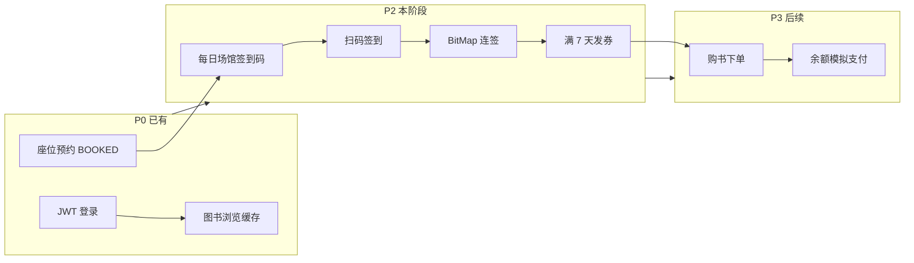
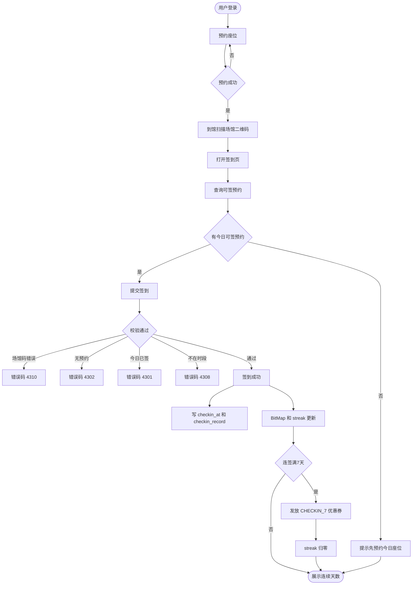
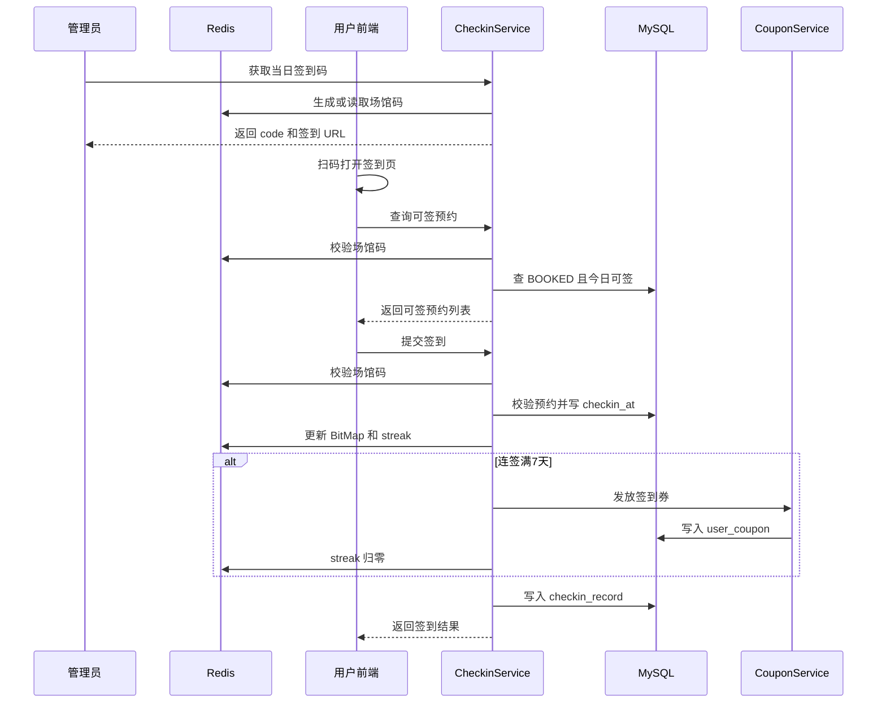
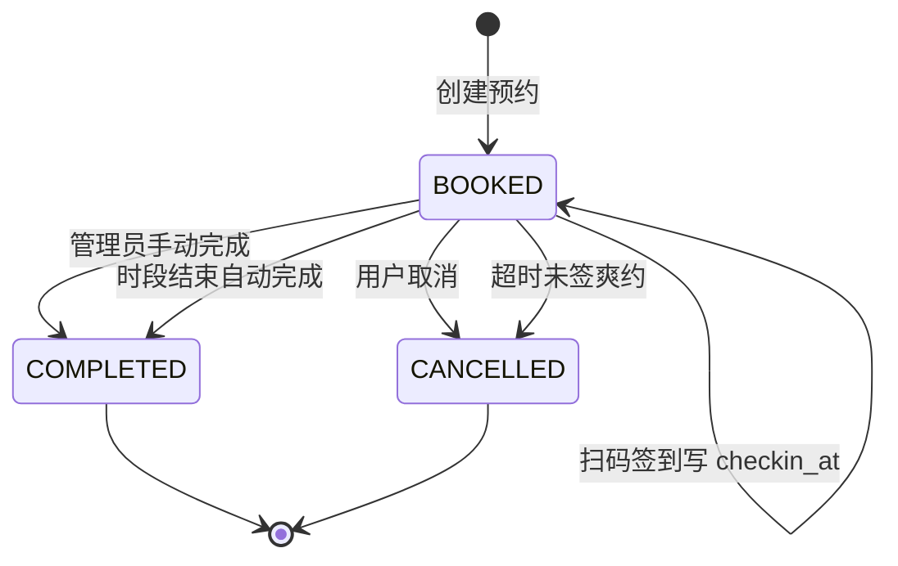
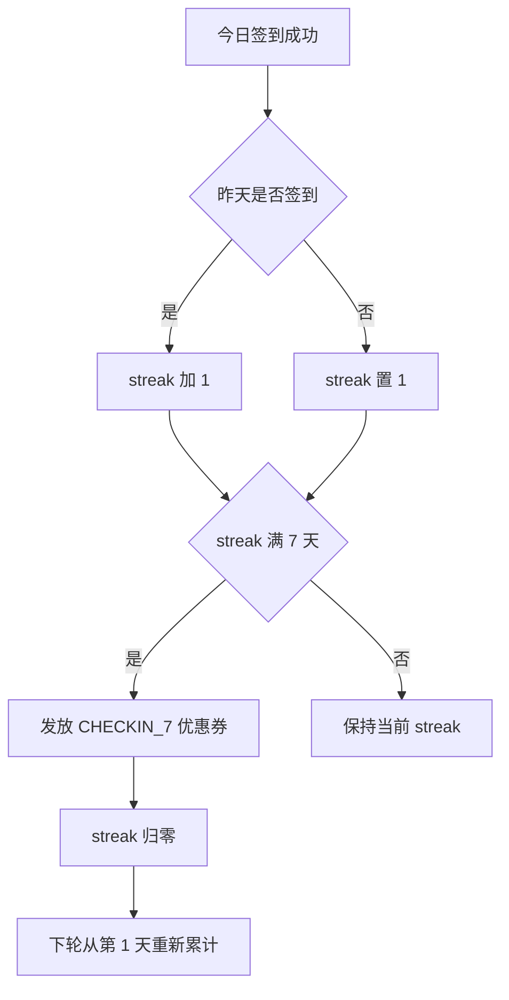
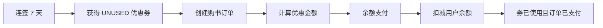
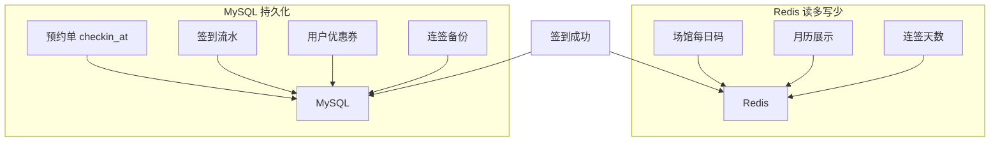

# P2：座位预约 → 扫码签到 → 连签赠券


> **项目**：smart_bookstore（智慧书城） · **文档类型**：学习文档  
> **关联**：`com.zx.marketing.checkin` — 连续签到 BitMap 与发券  
> **索引**：[学习文档中心](./README.md)

> 阶段目标：在 **P0 座位预约** 基础上，实现 **到馆扫码签到**、**连续 7 天赠券**，形成「预约来读 → 打卡履约 → 促活领券」故事线。  
> 参考亮点：黑马点评 **签到 BitMap + 连续天数**；业务约束：**仅当日有预约的用户可签到**。

---

## 一、P2 在整体系统中的位置



| 阶段 | 能力 | 状态 |
|------|------|------|
| P0 | 统一认证、座位预约、图书缓存 | ✅ 已实现 |
| **P2** | **预约联动签到、每日码、连签赠券** | **✅ 已实现** |
| P2+ | 时段结束自动 COMPLETED / 爽约 CANCELLED | ⏳ 待补定时任务 |
| P3 | 购书用券、余额支付 | ✅ 已实现（可演示闭环） |

---

## 二、业务流程图

### 2.1 端到端用户旅程

```text
登录 → 预约今日座位(BOOKED) → 到馆扫场馆码 → 选预约单签到
    → 连续签到累计 → 第7天得优惠券 → (P3) 购书用券支付
```



### 2.2 扫码签到时序图（技术视角）



### 2.3 预约单与签到的状态关系

签到 **不改变** 预约单 `status`（仍为 `BOOKED`），通过 `checkin_at` 表示「已到馆履约」。



> 说明：`checkin_at` 为空表示待签到，有值表示已签到。后两种流转待定时任务实现。

### 2.4 连续签到与发券规则



| 规则 | 说明 |
|------|------|
| 每人每天 1 次 | `checkin_record.uk_checkin_user_date` + 业务校验 |
| 必须绑定预约单 | `checkin_record.reservation_order_id` 必填 |
| 断签 | 昨天未签 → 今天从 streak=1 重新开始 |
| 满 7 天 | 发券后 streak **归零**（可配置 `checkin.streak-reward-days`） |
| 券模板 | `coupon_template.name = CHECKIN_7`，满 0 减 5，14 天有效 |

### 2.5 与 P3 的衔接（购书用券）



---

## 三、技术栈与使用说明

### 3.1 技术栈总览

| 层次 | 技术 | P2 中的用途 |
|------|------|-------------|
| 语言 / 运行时 | **Java 21** | 业务实现 |
| 框架 | **Spring Boot 4.1** | Web、配置、定时（待扩展） |
| 安全 | **Spring Security + JWT** | 签到/查券接口需 `ROLE_USER` |
| ORM | **MyBatis-Plus 3.5** | `checkin_*`、`coupon_*` 表 CRUD |
| 数据库 | **MySQL 8** | 预约单、签到流水、券持久化 |
| 缓存 | **Redis (StringRedisTemplate)** | 每日场馆码、BitMap 月历、连签天数 |
| 配置 | **@ConfigurationProperties** | `checkin.*` 签到窗口、前端 URL |
| 前端（建议） | **Vue3 + Vite** | 扫码页 `/checkin?venueId&code` |

**P2 未使用**：RabbitMQ（发券当前同步落库）、地图 SDK、GPS 定位（采用扫码签到方案）。

### 3.2 各技术在 P2 中的落点

#### Spring Boot + Spring Security

- 用户接口：`@PreAuthorize("hasRole('USER')")`
- 管理员取码：`@PreAuthorize("hasRole('ADMIN')")`
- 身份：`AuthPrincipal` 从 JWT 过滤器注入

#### MySQL（持久化 / 事务）

| 表 | 作用 |
|----|------|
| `reservation_order` | 扩展 `checkin_at`，签到履约凭证 |
| `checkin_record` | 签到流水，关联 `reservation_order_id` |
| `checkin_streak` | 连签状态备份（与 Redis 双写） |
| `coupon_template` | 券模板 `CHECKIN_7` |
| `user_coupon` | 用户持有的签到赠券 |

关键写路径在 `@Transactional` 内：

```text
校验预约 → UPDATE checkin_at → INSERT checkin_record → (可选) INSERT user_coupon
```

#### Redis（高性能 / 每日刷新）

| Key | 类型 | TTL | 用途 |
|-----|------|-----|------|
| `venue:checkin:code:{venueId}:{yyyyMMdd}` | String | 至次日 | **每日刷新**场馆签到码 |
| `sign:user:{userId}:{yyyyMM}` | BitMap | ~40 天 | 当月签到日历 |
| `sign:streak:{userId}` | String | 长期 | 当前连续天数 |
| `sign:last:{userId}` | String | 长期 | 上次签到日期 |

**每日码生成逻辑**：当日首次请求时生成 6 位随机码写入 Redis，次日 key 过期自动失效。

#### MyBatis-Plus

- 条件更新防重复签到：

```sql
UPDATE reservation_order
SET checkin_at = NOW()
WHERE id = ? AND status = 'BOOKED' AND checkin_at IS NULL
```

- 券发放：`coupon_template.issued_count` 条件自增（有总量时）

### 3.3 模块包结构（已实现）

```text
com.zx.marketing.checkin/
├── config/CheckinProperties.java
├── controller/
│   ├── CheckinController.java          # /api/checkin/*
│   └── CheckinAdminController.java     # /api/reservation/admin/.../checkin-code
├── service/
│   ├── CheckinService.java             # 主业务编排
│   └── CheckinRedisService.java        # 场馆码 + BitMap + streak
├── entity/ repository/ mapper/
└── exception/                          # 4301~4312

com.zx.bookstore.coupon/
├── service/CouponService.java            # 发券、算折扣、我的券
└── controller/CouponController.java      # GET /api/coupons/mine

com.zx.reservation/                       # P0 扩展
├── entity/ReservationOrder.java          # + checkinAt
└── mapper/ReservationOrderMapper.java    # updateCheckinAt
```

### 3.4 配置项

```yaml
# application.yaml
checkin:
  frontend-base-url: http://localhost:5173   # 二维码跳转 H5 地址
  streak-reward-days: 7                      # 连签赠券天数
  window-minutes-before: 15                  # 签到窗口：开始前
  window-minutes-after: 15                   # 签到窗口：结束后
```

**可签到时间窗口**：

```text
[slot.start_time - 15min , slot.end_time + 15min]
```

---

## 四、API 一览

### 4.1 管理员

| 方法 | 路径 | 说明 |
|------|------|------|
| GET | `/api/reservation/admin/resources/{id}/checkin-code` | 获取当日签到码 + URL（生成二维码） |

### 4.2 用户签到

| 方法 | 路径 | 说明 |
|------|------|------|
| GET | `/api/checkin/eligible?venueId=&code=` | 校验场馆码，返回今日可签预约 |
| POST | `/api/checkin` | 签到，body 见下 |
| GET | `/api/checkin/streak` | 当前连续天数 |
| GET | `/api/checkin/calendar?month=2026-07` | 月签到日历（BitMap） |

**POST /api/checkin 请求体**：

```json
{
  "reservationOrderId": 12,
  "venueId": 1,
  "code": "A8F3K2"
}
```

### 4.3 优惠券

| 方法 | 路径 | 说明 |
|------|------|------|
| GET | `/api/coupons/mine?status=UNUSED` | 我的优惠券 |

### 4.4 错误码

| 码 | 含义 |
|----|------|
| 4301 | 今日已签到 |
| 4302 | 无有效预约 |
| 4303 | 预约不是今天 |
| 4304 | 该预约已签到 |
| 4308 | 不在签到时间段 |
| 4310 | 场馆码无效或过期 |
| 4311 | 预约场馆与扫码场馆不一致 |

---

## 五、数据流：MySQL 与 Redis 分工



| 场景 | 以谁为准 |
|------|----------|
| 今日能否签到 | MySQL `checkin_record` 唯一约束 + Redis BitMap 双检 |
| 月历展示 | Redis BitMap（快） |
| 连签天数 | Redis 实时计算；MySQL `checkin_streak` 备份 |
| 发券记录 | MySQL `user_coupon` 为准 |
| 场馆码 | Redis，每日刷新 |

---

## 六、自测检查清单

```text
□ 管理员获取 checkin-code，码当日有效
□ 无预约调用 eligible → orders 为空
□ 有今日 BOOKED 预约 → eligible 返回可签列表
□ 错误场馆码 → 4310
□ 签到成功 → checkin_at 有值，checkin_record 有记录
□ 同日再签 → 4301
□ 连签 7 天 → /api/coupons/mine 出现 CHECKIN_7 券
□ 断签一天 → streak 从 1 重新开始
□ GET /api/checkin/calendar 与 BitMap 一致
```

---

## 七、答辩可讲的 3 个亮点

1. **业务闭环**：签到不是独立打卡，必须绑定 **当日座位预约单**，防止远程刷券。  
2. **Redis BitMap**：月历签到占用内存极小，适合高并发读；连签天数 O(1) 更新。  
3. **每日刷新场馆码**：扫码到馆 + 动态码，比纯按钮签到多一层到馆校验，实现成本低。

**可诚实说明的改进点**：预约单在签到后仍停留在 `BOOKED`，时段结束的自动 `COMPLETED` / 爽约 `CANCELLED` 可通过定时任务补齐，完善生命周期闭环。

---

## 八、相关文件

| 文件 | 说明 |
|------|------|
| `src/main/java/com/zx/marketing/checkin/**` | 签到模块 |
| `src/main/java/com/zx/bookstore/coupon/**` | 优惠券模块 |
| `src/main/resources/db/schema.sql` | 表结构（checkin / coupon） |
| `src/main/resources/db/migration-checkin.sql` | 已有库升级脚本 |
| `docs/书城系统分阶段实施指南.md` | P2 实施步骤 |
| `docs/书城系统功能规划.md` | 整体功能规划 |
