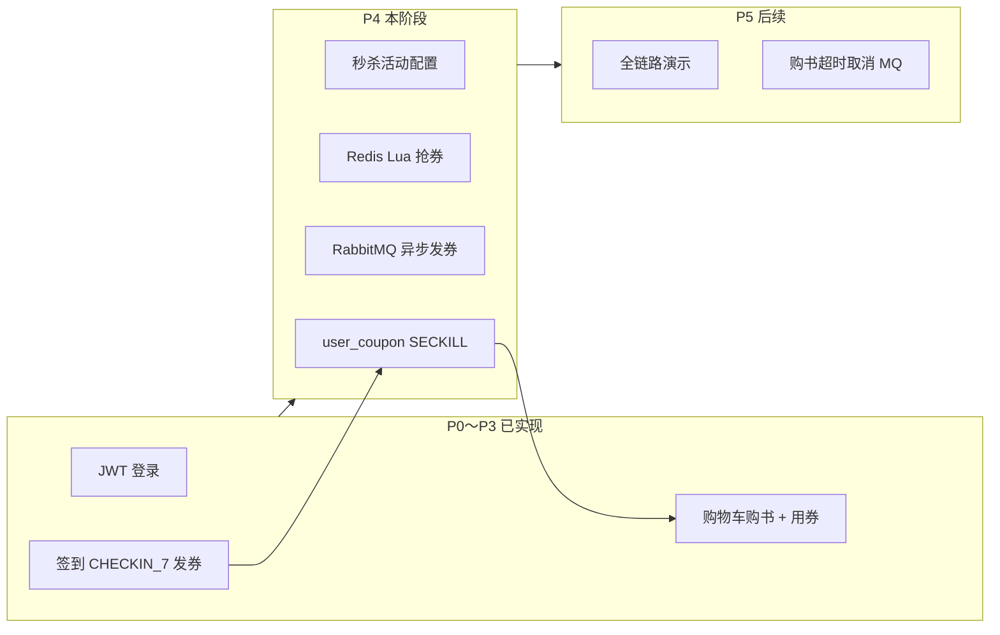
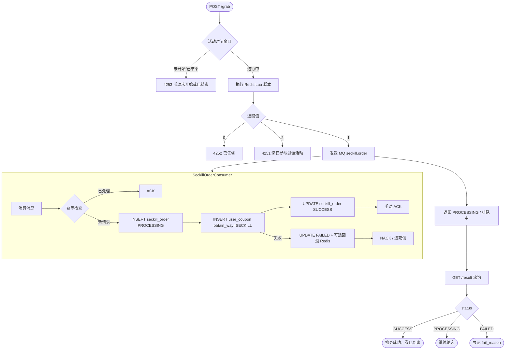
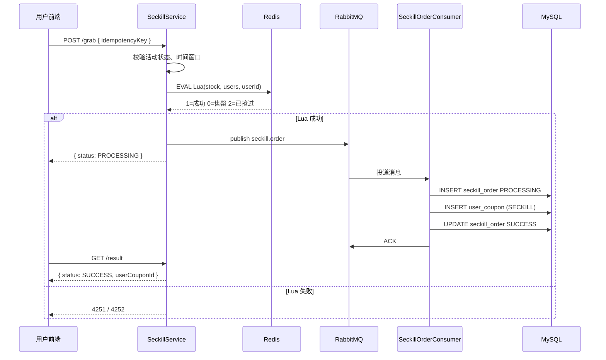

# P4：优惠券秒杀 + Redis Lua + RabbitMQ 异步发券


> **项目**：smart_bookstore（智慧书城） · **文档类型**：学习文档  
> **关联**：`com.zx.bookstore.seckill` — Lua 抢券 + MQ 发券  
> **索引**：[学习文档中心](./README.md)

> 阶段目标：实现 **限时抢优惠券** 能力——高并发下 Redis Lua 原子扣库存，RabbitMQ 异步落库发券，与 P3 购书用券形成「抢券 → 下单抵扣」闭环。  
> 参考亮点：黑马点评 **秒杀 Lua + 一人一单**；苍穹外卖式 **MQ 削峰异步落库**。  
> 前置：P0～P3 已完成（认证、签到发券、购书用券）；RabbitMQ 已安装（端口 5672）。

---

## 一、P4 在整体系统中的位置



| 阶段 | 能力 | 状态 |
|------|------|------|
| P0～P3 | 图书、借阅、签到、购物车、购书用券 | ✅ 已实现 |
| **P4** | **秒杀抢券、Lua 原子库存、MQ 异步落库** | ⏳ **待实现** |
| P5 | 管理端整合、全链路演示、延迟取消（可选） | 规划中 |

### 1.1 与现有优惠券模块的关系

| 获券方式 `obtain_way` | 模块 | 说明 |
|----------------------|------|------|
| `CHECKIN_7` | P2 签到 | 连签 7 天同步发券 |
| `ADMIN` | 管理端 | 人工发放（可扩展） |
| **`SECKILL`** | **P4 秒杀** | 抢券成功后 MQ 异步写入 `user_coupon` |

P3 购书时 `CouponService.calculateDiscount` **不区分**获券来源，秒杀券与签到券使用规则相同（门槛、满减/折扣由 `coupon_template` 决定）。

---

## 二、业务流程图

### 2.1 端到端用户旅程

```text
ADMIN 创建秒杀活动 + 预热 Redis 库存
  → USER 浏览活动列表 / 详情（倒计时）
  → 活动开始点击「立即抢券」
  → Redis Lua 判库存 + 判重复 → 成功则返回「排队中」
  → 发 RabbitMQ seckill.order
  → Consumer 异步 INSERT seckill_order + user_coupon
  → USER 轮询 result → SUCCESS → 我的优惠券可见
  → (P3) 购物车结算选券 → 余额支付
```

### 2.2 抢券主流程（技术视角）



### 2.3 时序图（抢券 + MQ）



---

## 三、为什么用 Redis Lua + MQ，而不是直接写库？

| 方案 | 问题 |
|------|------|
| 直接 `UPDATE seckill_stock` | 高并发下 DB 成为瓶颈；锁竞争严重 |
| 先查再减（无原子） | 超卖、重复抢 |
| Redis decr 无 Lua | 库存与用户 Set 非原子，可能不一致 |
| Lua 成功同步写库 | 抢券峰值仍打满 DB，接口 RT 高 |

**P4 选型**：

1. **Redis Lua**：库存判断、`decr`、`sadd` 用户集合 **一次原子完成**（参考黑马点评）
2. **RabbitMQ**：抢券接口快速返回；**异步**创建 `seckill_order` + `user_coupon`，削峰填谷
3. **MySQL 唯一约束**：`uk_seckill_user_activity` 兜底一人一单（防 Redis 与 DB 极端不一致）

---

## 四、数据库设计

> 表结构见 [书城系统数据库草案.sql](./书城系统数据库草案.sql) §10。实施时需同步写入 `schema.sql`。

### 4.1 `seckill_activity`（秒杀活动）

| 字段 | 说明 |
|------|------|
| `id` | 活动 ID |
| `name` | 活动名称 |
| `template_id` | 关联 `coupon_template.id`（抢成功后发的券） |
| `seckill_stock` | 秒杀总量（创建时写入，并预热到 Redis） |
| `start_time` / `end_time` | 活动窗口 |
| `status` | 1=启用 0=下架 |

### 4.2 `seckill_order`（参与记录）

| 字段 | 说明 |
|------|------|
| `user_id` + `activity_id` | **唯一约束** `uk_seckill_user_activity`（一人一单） |
| `status` | `PROCESSING` → `SUCCESS` / `FAILED` |
| `idempotency_key` | 幂等键，唯一 `uk_seckill_idempotency` |
| `user_coupon_id` | 成功后关联发放的券 |
| `fail_reason` | 失败原因 |

### 4.3 状态机

```text
seckill_order:
  PROCESSING  →  MQ 消费中 / 刚抢中 Lua 成功
  SUCCESS     →  user_coupon 已发放
  FAILED      →  落库失败、模板停发等（可补偿回滚 Redis）
```

---

## 五、Redis 设计

### 5.1 Key 规划

| Key | 类型 | TTL | 说明 |
|-----|------|-----|------|
| `seckill:stock:{activityId}` | String | 至活动结束 + 缓冲 | 剩余库存（整数） |
| `seckill:users:{activityId}` | Set | 至活动结束 + 缓冲 | 已抢用户 ID 集合 |
| `seckill:activity:{activityId}` | String/Hash | 可选缓存 | 活动详情（列表页缓存，可选） |

### 5.2 预热时机

- **管理端创建/启用活动**时：`SET seckill:stock:{id} = seckill_stock`，`DEL seckill:users:{id}`（或新建空 Set）
- 活动下架：可删除 Key 或保留至 TTL 过期

### 5.3 Lua 脚本（标准版）

```lua
-- KEYS[1] = seckill:stock:{activityId}
-- KEYS[2] = seckill:users:{activityId}
-- ARGV[1] = userId
local stock = tonumber(redis.call('get', KEYS[1]))
if stock == nil or stock <= 0 then
    return 0   -- 售罄
end
if redis.call('sismember', KEYS[2], ARGV[1]) == 1 then
    return 2   -- 已参与
end
redis.call('decr', KEYS[1])
redis.call('sadd', KEYS[2], ARGV[1])
return 1       -- 成功
```

**返回值约定**（与 Service 层映射）：

| Lua 返回 | 业务含义 | 建议错误码 |
|----------|----------|------------|
| 0 | 库存不足 | 4252 |
| 1 | 抢中，待发 MQ | 成功 |
| 2 | 用户已抢过 | 4251 |

> **注意**：Lua 成功后库存已扣、用户已入 Set。若 MQ 发送失败，需有补偿策略（重试发送或定时对账回滚 Redis）。

---

## 六、RabbitMQ 设计

### 6.1 拓扑

| 组件 | 名称 | 说明 |
|------|------|------|
| Exchange | `bookstore.topic` | topic 类型 |
| Queue | `seckill.order` | 秒杀异步发券 |
| Routing Key | `seckill.order` | 与队列绑定 |

### 6.2 消息体

```json
{
  "userId": 1,
  "activityId": 100,
  "idempotencyKey": "550e8400-e29b-41d4-a716-446655440000"
}
```

### 6.3 消费端要求

| 要求 | 说明 |
|------|------|
| **手动 ACK** | `user_coupon` 插入成功后再 `basicAck` |
| **幂等** | 先查 `idempotency_key` 或 `uk_seckill_user_activity` |
| **失败重试** | 有限次数 + 死信队列（可选 P4.1） |
| **事务** | Consumer 内 `@Transactional`：`seckill_order` + `user_coupon` 同成功或同回滚 |

### 6.4 消费逻辑伪代码

```text
1. 解析消息 userId, activityId, idempotencyKey
2. 若 idempotencyKey 已存在 seckill_order → ACK 返回
3. INSERT seckill_order (PROCESSING)
4. 查 activity.template_id → CouponTemplate
5. incrementIssuedCount（若模板有总量限制）
6. INSERT user_coupon (obtain_way=SECKILL, status=UNUSED)
7. UPDATE seckill_order SET status=SUCCESS, user_coupon_id=?
8. ACK
```

失败时：`UPDATE status=FAILED, fail_reason=?`；可选 Lua 回滚库存（`incr stock` + `srem users`）。

### 6.5 application.yaml 配置示例

```yaml
spring:
  rabbitmq:
    host: localhost
    port: 5672
    username: guest
    password: guest
    virtual-host: /
    listener:
      simple:
        acknowledge-mode: manual
        prefetch: 10
```

---

## 七、API 设计

Base：`http://localhost:8081`，Header：`Authorization: Bearer <accessToken>`

### 7.1 用户端（Bearer + USER）

| 方法 | 路径 | 说明 |
|------|------|------|
| GET | `/api/seckill/activities` | 活动列表（进行中/即将开始） |
| GET | `/api/seckill/activities/{id}` | 活动详情（含剩余库存展示策略见下） |
| POST | `/api/seckill/activities/{id}/grab` | 抢券 |
| GET | `/api/seckill/activities/{id}/result` | 查询当前用户抢购结果 |

#### POST `/grab` 请求体

```json
{
  "idempotencyKey": "550e8400-e29b-41d4-a716-446655440000"
}
```

#### POST `/grab` 成功响应（示例）

```json
{
  "code": 0,
  "data": {
    "activityId": 100,
    "status": "PROCESSING",
    "message": "排队中，请稍后查询结果"
  }
}
```

#### GET `/result` 响应（示例）

```json
{
  "code": 0,
  "data": {
    "activityId": 100,
    "status": "SUCCESS",
    "userCouponId": 42,
    "failReason": null
  }
}
```

**剩余库存展示**：详情页可读 Redis `seckill:stock:{id}`（略滞后可接受）；或仅展示「火热抢购中」不做精确数。

### 7.2 管理端（Bearer + ADMIN）

| 方法 | 路径 | 说明 |
|------|------|------|
| POST | `/api/admin/seckill/activities` | 创建活动 + 预热 Redis |
| GET | `/api/admin/seckill/activities` | 活动列表 |
| PUT | `/api/admin/seckill/activities/{id}` | 更新（进行中慎改库存） |
| GET | `/api/admin/seckill/activities/{id}/orders` | 可选：参与记录统计 |

#### 创建活动请求体（示例）

```json
{
  "name": "周末满50减10秒杀",
  "templateId": 2,
  "seckillStock": 100,
  "startTime": "2026-07-10 10:00:00",
  "endTime": "2026-07-10 12:00:00"
}
```

---

## 八、错误码（建议 4251 段）

> **说明**：[书城系统功能规划](./书城系统功能规划.md) 原稿将秒杀写在 4201～4204，与 **购书交易模块 4201～4206 冲突**。P4 实施建议统一使用 **4251～4255**，并在 `接口文档.md` 中同步。

| code | message | 说明 |
|------|---------|------|
| 4251 | 您已参与过该活动 | Lua 返回 2 或 DB 唯一约束 |
| 4252 | 已售罄 | Lua 返回 0 |
| 4253 | 活动未开始或已结束 | 时间窗口校验 |
| 4254 | 活动不存在或已下架 | |
| 4255 | 排队中，请稍后查询结果 | 可选：重复 grab 且已有 PROCESSING |
| 4256 | 秒杀活动配置异常 | 模板不存在等 |

---

## 九、后端包结构（建议）

```text
com.zx.bookstore.seckill/
├── config/
│   └── RabbitMqConfig.java          # Exchange、Queue、Binding
├── controller/
│   ├── SeckillController.java
│   └── SeckillAdminController.java
├── service/
│   ├── SeckillService.java          # grab、result、活动查询
│   ├── SeckillRedisService.java     # Lua、预热、读库存
│   └── SeckillMqProducer.java
├── consumer/
│   └── SeckillOrderConsumer.java
├── entity/
│   ├── SeckillActivity.java
│   └── SeckillOrder.java
├── mapper / repository / dto / exception / enums
└── resources/
    └── lua/seckill_grab.lua
```

**依赖**（`pom.xml`）：

```xml
<dependency>
    <groupId>org.springframework.boot</groupId>
    <artifactId>spring-boot-starter-amqp</artifactId>
</dependency>
```

**MapperScan**：`com.zx.bookstore.seckill.mapper`

---

## 十、分步实施清单（约 1.5 周）

### Step 4.1 环境与依赖（0.5 天）

- [ ] RabbitMQ 管理界面 `http://localhost:15672` 可访问
- [ ] `spring-boot-starter-amqp` + `application.yaml` 配置
- [ ] `schema.sql` 增加 `seckill_activity`、`seckill_order`

### Step 4.2 Redis 秒杀（1.5 天）

- [ ] `SeckillRedisService` + Lua 脚本
- [ ] 管理端创建活动预热库存
- [ ] `POST /api/seckill/activities/{id}/grab`
- [ ] 活动列表/详情接口

### Step 4.3 RabbitMQ（1.5 天）

- [ ] 声明 `bookstore.topic` / `seckill.order`
- [ ] Grab 成功发消息
- [ ] `SeckillOrderConsumer` 落库 + 发券
- [ ] `GET /api/seckill/activities/{id}/result`

### Step 4.4 管理端（0.5 天）

- [ ] `POST/GET /api/admin/seckill/activities`

### Step 4.5 自测（1 天）

- [ ] 活动未开始 → 4253
- [ ] 单人重复抢 → 4251
- [ ] 库存抢完 → 4252
- [ ] 100 并发仅成功 N 次（N=库存）
- [ ] MQ 消费后 `user_coupon` 可查，`obtain_way=SECKILL`
- [ ] `GET /result` 从 PROCESSING → SUCCESS
- [ ] 抢到的券可在 P3 `coupons/available` 与购书下单中使用
- [ ] （可选）消费失败重试 / 死信

---

## 十一、前端页面建议

| 路由 | 功能 |
|------|------|
| `/seckill` | 活动列表、倒计时 |
| `/seckill/:id` | 详情、抢券按钮、结果轮询 |
| `/admin/seckill` | ADMIN 创建活动、查看库存 |

**抢券交互**：

```text
1. 点击抢券 → 生成 idempotencyKey（重试复用同一 key）
2. POST /grab → 若成功显示「排队中」
3. 每 1～2s 轮询 GET /result，最多 30s
4. SUCCESS → 跳转 /coupons；FAILED → Toast failReason
```

详见 [前端生成提示词](./前端生成提示词.md)（P4 章节待扩展）。

---

## 十二、与 P3 购书闭环演示

```text
1. ADMIN 创建秒杀活动（关联「满50减10」模板，库存 50）
2. USER 抢券成功 → 我的优惠券 UNUSED
3. 加购图书满 50 → GET /coupons/available → 选秒杀券
4. cartItemIds 下单 → 支付 → 券变 USED
```

答辩可对比两种获券路径：**签到连签（同步）** vs **秒杀（异步 MQ）**。

---

## 十三、面试 / 答辩要点

| 追问 | 回答要点 |
|------|----------|
| 为什么用 Lua？ | 判库存、decr、sadd 用户 Set 必须原子，避免超卖和重复抢 |
| 为什么还要 MQ？ | 抢券接口要快；落库发券异步削峰；Consumer 可水平扩展 |
| 一人一单怎么保证？ | Redis Set + DB `uk_seckill_user_activity` 双重保障 |
| 幂等键干什么？ | 同一次 grab 重试不重复发 MQ、不重复建单 |
| Lua 成功但 MQ 失败？ | 重试发送；或补偿任务回滚 Redis 库存 |
| 和购书扣库存区别？ | 购书 pay 时 DB 行锁扣 `sale_stock`；秒杀抢的是 **券名额**，不是图书库存 |
| 和签到发券区别？ | 签到同步 `CouponService.issueCheckin7Coupon`；秒杀异步 MQ，适合高并发 |

---

## 十四、相关文档

- [书城系统分阶段实施指南](./书城系统分阶段实施指南.md) — §六 P4 任务清单
- [书城系统功能规划](./书城系统功能规划.md) — 秒杀流程与 Redis/MQ 设计
- [书城系统数据库草案.sql](./书城系统数据库草案.sql) — 建表 SQL
- [前后端联调文档](./前后端联调文档.md) — 环境与服务端口
- [Redis缓存查询三种方案学习文档](./Redis缓存查询三种方案学习文档.md) — 读路径缓存（活动列表可选）
- [幂等与行级锁学习文档](./幂等与行级锁学习文档.md) — idempotencyKey 原理（与 grab 共用）
- [智慧书城项目业务价值点](./智慧书城项目业务价值点.md) — 全项目价值总览

---

## 十五、当前代码状态（截至文档编写时）

| 项 | 状态 |
|----|------|
| `seckill_activity` / `seckill_order` 表 | ❌ 未写入 `schema.sql`（仅在数据库草案） |
| `spring-boot-starter-amqp` | ❌ 未加入 `pom.xml` |
| `com.zx.bookstore.seckill` 包 | ❌ 未创建 |
| `CouponObtainWay.SECKILL` 枚举 | ✅ 已预留 |
| RabbitMQ 环境 | ✅ 用户已安装（5672） |

完成 P4 后请更新本文档「状态」表与 [接口文档](./接口文档.md) 秒杀章节。
