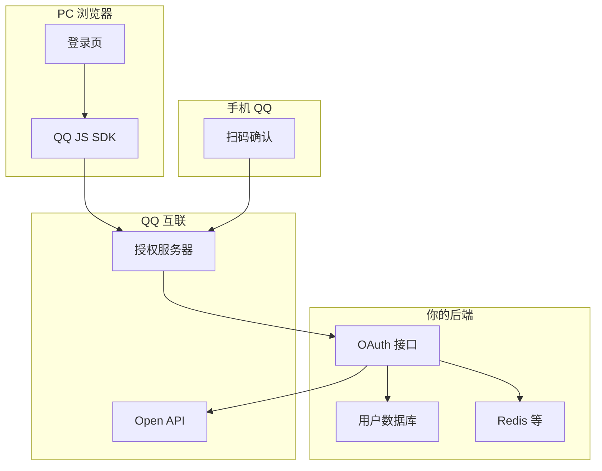
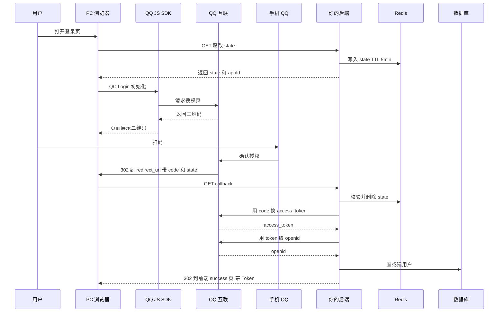
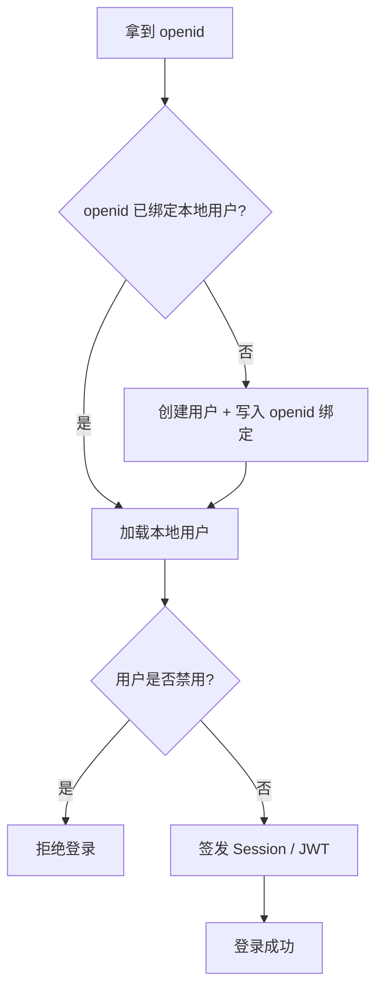
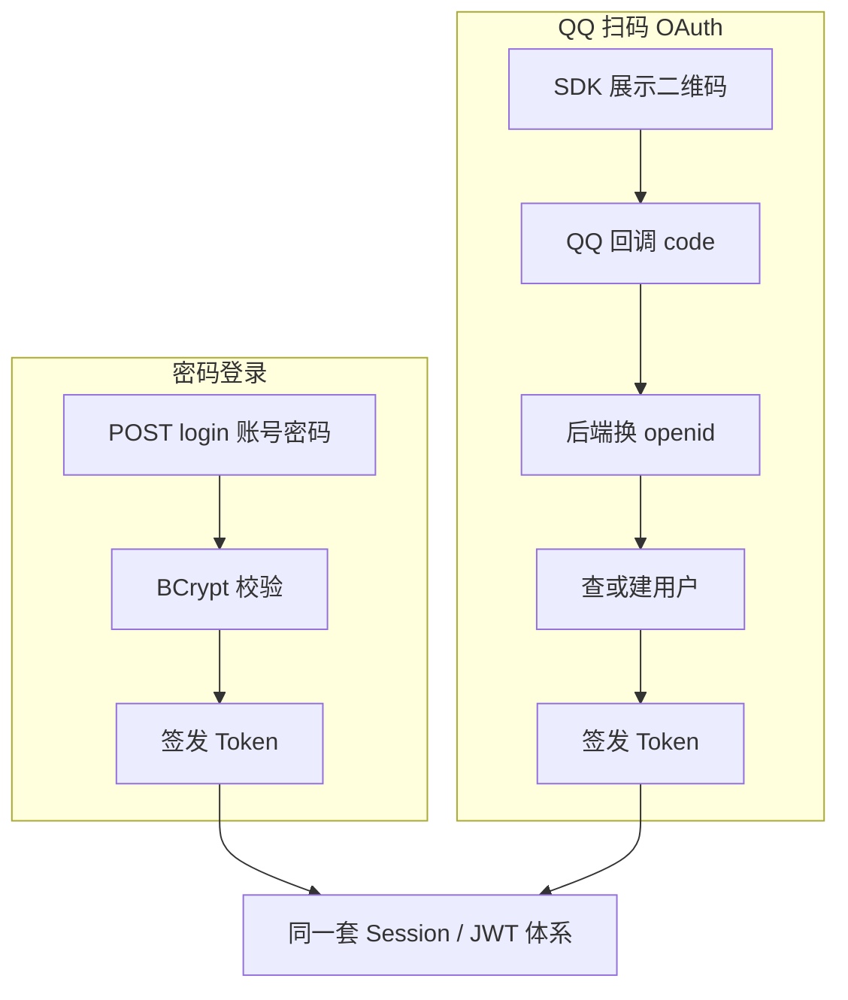

# 在智慧书城实现 QQ OAuth 扫码登录

> **项目**：smart_bookstore（智慧书城）  
> **文档类型**：学习文档 · 关联本仓库业务代码  
> **关联包 / 模块**：`com.zx.auth.oauth`  
> **建议前置**：[登录流程学习文档](./登录流程学习文档.md)、[双 Token 登录学习文档](./双Token登录学习文档.md)

## 学习目标

1. 掌握授权码模式：state、code 换 token、openid 绑定
2. 理解第三方身份与本地用户表的关联
3. 跟踪 callback → LoginHandler → 发双 Token 的闭环

## 与本仓库的对应关系

| 路径 | 说明 |
| --- | --- |
| `src/main/java/com/zx/auth/controller/QqOAuthController.java` | 对照阅读 |
| `src/main/java/com/zx/auth/service/QqOAuthService.java` | 对照阅读 |
| `src/main/java/com/zx/auth/service/login/QqOAuthLoginHandler.java` | 对照阅读 |

读理论时请打开上表文件对照；改代码前先跑通 `docker compose up -d` 与 `local` profile。

---

## 导读
很多初学者会把「QQ 扫码登录」当成一种独立协议。实际上，**扫码只是前端交互形态**，底层仍然是标准的 OAuth 2.0：

```text
用户授权 → 拿到 code → 后端用 code 换 access_token → 用 token 取 openid → 在你系统里登录
```

和手机验证码登录、密码登录的区别只在于：**「如何证明用户是谁」**。一旦拿到 openid 并完成账号绑定，后面的 Session、JWT、权限体系都可以复用现有设计。

---

## 一、三个核心凭证

在 QQ 互联控制台创建「网站应用」后，你会拿到：

| 凭证 | 能否给前端 | 用途 |
|------|------------|------|
| **App ID** | ✅ 可以 | 初始化 QQ JS SDK、拼授权 URL 的 client_id |
| **App Key（AppSecret）** | ❌ 绝对不能 | 后端用 code 换 token 时作为 client_secret |
| **redirect_uri** | 配置在控制台 | QQ 授权成功后浏览器跳转的地址 |

**安全原则：** App Key 只存在于服务端配置（环境变量 / 密钥管理），永远不要写进前端 JS 或提交到 Git。

---

## 二、参与方与职责



| 角色 | 做什么 |
|------|--------|
| **PC 浏览器 + JS SDK** | 展示二维码、携带 state 发起授权 |
| **手机 QQ** | 用户扫码并在 App 内点「确认登录」 |
| **QQ 互联** | 校验用户身份，签发一次性 code，提供换 token / 取 openid 的 API |
| **你的后端** | 校验 state、用 code 换 openid、查或建用户、签发自己系统的登录态 |
| **Redis（推荐）** | 存 OAuth state，防 CSRF |
| **数据库** | 存 openid 与本地用户的绑定关系 |

---

## 三、为什么需要 state

OAuth 回调时，QQ 会在 URL 里带上 `code` 和 `state`：

```text
https://your-domain.com/oauth/qq/callback?code=xxx&state=yyy
```

**state 是你自己生成的随机字符串**，在发起授权前写入 Redis（或 Session），回调时校验并删除。

作用：

1. **防 CSRF**：攻击者无法伪造一个有效的 state
2. **防重放**：state 一次性消费，用过即删
3. **关联上下文**（可选）：可编码来源页面、设备类型等

典型 TTL：**5～10 分钟**。

---

## 四、完整流程（逐步拆解）

### 4.1 时序总览



---

### 4.2 第一步：前端拿 state

PC 扫码方案里，**推荐后端生成 state**，前端通过接口获取：

```http
GET /api/auth/oauth/qq/state
```

响应示例：

```json
{
  "code": 0,
  "data": {
    "state": "a1b2c3d4e5f6...",
    "appId": "101234567",
    "redirectUri": "https://example.com/api/auth/oauth/qq/callback"
  }
}
```

后端同时执行：

```text
Redis SET oauth:state:{state} = 1  EX 600
```

---

### 4.3 第二步：初始化 QQ JS SDK，展示二维码

前端引入 QQ 互联 JS SDK，在登录页初始化：

```html
<script src="https://connect.qq.com/qc_jssdk.js"></script>
<div id="qq-login-container"></div>
```

```javascript
QC.Login({
  btnId: 'qq-login-container',
  appId: '101234567',           // App ID，可公开
  redirectURI: 'https://example.com/api/auth/oauth/qq/callback',
  scope: 'get_user_info',
  state: stateFromBackend       // 必须用后端返回的 state
})
```

SDK 会向 QQ 请求授权页，并在页面上渲染**二维码**。用户用手机 QQ 扫描后，在 App 内点击确认。

> **注意：** `redirectURI` 必须与 QQ 控制台配置的回调地址**完全一致**（协议、域名、端口、路径）。

---

### 4.4 第三步：QQ 回调你的后端

用户确认授权后，**浏览器会被 QQ 302 重定向**到你的 `redirect_uri`：

```http
GET /api/auth/oauth/qq/callback?code=AUTHORIZATION_CODE&state=SAME_STATE
```

这里的 `code` 是**授权码**：

- **一次性**：用过即失效
- **短有效期**：通常几分钟
- **只能由后端换 token**：因为需要 App Key

---

### 4.5 第四步：后端校验 state

```text
1. code、state 不能为空
2. Redis 中存在 oauth:state:{state}
3. 校验通过后 DELETE 该 key（一次性消费）
4. state 无效 → 拒绝，疑似 CSRF
```

---

### 4.6 第五步：用 code 换 access_token

后端向 QQ Open API 发起请求（**必须用 App Key，仅服务端**）：

```http
GET https://graph.qq.com/oauth2.0/token
  ?grant_type=authorization_code
  &client_id={AppID}
  &client_secret={AppKey}
  &code={code}
  &redirect_uri={redirect_uri}
```

**成功**时响应体是 query string 格式：

```text
access_token=XXXX&expires_in=7776000&refresh_token=YYYY
```

**失败**时可能返回 JSON：

```json
{"error":100020,"error_description":"code is reused"}
```

常见失败原因：

| 原因 | 说明 |
|------|------|
| code 过期 | 用户扫码太慢 |
| code 已使用 | 重复请求 callback |
| redirect_uri 不一致 | 与换 token 时传的地址必须和授权时相同 |
| App Key 错误 | 配置问题 |

---

### 4.7 第六步：用 access_token 取 openid

```http
GET https://graph.qq.com/oauth2.0/me?access_token={token}&fmt=json
```

响应示例：

```json
{"client_id":"101234567","openid":"用户的openid"}
```

**openid** 是用户在**当前 App** 下的唯一标识，应作为你系统里的第三方身份 ID。

> **进阶：** 若同一主体下有多个 QQ 应用，建议使用 **unionid** 作为绑定键，避免同一用户在不同 App 下 openid 不同。需在 QQ 互联申请 unionid 权限。

---

### 4.8 第七步（可选）：拉取用户信息

```http
GET https://graph.qq.com/user/get_user_info
  ?access_token={token}
  &oauth_consumer_key={AppID}
  &openid={openid}
```

可拿到昵称、头像等，用于**首次注册**时生成默认用户名。这一步失败不应阻断登录。

---

### 4.9 第八步：在你系统里完成登录

拿到 openid 后，业务逻辑与「第三方登录」通用模式一致：



数据库设计参考：

```text
user_identity 表
  identity_type  = qq_openid  （或 qq_unionid）
  identity_value = openid
  user_id        = 本地用户 ID
```

**QQ 的 access_token 一般不必长期存储**，仅用于换 openid 和拉资料，用完即可。

---

### 4.10 第九步：把登录态交给前端

OAuth 回调是**浏览器整页跳转**，不适合像 AJAX 登录那样直接返回 JSON。常见两种做法：

#### 方式 A：302 重定向 + URL Hash（常用）

```java
response.sendRedirect(
  "https://frontend.example.com/oauth/success"
  + "#accessToken=xxx&refreshToken=yyy&expireIn=7200"
);
```

原理：

1. `sendRedirect` 返回 **HTTP 302**，响应头 `Location` 指向前端 success 页
2. `#` 后面的内容叫 **URL Fragment**，**不会发给任何服务器**，只留在浏览器
3. 前端 success 页用 JS 解析 `window.location.hash`，存入 localStorage

```javascript
const params = new URLSearchParams(window.location.hash.slice(1))
const accessToken = params.get('accessToken')
localStorage.setItem('accessToken', accessToken)
history.replaceState(null, '', '/home')  // 清掉 hash 中的 Token
```

为什么 Token 放 `#` 而不是 `?`：`?` 会出现在服务器 access log 里，相对更不安全。

#### 方式 B：SPA 二次 POST

QQ 回调到前端页面，前端从 URL 取出 `code` + `state`，再 `POST /login` 换 JSON Token。适合纯 SPA，但需要额外处理 callback 路由。

---

## 五、后端需要几个接口

| 接口 | 是否必须 | 说明 |
|------|----------|------|
| `GET .../oauth/qq/state` | ✅ 推荐 | 生成 state，返回给 SDK |
| `GET .../oauth/qq/callback` | ✅ 必须 | QQ 控制台配置的 redirect_uri |
| `GET .../oauth/qq/authorize` | ⭕ 可选 | 服务端 302 到 QQ；PC 扫码用 SDK 时通常不需要 |

登录后的 refresh、logout、查用户信息，复用你现有的认证接口即可。

---

## 六、安全清单

| 项 | 做法 |
|----|------|
| App Key | 仅后端，环境变量注入 |
| state | 后端生成、Redis 存、一次性校验 |
| redirect_uri | 控制台、SDK、换 token 三处必须一致 |
| code | 仅后端使用，不可在前端换 token |
| HTTPS | 生产环境 callback 必须 HTTPS |
| Token 传递 | 优先 hash fragment 或 HttpOnly Cookie，避免 query 明文 |
| 开放接口 | state / callback 需加入认证白名单，不走 JWT 拦截 |

---

## 七、与密码登录的对比



差异只在**身份验证方式**；Session 管理、Token 刷新、权限控制可以完全复用。

---

## 八、常见踩坑

| 现象 | 可能原因 |
|------|----------|
| 回调 404 | redirect_uri 路径与后端路由不一致 |
| invalid state | state 过期、被重复使用、或前后端 state 不一致 |
| code 换 token 失败 | redirect_uri 不一致、code 已用过、App Key 错误 |
| 本地调试失败 | QQ 控制台未配置 localhost 或端口不对 |
| 扫码后无反应 | SDK 的 redirectURI 与控制台不一致 |
| 前端拿不到 Token | success 页未解析 hash；或误把 Token 放 query 被路由吞掉 |

---

## 九、调 QQ 哪几个 API（速查）

| 步骤 | URL | 方法 | 关键参数 |
|------|-----|------|----------|
| 换 Token | `graph.qq.com/oauth2.0/token` | GET | grant_type, client_id, client_secret, code, redirect_uri |
| 取 openid | `graph.qq.com/oauth2.0/me` | GET | access_token, fmt=json |
| 用户信息 | `graph.qq.com/user/get_user_info` | GET | access_token, oauth_consumer_key, openid |

---

## 十、总结

QQ PC 扫码登录的本质：

```text
1. 后端生成 state（防 CSRF）
2. 前端 SDK 展示二维码
3. 用户手机 QQ 扫码确认
4. QQ 302 回调带 code
5. 后端用 code + AppKey 换 access_token
6. 后端用 token 取 openid
7. openid 绑定本地用户，签发自己系统的 Token
8. 302 重定向到前端，前端从 URL hash 读取 Token
```

记住三句话：

1. **扫码只是 UI，协议是 OAuth 2.0 授权码模式**
2. **App Key 永远在后端，code 也只能在后端换 token**
3. **openid 是你系统和 QQ 用户之间的桥梁，登录态仍由你自己签发**

搞懂这条链路，接入微信、GitHub、Google 等 OAuth 登录也是同一套思路，只是授权页和 API 地址不同。

---

## 延伸阅读

- [QQ 互联官方文档](https://wiki.connect.qq.com/)
- [OAuth 2.0 授权码模式（RFC 6749）](https://datatracker.ietf.org/doc/html/rfc6749#section-4.1)
- [OAuth 2.0 for Browser-Based Apps（BCP）](https://datatracker.ietf.org/doc/html/draft-ietf-oauth-browser-based-apps)
