# QQ 官方 JS SDK（PC 扫码登录）流程图


> **项目**：smart_bookstore（智慧书城） · **文档类型**：学习文档  
> **关联**：`com.zx.auth.oauth` — OAuth 时序  
> **索引**：[学习文档中心](./README.md)

> 适用场景：PC 网页端，用户使用**手机 QQ 扫码**完成第三方登录  
> 官方平台：[QQ 互联](https://connect.qq.com/)  
> 协议基础：**OAuth 2.0 授权码模式**（扫码只是前端交互形态，本质仍是 OAuth）  
> 关联文档：[登录流程学习文档](./登录流程学习文档.md) · [接口文档](./接口文档.md) · [项目流程图](./项目流程图.md)

---

## 一、写在前面

PC 端「QQ 扫码登录」并不是一套独立于 OAuth 之外的协议。QQ 互联提供的 **JS SDK** 在页面上展示二维码，用户用手机 QQ 扫描确认后，浏览器仍会走 **授权码（code）→ 换 Token → 取 openid** 的标准流程。

本文说明：

1. QQ 官方 JS SDK 扫码登录的**完整链路**
2. 前端、QQ 服务器、自己后端各自做什么
3. 与 `smart_bookstore` 双 Token 架构如何衔接（**设计参考**，当前仓库尚未接入 QQ OAuth）

---

## 二、前置准备（QQ 互联控制台）

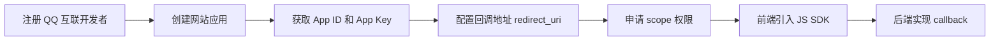

| 配置项 | 说明 | 示例 |
|--------|------|------|
| **App ID** | 应用标识，前端 SDK 必填 | `101234567` |
| **App Key** | 应用密钥，**仅后端**使用 | 环境变量，不进 Git |
| **redirect_uri** | 授权成功后的回调地址 | `https://your-domain.com/api/auth/oauth/qq/callback` |
| **scope** | 授权范围 | `get_user_info` 等 |
| **网站域名** | 与前端页面域名一致 | 控制台需备案/校验 |

> **注意：** 本地开发时 `redirect_uri` 需与 QQ 控制台配置**完全一致**（含协议、端口、路径）。`localhost` 是否支持以 QQ 互联当前规则为准。

---

## 三、角色与职责

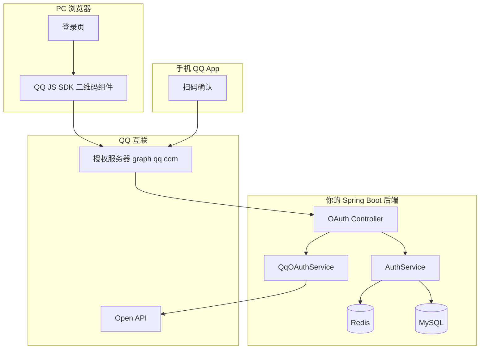

| 角色 | 职责 |
|------|------|
| **PC 浏览器 + JS SDK** | 展示二维码、发起 OAuth、接收 redirect |
| **手机 QQ** | 用户扫码、确认授权 |
| **QQ 互联** | 签发 code、换 access_token、提供 openid |
| **你的后端** | 验 state、换 openid、查/建用户、发双 Token |
| **Redis** | 存 OAuth state（防 CSRF）、Session 缓存等 |
| **MySQL** | 存用户、openid 绑定、Session |

---

## 四、端到端总览（扫码登录）

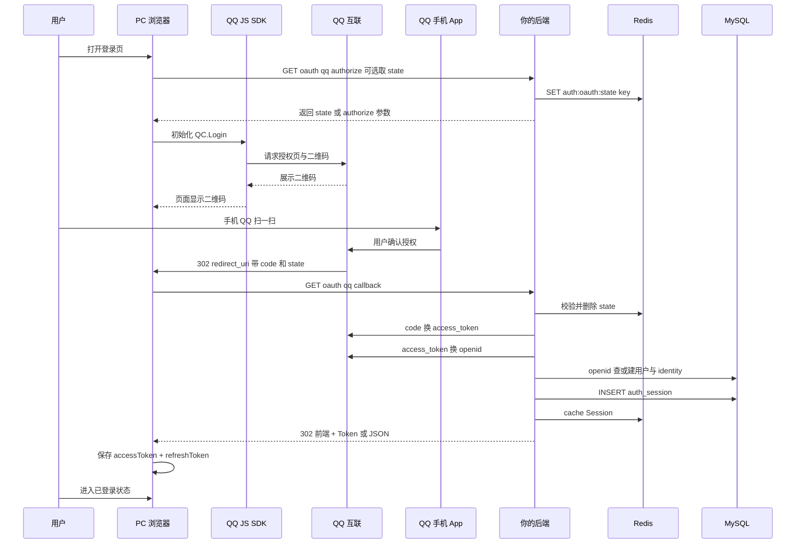

---

## 五、前端：QQ 官方 JS SDK 流程

### 5.1 页面集成步骤

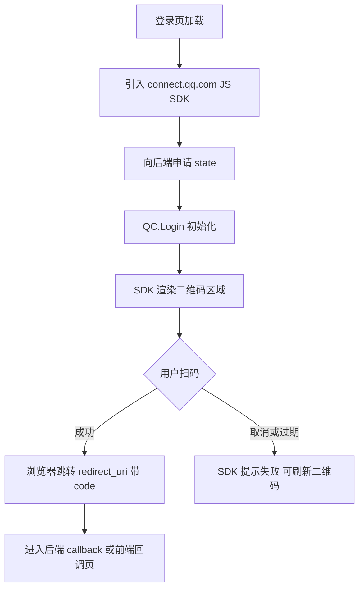

### 5.2 前端伪代码（示意）

```html
<div id="qq-login-container"></div>
<script src="https://connect.qq.com/qc_jssdk.js"></script>
<script>
  // 1. 先从后端拿 state（推荐，不要前端自己造）
  const { state } = await fetch('/api/auth/oauth/qq/state').then(r => r.json());

  // 2. 初始化 QQ 登录（具体 API 以 QQ 互联最新文档为准）
  QC.Login({
    btnId: 'qq-login-container',
    appId: '你的 App ID',
    redirectURI: 'https://your-domain.com/api/auth/oauth/qq/callback',
    scope: 'get_user_info',
    state: state,
    // PC 端 SDK 会在容器内展示二维码或登录按钮
  });
</script>
```

### 5.3 前端两种 callback 处理方式

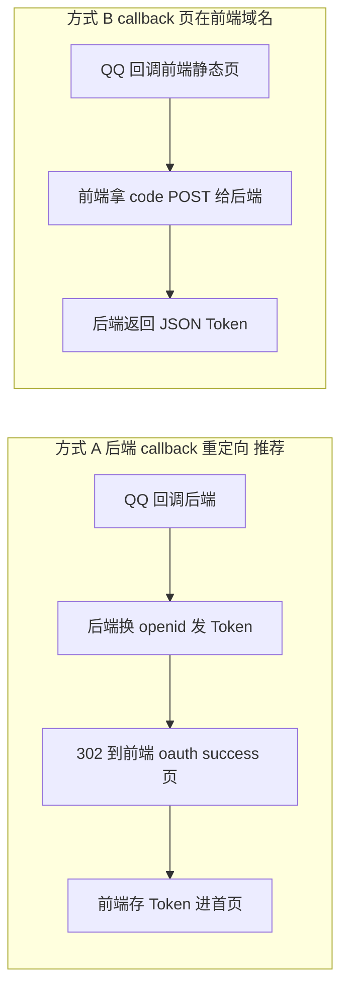

| 方式 | 优点 | 注意 |
|------|------|------|
| **A：后端 callback** | App Key 不暴露、state 校验集中 | redirect_uri 指向后端 |
| **B：前端 callback** | 前后端分离部署灵活 | 必须用 PKCE 或严格 state；code 尽快换 token |

`smart_bookstore` 推荐 **方式 A**，与现有 Spring Security + 双 Token 更一致。

---

## 六、后端：OAuth Callback 流程

### 6.1 建议接口

| 方法 | 路径 | 说明 |
|------|------|------|
| GET | `/api/auth/oauth/qq/state` | 生成 state 写入 Redis，返回给前端 |
| GET | `/api/auth/oauth/qq/authorize` | （可选）直接 302 到 QQ 授权页 |
| GET | `/api/auth/oauth/qq/callback` | QQ 回调，换 openid，登录，重定向前端 |

### 6.2 Callback 详细流程

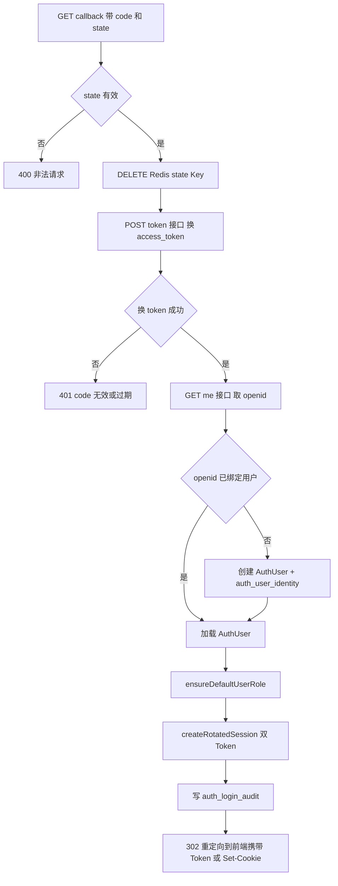

### 6.3 调用的 QQ Open API

| 步骤 | URL | 说明 |
|------|-----|------|
| 换 Token | `https://graph.qq.com/oauth2.0/token` | grant_type=authorization_code |
| 取 openid | `https://graph.qq.com/oauth2.0/me` | 返回 openid（JSONP 或 JSON） |
| 用户信息（可选） | `https://graph.qq.com/user/get_user_info` | 昵称、头像 |

> **unionid：** 若同一主体下有多个 QQ 应用，建议用 unionid 作为 `identity_value`，避免同一用户在不同 App 下 openid 不同。

---

## 七、与 smart_bookstore 双 Token 衔接

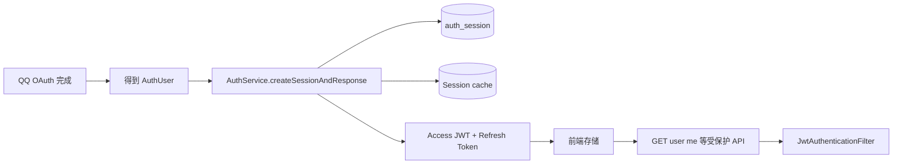

QQ 扫码登录**不需要**改动现有核心：

| 模块 | 是否改动 |
|------|----------|
| `JwtService` / Access JWT | 不变 |
| `createRotatedSession` / Rotation | 不变 |
| `JwtAuthenticationFilter` | 不变 |
| `AuthRedisService` 黑名单 | 不变 |
| `AuthSessionCacheService` | 不变 |
| **新增** | `QqOAuthController`、`QqOAuthService`、identity 类型 `qq_openid` |

登录成功后与密码登录、验证码登录**共用同一套 Token 与 Session 机制**。

---

## 八、Redis 在 QQ 扫码流程中的作用

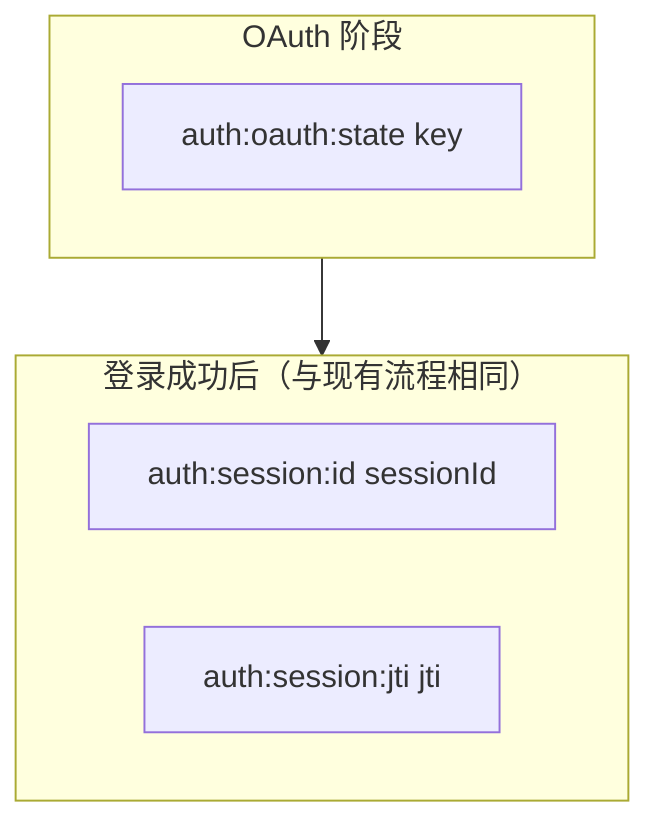

| Key | 时机 | TTL | 作用 |
|-----|------|-----|------|
| `auth:oauth:state:{state}` | authorize 前写入 | 5～10 分钟 | 防 CSRF，callback 校验后删除 |
| `auth:session:id:*` | 登录成功 | refresh/absolute 剩余 | Session 快照 |
| `auth:session:jti:*` | 登录成功 | 同上 | jti 索引 |

QQ 的 `access_token` **一般不必存入 Redis/MySQL**（仅用于换 openid，用完即可）。

---

## 九、数据库设计参考

### 9.1 扩展 auth_user_identity

```sql
-- identity_type 建议扩展 ENUM，或新增 oauth 表
identity_type  = 'qq_openid'   -- 或 'qq_unionid'
identity_value = openid 或 unionid
verified       = 1
```

### 9.2 登录审计

```sql
auth_login_audit.login_type = 'qq_oauth'
```

---

## 十、SecurityConfig 需放行的路径

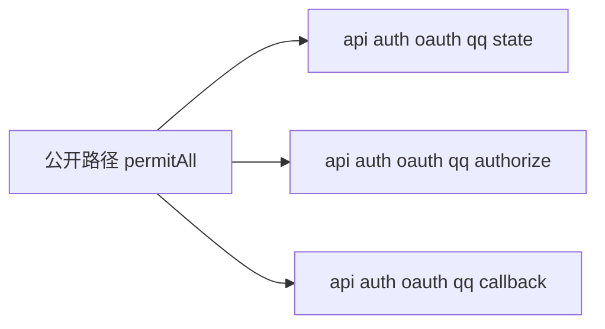

与现有 `/api/auth/login`、`/refresh` 一样，OAuth 入口和 callback **不能**走 JWT 过滤器。

---

## 十一、时序对比：扫码 vs 账号密码

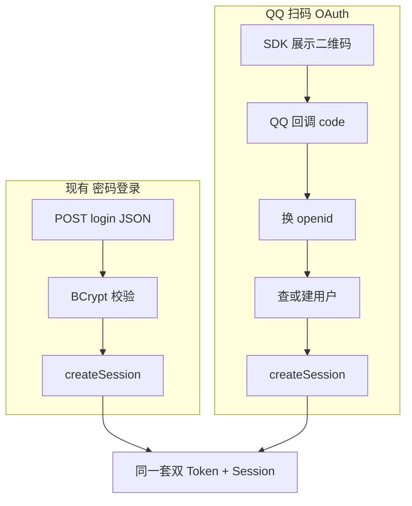

**差异只在「如何证明用户是谁」；Session 与 Token 签发逻辑可完全复用。**

---

## 十二、异常与失败分支

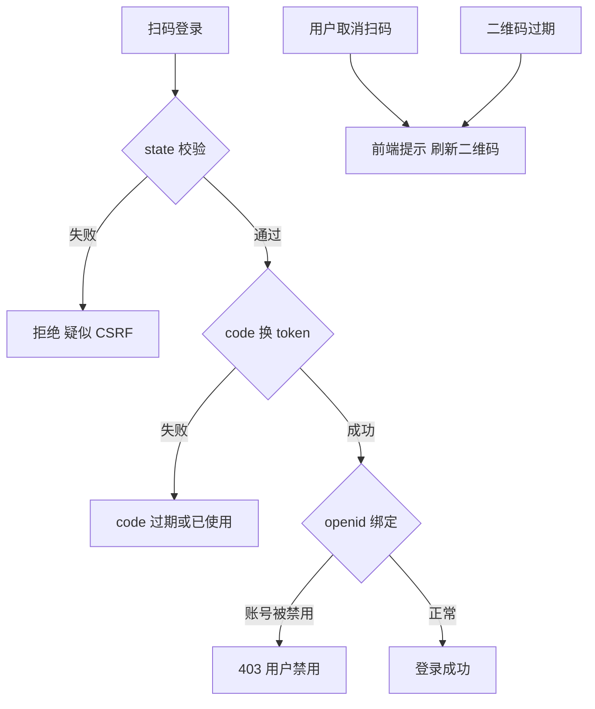

| 场景 | 前端 | 后端 |
|------|------|------|
| 用户取消 | SDK 回调失败，提示重试 | 无请求 |
| state 不匹配 | — | 400，记录安全日志 |
| code 无效 | 跳转错误页 | 401 |
| QQ API 超时 | 提示稍后重试 | 503 + 重试 |

---

## 十三、配置项参考

```yaml
auth:
  oauth:
    qq:
      app-id: ${QQ_APP_ID}
      app-key: ${QQ_APP_KEY}
      redirect-uri: https://your-domain.com/api/auth/oauth/qq/callback
      scope: get_user_info
      state-ttl-seconds: 600
      frontend-success-url: https://your-frontend.com/oauth/success
```

---

## 十四、实施 checklist

- [ ] QQ 互联创建网站应用，配置 redirect_uri
- [ ] 后端：`/oauth/qq/state`、`/oauth/qq/callback`
- [ ] Redis：`auth:oauth:state:*`
- [ ] MySQL：`auth_user_identity` 支持 qq_openid
- [ ] `SecurityConfig` 放行 OAuth 路径
- [ ] 登录成功复用 `createSessionAndResponse`
- [ ] 前端：引入 JS SDK，展示二维码容器
- [ ] callback 后重定向前端并保存双 Token
- [ ] 审计 `login_type=qq_oauth`
- [ ] 联调：扫码 → `/api/user/me` → refresh → logout

---

## 十五、相关链接

| 资源 | 地址 |
|------|------|
| QQ 互联首页 | https://connect.qq.com/ |
| 开发文档 | https://wiki.connect.qq.com/ （以官网最新为准） |
| 本项目接口文档 | [接口文档](./接口文档.md) |
| 登录全链路说明 | [登录流程学习文档](./登录流程学习文档.md) |

---

## 十六、总结

```text
QQ PC 扫码登录 = QQ JS SDK 展示二维码
                + 手机 QQ 确认授权
                + OAuth 2.0 授权码换 openid
                + 映射到本地用户
                + 复用现有双 Token Session
```

**扫码只是交互；安全与账号体系的关键仍是：state 校验、code 一次性、openid 绑定、双 Token 签发。**

如需在本仓库落地 QQ OAuth 代码，可参考本文接口设计，在 Agent 模式下实现 Controller / Service / 表结构变更。
