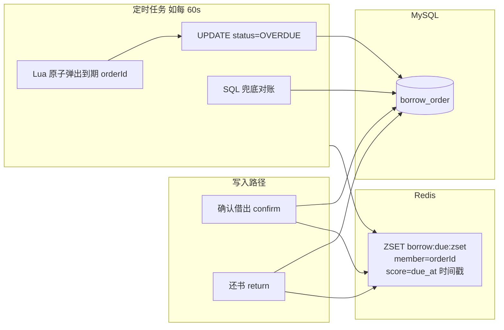
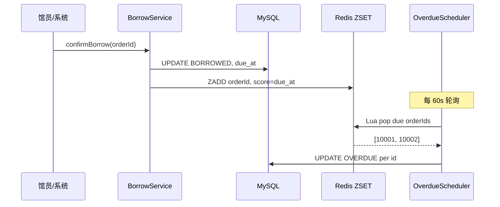

# Redis ZSET + Lua 实现借阅到期精准触发

> **项目**：smart_bookstore（智慧书城）  
> **文档类型**：学习文档 · 关联本仓库业务代码  
> **关联包 / 模块**：`com.zx.bookstore.borrow`  
> **建议前置**：[借阅逾期四种实现思路对比](./借阅逾期四种实现思路对比.md)

## 学习目标

1. 理解 ZSET 以 due_at 为 score 的到期调度模型
2. 掌握 Lua 原子弹出到期订单的写法
3. 了解 Scheduler 轮询 + SQL 对账兜底设计

## 与本仓库的对应关系

| 路径 | 说明 |
| --- | --- |
| `src/main/java/com/zx/bookstore/borrow/service/BorrowDueRedisService.java` | 对照阅读 |
| `src/main/resources/lua/borrow_due_pop.lua` | 对照阅读 |
| `src/main/java/com/zx/bookstore/borrow/scheduler/BorrowOverdueScheduler.java` | 对照阅读 |

读理论时请打开上表文件对照；改代码前先跑通 `docker compose up -d` 与 `local` profile。

---

## 一、写在前面

很多团队一说到「定时处理逾期」，第一反应是：

```sql
-- 每分钟全表扫一遍？
SELECT * FROM borrow_order
WHERE status = 'BORROWED' AND due_at < NOW();
```

数据量上来以后，这条 SQL 会越来越慢，且**每次扫描大量尚未到期的行**，浪费 CPU 和 IO。

本文介绍一种更常见的工程做法：

```text
借出时：把 orderId 按 due_at 放进 Redis ZSET
到期时：Lua 只「弹出」 score <= 当前时间的 member
还书时：从 ZSET 删掉，避免误触发
兜底：  偶尔用 SQL 对账，防止 Redis 写入失败
```

**核心思想**：定时任务还在，但**不再全表扫描**，只处理「已经到期」的那一小批订单。

---

## 二、业务背景

### 2.1 借阅状态机（简化）

```text
APPLIED（已申请，待取书）
    └─ confirm ──→ BORROWED（在借中）
                       ├─ return ──→ RETURNED（已还）
                       └─ 到期未还 ──→ OVERDUE（逾期，仍可还书）
```

| 状态 | 含义 |
|------|------|
| `BORROWED` | 已借出，未到应还时间或刚到期待处理 |
| `OVERDUE` | 已过 `due_at` 仍未还，需展示、通知、计罚 |
| `RETURNED` | 已还，终态 |

### 2.2 要解决什么问题

| 层次 | 需求 | 是否必须改库里的 `OVERDUE` 状态 |
|------|------|--------------------------------|
| L1 | 列表展示「已逾期 3 天」 | 否（`due_at < now` 即可算） |
| L2 | 管理端筛选逾期单 | 是 |
| L3 | 到期短信 / 站内信 | 需要可靠触发 |
| L4 | 罚息、冻结借阅资格 | 需要可靠触发 + 持久化 |

本文聚焦 **L2～L4**：如何把「到期」这件事**准、稳、可扩展**地触发出来。

---

## 三、方案对比（为什么不是别的）

| 方案 | 做法 | 优点 | 缺点 |
|------|------|------|------|
| **A. 定时全表扫** | `WHERE due_at < NOW()` | 简单 | 数据量大时慢；索引压力大 |
| **B. 展示时实时算** | 查询时 `due_at < now` | 无后台任务 | 无法主动通知；筛选逾期单仍要扫 |
| **C. 延迟 MQ** | 借出时发延迟消息 | 到点精确 | 改期难；大量 TTL 消息占资源 |
| **D. Redis ZSET + 轮询** | score = 到期时间戳 | 只处理到期单；改期 = ZADD 更新 | 依赖 Redis；需兜底对账 |

**推荐 D**：实现成本适中，性能稳定，和「借出写 due_at、还书删索引」的业务节奏天然契合。

---

## 四、整体架构



**分工**：

- **MySQL**：借阅单权威数据，`due_at`、`status` 以库为准。
- **Redis ZSET**：**调度索引**，告诉系统「哪些单在什么时间点该被处理」。
- **Lua**：一次网络往返内完成「查到期 + 删索引」，避免重复处理。
- **定时任务**：短周期轮询（如 60 秒），每次只 pop 一批到期 ID，不是扫全表。

---

## 五、Redis 数据结构设计

### 5.1 Key 规划

```text
Key:    borrow:due:zset
Type:   ZSET（有序集合）
Member: 借阅单 ID，如 "10001"
Score:  due_at 的 Unix 秒时间戳（double），如 1735689600.0
```

### 5.2 为什么用 ZSET

Redis ZSET 按 **score 排序**，支持：

```redis
ZRANGEBYSCORE borrow:due:zset -inf 1735689600 LIMIT 0 100
```

含义：**只取出 score ≤ 当前时间戳的前 100 个 orderId**，也就是「已经到期的前 100 单」。

对比全表扫：

```text
全表扫：每次看所有 BORROWED 行
ZSET：  每次只看 score 落在 (-∞, now] 的成员，数量 ≈ 到期单量
```

### 5.3 生命周期

| 事件 | Redis 操作 |
|------|------------|
| 确认借出 | `ZADD borrow:due:zset <dueEpoch> <orderId>` |
| 还书 | `ZREM borrow:due:zset <orderId>` |
| 续借改期 | `ZADD` 同一 member，新 score 覆盖旧 score |
| 到期处理 | Lua：`ZRANGEBYSCORE` + `ZREM` |

---

## 六、Lua 脚本：原子「弹出」到期单

### 6.1 为什么需要 Lua

若不用 Lua，两步分开执行：

```text
1. ZRANGEBYSCORE  → 得到 [10001, 10002]
2. ZREM 10001, 10002
```

在步骤 1 和 2 之间，另一个实例也可能读到相同 ID，导致**重复标记逾期**。

Lua 在 Redis 内**单线程原子执行**，一次搞定。

### 6.2 完整脚本 `borrow_due_pop.lua`

```lua
-- 原子取出 score <= maxScore 的 orderId，并从 ZSET 删除
-- KEYS[1] = borrow:due:zset
-- ARGV[1] = maxScore（当前 Unix 秒）
-- ARGV[2] = limit（每批最多处理条数）
-- 返回：被弹出的 member 列表（字符串数组）

local key = KEYS[1]
local maxScore = tonumber(ARGV[1])
local limit = tonumber(ARGV[2])

if maxScore == nil or limit == nil or limit <= 0 then
    return {}
end

-- 按 score 升序取到期 member，最多 limit 个
local members = redis.call('ZRANGEBYSCORE', key, '-inf', maxScore, 'LIMIT', 0, limit)
if #members == 0 then
    return {}
end

for i = 1, #members do
    redis.call('ZREM', key, members[i])
end

return members
```

### 6.3 Redis CLI 手工验证

```bash
# 模拟 3 笔借出：两笔已到期，一笔未到期
redis-cli ZADD borrow:due:zset 1000 "order-1"
redis-cli ZADD borrow:due:zset 2000 "order-2"
redis-cli ZADD borrow:due:zset 9999999999 "order-3"

# 加载并执行 Lua（maxScore=3000，limit=10）
redis-cli EVAL "$(cat borrow_due_pop.lua)" 1 borrow:due:zset 3000 10
# 期望返回：order-1, order-2

# 再次执行，应返回空；order-3 仍在
redis-cli ZRANGE borrow:due:zset 0 -1 WITHSCORES
```

---

## 七、MySQL 表结构（示例）

```sql
CREATE TABLE borrow_order (
    id          BIGINT UNSIGNED PRIMARY KEY AUTO_INCREMENT,
    user_id     BIGINT UNSIGNED NOT NULL,
    book_id     BIGINT UNSIGNED NOT NULL,
    status      VARCHAR(16)  NOT NULL COMMENT 'APPLIED/BORROWED/OVERDUE/RETURNED/CANCELLED',
    borrow_at   DATETIME     NULL COMMENT '确认借出时间',
    due_at      DATETIME     NULL COMMENT '应还时间',
    return_at   DATETIME     NULL,
    created_at  DATETIME     NOT NULL DEFAULT CURRENT_TIMESTAMP,
    updated_at  DATETIME     NOT NULL DEFAULT CURRENT_TIMESTAMP ON UPDATE CURRENT_TIMESTAMP,
    KEY idx_status_due (status, due_at)
) ENGINE=InnoDB DEFAULT CHARSET=utf8mb4;
```

标记逾期的 SQL（**带状态条件，幂等**）：

```sql
-- 单笔
UPDATE borrow_order
SET status = 'OVERDUE', updated_at = NOW()
WHERE id = ? AND status = 'BORROWED';

-- 兜底批量（Redis 漏写时）
UPDATE borrow_order
SET status = 'OVERDUE', updated_at = NOW()
WHERE status = 'BORROWED' AND due_at < NOW()
LIMIT 100;
```

`idx_status_due` 让兜底 SQL 走索引，**偶尔跑**，不是每分钟全表扫。

---

## 八、Java：Redis 调度服务

### 8.1 Maven 依赖（Spring Boot 3）

```xml
<dependency>
    <groupId>org.springframework.boot</groupId>
    <artifactId>spring-boot-starter-data-redis</artifactId>
</dependency>
```

### 8.2 `BorrowDueScheduleService.java`

```java
package com.example.library.borrow;

import jakarta.annotation.PostConstruct;
import org.springframework.core.io.ClassPathResource;
import org.springframework.data.redis.core.StringRedisTemplate;
import org.springframework.data.redis.core.script.DefaultRedisScript;
import org.springframework.scripting.support.ResourceScriptSource;
import org.springframework.stereotype.Service;

import java.time.LocalDateTime;
import java.time.ZoneId;
import java.util.ArrayList;
import java.util.Collections;
import java.util.List;

@Service
public class BorrowDueScheduleService {

    /** 全局一张调度 ZSET 即可；量大可按馆/分片拆 key */
    public static final String DUE_ZSET_KEY = "borrow:due:zset";

    private final StringRedisTemplate redis;

    @SuppressWarnings("rawtypes")
    private DefaultRedisScript<List> popDueScript;

    public BorrowDueScheduleService(StringRedisTemplate redis) {
        this.redis = redis;
    }

    @PostConstruct
    void loadLua() {
        popDueScript = new DefaultRedisScript<>();
        popDueScript.setResultType(List.class);
        popDueScript.setScriptSource(
                new ResourceScriptSource(new ClassPathResource("lua/borrow_due_pop.lua"))
        );
    }

    /**
     * 确认借出后调用：把订单 ID 放入 ZSET，score = due_at 的 Unix 秒。
     */
    public void scheduleDue(Long orderId, LocalDateTime dueAt) {
        if (orderId == null || dueAt == null) {
            return;
        }
        double score = dueAt.atZone(ZoneId.systemDefault()).toEpochSecond();
        redis.opsForZSet().add(DUE_ZSET_KEY, String.valueOf(orderId), score);
    }

    /**
     * 还书后调用：从 ZSET 移除，避免已还订单被误标逾期。
     */
    public void removeDue(Long orderId) {
        if (orderId == null) {
            return;
        }
        redis.opsForZSet().remove(DUE_ZSET_KEY, String.valueOf(orderId));
    }

    /**
     * Lua 原子弹出 score <= nowEpoch 的 orderId。
     *
     * @param nowEpoch 当前 Unix 秒
     * @param limit    每批最多弹出条数
     */
    @SuppressWarnings("unchecked")
    public List<Long> popDueOrderIds(long nowEpoch, int limit) {
        if (limit <= 0) {
            return List.of();
        }
        List<String> raw = redis.execute(
                popDueScript,
                List.of(DUE_ZSET_KEY),
                String.valueOf(nowEpoch),
                String.valueOf(limit)
        );
        if (raw == null || raw.isEmpty()) {
            return List.of();
        }
        List<Long> ids = new ArrayList<>(raw.size());
        for (String s : raw) {
            ids.add(Long.parseLong(s));
        }
        return Collections.unmodifiableList(ids);
    }
}
```

脚本文件放在：`src/main/resources/lua/borrow_due_pop.lua`（内容见第六节）。

---

## 九、Java：借出 / 还书时维护 ZSET

### 9.1 确认借出 `confirmBorrow`

```java
package com.example.library.borrow;

import org.springframework.stereotype.Service;
import org.springframework.transaction.annotation.Transactional;

import java.time.LocalDateTime;

@Service
public class BorrowService {

    private final BorrowOrderRepository orderRepository;
    private final BorrowDueScheduleService dueScheduleService;

    public BorrowService(BorrowOrderRepository orderRepository,
                         BorrowDueScheduleService dueScheduleService) {
        this.orderRepository = orderRepository;
        this.dueScheduleService = dueScheduleService;
    }

    @Transactional
    public void confirmBorrow(Long orderId, int borrowDays) {
        LocalDateTime now = LocalDateTime.now();
        LocalDateTime dueAt = now.plusDays(borrowDays);

        // 1. 事务内更新 MySQL（权威数据）
        int updated = orderRepository.markBorrowed(orderId, now, dueAt);
        if (updated == 0) {
            throw new IllegalStateException("订单不可借出，id=" + orderId);
        }

        // 2. 写入 Redis 调度索引（建议在事务提交后做，见下文「注意点」）
        dueScheduleService.scheduleDue(orderId, dueAt);
    }
}
```

### 9.2 还书 `returnBook`

```java
@Transactional
public void returnBook(Long orderId) {
    LocalDateTime now = LocalDateTime.now();
    int updated = orderRepository.markReturned(orderId, now);
    if (updated == 0) {
        throw new IllegalStateException("订单不可还书，id=" + orderId);
    }
    // 从 ZSET 移除，幂等：不存在也不报错
    dueScheduleService.removeDue(orderId);
}
```

### 9.3 Repository 示例（MyBatis 注解）

```java
package com.example.library.borrow;

import org.apache.ibatis.annotations.Param;
import org.apache.ibatis.annotations.Update;

import java.time.LocalDateTime;

public interface BorrowOrderRepository {

    @Update("""
            UPDATE borrow_order
            SET status = 'BORROWED', borrow_at = #{borrowAt}, due_at = #{dueAt}, updated_at = NOW()
            WHERE id = #{id} AND status = 'APPLIED'
            """)
    int markBorrowed(@Param("id") Long id,
                     @Param("borrowAt") LocalDateTime borrowAt,
                     @Param("dueAt") LocalDateTime dueAt);

    @Update("""
            UPDATE borrow_order
            SET status = 'RETURNED', return_at = #{returnAt}, updated_at = NOW()
            WHERE id = #{id} AND status IN ('BORROWED', 'OVERDUE')
            """)
    int markReturned(@Param("id") Long id, @Param("returnAt") LocalDateTime returnAt);

    @Update("""
            UPDATE borrow_order
            SET status = 'OVERDUE', updated_at = NOW()
            WHERE id = #{id} AND status = 'BORROWED'
            """)
    int markOverdue(@Param("id") Long id);

    @Update("""
            UPDATE borrow_order
            SET status = 'OVERDUE', updated_at = NOW()
            WHERE status = 'BORROWED' AND due_at < NOW()
            LIMIT #{limit}
            """)
    int markOverdueBatch(@Param("limit") int limit);
}
```

---

## 十、Java：定时任务处理逾期

### 10.1 配置类

```java
package com.example.library.borrow;

import org.springframework.boot.context.properties.ConfigurationProperties;

@ConfigurationProperties(prefix = "library.borrow.overdue")
public class OverdueProperties {
    /** 是否启用逾期调度 */
    private boolean enabled = true;
    /** 轮询间隔（毫秒），fixedDelay：上一轮结束后再等 */
    private long pollIntervalMs = 60_000;
    /** 每批从 ZSET 弹出条数 */
    private int batchSize = 100;

    // getter / setter 省略
}
```

```yaml
# application.yaml
library:
  borrow:
    overdue:
      enabled: true
      poll-interval-ms: 60000
      batch-size: 100

spring:
  task:
    scheduling:
      pool:
        size: 2
```

### 10.2 调度器 `OverdueScheduler.java`

```java
package com.example.library.borrow;

import org.slf4j.Logger;
import org.slf4j.LoggerFactory;
import org.springframework.boot.autoconfigure.condition.ConditionalOnProperty;
import org.springframework.scheduling.annotation.Scheduled;
import org.springframework.stereotype.Component;

import java.time.Instant;
import java.util.List;

@Component
@ConditionalOnProperty(prefix = "library.borrow.overdue", name = "enabled", havingValue = "true", matchIfMissing = true)
public class OverdueScheduler {

    private static final Logger log = LoggerFactory.getLogger(OverdueScheduler.class);

    private final OverdueProperties properties;
    private final BorrowDueScheduleService dueScheduleService;
    private final BorrowOrderRepository orderRepository;

    public OverdueScheduler(OverdueProperties properties,
                            BorrowDueScheduleService dueScheduleService,
                            BorrowOrderRepository orderRepository) {
        this.properties = properties;
        this.dueScheduleService = dueScheduleService;
        this.orderRepository = orderRepository;
    }

    /**
     * fixedDelay：避免上一轮还没跑完又开始下一轮。
     * 精度 = 轮询间隔（如 60s），对借阅场景通常足够。
     */
    @Scheduled(fixedDelayString = "${library.borrow.overdue.poll-interval-ms:60000}")
    public void processOverdue() {
        int batchSize = Math.max(1, properties.getBatchSize());
        long nowEpoch = Instant.now().getEpochSecond();

        // 1. 从 Redis 弹出到期 orderId
        List<Long> orderIds = dueScheduleService.popDueOrderIds(nowEpoch, batchSize);
        int marked = 0;
        for (Long orderId : orderIds) {
            if (orderRepository.markOverdue(orderId) > 0) {
                marked++;
                // 可选：发 MQ / 站内信 notifyOverdue(orderId);
            }
        }
        if (marked > 0) {
            log.info("marked overdue from zset, count={}", marked);
        }

        // 2. SQL 兜底对账（Redis ZADD 失败、历史数据未入 ZSET）
        reconcileFromDb(batchSize);
    }

    private void reconcileFromDb(int batchSize) {
        int total = 0;
        int updated;
        do {
            updated = orderRepository.markOverdueBatch(batchSize);
            total += updated;
        } while (updated == batchSize);
        if (total > 0) {
            log.info("reconciled overdue from db, count={}", total);
        }
    }
}
```

启用调度：

```java
@SpringBootApplication
@EnableScheduling
@ConfigurationPropertiesScan
public class LibraryApplication {
    public static void main(String[] args) {
        SpringApplication.run(LibraryApplication.class, args);
    }
}
```

---

## 十一、端到端时序

```text
时间线 ──────────────────────────────────────────────────────────→

T0  用户借出 confirm
    MySQL: status=BORROWED, due_at=T0+30天
    Redis: ZADD borrow:due:zset score=due_at member=orderId

T1  用户提前还书 return
    MySQL: status=RETURNED
    Redis: ZREM borrow:due:zset orderId

T2  到期日 due_at 已过，定时任务触发（如 T2 与 due_at 差 ≤ 60s）
    Lua:  弹出 orderId
    MySQL: UPDATE status=OVERDUE WHERE id=? AND status=BORROWED
    可选: 发送逾期通知
```



---

## 十二、关键注意点

### 12.1 MySQL 与 Redis 的一致性

| 原则 | 说明 |
|------|------|
| **MySQL 是权威** | 展示、对账、报表以库为准 |
| **Redis 是索引** | 丢了可以靠 SQL 兜底重建 |
| **UPDATE 带状态条件** | `WHERE status='BORROWED'` 保证幂等 |

**推荐**：`ZADD` 放在 **事务提交之后**，避免事务回滚但 Redis 已写入：

```java
@Transactional
public void confirmBorrow(Long orderId, int borrowDays) {
    // ... update db ...
    TransactionSynchronizationManager.registerSynchronization(new TransactionSynchronization() {
        @Override
        public void afterCommit() {
            dueScheduleService.scheduleDue(orderId, dueAt);
        }
    });
}
```

### 12.2 精度：轮询间隔 vs 实时

本方案是 **短周期轮询**，不是毫秒级精确闹钟：

```text
due_at = 10:00:00
poll   = 每 60 秒
实际标记 OVERDUE 可能在 10:00:00 ~ 10:01:00 之间
```

借阅场景一般可接受。若要更准，可缩短 `poll-interval-ms`（如 10s），或到期前发「提醒」、到期后用本方案「标逾期」。

### 12.3 续借 / 改期

```java
public void renewBorrow(Long orderId, int extraDays) {
    LocalDateTime newDueAt = ...; // 业务计算新 due_at
    orderRepository.updateDueAt(orderId, newDueAt);
    dueScheduleService.scheduleDue(orderId, newDueAt); // ZADD 覆盖 score
}
```

同一 member 再次 `ZADD` 会**更新 score**，无需先 ZREM。

### 12.4 多实例部署

Lua 弹出是原子的，多个应用实例同时跑定时任务时：

- 同一 `orderId` **只会被一个实例 pop 到**
- `markOverdue` 带 `status='BORROWED'` 条件，重复执行也安全

仍建议：`fixedDelay` + 合理 `batchSize`，避免惊群打满 DB。

### 12.5 Redis 宕机 / 冷启动

| 场景 | 处理 |
|------|------|
| Redis 短暂不可用 | `scheduleDue` 失败记日志；靠 `reconcileFromDb` 兜底 |
| 新环境空 ZSET | 写启动任务：把 `status=BORROWED` 且 `due_at` 未来的单批量 ZADD |

冷启动重建示例：

```java
public void rebuildZsetFromDb() {
    List<BorrowOrder> active = orderRepository.findAllBorrowed();
    for (BorrowOrder o : active) {
        if (o.getDueAt() != null) {
            dueScheduleService.scheduleDue(o.getId(), o.getDueAt());
        }
    }
}
```

### 12.6 量级与分片

| 在借订单量 | 建议 |
|------------|------|
| < 10 万 | 单 ZSET `borrow:due:zset` 足够 |
| 更大 | 按 `orderId % N` 或按馆 ID 拆多个 ZSET，定时任务并行 pop |

---

## 十三、与「延迟 MQ」怎么选

| 维度 | Redis ZSET + 轮询 | RabbitMQ 延迟队列 |
|------|-------------------|-------------------|
| 改期 | ZADD 改 score 即可 | 需取消/重发消息，较麻烦 |
| 实现复杂度 | 低 | 中（DLX/TTL/插件） |
| 到点精度 | 受轮询间隔影响 | 可更贴近 due_at |
| 依赖 | Redis（多数项目已有） | RabbitMQ |

**经验法则**：借阅、会员到期、订单超时（分钟～天级）→ ZSET 很合适；秒级强实时 → 再考虑延迟 MQ。

---

## 十四、测试清单

```text
□ confirm 后 ZSET 存在 member，score ≈ due_at 时间戳
□ return 后 ZSET 无该 member
□ due_at 到期后一轮调度内 status → OVERDUE
□ 已 RETURNED 的单不会被标 OVERDUE（ZREM + SQL 条件）
□ 手动删掉 ZSET member，reconcileFromDb 仍能标逾期
□ 多实例同时跑，同一单不重复通知（幂等 UPDATE）
□ Redis 重启后 rebuildZsetFromDb 可恢复索引
```

---

## 十五、总结

| 问题 | 答案 |
|------|------|
| 还要不要定时任务？ | **要**，但只处理 ZSET 弹出的到期单，不全表扫 |
| ZSET 存什么？ | member = 订单 ID，score = `due_at` Unix 秒 |
| 为什么用 Lua？ | `ZRANGEBYSCORE` + `ZREM` 原子执行，防重复 pop |
| MySQL 干什么？ | 权威状态；`OVERDUE` 持久化；兜底对账 |
| 还书为什么要 ZREM？ | 避免已还订单被误标逾期 |

一句话：**用 Redis ZSET 做「到期时间索引」，用 Lua 批量弹出，用轻量定时任务驱动 MySQL 状态变更**——在借阅、租约、会员到期等场景里，这是比全表扫描更稳妥、也更好讲清楚的工程方案。
