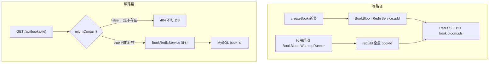
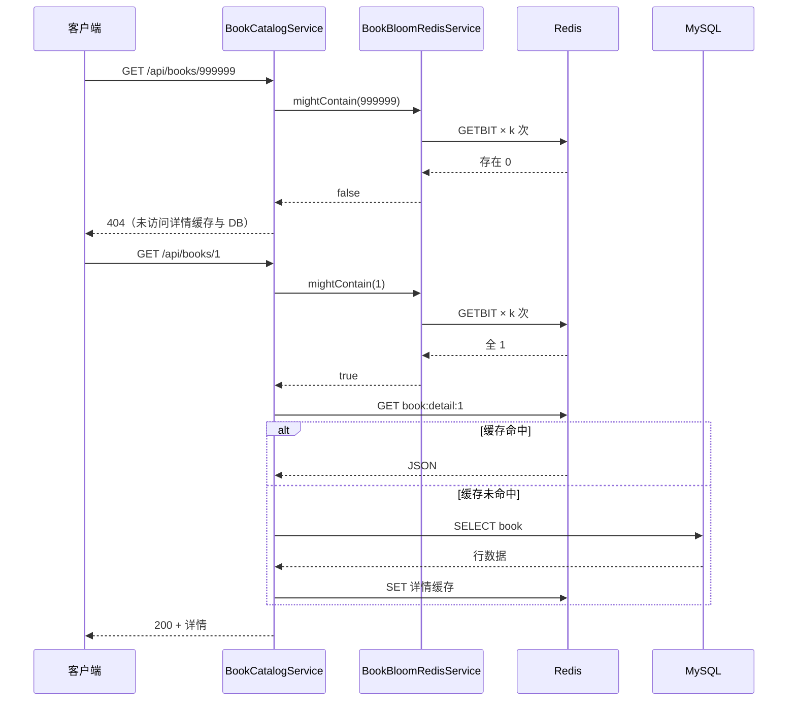

# 基于 Redis Bitmap 的布隆过滤器实现原理


> **项目**：smart_bookstore（智慧书城） · **文档类型**：学习文档  
> **关联**：`catalog.support` — 原理补充，配合布隆学习文档  
> **索引**：[学习文档中心](./README.md)

> 适用项目：`smart_bookstore` 智慧书城 · 图书目录模块（`com.zx.bookstore.catalog`）  
> 实现方式：**标准 Redis 的 SETBIT / GETBIT**，无需 RedisBloom 模块、无需 Redisson / Guava  
> 关联文档：[Redis缓存查询三种方案学习文档](./Redis缓存查询三种方案学习文档.md) · [书城系统分阶段实施指南](./书城系统分阶段实施指南.md)

---

## 写在前面

图书详情接口采用 **Cache-Aside**（先查 Redis，未命中再查 MySQL）时，会遇到 **缓存穿透**：

```text
恶意或误用：GET /api/books/999999（数据库里根本没有这本书）
  → Redis 无缓存
  → 每次请求都打 MySQL
  → DB 压力大
```

**布隆过滤器（Bloom Filter）** 可以在查缓存 / DB **之前** 快速判断：

- **一定不存在** → 直接返回 404  
- **可能存在** → 继续走 Redis → MySQL（可能有少量误判）

本项目用 **Redis 的 Bitmap** 存储布隆过滤器的位数组，Key 为 `book:bloom:ids`。

---

## 一、布隆过滤器回顾

### 1.1 数据结构

本质上是一个长度为 **m** 的 **位数组（bit array）**，配合 **k 个哈希函数**：

```text
bit:  [0][1][2][3][4][5][6][7][8]...
       0  1  0  1  1  0  0  1  0
```

- **插入元素 x**：用 k 个哈希算出 k 个位置，全部置 **1**  
- **查询元素 x**：k 个位置 **全是 1** → 可能存在；**任一为 0** → 一定不存在  

### 1.2 两个核心性质

| 性质 | 含义 |
|------|------|
| **无假阴性** | 说「不存在」时，一定真的没插入过 |
| **有假阳性** | 说「可能存在」时，可能是别的元素把同几位都置 1 了 |

因此业务上只能说 **mightContain（可能存在）**，不能说 **mustContain（一定存在）**。

### 1.3 参数 m 与 k 怎么定

给定：

- **n**：预期元素数量（如 10 万本书）  
- **p**：可接受误判率（如 1% = 0.01）  

经典公式（本项目 `BloomFilterSpec.of` 使用）：

```text
m = ceil( -n * ln(p) / (ln 2)² )     // 位数组长度
k = round( (m / n) * ln 2 )          // 哈希函数个数
```

**示例**（默认配置 `n=100000`, `p=0.01`）：

| 参数 | 计算结果 |
|------|----------|
| m | ≈ 958,506 bit（约 117 KB） |
| k | ≈ 7 |

对应代码：

```java
// BloomFilterSpec.java
long m = (long) Math.ceil(-n * Math.log(p) / (Math.log(2) * Math.log(2)));
int k = (int) Math.round((double) m / n * Math.log(2));
k = Math.max(1, Math.min(k, 16));  // 限制 k 在 1~16
```

---

## 二、为什么用 Redis Bitmap

### 2.1 三种常见实现对比

| 方式 | 优点 | 缺点 |
|------|------|------|
| **JVM 内存（Guava）** | 简单 | 多实例各一份，需每台预热 |
| **RedisBloom 模块（BF.ADD）** | 命令原生、功能全 | 需 Redis Stack / 安装模块 |
| **Redis Bitmap（SETBIT/GETBIT）** | **标准 Redis 即可**、多实例共享 | 需自己实现哈希与参数计算 |

本项目已有 `StringRedisTemplate` 与 Redis 基础设施，选用 **Bitmap 自实现**，兼顾：

- 分布式多实例 **共用一份** 过滤器  
- **不引入** 新依赖与 Redis 模块  
- 与现有 Cache-Aside 自然衔接  

### 2.2 Redis Bitmap 是什么

Redis 的 String 类型底层可按 **位** 操作：

| 命令 | 作用 |
|------|------|
| `SETBIT key offset value` | 将 key 的第 offset 位设为 0 或 1 |
| `GETBIT key offset` | 读取第 offset 位 |

Spring 封装：

```java
redis.opsForValue().setBit("book:bloom:ids", offset, true);
redis.opsForValue().getBit("book:bloom:ids", offset);
```

**offset** 即布隆过滤器位数组的下标，范围 `[0, m-1]`。

---

## 三、整体架构（本项目）



### 3.1 代码模块

| 类 | 职责 |
|----|------|
| `BloomFilterSpec` | 根据 n、p 计算 m、k |
| `RedisBloomHash` | bookId → bit offset |
| `BookBloomRedisService` | add / mightContain / rebuild |
| `BookBloomWarmupRunner` | 启动预热 |
| `BookCatalogService` | 详情查询接入、建书增量 add |

### 3.2 Redis Key

```text
Key:   book:bloom:ids
Type:  String（Bitmap）
```

---

## 四、哈希：如何把 bookId 映射到 bit 位置

经典布隆需要 **k 个独立的哈希函数**。工程上常用 **双重哈希** 从 2 个基础哈希派生 k 个：

```text
offset(i) = (h1 + i * h2) mod m     ，i = 0, 1, ..., k-1
```

本项目 `RedisBloomHash.offset`：

```java
long h1 = mix64(bookId ^ SEED_1);
long h2 = mix64(bookId ^ SEED_2 ^ ((long) index << 32));
long combined = h1 + (long) index * h2;
return Long.remainderUnsigned(combined, bitSize);
```

- `mix64`：64 位混淆（类似 MurmurHash3 finalizer），降低碰撞  
- `Long.remainderUnsigned`：无符号取模，保证 offset 非负  
- `index`：第几个哈希（0 ~ k-1）  

**示例**（概念图，`k=3`）：

```text
bookId = 1001
  → offset(0) = 12345
  → offset(1) = 67890
  → offset(2) = 23456

add 时：SETBIT key 12345 1；SETBIT key 67890 1；SETBIT key 23456 1
```

---

## 五、三个核心操作

### 5.1 添加（add）

```java
for (int i = 0; i < spec.hashFunctions(); i++) {
    long offset = RedisBloomHash.offset(bookId, i, spec.bitSize());
    redis.opsForValue().setBit(BLOOM_KEY, offset, true);
}
```

**业务触发**：

- 管理端 `createBook` 成功后 `add(book.getId())`  
- 启动预热 `rebuild(allBookIds)` 对每个 id 调用 add  

### 5.2 查询（mightContain）

```java
for (int i = 0; i < spec.hashFunctions(); i++) {
    long offset = RedisBloomHash.offset(bookId, i, spec.bitSize());
    Boolean bit = redis.opsForValue().getBit(BLOOM_KEY, offset);
    if (!Boolean.TRUE.equals(bit)) {
        return false;  // 任一位为 0 → 一定不存在
    }
}
return true;  // 全为 1 → 可能存在
```

接入 `BookCatalogService.getBookDetail`：

```java
if (!bookBloomRedisService.mightContain(id)) {
    throw BookstoreException.bookNotFound();
}
// 继续 Cache-Aside...
```

**管理端详情 `getBookDetailAdmin` 不走布隆**，避免影响后台排查。

### 5.3 重建（rebuild）

```java
redis.delete(BLOOM_KEY);
for (Long bookId : bookIds) {
    add(bookId);
}
```

用于 **应用启动** 时从 MySQL 扫 `SELECT id FROM book` 全量预热。

---

## 六、完整读路径时序



---

## 七、配置项

`application.yaml`：

```yaml
bookstore:
  cache:
    bloom-enabled: true                 # 总开关
    bloom-expected-elements: 100000     # n：预期图书规模
    bloom-false-positive-rate: 0.01     # p：误判率 1%
    bloom-warmup-on-startup: true       # 启动全量预热
```

| 配置 | 说明 |
|------|------|
| `bloom-enabled: false` | 关闭布隆，`mightContain` 恒为 true，等价于未接入 |
| 增大 `bloom-expected-elements` | m 变大，内存略增、误判率下降 |
| 减小 `bloom-false-positive-rate` | 要求更准，m 更大 |

---

## 八、与 Cache-Aside 的分工

| 层级 | 作用 | 本项目 |
|------|------|--------|
| **布隆过滤器** | 拦截「一定不存在」的 id | `book:bloom:ids` |
| **Redis 详情缓存** | 缓存已查过的书详情 JSON | `book:detail:{id}` |
| **MySQL** | 权威数据源 | `book` 表 |

三者叠加：

```text
布隆 → 防穿透（恶意 id）
缓存 → 防击穿 / 减 DB 读（合法 id 重复查询）
```

---

## 九、边界与工程取舍

### 9.1 不支持删除

经典布隆 **不能删元素**（清 0 会影响其他元素）。  

- 书 **下架**：id 仍在布隆中 → 会多查一次 DB，最终 `findEnabledById` 仍 404  
- **只有假阳性影响**，无假阴性，业务正确  

### 9.2 误判（假阳性）

布隆说「可能存在」，但 DB 没有 → 多一次 Redis + DB，**不会错误返回假数据**。  

可通过调小 `bloom-false-positive-rate` 降低概率。

### 9.3 Redis 故障：fail-open

`mightContain` 异常时 **返回 true**，放行查 DB，避免 Redis 挂了导致全部 404：

```java
catch (Exception e) {
    log.warn("book bloom check failed, fail-open to DB");
    return true;
}
```

### 9.4 数据一致性

| 场景 | 处理 |
|------|------|
| 新书 createBook | 同步 `add(bookId)` |
| 启动 / 部署 | `BookBloomWarmupRunner` 全量 rebuild |
| 历史数据漏 add | 依赖启动预热；或手动触发 rebuild |
| 多实例 | 共用同一 Redis Key，无 JVM 本地不一致问题 |

### 9.5 与 RedisBloom 模块的区别

| 维度 | Bitmap 自实现 | RedisBloom `BF.*` |
|------|---------------|-------------------|
| 依赖 | 标准 Redis | 需模块 |
| 扩容 | 改配置需 rebuild | 模块支持更好 |
| 命令 | SETBIT / GETBIT | BF.ADD / BF.EXISTS |
| 适用 | 中小规模、已有 Spring Redis | 大规模、运维可装模块 |

---

## 十、自测方法

```text
1. 启动应用，日志应出现：
   book bloom filter initialized, bitSize=..., hashFunctions=...
   book bloom rebuild finished, count=N

2. 查存在的书：
   GET /api/books/1 → 200

3. 查明显不存在的 id：
   GET /api/books/999999 → 404（且不应频繁打 DB）

4. Redis CLI 验证：
   GETBIT book:bloom:ids 0
   BITCOUNT book:bloom:ids   # 已置 1 的 bit 数量（约 n×k，有重叠）

5. 管理端新建书后，该 id 应能通过布隆（无需重启）
```

---

## 十一、面试 / 答辩参考话术

> 我们用标准 Redis 的 Bitmap 实现布隆过滤器，Key 是 `book:bloom:ids`。  
> 根据预期 10 万图书和 1% 误判率算出位数组长度 m 和哈希次数 k，每个 bookId 通过双重哈希映射到 k 个 offset，插入时 SETBIT 置 1，查询时 GETBIT 全 1 才认为可能存在。  
> 用户详情接口在 Cache-Aside 之前先过布隆，说不存在直接 404，防缓存穿透；新书 create 时增量 add，启动时从 DB 全量预热。  
> 经典布隆不支持删除，下架书只会多查一次 DB；Redis 异常时 fail-open 保证可用性。  
> 相比 RedisBloom 模块，我们零额外依赖，适合当前书城规模与毕设演示。

---

## 十二、相关代码路径

| 资源 | 路径 |
|------|------|
| 参数计算 | `catalog/support/BloomFilterSpec.java` |
| 哈希 offset | `catalog/support/RedisBloomHash.java` |
| Redis 操作 | `catalog/service/BookBloomRedisService.java` |
| 启动预热 | `catalog/config/BookBloomWarmupRunner.java` |
| 读路径接入 | `catalog/service/BookCatalogService#getBookDetail` |
| 配置 | `BookstoreCacheProperties` · `application.yaml` |
| 缓存穿透背景 | [Redis缓存查询三种方案学习文档.md](./Redis缓存查询三种方案学习文档.md) §1.1 |
