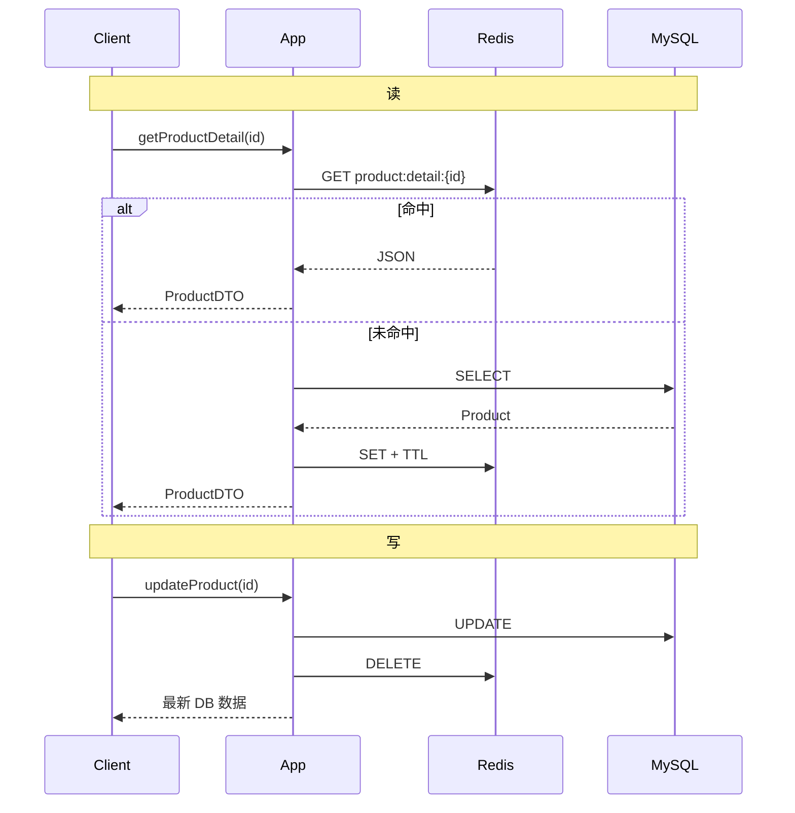
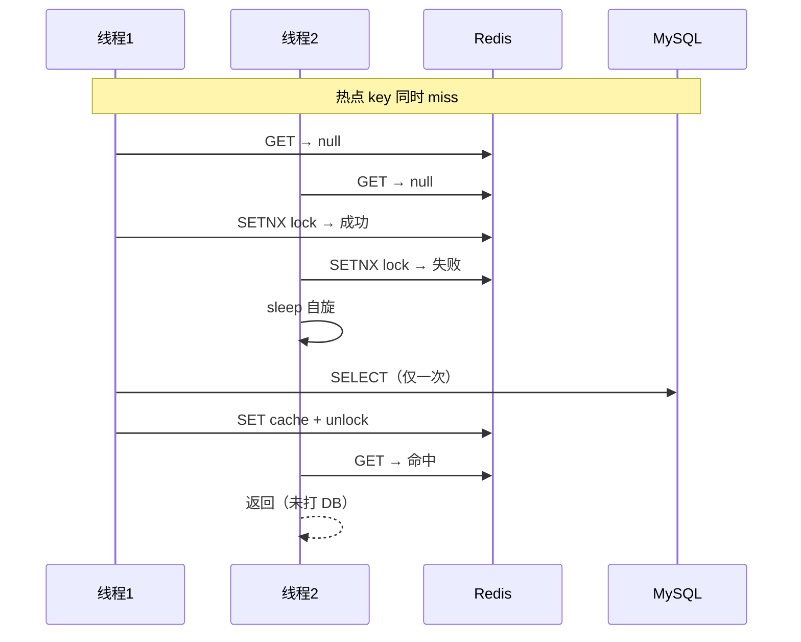
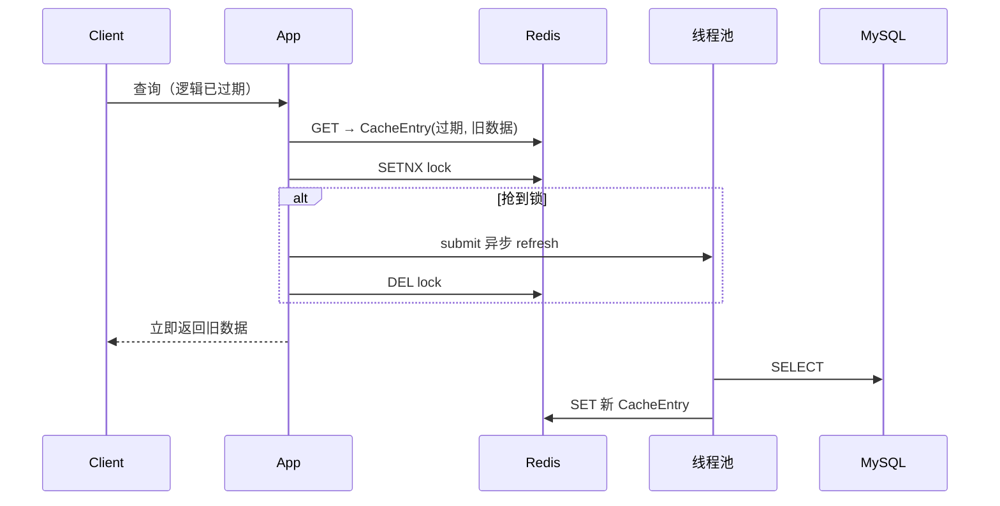

# 图书详情三种 Redis 缓存方案

> **项目**：smart_bookstore（智慧书城）  
> **文档类型**：学习文档 · 关联本仓库业务代码  
> **关联包 / 模块**：`com.zx.bookstore.catalog`  
> **建议前置**：[缓存](./learning/缓存.md)、[生产可用布隆过滤器学习文档](./生产可用布隆过滤器学习文档.md)

## 学习目标

1. 对比 L1 Caffeine + L2 Redis 的 Cache Aside 读路径
2. 理解布隆过滤器防穿透的策略
3. 掌握逻辑过期应对热 Key 击穿的思路

## 与本仓库的对应关系

| 路径 | 说明 |
| --- | --- |
| `src/main/java/com/zx/bookstore/catalog/service/BookCatalogService.java` | 对照阅读 |
| `src/main/java/com/zx/bookstore/catalog/service/BookCacheFacade.java` | 对照阅读 |
| `src/main/java/com/zx/bookstore/catalog/service/BookBloomRedisService.java` | 对照阅读 |

读理论时请打开上表文件对照；改代码前先跑通 `docker compose up -d` 与 `local` profile。

---

## 导读
做「详情查询 + Redis 缓存」时，常见三种 **读路径** 方案：

| 方案 | 别名 | 典型参考 |
|------|------|----------|
| **Cache-Aside** | 旁路缓存 | 大多数业务项目的默认方案 |
| **互斥锁重建** | 防击穿方案之一 | 黑马点评 `queryWithPassThrough` |
| **逻辑过期** | 热点不断档 | 黑马点评 `queryWithLogicalKey` |

三者 **不是互斥关系**，针对不同痛点：

- Cache-Aside：**默认首选**，简单够用
- 互斥锁：在 Cache-Aside 基础上，解决 **热点 key miss 击穿**
- 逻辑过期：解决 **热点 key 过期瞬间 DB 风暴**，牺牲短暂一致性

写路径（先写 DB 再删缓存 / 更新缓存等）见 [数据库与缓存高一致性业务场景实现方案.md](./数据库与缓存高一致性业务场景实现方案.md)。

---

## 一、三个基础概念（必背）

### 1.1 缓存穿透（Cache Penetration）

**现象**：查询 **不存在** 的数据（如 `id=-1`、恶意刷不存在的 id），缓存没有、DB 也没有，**每次请求都打 DB**。

**常见手段**：

| 手段 | 说明 |
|------|------|
| **空值缓存** | DB 查不到时，缓存占位符（如 `""`），**短 TTL** 2~5 分钟 |
| **布隆过滤器** | 快速判断 id 是否可能存在 |
| **参数校验** | 非法 id 在入口拦截 |

**错误示例**：

```java
// ❌ DB 无数据时不写缓存 → 恶意 id 打穿 DB
Product p = productMapper.selectById(id);
if (p == null) throw new NotFoundException();
redis.set(key, toJson(p), ttl);
```

**正确示例**：

```java
Product p = productMapper.selectById(id);
if (p == null) {
    redis.set(key, "", Duration.ofMinutes(2));  // 空值短 TTL
    throw new NotFoundException();
}
redis.set(key, toJson(p), ttl);
```

---

### 1.2 缓存击穿（Cache Breakdown）

**现象**：**某个热点 key** 失效（物理过期或被删）的瞬间，**大量并发** 同时 miss，全部打到 DB。

**常见手段**：

- **互斥锁**：只有一个线程查 DB 并回填
- **逻辑过期**：key 不删，过期后返回旧值 + 异步重建
- 热点 key 永不过期 + 后台定时更新

---

### 1.3 缓存雪崩（Cache Avalanche）

**现象**：**大量 key 在同一时刻** 过期（或 Redis 集群故障），DB 压力骤增。

**常见手段**：

- **TTL 随机抖动**：`baseTtl + random(0, jitter)`
- 多级缓存、限流降级、Redis 高可用

**示例**：

```java
long ttl = 1800 + ThreadLocalRandom.current().nextLong(0, 300);
redis.set(key, json, Duration.ofSeconds(ttl));
```

---

## 二、方案一：Cache-Aside（旁路缓存）

### 2.1 核心思想

- **读**：先 Redis，miss 再 DB，回填缓存（**应用负责** 读写的缓存逻辑）
- **写**：先写 DB，再 **删除缓存**（Write-Invalidate）

工程上 **最常用、性价比最高** 的默认方案。

### 2.2 读路径

```text
GET cache
  ├─ hit  → 返回
  └─ miss → SELECT DB → SET cache（带 TTL）→ 返回
```

### 2.3 写路径（通用）

| 操作 | Redis 行为 | 说明 |
|------|------------|------|
| 新增 | 通常不操作 | 懒加载，首次读再回填 |
| 更新 | `DELETE product:detail:{id}` | 写时删缓存 |
| 下架/删除 | `DELETE` | 避免旧详情仍可读 |
| 查详情 | miss 时 `SET` | 唯一回填入口 |

### 2.4 完整示例

**缓存服务**：

```java
@Service
@RequiredArgsConstructor
public class ProductCacheService {

    private static final String KEY_PREFIX = "product:detail:";

    private final StringRedisTemplate redis;
    private final ObjectMapper objectMapper;

    public Optional<ProductDTO> get(Long id) {
        String json = redis.opsForValue().get(key(id));
        if (json == null) return Optional.empty();
        return Optional.of(objectMapper.readValue(json, ProductDTO.class));
    }

    public void put(ProductDTO dto) {
        long ttl = 1800 + ThreadLocalRandom.current().nextLong(0, 300);
        redis.opsForValue().set(
                key(dto.getId()),
                objectMapper.writeValueAsString(dto),
                Duration.ofSeconds(ttl));
    }

    public void evict(Long id) {
        redis.delete(key(id));
    }

    private String key(Long id) {
        return KEY_PREFIX + id;
    }
}
```

**业务层 — 读**：

```java
public ProductDTO getProductDetail(Long id) {
    Optional<ProductDTO> cached = productCache.get(id);
    if (cached.isPresent()) {
        return cached.get();
    }
    Product product = productMapper.selectEnabledById(id)
            .orElseThrow(() -> new NotFoundException(id));
    ProductDTO dto = toDTO(product);
    productCache.put(dto);
    return dto;
}
```

**业务层 — 写**：

```java
@Transactional
public ProductDTO updateProduct(Long id, UpdateRequest req) {
    Product product = loadAndApply(id, req);
    productMapper.updateById(product);
    productCache.evict(id);           // 写时删，不 put
    return toDTO(product);
}
```

### 2.5 时序图



### 2.6 优点

- 实现简单，易维护
- 写后删缓存，一致性较好
- TTL 抖动可缓解雪崩

### 2.7 典型错误

#### 错误 1：写路径更新 DB 后去 put，读路径又去 get — 逻辑混乱

```java
// ❌ 写时 put + 读时 miss 回填，两套逻辑易不一致
update() { db.update(); cache.put(dto); }
get()    { if miss { db.select(); cache.put(dto); } }
// 若 put 与 get 的 toDTO 不一致 → 脏数据
```

**正确**：写路径 **evict** 或 **统一 toDTO** 后 put（Write-Through，见一致性文档方案 B）。

---

#### 错误 2：只缓存读，写路径从不 evict

```java
// ❌ 改价后 Redis 仍是旧价，直到 TTL 过期
public void updateProduct(...) {
    productMapper.update(...);
    // 忘了删缓存
}
```

---

#### 错误 3：新增时也 put 预热所有数据

```java
// ❌ 大量冷门商品占用 Redis，可能永远无人读
createProduct(...) {
    productMapper.insert(product);
    cache.put(toDTO(product));  // 通常不必
}
```

**正确**：新增 **不预热**，首次读 miss 时再回填。

---

### 2.8 短板与改进

| 短板 | 改进 |
|------|------|
| 不存在 id 每次打 DB | 空值缓存 |
| 热点 key 同时过期 | 互斥锁（方案二） |
| 更新后首次读 miss | 可接受；或写时 put（Write-Through） |

---

## 三、方案二：互斥锁重建（防击穿）

### 3.1 核心思想

缓存 **未命中** 时，用 Redis `SETNX` 保证 **同一 key 只有一个线程** 查 DB 并回填；其他线程 **自旋等待** 后重读缓存。

与 Cache-Aside 的区别：**仅在 miss 路径加互斥**，专门防热点失效瞬间的 DB 风暴。

### 3.2 读路径

```text
GET cache
  ├─ hit  → 返回
  └─ miss → tryLock(lockKey)
              ├─ 成功 → 查 DB → SET → unlock → 返回
              └─ 失败 → sleep → 再次 GET → 返回
```

### 3.3 完整示例

```java
@Service
@RequiredArgsConstructor
public class ProductCacheWithMutex {

    private final StringRedisTemplate redis;
    private final ProductMapper productMapper;

    private static final String CACHE_PREFIX = "product:detail:";
    private static final String LOCK_PREFIX = "lock:product:";

    public ProductDTO getById(Long id) {
        String key = CACHE_PREFIX + id;
        String lockKey = LOCK_PREFIX + id;

        // 1. 查缓存
        String json = redis.opsForValue().get(key);
        if (json != null) {
            if (json.isEmpty()) throw new NotFoundException(id);
            return parse(json);
        }

        // 2. miss：抢锁
        boolean locked = tryLock(lockKey, 30);
        if (!locked) {
            return waitForCache(key, id);
        }

        try {
            // 3. 双重检查
            json = redis.opsForValue().get(key);
            if (json != null) {
                if (json.isEmpty()) throw new NotFoundException(id);
                return parse(json);
            }

            // 4. 查 DB
            Product product = productMapper.selectById(id);
            if (product == null) {
                redis.opsForValue().set(key, "", Duration.ofMinutes(2));
                throw new NotFoundException(id);
            }
            ProductDTO dto = toDTO(product);
            redis.opsForValue().set(key, toJson(dto), randomTtl());
            return dto;
        } finally {
            unlock(lockKey);
        }
    }

    private ProductDTO waitForCache(String key, Long id) {
        for (int i = 0; i < 50; i++) {  // 最多等 ~2.5s
            try {
                Thread.sleep(50);
            } catch (InterruptedException e) {
                Thread.currentThread().interrupt();
                throw new RuntimeException(e);
            }
            String json = redis.opsForValue().get(key);
            if (json != null) {
                if (json.isEmpty()) throw new NotFoundException(id);
                return parse(json);
            }
        }
        throw new RuntimeException("等待缓存重建超时");
    }

    private boolean tryLock(String lockKey, long seconds) {
        return Boolean.TRUE.equals(
                redis.opsForValue().setIfAbsent(lockKey, "1", Duration.ofSeconds(seconds)));
    }

    private void unlock(String lockKey) {
        redis.delete(lockKey);
    }
}
```

### 3.4 时序图（击穿场景）



### 3.5 优点

- 有效解决 **同一 key 并发 miss** 的击穿
- 可叠加空值缓存，缓解穿透
- 回填的是 **最新 DB 数据**，一致性接近 Cache-Aside

### 3.6 典型错误

#### 错误 1：自旋无超时，活锁

```java
// ❌ 持锁线程崩溃，其他线程永远 while(true)
while (true) {
    Thread.sleep(50);
    if (redis.get(key) != null) return parse(...);
}
```

**正确**：**次数/时间上限**；锁带 **过期时间**（`SETNX` + TTL）。

---

#### 错误 2：解锁误删他人锁

```java
// ❌ 线程 A 锁过期，线程 B 获得锁，线程 A finally 里 delete → 删掉 B 的锁
redis.delete(lockKey);
```

**正确**：Redisson / Lua 脚本 **compare-and-delete**（只删自己的 lock value）。

---

#### 错误 3：所有读都加锁，包括 cache hit

```java
// ❌ 每次请求都 SETNX，无意义开销
tryLock(...);
String json = redis.get(key);
```

**正确**：**仅 miss 时** 抢锁。

---

### 3.7 注意点

- 高并发 miss 时，等待线程 **响应延迟上升**
- 生产推荐 Redisson `RLock` 或 Lua 解锁
- 可与 Cache-Aside **叠加**：平时走简单 get，热点 key 配置走 mutex

---

## 四、方案三：逻辑过期（热点不断档）

### 4.1 核心思想

- Redis key **不设物理 TTL**（或很长），数据不会自动消失
- 值结构：`{ expireTime, data }`，由应用判断 **逻辑是否过期**
- **未过期**：直接返回
- **已过期**：**仍返回旧 data**，同时 **异步** 查 DB 重建；仅一个线程抢锁刷新

适用：**超高 QPS 热点读**，且 **可接受短暂旧数据**。

### 4.2 数据结构

```java
@Data
@AllArgsConstructor
public class CacheEntry {
    private LocalDateTime expireTime;  // 逻辑过期时间
    private Object data;               // 业务数据；"" 表示不存在
}
```

```java
public void saveWithLogicalExpire(String key, Object data, Duration logicalTtl) {
    CacheEntry entry = new CacheEntry(LocalDateTime.now().plus(logicalTtl), data);
    redis.opsForValue().set(key, JSON.toJSONString(entry)); // 无物理 TTL
}
```

### 4.3 读路径

```text
GET cache
  ├─ null（未预热）
  │     └─ 互斥查 DB 回填（同方案二）
  └─ 有值
        ├─ data 为空 → 不存在
        ├─ 未逻辑过期 → 返回 data
        └─ 已逻辑过期
              ├─ 抢锁失败 → 返回旧 data
              └─ 抢锁成功 → 异步 refresh → 返回旧 data
```

### 4.4 完整示例（核心逻辑）

```java
@Service
@RequiredArgsConstructor
public class ProductCacheLogicalExpire {

    private final StringRedisTemplate redis;
    private final ProductMapper productMapper;
    private final ExecutorService refreshPool = Executors.newFixedThreadPool(10);

    public ProductDTO getById(Long id) {
        String key = "product:detail:" + id;
        String lockKey = "lock:product:" + id;
        String json = redis.opsForValue().get(key);

        // A. 完全未命中 → 互斥初始化（同方案二）
        if (json == null) {
            return initWithMutex(key, lockKey, id);
        }

        CacheEntry entry = JSON.parseObject(json, CacheEntry.class);

        if (entry.getData().toString().trim().isEmpty()) {
            throw new NotFoundException(id);
        }

        // B. 未逻辑过期
        if (!LocalDateTime.now().isAfter(entry.getExpireTime())) {
            return toDTO(entry.getData());
        }

        // C. 已逻辑过期 → 返回旧值 + 异步重建
        if (tryLock(lockKey, 30)) {
            try {
                refreshPool.submit(() -> refresh(key, id));
            } finally {
                unlock(lockKey);
            }
        }
        return toDTO(entry.getData());  // 当前请求始终返回旧值
    }

    private void refresh(String key, Long id) {
        Product product = productMapper.selectById(id);
        if (product != null) {
            saveWithLogicalExpire(key, toDTO(product), Duration.ofMinutes(30));
        } else {
            saveWithLogicalExpire(key, "", Duration.ofMinutes(2));
        }
    }
}
```

### 4.5 时序图



### 4.6 优点

- 逻辑过期瞬间 **几乎不打 DB**，用户 **无阻塞**
- 适合店铺详情、爆款 SKU 等读风暴

### 4.7 典型错误

#### 错误 1：只做逻辑过期，写路径不维护缓存

```java
// ❌ 管理员改价只 UPDATE DB，Redis 仍是旧 Shop
productMapper.updatePrice(id, 100);
// 用户长期看到旧价，直到异步 refresh
```

**正确**：写接口必须 **evict 或 put 新 CacheEntry**。

---

#### 错误 2：逻辑过期 + 物理 TTL 混用导致 key 消失

```java
// ❌ 设了物理 TTL，key 消失 → 又走 miss 击穿
redis.set(key, entryJson, Duration.ofHours(1));
```

**正确**：逻辑过期方案 **通常不设短物理 TTL**。

---

#### 错误 3：异步 refresh 里抛异常无人处理

```java
refreshPool.submit(() -> {
    if (db == null) throw new RuntimeException("不存在");  // ❌ 线程池吞异常
});
```

**正确**：异步任务内 **try-catch + 日志**；null 写空值缓存。

---

#### 错误 4：改价场景仍用逻辑过期

```text
促销改价要求立刻生效 → 逻辑过期故意返回旧价 → 业务不符
```

**正确**：改价敏感场景用 **Cache-Aside + 写时删缓存**，不用逻辑过期。

---

### 4.8 短板

- **一致性弱**：过期窗口内可能一直旧数据
- 实现复杂：线程池、锁、预热、写路径配合
- 需要 **预热**（否则首次 null 仍走互斥初始化）

---

## 五、三种方案对比总表

| 维度 | Cache-Aside | 互斥锁重建 | 逻辑过期 |
|------|-------------|------------|----------|
| **触发 DB** | miss 时同步 | miss 时同步（互斥） | 过期后异步；miss 时同步初始化 |
| **过期方式** | Redis 物理 TTL | Redis 物理 TTL | 应用层逻辑时间 |
| **过期瞬间** | 大量 miss → DB | 单线程查 DB，其他等待 | 返回旧值，后台刷新 |
| **一致性** | 较好 | 较好 | 较弱 |
| **穿透** | 需空值缓存 | 易叠加空值 | 可空值 |
| **击穿** | 弱 | **强** | **强** |
| **雪崩** | TTL jitter | TTL jitter | 逻辑时间可错开 |
| **复杂度** | 低 | 中 | 高 |
| **典型场景** | 普通详情 | 热点 miss | 超高 QPS、容忍旧数据 |

---

## 六、写路径要点（面试常问）

### 6.1 为什么「先写 DB 再删缓存」？

若 **先删再写**，删与写之间读请求可能把 **旧 DB 数据** 写回缓存。

详见：[数据库与缓存高一致性业务场景实现方案.md](./数据库与缓存高一致性业务场景实现方案.md)

### 6.2 为什么默认写时删，不写时 put？

- 删缓存简单，回填逻辑只在读路径一处
- 避免写路径 `toDTO` 与读路径不一致
- 代价：更新后首次读多一次 DB

### 6.3 逻辑过期的写路径

管理员改 DB 后必须 **删或更新 Redis**，否则逻辑过期前的旧快照会长期存在。

---

## 七、选型指南

```text
默认从 Cache-Aside 开始
    ↓
是否存在热点 key 同时 miss 打穿 DB？
    ├─ 是 → 叠加互斥锁（方案二）
    └─ 否 ↓

是否存在超高 QPS 热点，且业务容忍短暂旧数据？
    ├─ 是 → 逻辑过期（方案三）+ 写路径 evict/put
    └─ 否 → 保持 Cache-Aside

改价 / 下架是否要求尽快生效？
    ├─ 是 → 不用逻辑过期
    └─ 否 → 可考虑逻辑过期
```

| 场景 | 推荐 |
|------|------|
| 普通商品/文章详情 | Cache-Aside |
| 大促爆款 SKU | 互斥锁 或 逻辑过期 |
| 店铺首页超高 QPS | 逻辑过期（可接受旧展示） |
| 后台改价立刻生效 | Cache-Aside + 写时删 |

---

## 八、面试口述模板（约 1 分钟）

> Redis 缓存读路径我熟悉三种方案。  
> **Cache-Aside** 是默认：读先 Redis，miss 查 DB 回填；写先 DB 再删缓存，TTL 加随机偏移防雪崩。  
> **互斥锁重建** 在 miss 时用 SETNX，只有一个线程查 DB，其他自旋等缓存，解决热点 key 击穿；要设锁超时和自旋上限。  
> **逻辑过期** 是缓存值带逻辑过期时间，物理 key 不删；过期后返回旧数据、异步刷新，适合超高 QPS 且能容忍旧数据的场景，但写路径也要删或更新缓存，不适合改价立刻生效的业务。  
> 穿透用空值短 TTL，雪崩用 TTL jitter；写路径一致性另有一套六种方案，和读路径分开看。

---

## 九、延伸阅读

| 文档 | 内容 |
|------|------|
| [数据库与缓存高一致性业务场景实现方案.md](./数据库与缓存高一致性业务场景实现方案.md) | 写路径：删缓存、Write-Through、延迟双删、version、Canal |

---

*文档说明：通用方案梳理，示例以 `product:detail:{id}` 为抽象场景，不绑定具体项目。*
