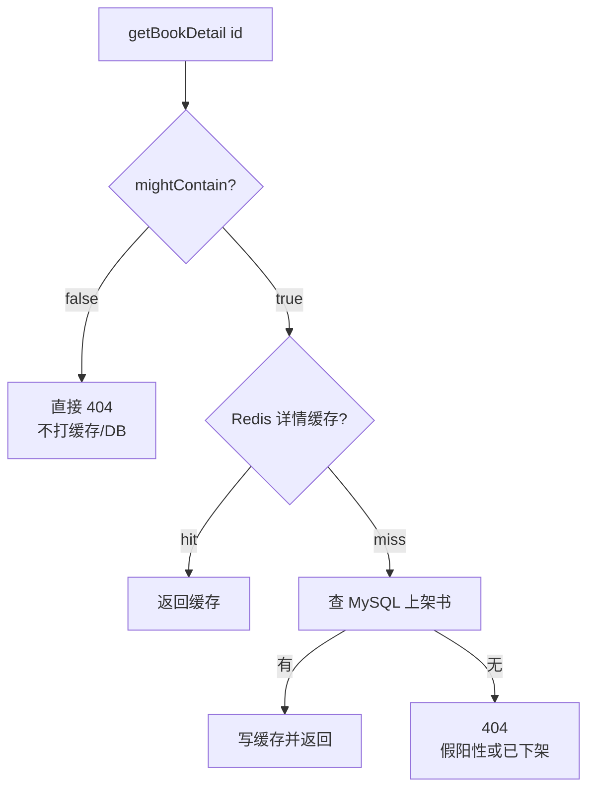

# C2：布隆过滤器（Bloom Filter）详解


> **项目**：smart_bookstore（智慧书城） · **文档类型**：学习文档（加深分册）  
> **索引**：[加深方向](./README.md) · [学习文档中心](../README.md)

对应 [缓存学习路线](./缓存.md) 的 C2 阶段。目标：吃透布隆过滤器的误判语义、参数设计，以及本仓库用 Redis Bitmap 实现书目 ID 过滤、防详情查询缓存穿透的完整链路。

预计：3～4 天。产出：读写时序图 + 「误判为存在」时的代码路径说明。

---

## 1. 要解决什么问题

### 1.1 缓存穿透

```text
客户端反复请求「根本不存在」的 bookId
  → 缓存 miss
  → 每次都打到 MySQL
  → DB 被无效流量打满
```

与击穿、雪崩的区别：

| 问题 | 特征 | 典型手段 |
| --- | --- | --- |
| **穿透** | 查**不存在**的数据 | 布隆、空值缓存、参数校验 |
| **击穿** | **热点 Key** 过期瞬间并发打 DB | 互斥重建、逻辑过期 |
| **雪崩** | **大量 Key** 同时过期 | TTL 抖动、限流、多级缓存 |

本仓库书目 Bloom 挡的是 **穿透**：乱扫 / 恶意猜不存在的 ID，在进缓存与 MySQL 之前被拦住。

### 1.2 为何不用「把所有 ID 放 Set」

| 方案 | 空间 | 查询 | 问题 |
| --- | --- | --- | --- |
| Redis Set 存全量 bookId | 随 ID 线性涨（字符串开销大） | 精确 | 书量大时内存贵 |
| 本地 HashSet | 同上；多实例难共享 | 精确 | 与 Redis 多实例部署不契合 |
| **布隆过滤器** | 约 `m` 个 bit，远小于存原文 | 近似 | 有假阳性；不能删 |

布隆用空间换「绝对不在」的快速判定，适合「存在性前置过滤」。

---

## 2. 经典原理

### 2.1 结构

- 长度为 `m` 的 **位数组**（初始全 0）
- `k` 个相互独立的 **哈希函数** `h1 … hk`，值域映射到 `[0, m)`

### 2.2 加入（Add）

对元素 `x`：

1. 计算 `k` 个下标：`h1(x), h2(x), …, hk(x)`
2. 把这些位置的 bit 全部置为 `1`

同一 bit 可被多个元素共享（这是假阳性的根源）。

### 2.3 查询（Might Contain）

再算同样 `k` 个下标：

| 结果 | 含义 |
| --- | --- |
| **任一 bit 为 0** | **一定不在集合中**（无假阴性） |
| **全部为 1** | **可能在集合中**（可能有假阳性） |

口诀：

```text
false → 一定不存在（可信）
true  → 可能存在（还需查缓存 / DB）
```

### 2.4 小例子（直觉）

假设 `m = 16`，`k = 3`，已加入 `id=7`，占了 bit `2,5,11`。

- 查 `7`：三个位置都是 1 → 可能存在（真存在）
- 查从未加入的 `99`：若哈希碰巧也落到已为 1 的位 → **假阳性**
- 查 `99`：若有一位仍是 0 → **一定不存在**

### 2.5 为何不能删除

经典布隆 **不支持删除**：某个 bit 可能被多个元素共用，清 0 会误伤其他元素，造成 **假阴性**（说不存在但其实存在过）——对业务更危险。

变体：Counting Bloom、Cuckoo Filter 等可支持删除，实现更复杂。本仓库用经典布隆，接受「下架书仍占 bit」。

---

## 3. 参数：`n`、`p` → `m`、`k`

### 3.1 符号

| 符号 | 含义 | 本仓库配置 |
| --- | --- | --- |
| `n` | 预期插入元素数 | `bloom-expected-elements: 100000` |
| `p` | 目标假阳性率 | `bloom-false-positive-rate: 0.01`（约 1%） |
| `m` | 位数组长度 | 由公式算出 |
| `k` | 哈希函数个数 | 由公式算出，并限制在 `[1, 16]` |

### 3.2 经典最优公式

在理想均匀哈希下，给定 `n`、`p`：

$$
m = \left\lceil -\frac{n \ln p}{(\ln 2)^2} \right\rceil
$$

$$
k = \mathrm{round}\left(\frac{m}{n}\ln 2\right)
$$

**交互演算**（拖动 `n` / `p` 看 `m`、`k`、内存与曲线）：用浏览器打开 [bloom-mk-calculator.html](./bloom-mk-calculator.html)。

直观：

- `p` 越小（越不容忍误判）→ `m` 越大 → 越占内存
- `n` 越大 → `m` 越大
- `k` 过大：每次查询 `GETBIT` 次数变多，收益递减；本仓库 cap 到 16

实现见 `BloomFilterSpec.of`：

```text
m = ceil(-n * ln(p) / (ln2)²)，且至少 64
k = round((m/n) * ln2)，夹到 [1, 16]
```

### 3.3 粗算内存

Redis String 作 Bitmap 时，大致占用约为：

$$
\text{bytes} \approx \left\lceil \frac{m}{8} \right\rceil
$$

（实际还有 Redis 对象头等开销。）例如 `n=1e5`、`p=0.01` 时 `m` 约十几万到几十万 bit，通常只有几十 KB 量级，远小于存 10 万个整数 ID 的 Set。

**注意**：若实际插入量远超配置的 `n`，假阳性率会明显高于 `p`，需要调大 `n` 后 `rebuild`。

---

## 4. 哈希：双重哈希派生 `k` 个 offset

维护真正独立的 `k` 个哈希函数成本高。常见做法是 **双重哈希（Kirsch–Mitzenmacher）**：

$$
h_i(x) = (h_1(x) + i \cdot h_2(x)) \bmod m,\quad i = 0,\ldots,k-1
$$

本仓库 `RedisBloomHash`：

1. 用两个种子对 `bookId` 做 `mix64`（类似 Murmur 终混）得到 `h1`、`h2`
2. `offset(i) = (h1 + i·h2) mod m`（无符号取模，保证非负）
3. 底层用 Redis `SETBIT` / `GETBIT`，**不依赖 RedisBloom 模块**

---

## 5. 本仓库实现映射

| 组件 | 路径 | 职责 |
| --- | --- | --- |
| 规格 | `catalog/support/BloomFilterSpec.java` | `n,p` → `m,k` |
| 哈希 | `catalog/support/RedisBloomHash.java` | `bookId,i,m` → offset |
| 服务 | `catalog/service/BookBloomRedisService.java` | `add` / `mightContain` / `rebuild` |
| 预热 | `catalog/config/BookBloomWarmupRunner.java` | 启动全量 rebuild |
| 读路径 | `BookCatalogService#getBookDetail` | 先 Bloom 再缓存 / DB |
| 写路径 | `BookCatalogService#createBook` | 落库后 `add` |
| 配置 | `bookstore.cache.bloom-*` | 开关、规模、预热 |

Redis Key：`book:bloom:ids`（全站一份 Bitmap，多应用实例共享）。

---

## 6. 核心 API 行为

### 6.1 `add(bookId)`

对 `i = 0 … k-1`：`SETBIT book:bloom:ids offset(i) 1`。

失败只打 warn，不抛业务异常（避免建书因 Bloom 抖动失败）。

### 6.2 `mightContain(bookId)`

对每个 offset `GETBIT`：

- 任一为 0 → 返回 `false`（一定不存在）
- 全为 1 → 返回 `true`（可能存在）

特殊策略：

| 情况 | 返回 | 原因 |
| --- | --- | --- |
| 关闭 Bloom / `bookId == null` | `true` | fail-open，不拦正常/异常边界 |
| Redis 异常 | `true` | **可用性优先**：宁可打 DB，不误 404 真书 |

### 6.3 `rebuild(ids)`

`DEL book:bloom:ids`，再对每个 id `add`。用于启动预热或运维补偿。

---

## 7. 生命周期与时序

### 7.1 启动预热

```text
应用启动
  → BookBloomWarmupRunner（bloom-warmup-on-startup=true）
  → BookRepository.listAllIds()
  → BookBloomRedisService.rebuild(ids)
  → Bitmap 含当前全部 book id（含下架，经典布隆不可删）
```

### 7.2 增量写入

```text
createBook 事务成功写入 MySQL
  → bookBloomRedisService.add(newId)
  → 避免「DB 有书、Bloom 没有」导致误判不存在 → 用户 404
```

漏加后果：真书被 `mightContain=false` → 直接 `bookNotFound`，比假阳性严重。故写路径必须 `add`，预热失败要关注日志。

### 7.3 用户详情读路径



要点：

- **管理端** `getBookDetailAdmin` **不走** Bloom（需查下架书、离线索引等）
- 假阳性：多走一次缓存 miss + DB，结果仍是 404 或查到下架策略决定的数据——可接受
- 假阴性（漏 add）：真书 404——不可接受，靠预热 + create 后 add 避免

---

## 8. 与空值缓存等手段对比

| 手段 | 优点 | 缺点 | 本项目 |
| --- | --- | --- | --- |
| 布隆过滤器 | 挡海量乱 ID，内存小 | 假阳性；不能删；要预热 | **已用** |
| 空值缓存（缓存 null） | 实现简单 | 每个不存在 ID 占一个 Key；攻击仍可刷很多 Key | 可与 Bloom 叠加 |
| 接口参数校验 | 成本低 | 挡不住合法格式的伪造 ID | 基础手段 |
| 网关限流 | 保护整体 QPS | 不区分「存不存在」 | 另层防护 |

推荐组合：参数校验 + Bloom 前置 +（可选）空值短 TTL。

---

## 9. 运维与配置注意

配置（`application.yaml`）：

```yaml
bookstore:
  cache:
    bloom-enabled: true
    bloom-expected-elements: 100000
    bloom-false-positive-rate: 0.01
    bloom-warmup-on-startup: true
```

实践建议：

1. 图书总量逼近或超过 `expected-elements` 时，调大 `n` 并触发一次 `rebuild`
2. 改 `n`/`p` 会改变 `m`、`k`，与旧 Bitmap **不兼容**，必须 rebuild，不能只改配置不重建
3. 多实例部署依赖同一 Redis Key；预热只需一次即可（多实例重复 rebuild 会短暂清空再写入，注意启动风暴）
4. 监控：Bloom 拦截次数、假阳性后的 DB 404、`add`/`rebuild` 失败日志

---

## 10. 自检清单与参考答案

- [ ] 能用一句话说清 Bloom 的 `true` / `false` 语义
- [ ] 能写出 `m`、`k` 与 `n`、`p` 的关系（不必默写精确公式，要懂方向）
- [ ] 能画出本项目预热、`add`、读详情三条路径
- [ ] 能说明为何下架不删 Bloom、管理端为何绕过
- [ ] 能对比 Bloom 与空值缓存

### 参考答案

**1. 语义**

- `false`：一定不存在，可直接拒绝
- `true`：可能存在，必须继续查缓存 / DB

**2. 参数方向**

- 要更低误判 → 更大 `m`（更多内存）
- 元素更多 → 更大 `m`
- `k` 适中即可；过大拖慢每次探测

**3. 三条路径**

- 预热：启动 `listAllIds` → `rebuild`
- 增量：`createBook` → `add`
- 读取：`mightContain` → 缓存 → DB

**4. 下架与管理端**

- 经典布隆不能可靠删除；下架 id 仍占位，最多多一次 DB
- 管理端要看下架书，故不走 Bloom

**5. vs 空值缓存**

- Bloom 适合挡「无穷伪造 ID」；空值缓存适合「偶尔 miss 的已知不存在」
- 可叠加：Bloom 先滤，过了再走缓存（含空值）

---

## 11. 面试口述（约 1 分钟）

书城详情有缓存穿透风险：乱猜不存在的 bookId 会打穿到 MySQL。我们用 Redis Bitmap 自实现布隆过滤器，Key 是 `book:bloom:ids`。按预期书量和误判率算出位图长度和哈希个数，双重哈希映射到 `SETBIT`/`GETBIT`。启动从 DB 全量预热，新建图书后增量 `add`。用户查详情先 `mightContain`，返回 false 直接 404；true 再走缓存和库。经典布隆不能删，下架书仍占位可接受；Redis 故障时 fail-open 放行查库，优先可用性。管理端详情绕过布隆以便查下架书。

---

## 相关文档

- [学习路线：缓存](./缓存.md)（C1～C5 总览；本文对应 C2）
- [学习路线：高并发](./高并发.md)
- [后续学习路线](../后续学习路线.md)
- [基于 Redis Bitmap 的布隆过滤器实现原理](../Redis布隆过滤器Bitmap实现原理.md)（更偏代码与命令对照）
- [生产可用布隆过滤器学习文档](../生产可用布隆过滤器学习文档.md)（学习向）
