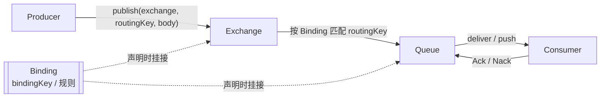

# M1：消息模型与投递语义


> **项目**：smart_bookstore（智慧书城） · **文档类型**：学习文档（加深分册）  
> **索引**：[加深方向](./README.md) · [学习文档中心](../README.md)

对应 [消息队列学习路线](./消息队列.md) 的 M1 阶段。目标：搞清 RabbitMQ（及同类 Broker）里消息怎么走，以及「最多一次 / 至少一次 / 恰好一次」在工程里分别意味着什么。

预计：2～3 天。产出：一张「丢消息可能发生在哪一层」的图（文末有模板）。

---

## 1. 核心模型：交换机、队列、路由键、绑定

### 1.1 四件套各自干什么

| 概念 | 角色 |
| --- | --- |
| **Producer（生产者）** | 应用把消息发给 **Exchange**，一般不直接「点名某个队列」 |
| **Exchange（交换机）** | 根据类型与路由规则，决定消息去哪些队列 |
| **Routing Key（路由键）** | 发送时带的字符串标签，供交换机匹配 |
| **Binding（绑定）** | 声明「某队列用什么规则挂在某交换机上」 |
| **Queue（队列）** | 真正存消息、供 Consumer 拉取/推送消费的地方 |

直观流水线（默画用；Binding 是 Exchange 与 Queue 之间的「路由规则」，不是消息上的一跳）：



文字版（无 Mermaid 预览时）：

```text
                    ┌──────── Binding ────────┐
                    │  声明：Queue 挂到 Exchange │
                    │  规则：bindingKey / 模式   │
                    └───────────┬──────────────┘
                                │ 匹配用
Producer ──publish──► Exchange ─┴──► Queue ──► Consumer
              (routingKey, body)              │
                                              └── Ack / Nack
```

要点：

1. Producer **只认 Exchange**，一般不直接指定 Queue 名
2. Binding **事先声明**，决定「这条 routingKey 进哪些 Queue」
3. Queue **存消息**；多个 Consumer 抢同一 Queue 时，一条消息通常只给其中一个
4. Consumer 用 **Ack / Nack** 告诉 Broker 是否可删消息

### 1.2 常见交换机类型

| 类型 | 行为 |
| --- | --- |
| **direct** | routingKey 与 bindingKey **完全相等** 才投递 |
| **topic** | 按模式匹配（`*` 一段、`#` 多段），适合分类订阅 |
| **fanout** | 忽略路由键，广播到所有绑定队列 |
| **headers** | 按消息头匹配（少用） |
| **x-delayed-message** | 插件：先延迟，再按内部类型（如 direct）路由 |

本仓库例子：

- 秒杀：通常是 direct 交换机 + 固定 routingKey → 业务队列  
- 订单超时：`trade.delayed`（`x-delayed-message`）到期后再进 `trade.order.timeout`

### 1.3 绑定在解决什么问题

没有绑定，交换机不知道队列在哪。绑定把「逻辑路由」和「物理队列」解耦：

- 换队列名、加镜像消费者队列，不必改生产者代码（仍发同一 exchange + routingKey）
- 一个交换机可绑多个队列（扇出、多订阅）

### 1.4 虚拟主机 Virtual Host

RabbitMQ 里 `vhost` 做租户隔离（权限、队列名空间）。连接时要指定正确的 vhost，否则「明明建了队列却连不上」。

---

## 2. 投递语义：at-most-once / at-least-once / exactly-once

### 2.1 三种语义

| 语义 | 含义 | 典型代价 |
| --- | --- | --- |
| **at-most-once** | 最多投递一次，允许丢，尽量不重复 | 实现简单；业务要能容忍丢 |
| **at-least-once** | 至少一次，允许重复，尽量不丢 | 必须做**消费幂等** |
| **exactly-once** | 恰好一次 | Broker+协议+业务全链路极难；MQ 层很少「真 · 全局恰好一次」 |

### 2.2 实务结论

绝大多数业务系统宣称的「可靠」，工程落地是：

```text
at-least-once（传输） + 业务幂等（效果恰好一次）
```

也就是：消息可能被投两次，但「发券 / 扣款 / 改状态」只生效一次。

### 2.3 和本仓库的对应直觉

| 场景 | 传输侧 | 业务侧如何「恰好一次效果」 |
| --- | --- | --- |
| 秒杀发券 | 手动 ACK，失败可再投 / 进 DLQ | 唯一索引 + 先查后写 |
| 订单超时取消 | 延迟到达后消费 | 仅当仍为待支付才取消 |

---

## 3. 持久化：消息与队列

「重启 RabbitMQ 消息还在吗？」取决于多层，不是只开一个开关。

### 3.1 持久化队列（Durable Queue）

队列声明为 `durable=true`：Broker 重启后**队列定义**还在。  
注意：这不等于队列里的消息一定还在。

### 3.2 持久化消息（Persistent Message）

发送时 delivery mode = persistent（Spring 里常通过消息属性设置）。  
只有「持久化消息 + 持久化队列」组合，落盘后才更可能在 Broker 重启后恢复。

### 3.3 仍然可能丢的情况

- 消息写入缓冲尚未刷盘就宕机（极端）  
- 非持久化消息  
- 队列本身是 exclusive / auto-delete  
- 生产者以为发成功、实际未达 Broker（见下一节 Confirm）

---

## 4. Publisher Confirm（发送方确认）

### 4.1 问题

`convertAndSend` 返回，只表示客户端 API 调用走完，**不保证** Broker 已接收并落稳。网络抖动、Broker 拒绝时，可能「应用以为发出去了」。

### 4.2 Confirm / Return

- **Publisher Confirm**：Broker 确认已接收（可配置到写入磁盘后的级别，视策略而定）  
- **Mandatory + Return**：若无法路由到任何队列，把消息退回生产者

开启后，应用应在 confirm 失败时：重试、记日志、或回滚上游已做的动作（如秒杀里发 MQ 失败则 `rollbackGrab`）。

### 4.3 与「事务消息 / 本地消息表」的关系

Confirm 解决的是 **Producer ↔ Broker** 的到达确认，不解决「DB 事务与发消息」的原子性。  
DB 已提交但 Confirm 失败、或 Confirm 成功但本地事务回滚，仍要靠：事务后发送、Outbox、补偿等（见学习路线 M5）。

---

## 5. Consumer ACK / NACK / 重入队

### 5.1 自动 ACK vs 手动 ACK

| 模式 | 行为 |
| --- | --- |
| **auto** | 消息一投递给消费者（或进入回调）就认为成功，业务失败也难回炉 |
| **manual** | 业务成功后显式 `basicAck`；失败 `basicNack`/`basicReject` |

本仓库配置为手动确认：

```yaml
spring.rabbitmq.listener.simple.acknowledge-mode: manual
```

消费者形态（秒杀 / 交易超时同类）：

```text
try {
  业务处理
  channel.basicAck(deliveryTag, false)
} catch {
  channel.basicNack(deliveryTag, false, false)  // requeue=false → 常进 DLX
}
```

### 5.2 参数含义（回顾）

| 调用 | 作用 |
| --- | --- |
| `basicAck(tag, multiple)` | 确认成功；`multiple=false` 只确认这一条 |
| `basicNack(tag, multiple, requeue)` | 否定确认 |
| `requeue=true` | 消息重新回队列（可能被立刻再消费，小心毒消息死循环） |
| `requeue=false` | 不重回队列；若配置了死信，则走向 DLX/DLQ |

`deliveryTag`：本次投递的编号，必须在对应 `Channel` 上确认。

### 5.3 prefetch

`prefetch`（如 10）限制「未 ACK 的在途消息」数量，实现消费者端流控，避免一次推太多把应用打满。

### 5.4 业务失败但仍然 ACK 的情况

秒杀发券失败时，有的设计会**落 FAILED 后 ACK**，避免事务回滚冲掉失败态、也避免无限重试。  
此时「可靠性」靠状态机与对账，而不是靠 Nack 重试。要分清：

- **可重试的瞬时错误** → Nack + 有限重试 / 延迟重试  
- **确定失败 / 已写入终态** → Ack，别再投

---

## 6. 丢消息可能发生在哪一层（产出图）

```text
┌─────────────┐   ① 发送失败 / 未 Confirm
│  Producer   │ ──────────────────────────────► 丢或不确定
└──────┬──────┘
       │ ② 已发出，Broker 拒绝 / 无法路由（无 Return 则像丢）
       ▼
┌─────────────┐   ③ 非持久化 + Broker 宕机
│   Broker    │ ──────────────────────────────► 丢
│ Exchange/Q  │   ④ 队列溢出丢弃策略（若配置）
└──────┬──────┘
       │ ⑤ 已投递，业务成功前进程崩溃且已 Auto-Ack
       ▼
┌─────────────┐   ⑥ 手动模式未 Ack 则重投（变重复，不是丢）
│  Consumer   │   ⑦ Nack(requeue=false) 且无 DLQ → 像丢
└─────────────┘   ⑧ 业务「假装成功」Ack 但实际没落库 → 逻辑丢
```

| 层 | 防护 |
| --- | --- |
| ①② | Confirm、Mandatory/Return、发送失败回滚上游 |
| ③ | 持久化队列 + 持久化消息 |
| ④ | 监控队列深度、合理溢出策略、扩容消费者 |
| ⑤⑥ | 手动 ACK；幂等应对重复 |
| ⑦ | 配置 DLX/DLQ + 对账 |
| ⑧ | 事务边界、先落库再 Ack、状态机 |

建议自己在笔记里按「秒杀发券」「订单超时」各画一版，标出你们代码里已做 / 未做的防护。

---

## 7. 与「延迟消息」「死信」的边界

| 概念 | 目的 |
| --- | --- |
| **延迟投递** | 故意晚一点进业务队列（如 `x-delay`） |
| **死信** | 消费失败或过期后的归宿，用于补偿 / 人工处理 |
| **投递语义** | 整条链路上丢与重复的保证级别 |

三者常组合：延迟到期 → 业务队列 → 失败进 DLQ；语义仍是 at-least-once + 幂等。

---

## 8. 自检清单

- [ ] 能默画 Producer → Exchange → Binding → Queue → Consumer（见 [§1.1](#11-四件套各自干什么)）
- [ ] 能说明 direct / topic / fanout 差异
- [ ] 能解释为何「恰好一次」常用「至少一次 + 幂等」代替
- [ ] 能区分 durable 队列与 persistent 消息
- [ ] 能说明 Confirm 解决哪一段、解决不了哪一段
- [ ] 能说明 `Ack` / `Nack(requeue=true/false)` 的后果
- [ ] 能指出至少 4 个丢消息可能发生的位置及对策

### 参考答案

**1. 默画主链路**

```text
Producer ──publish(routingKey)──► Exchange ──按 Binding 匹配──► Queue ──► Consumer
                                      ▲
                              Binding（事先声明）
```

Producer 只发 Exchange；Binding 决定进哪些 Queue；Queue 存消息；Consumer 处理后 Ack/Nack。

**2. direct / topic / fanout**

| 类型 | 匹配规则 | 一句话 |
| --- | --- | --- |
| direct | routingKey 与 bindingKey **全等** | 精确投递 |
| topic | `*` 一段、`#` 多段模式匹配 | 分类订阅 |
| fanout | **忽略** routingKey | 绑了几个队列就广播几份 |

同 key 绑多队列 = 多份拷贝；同队列多消费者 = 竞争消费（一条只给一人）。

**3. 为何用「至少一次 + 幂等」代替「恰好一次」**

MQ 层很难在全链路保证「全局恰好一次」（网络重试、崩溃重投都会重复）。实务做法：传输用 at-least-once 尽量不丢，业务用唯一键 / 状态机保证「效果只生效一次」。

**4. durable 队列 vs persistent 消息**

| | 管什么 | 单独开够不够 |
| --- | --- | --- |
| durable 队列 | Broker 重启后**队列定义**还在 | 不够，非持久消息仍可能丢 |
| persistent 消息 | 消息按持久模式写入 | 不够，非 durable 队列重启定义都没了 |

要「重启后消息还在」：两者都开，且仍可能有刷盘窗口等极端丢。

**5. Confirm 解决 / 解决不了**

- **解决**：Producer ↔ Broker 是否收到（及可配置的落盘确认）；配合 Mandatory/Return 可知能否路由到队列
- **解决不了**：DB 与发消息的原子性；消费是否成功；Broker 已收之后的积压 / 溢出 / 消费侧逻辑丢

DB↔MQ 原子性要靠事务后发送、Outbox、补偿等。

**6. Ack / Nack 后果**

| 调用 | 后果 |
| --- | --- |
| `Ack` | Broker 删除该消息，认为消费成功 |
| `Nack(requeue=true)` | 重回原队列，可能立刻再投（毒消息易死循环） |
| `Nack(requeue=false)` | 不回原队列；若配了 DLX → 进 DLQ；否则像丢 |

**7. 至少 4 处丢消息 + 对策**（任选四点即可）

| 位置 | 对策 |
| --- | --- |
| ① 发送失败 / 未 Confirm | 开 Confirm；失败重试或回滚上游 |
| ② 无法路由且无 Return | Mandatory + Return；检查 Binding |
| ③ 非持久化 + Broker 宕机 | durable 队列 + persistent 消息 |
| ④ 队列溢出丢弃 | 监控深度、限流、扩消费者 |
| ⑤ Auto-Ack 后业务未完成就崩 | 改手动 Ack，成功后再 Ack |
| ⑦ Nack 不 requeue 且无 DLQ | 配 DLX/DLQ + 失败落库 / 对账 |
| ⑧ 业务未落库却 Ack | 先落库再 Ack；状态机 + 对账 |

---

## 9. 面试口述（约 1 分钟）

消息先到交换机，再按路由键和绑定进队列。可靠投递上，生产级多是至少一次：发送用 Confirm，队列与消息持久化，消费端手动 ACK。因为会重复，业务用唯一键或状态机做幂等，效果上接近恰好一次。失败时 Nack 且不 requeue，进死信做对账，避免毒消息死循环。

---

## 相关文档

- [消息队列学习路线](./消息队列.md)
- [学习路线：高并发](./高并发.md)（削峰与秒杀发 MQ）
- [秒杀令牌桶限流](./秒杀令牌桶限流.md)（入口限流，发生在 MQ 之前）
