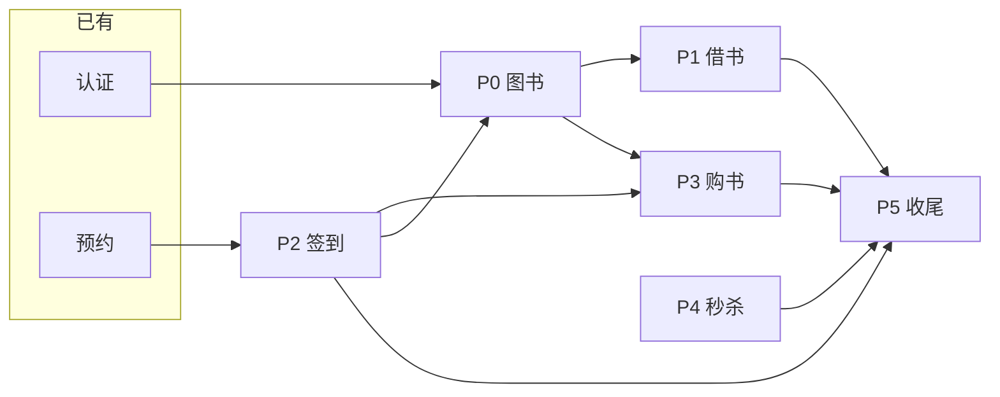

# 智慧书城 — 分阶段分步骤实施指南


> **项目**：smart_bookstore（智慧书城） · **文档类型**：学习文档  
> **关联**：`com.zx.bookstore` — 分期实现路径  
> **索引**：[学习文档中心](./README.md)

> 项目：`smart_bookstore` 演进为智慧书城  
> 前置：[书城系统功能规划](./书城系统功能规划.md) · [数据库草案](./书城系统数据库草案.sql)  
> 建议总周期：**6～8 周**（课余开发）  
> 最后更新：2026-07

---

## 一、实施前检查（Day 0）

### 1.1 已有能力（无需重做）

| 模块 | 状态 | 说明 |
|------|------|------|
| 统一认证 | ✅ | JWT 双 Token、QQ OAuth、RBAC |
| 座位预约 | ✅ | 行锁防超卖、幂等、状态机 |
| MySQL + Redis | ✅ | 会话缓存、限流 |
| 四层架构 | ✅ | Controller / Service / Repository / Entity |

### 1.2 环境准备

```text
□ JDK 17+
□ MySQL 8.0（smart_bookstore 库）
□ Redis 6+
□ RabbitMQ 3.x（P4 前安装即可）
□ Apifox / Postman
□ 可选：Vue3 前端（可与后端并行）
```

### 1.3 实施原则

1. **每阶段结束必须可演示**（接口通 + 自测清单打勾）  
2. **先 DB → Entity → Repository → Service → Controller**  
3. **每阶段更新 `docs/接口文档.md`**  
4. **不跨阶段堆功能**（例如 P1 未完成不开始秒杀）

### 1.4 阶段总览

| 阶段 | 名称 | 周期 | 里程碑 |
|------|------|------|--------|
| **P0** | 工程基座 + 图书模块 | 1 周 | 图书 CRUD + Redis 缓存 |
| **P1** | 借还书 | 1 周 | 线上申请 + 线下确认 + 状态机闭环 |
| **P2** | 签到 + 预约联动 | 1 周 | 7 天连签送券 |
| **P3** | 购书 + 优惠券 | 1.5 周 | 购物车、下单、用券 |
| **P4** | 秒杀 + RabbitMQ | 1.5 周 | Lua 抢券 + 异步落库 |
| **P5** | 管理端 + 联调收尾 | 1 周 | 全链路演示 + 文档 |
| **P6** | 可选增强 | 按需 | STAFF、逾期、报表 |

---

## 二、P0：工程基座 + 图书模块（第 1 周）

**目标**：书城包结构就绪，图书分类/列表/详情可用，详情走 Redis 缓存。

### Step 0.1 依赖与配置（0.5 天）

| 步骤 | 任务 | 产出 |
|------|------|------|
| 0.1.1 | `pom.xml` 确认 MyBatis-Plus、Redis；**暂不**加 RabbitMQ | 编译通过 |
| 0.1.2 | 新建包 `com.zx.bookstore.catalog` | 目录结构 |
| 0.1.3 | 新建 `BookstoreException` / 错误码 4xxx 段 | 异常体系 |
| 0.1.4 | `application.yaml` 增加 `bookstore.cache.ttl` 等配置项 | 可配置 TTL |

### Step 0.2 数据库（0.5 天）

| 步骤 | 任务 | 产出 |
|------|------|------|
| 0.2.1 | 执行 `book_category`、`book` 建表（见数据库草案） | 表存在 |
| 0.2.2 | 插入 2 个分类 + 5～10 本示例图书 | 种子数据 |
| 0.2.3 | 可选：`book_stock_log` 表先建不接入 | 为 P1 预留 |

### Step 0.3 后端四层（2 天）

| 步骤 | 任务 | 文件示例 |
|------|------|----------|
| 0.3.1 | Entity | `BookCategory.java`, `Book.java` |
| 0.3.2 | Mapper | `BookMapper.java`, `BookCategoryMapper.java` |
| 0.3.3 | Repository | `BookRepository.java` |
| 0.3.4 | DTO | `BookResponse`, `CreateBookRequest`, `PageResult` |
| 0.3.5 | Service | `BookCatalogService`：分页、详情、管理 CRUD |
| 0.3.6 | Controller 用户 | `BookController` `/api/books` |
| 0.3.7 | Controller 管理 | `BookAdminController` `/api/admin/books` |

**接口清单（P0 最小集）**：

```text
GET  /api/books?page&categoryId&keyword     USER
GET  /api/books/{id}                        USER
GET  /api/book-categories                   USER
POST /api/admin/books                       ADMIN
PUT  /api/admin/books/{id}                  ADMIN
DELETE /api/admin/books/{id}                ADMIN（逻辑下架 status=0）
POST /api/admin/book-categories             ADMIN
```

### Step 0.4 Redis 缓存（1 天）

| 步骤 | 任务 | 说明 |
|------|------|------|
| 0.4.1 | `BookRedisService` | Key: `book:detail:{id}` |
| 0.4.2 | 读：Cache-Aside | 先 Redis，miss 查 MySQL 再回填 |
| 0.4.3 | 写：更新/下架时 evict | 防脏读 |
| 0.4.4 | TTL + 随机偏移 | 防雪崩（苍穹外卖思路） |

### Step 0.5 自测与文档（0.5 天）

```text
□ admin 登录后 POST 创建图书
□ GET 列表分页、按分类筛选
□ GET 详情第二次命中 Redis（看日志或 redis-cli）
□ 更新图书后详情缓存失效
□ 更新 docs/接口文档.md P0 章节
```

**P0 交付物**：图书模块可演示 + 缓存可讲。

---

## 三、P1：借还书（第 2 周）

**目标**：用户 **线上提交借阅申请**，馆员 **线下确认借出** 后完成闭环；可借册数并发安全；借阅单走完整 **状态机**。

### 1.0 业务模型（先读）

**场景**：用户在 App 选书并提交申请 → 到馆后由馆员核验并登记取书 → 到期还书。

```text
APPLIED（线上已申请，待取书）
    ├─ confirm ──→ BORROWED（线下已借出，在借中）
    │                  ├─ return ──→ RETURNED（已还，终态）
    │                  └─ 定时任务 ──→ OVERDUE（逾期，仍须还书）
    └─ cancel / reject / 超时 ──→ CANCELLED（终态）
```

| 状态 | 含义 | 谁触发 |
|------|------|--------|
| `APPLIED` | 线上申请成功，等待到馆取书 | 用户 `POST /api/borrow/orders` |
| `BORROWED` | 线下已取书，计入在借 | 馆员 `POST .../confirm` |
| `RETURNED` | 已还书 | 用户或馆员 `.../return` |
| `OVERDUE` | 已过 `due_at` 未还 | 定时任务（P1 可先不做，表结构预留） |
| `CANCELLED` | 用户取消 / 馆员驳回 / 超时未取 | 用户 cancel、馆员 reject、定时任务 |

**库存策略（P1 采用）**：

- **申请（APPLIED）**：不扣 `borrow_stock`，只校验「剩余可借册数 > 当前占用数」
- **确认借出（BORROWED）**：事务内 `book FOR UPDATE` → `borrow_stock -= 1`，写 `borrow_at`、`due_at`
- **取消（CANCELLED）**：若未借出，无需回滚库存
- **还书（RETURNED）**：`borrow_stock += 1`

占用数 = `status IN (APPLIED, BORROWED, OVERDUE)` 且 `book_id` 相同的订单数（可按书聚合统计）。

### Step 1.1 数据库（0.5 天）

| 步骤 | 任务 |
|------|------|
| 1.1.1 | 建表 `borrow_order`（`status` 含 APPLIED/BORROWED/RETURNED/OVERDUE/CANCELLED；`borrow_at`/`due_at` 确认借出时写入） |
| 1.1.2 | 可选：建表 `book_stock_log` |
| 1.1.3 | 示例书 `borrow_stock > 0` |

### Step 1.2 包结构（0.5 天）

```text
com.zx.bookstore.borrow/
  entity/BorrowOrder.java
  enums/BorrowOrderStatus.java      APPLIED/BORROWED/RETURNED/OVERDUE/CANCELLED + canTransitTo()
  repository/BorrowOrderRepository.java
  service/BorrowService.java
  controller/BorrowController.java           用户端
  controller/BorrowAdminController.java    馆员/管理端：确认、驳回、还书
  exception/BorrowException.java           4002～4004
```

### Step 1.3 用户端接口（1 天）

| 步骤 | 接口 | 要点 |
|------|------|------|
| 1.3.1 | `POST /api/borrow/orders` `{ bookId }` | 创建借阅单 → **APPLIED**；生成 `order_no` |
| 1.3.2 | 校验可借 | `borrow_stock > 该书 APPLIED+BORROWED+OVERDUE 占用数`，否则 4002 |
| 1.3.3 | 校验用户 | 无 `BORROWED`/`OVERDUE` 未还单，否则 4003 |
| 1.3.4 | `POST /api/borrow/orders/{id}/cancel` | 仅 **APPLIED** → CANCELLED |
| 1.3.5 | `GET /api/borrow/orders/mine?status&page` | 我的借阅 |
| 1.3.6 | `GET /api/borrow/orders/{id}` | 详情（本人） |
| 1.3.7 | `POST /api/borrow/orders/{id}/return` | **BORROWED/OVERDUE** → RETURNED；`borrow_stock += 1`（可选：P1 仅馆员还书则放管理端） |

**申请时不做**：`FOR UPDATE` 扣库存、`borrow_at`/`due_at` 写入。

### Step 1.4 管理端接口（1 天）— 线下闭环关键

| 步骤 | 接口 | 要点 |
|------|------|------|
| 1.4.1 | `GET /api/admin/borrow/orders?status&page` | 默认查 `status=APPLIED` 待取书列表 |
| 1.4.2 | `POST /api/admin/borrow/orders/{id}/confirm` | **APPLIED → BORROWED** |
| 1.4.3 | confirm 事务内 | `book FOR UPDATE` → 再校验库存 → `borrow_stock -= 1` |
| 1.4.4 | confirm 写入 | `borrow_at = now`，`due_at = now + book.borrow_days` |
| 1.4.5 | 条件更新 | `UPDATE ... SET status='BORROWED' WHERE id=? AND status='APPLIED'` |
| 1.4.6 | `POST /api/admin/borrow/orders/{id}/reject` | **APPLIED → CANCELLED**（馆员驳回） |
| 1.4.7 | `POST /api/admin/borrow/orders/{id}/return` | **BORROWED/OVERDUE → RETURNED**；`borrow_stock += 1` |

**幂等**：对已 `BORROWED` 重复 confirm → 直接返回成功；对已 `RETURNED` 重复 return → 直接返回。

### Step 1.5 状态机实现要点（0.5 天）

| 步骤 | 任务 |
|------|------|
| 1.5.1 | `BorrowOrderStatus.canTransitTo(target)` 枚举校验非法跳转 → 4004 |
| 1.5.2 | 所有状态变更优先 **条件 UPDATE**（`WHERE status = 当前状态`），影响行数 0 则冲突 |
| 1.5.3 | 与预约单同款：`ReservationOrderStatus` 思路复用到借阅 |

### Step 1.6 可选增强（P1 可不做的预留）

| 步骤 | 任务 | 说明 |
|------|------|------|
| 1.6.1 | 定时：`APPLIED` 超 48h 未取 → `CANCELLED` | 释放「占用名额」 |
| 1.6.2 | 定时：`due_at < now` 且 `BORROWED` → `OVERDUE` | P6 亦可接入 |
| 1.6.3 | `book_stock_log` 记录 BORROW_OUT / BORROW_IN | 审计 |

### Step 1.7 自测（0.5 天）

```text
□ 用户申请 → status=APPLIED，borrow_stock 不变
□ 库存已满（含 APPLIED 占用）时再申请 → 4002
□ 有 BORROWED/OVERDUE 未还时再申请 → 4003
□ 用户取消 APPLIED → CANCELLED
□ 馆员 confirm → BORROWED，borrow_stock 减 1，borrow_at/due_at 有值
□ 重复 confirm 幂等
□ 馆员 reject APPLIED → CANCELLED，库存不变
□ 还书 → RETURNED，borrow_stock 加 1
□ 对已 RETURNED / CANCELLED 操作 confirm/return → 4004
□ 并发：多用户申请最后一册 → 仅允许占用数内的 APPLIED；confirm 时 FOR UPDATE 仅 1 成功
```

### Step 1.8 接口清单（P1 最小集）

```text
POST /api/borrow/orders                         USER   申请借书 → APPLIED
POST /api/borrow/orders/{id}/cancel             USER   取消申请
GET  /api/borrow/orders/mine?status&page        USER
GET  /api/borrow/orders/{id}                    USER
POST /api/borrow/orders/{id}/return             USER   可选；亦可仅走管理端还书

GET  /api/admin/borrow/orders?status&page       ADMIN  借阅列表（待取书 status=APPLIED）
POST /api/admin/borrow/orders/{id}/confirm      ADMIN  线下确认借出
POST /api/admin/borrow/orders/{id}/reject       ADMIN  驳回申请
POST /api/admin/borrow/orders/{id}/return       ADMIN  馆员登记还书
```

**P1 交付物**：线上申请 + 线下确认 **状态机闭环** + confirm 时行锁扣库存，可答辩。

---

## 四、P2：签到 + 预约联动（第 3 周）

**目标**：用户凭当日预约签到；BitMap 记录；连续 7 天发券。

### Step 2.1 数据库 + 预约扩展（0.5 天）

| 步骤 | 任务 |
|------|------|
| 2.1.1 | `ALTER reservation_order ADD checkin_at` |
| 2.1.2 | 建表 `checkin_record`、`checkin_streak` |
| 2.1.3 | 建表 `coupon_template`、`user_coupon`（仅签到发券所需） |
| 2.1.4 | 种子：「连续签到7天赠券」模板 |

### Step 2.2 包结构（0.5 天）

```text
com.zx.marketing.checkin/
  service/CheckinService.java
  service/CheckinRedisService.java    BitMap + streak
  controller/CheckinController.java

com.zx.bookstore.coupon/              最小集：发券、查我的券
  service/CouponService.java
  controller/CouponController.java
```

### Step 2.3 签到逻辑（2 天）

| 步骤 | 任务 | 规则 |
|------|------|------|
| 2.3.1 | `POST /api/checkin` | body: `{ reservationOrderId }` |
| 2.3.2 | 校验预约 | BOOKED、user 本人、slot_date=今天、checkin_at 空 |
| 2.3.3 | Redis BitMap | `sign:user:{userId}:{yyyyMM}` offset=day-1 → 1 |
| 2.3.4 | 更新 streak | 昨天签过 +1，否则置 1 |
| 2.3.5 | streak >= 7 | INSERT `user_coupon`（obtain_way=CHECKIN_7），streak 归零 |
| 2.3.6 | 写 `checkin_record` + 更新 `reservation_order.checkin_at` | MySQL 持久化 |
| 2.3.7 | `GET /api/checkin/calendar?month=` | 返回当月哪些天签了 |
| 2.3.8 | `GET /api/checkin/streak` | 连续天数、今日是否已签 |
| 2.3.9 | `GET /api/coupons/mine` | 我的券列表 |

**错误码**：4301～4304（见功能规划）。

### Step 2.4 自测（1 天）

```text
□ 无预约签到 → 4302
□ 非当日预约 → 4303
□ 同日重复签到 → 4301
□ 手动改 Redis 模拟连签 7 天 → 收到优惠券
□ 断签后 streak 从 1 重新开始
```

**P2 交付物**：预约→签到→赠券故事线完整（黑马点评签到亮点）。

---

## 五、P3：购书 + 用券（第 4～5 周）

**目标**：购物车、下单、选券、模拟支付、订单状态机。

### Step 3.1 数据库（0.5 天）

```text
cart_item
trade_order
trade_order_item
（coupon_template / user_coupon 已在 P2 部分存在，补全字段即可）
```

### Step 3.2 购物车（1 天）

| 步骤 | 接口 |
|------|------|
| 3.2.1 | `GET /api/cart/items` |
| 3.2.2 | `POST /api/cart/items` `{ bookId, quantity }` |
| 3.2.3 | `PUT /api/cart/items/{id}` |
| 3.2.4 | `DELETE /api/cart/items/{id}` |

### Step 3.3 下单与支付（2 天）

| 步骤 | 任务 | 要点 |
|------|------|------|
| 3.3.1 | `POST /api/trade/orders` | 支持 `couponId?`、`idempotencyKey?` |
| 3.3.2 | 算价 | total - 券（门槛 4101） |
| 3.3.3 | 扣 `sale_stock` | 事务内或 Redis 预检 + DB |
| 3.3.4 | 核销券 | `UPDATE user_coupon SET status=USED WHERE id=? AND status=UNUSED` |
| 3.3.5 | 清空已下单购物车项 | |
| 3.3.6 | `POST /api/trade/orders/{id}/pay` | 模拟支付 → PAID |
| 3.3.7 | `POST /api/trade/orders/{id}/cancel` | 仅 PENDING_PAY，回滚库存/券 |
| 3.3.8 | `GET /api/trade/orders/mine` | |
| 3.3.9 | `GET /api/coupons/available?orderAmount=` | 下单页选券 |

### Step 3.4 管理端（0.5 天）

```text
GET /api/admin/trade/orders   ADMIN
```

### Step 3.5 自测（1 天）

```text
□ 加购 → 下单 → 支付 → COMPLETED/PAID
□ 用券后 pay_amount 正确
□ 券不满足门槛 4101
□ 库存不足 4103
□ idempotencyKey 重复提交不重复下单
□ 取消订单库存与券状态回滚
```

**P3 交付物**：苍穹外卖式订单 + 用券（不含秒杀）。

---

## 六、P4：秒杀 + RabbitMQ（第 5～6 周）

**目标**：抢优惠券；Redis Lua 原子扣减；MQ 异步发券。

### Step 4.1 环境与依赖（0.5 天）

| 步骤 | 任务 |
|------|------|
| 4.1.1 | 安装 RabbitMQ，管理界面可访问 |
| 4.1.2 | `pom.xml` 添加 `spring-boot-starter-amqp` |
| 4.1.3 | `application.yaml` 配置 host/port/virtual-host |
| 4.1.4 | 建表 `seckill_activity`、`seckill_order` |

### Step 4.2 Redis 秒杀（1.5 天）

| 步骤 | 任务 |
|------|------|
| 4.2.1 | `SeckillRedisService`：库存 Key、用户 Set Key |
| 4.2.2 | 编写 Lua 脚本（判库存、判重复、decr、sadd） |
| 4.2.3 | 活动创建/启动时预热库存到 Redis |
| 4.2.4 | `POST /api/seckill/activities/{id}/grab` |

### Step 4.3 RabbitMQ（1.5 天）

| 步骤 | 任务 |
|------|------|
| 4.3.1 | 声明 Exchange `bookstore.topic`、Queue `seckill.order` |
| 4.3.2 | Grab 成功 → 发消息 `{ userId, activityId, idempotencyKey }` |
| 4.3.3 | `SeckillOrderConsumer` 消费：INSERT seckill_order + user_coupon |
| 4.3.4 | 幂等：`uk_seckill_user_activity`、`idempotencyKey` |
| 4.3.5 | 失败：更新 seckill_order FAILED，回滚 Redis（可选补偿） |
| 4.3.6 | `GET /api/seckill/activities/{id}/result` 查 PROCESSING/SUCCESS |

### Step 4.4 管理端（0.5 天）

```text
POST /api/admin/seckill/activities     创建活动 + 预热 Redis
GET  /api/admin/seckill/activities
```

### Step 4.5 自测（1 天）

```text
□ 活动未开始 4203
□ 单人重复抢 4201
□ 库存抢完 4202
□ 100 并发仅成功 N 次（N=库存）
□ MQ 消费后 user_coupon 可查
□ 消费失败可重试 / 进死信（可选）
```

**P4 交付物**：黑马点评秒杀 + MQ 亮点。

> 详细设计见：[P4秒杀业务流程与技术栈](./P4秒杀业务流程与技术栈.md)

---

## 七、P5：管理端整合 + 全链路收尾（第 7 周）

**目标**：ADMIN 后台齐全；延迟取消；文档与演示脚本。

### Step 5.1 管理端补全（2 天）

```text
✓ 图书 / 分类 CRUD 页面或 Apifox 集合 → 见 docs/admin-apifox-collection.md
✓ 券模板 CRUD → CouponAdminController /api/admin/coupon-templates
✓ 秒杀活动配置 → SeckillAdminController 增删改查
✓ 预约 / 借阅 / 购书订单查询 → 已有 Reservation/Borrow/Trade Admin
✓ 统一 /api/admin 路由守卫 ADMIN → SecurityConfig + @PreAuthorize
```

### Step 5.2 购书超时取消（1 天，可选）

| 步骤 | 任务 |
|------|------|
| 5.2.1 | ✓ 下单发延迟消息 15min（RabbitMQ 延迟插件 `x-delayed-message`） |
| 5.2.2 | ✓ 消费：若仍 PENDING_PAY → CANCELLED（支付时才扣库存/券，关单无需回滚） |

### Step 5.3 前端 / 联调（2 天）

按 [书城系统功能规划](./书城系统功能规划.md) 第十二章路由，至少完成：

```text
/login → /reservation → /checkin → /books → /borrow/orders
/coupons → /seckill → /cart → /trade/orders
/admin（ADMIN）
```

或更新 [前端生成提示词](./前端生成提示词.md)（已含秒杀、完整管理端、购书超时倒计时）后生成前端项目。

### Step 5.4 文档与学习材料（1 天）

```text
□ docs/接口文档.md 全书城章节
□ README 启动说明 + 演示路径
□ 学习笔记 1：签到 BitMap + 7 天送券
□ 学习笔记 2：秒杀 Lua + RabbitMQ
□ 学习笔记 3（可选）：借还书行锁
```

### Step 5.5 全链路演示脚本（答辩用）

```text
1. admin 登录 → 上架图书、创建秒杀活动
2. user 登录 → 预约明日/今日座位
3. 到馆签到（可测 streak）
4. 线上申请借书 → 馆员 confirm → 还书
5. 加购 → 用签到券下单 → 支付
6. 秒杀抢券 → 轮询结果
7. ADMIN 查看各订单列表
```

**P5 交付物**：可录屏答辩的完整系统。

---

## 八、P6：可选增强（按需）

| 功能 | 步骤概要 | 价值 |
|------|----------|------|
| STAFF 角色 | 加 STAFF 角色，将 confirm/return 从 ADMIN 下放 | P1 已用 ADMIN 做馆员确认，P6 做权限细分 |
| 借阅逾期 | 定时任务扫 `due_at`，标记 OVERDUE | 定时任务 |
| 库存流水 | P1 预留的 `book_stock_log` 接入 | 审计 |
| 缓存穿透 | 空对象 / 布隆过滤器 | 点评八股落地 |
| 简单报表 | ADMIN 借阅量、签到人数 | 数据展示 |
| Docker Compose | MySQL+Redis+MQ 一键起 | 部署 |

---

## 九、阶段依赖关系



**可并行**：

- P1 借书 与 P2 签到 **可并行**（不同人 / 不同周）  
- P3 购书 依赖 P0；用券依赖 P2 的 `user_coupon`  
- P4 秒杀 依赖 P2 的券模块，与 P3 **可部分并行**

---

## 十、每周时间分配建议（课余）

| 周 | 阶段 | 约小时 |
|----|------|--------|
| 1 | P0 | 12～15h |
| 2 | P1 | 12～15h |
| 3 | P2 | 12～15h |
| 4 | P3 前半 | 8～10h |
| 5 | P3 后半 + P4 前半 | 12～15h |
| 6 | P4 后半 | 10～12h |
| 7 | P5 | 12～15h |

每天 1.5～2h 可持续；周末集中联调。

---

## 十一、最小 MVP 路径（时间紧时）

只做 **4 周版**：

| 周 | 内容 |
|----|------|
| 1 | P0 图书 + P1 借书 |
| 2 | P2 签到送券（核心亮点） |
| 3 | P4 秒杀简化版（可同步落库，先不上 MQ） |
| 4 | P5 文档 + 演示 |

**砍掉**：购物车复杂用券（P3 改为「单本直接购买」）、延迟取消、STAFF。

---

## 十二、每阶段 Checklist 模板

复制到记事本，每阶段结束打勾：

```markdown
## Px 完成检查
- [ ] 数据库脚本已执行并提交
- [ ] 接口 Apifox 集合已更新
- [ ] 错误码与功能规划一致
- [ ] 至少 1 条 happy path + 2 条异常 path 自测通过
- [ ] docs/接口文档.md 已更新
- [ ] 可独立演示本阶段功能（不依赖下一阶段）
```

---

## 相关文档

- [书城系统功能规划](./书城系统功能规划.md)
- [书城系统数据库草案](./书城系统数据库草案.sql)
- [自习室预约业务流程](./自习室预约业务流程.md)
- [幂等与行级锁学习文档](./幂等与行级锁学习文档.md)
- [前端生成提示词](./前端生成提示词.md)
