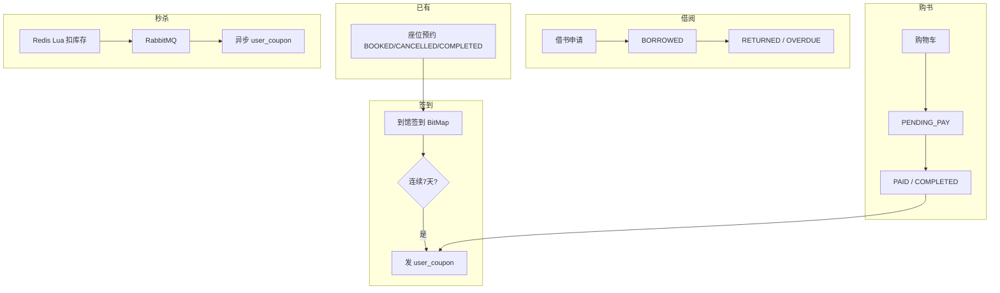

# 智慧书城管理系统 — 功能规划与项目结构


> **项目**：smart_bookstore（智慧书城） · **文档类型**：学习文档  
> **关联**：`com.zx.bookstore` — 书城能力边界  
> **索引**：[学习文档中心](./README.md)

> 项目：`smart_bookstore` 演进方向  
> 定位：统一认证 + **座位预约** + **借书/买书** + **签到促活** + **优惠券秒杀**  
> 融合参考：**苍穹外卖**（订单/缓存/后台）、**黑马点评**（签到/秒杀/Redis）  
> 最后更新：2026-07

---

## 一、写在前面

### 1.1 为什么要做书城

你已有 **JWT 双 Token + QQ 登录 + 座位预约（行锁防超卖）**，具备统一认证与一块真实业务。  
在此基础上扩展 **图书流通 + 营销 + 签到**，可以：

1. 复用现有认证与预约，形成 **「预约来读 → 签到打卡 → 借/买书 → 用券」** 完整故事线  
2. 把苍穹外卖的 **订单、购物车、缓存** 和黑马点评的 **签到 BitMap、秒杀 Lua、RabbitMQ** 落到同一项目  
3. 简历从「认证 + 预约」升级为 **「智慧书城综合业务平台」**

### 1.2 设计原则

| 原则 | 说明 |
|------|------|
| **MVP 分阶段** | 先借书 + 签到，再购书 + 秒杀，避免一次做全家桶 |
| **复用现有模块** | `auth`、`reservation` 尽量不改核心，只扩展 |
| **亮点做深 2～3 个** | 预约行锁、签到连签送券、秒杀 Lua+MQ，每个能讲 5 分钟 |
| **表设计可讲 ER** | 借、买、券、预约、签到能画一张关系图 |

### 1.3 相关文档

| 文档 | 说明 |
|------|------|
| [预约系统功能规划](./预约系统功能规划.md) | 已有预约模块 |
| [自习室预约业务流程](./自习室预约业务流程.md) | 预约流程与接口 |
| [书城系统数据库草案](./书城系统数据库草案.sql) | 新增表 SQL 草案 |
| [书城系统分阶段实施指南](./书城系统分阶段实施指南.md) | **分阶段分步骤实现清单** |
| [大二项目规划指南](./大二项目规划指南.md) | 项目合格线 |

---

## 二、项目定位

| 项 | 说明 |
|----|------|
| 项目名称 | 智慧书城管理系统（Smart Bookstore） |
| 后端 | Spring Boot 3 + MySQL + Redis + RabbitMQ + MyBatis-Plus |
| 认证 | 已有：密码/验证码/QQ OAuth、JWT、RBAC |
| 用户端 | 预约座位、到馆签到、借书、买书、抢优惠券 |
| 管理端 | 图书/库存/活动/券/预约/订单管理 |

**一句话**：在统一认证平台上，实现 **到馆阅读（预约+签到）** 与 **图书流通（借/买）** 及 **营销（券/秒杀）** 的闭环。

---

## 三、从苍穹外卖 / 黑马点评借鉴什么

| 来源 | 借鉴能力 | 在本项目落点 |
|------|----------|--------------|
| **苍穹外卖** | 分类 + 商品、Redis 缓存 | 图书分类、图书详情缓存 |
| **苍穹外卖** | 购物车、订单状态机 | 购书购物车、`trade_order` |
| **苍穹外卖** | 管理后台 CRUD | 图书/活动/券模板管理 |
| **苍穹外卖** | 延迟取消（可 RabbitMQ） | 购书订单超时未支付取消 |
| **黑马点评** | 签到 BitMap、连续天数 | 到馆签到、7 天送券 |
| **黑马点评** | 秒杀 Redis + Lua + 一人一单 | 优惠券秒杀 |
| **黑马点评** | MQ 异步落库 | 秒杀成功后异步写 `user_coupon` |
| **黑马点评** | 缓存穿透/击穿思路 | 图书详情、秒杀活动页 |
| **现有项目** | JWT、预约、FOR UPDATE | 签到与预约联动、占座防超卖 |

---

## 四、后端包结构

```text
com.zx
├── auth/                         # 已有：登录、JWT、QQ OAuth、RBAC
├── config/                       # 已有 + RabbitMQ、Redisson（可选）
├── common/                       # 统一响应、异常、错误码
│
├── reservation/                  # 已有：座位预约（扩展签到字段/接口）
│
├── bookstore/                    # 【新】书城核心
│   ├── catalog/                  # 分类、图书、库存
│   │   ├── controller/
│   │   ├── service/
│   │   ├── repository/
│   │   └── entity/
│   ├── borrow/                   # 借还书
│   ├── trade/                    # 购物车、购书订单
│   └── coupon/                   # 券模板、用户券
│
├── marketing/                    # 【新】营销
│   ├── checkin/                  # 到馆签到、连续天数、发券
│   └── seckill/                  # 秒杀活动、抢券
│
└── admin/                        # 可选：管理端聚合；或各模块 /admin 路径
```

**约定**：

- 用户接口：`/api/{module}/...`，需 `USER`  
- 管理接口：`/api/admin/{module}/...` 或模块内 `@PreAuthorize("hasRole('ADMIN')")`  
- 统一响应：`{ code, message, data }`（与认证模块一致）

---

## 五、角色与权限

| 角色 | 编码 | 能力 |
|------|------|------|
| 读者 | `USER` | 预约、签到、借书、买书、抢券、用券 |
| 店员 | `STAFF` | 借还确认、订单核销、活动查看（可选） |
| 管理员 | `ADMIN` | 全部配置、报表、活动/券/图书管理 |

实现：在 `auth_role` 增加 `STAFF`；Spring Security `@PreAuthorize`。

---

## 六、业务模块与状态机

### 6.1 模块总览



### 6.2 预约（已有，扩展）

| 状态 | 说明 |
|------|------|
| `BOOKED` | 已预约，可签到、管理员可完成 |
| `CANCELLED` | 已取消 |
| `COMPLETED` | 已使用/已结束 |

**扩展**：

- 字段：`checkin_at DATETIME NULL`（到馆签到时间）  
- 接口：`POST /api/reservation/orders/{id}/checkin`

### 6.3 借阅单 `borrow_order`

```text
APPLIED → BORROWED → RETURNED
              ↓
           OVERDUE（定时任务标记，仍须还书）
              ↓
           CANCELLED（仅 APPLIED 可取消）
```

### 6.4 购书订单 `trade_order`

```text
PENDING_PAY → PAID → COMPLETED
     ↓
 CANCELLED（超时 / 用户取消）
```

### 6.5 用户优惠券 `user_coupon`

```text
UNUSED → USED（下单核销）
     ↓
 EXPIRED（过期）
```

来源 `obtain_way`：`SECKILL` | `CHECKIN_7` | `ADMIN`

### 6.6 秒杀记录 `seckill_order`

```text
PROCESSING → SUCCESS（落库发券）
          → FAILED（库存不足等）
```

---

## 七、核心业务流程

### 7.1 预约 + 到馆签到 + 7 天送券

**规则**：

1. 用户须先预约当日（或预约时段内）座位，状态 `BOOKED`  
2. 每人每天最多签到 **1 次**  
3. 签到必须关联 **当日有效预约单**（防空签刷券）  
4. 连续签到 **7 天** 赠送指定 `coupon_template` 一张  
5. 断签：连续天数归零（与黑马点评一致，可配置）

**流程**：

```text
1. POST /api/checkin  body: { reservationOrderId }
2. 校验：订单归属、BOOKED、slot_date=今天、checkin_at 为空
3. Redis BitMap：sign:user:{userId}:{yyyyMM} 第 day 位置 1
4. 更新 streak：昨天签过 → streak+1，否则 streak=1
5. if streak >= 7 且未领过本轮 CHECKIN_7 券：
     INSERT user_coupon（或发 MQ checkin.reward 异步）
     streak 归零 / 标记已发放（产品二选一）
6. UPDATE reservation_order.checkin_at = NOW()
```

### 7.2 借书（线上申请 + 线下确认）

```text
1. GET /api/books 浏览
2. POST /api/borrow/orders  { bookId }  → borrow_order APPLIED（不占库存）
3. 用户到馆，馆员 GET /api/admin/borrow/orders?status=APPLIED
4. POST /api/admin/borrow/orders/{id}/confirm
   事务内：book FOR UPDATE → borrow_stock > 0 → borrow_stock-1
   → status BORROWED，borrow_at、due_at 写入
5. POST /api/admin/borrow/orders/{id}/return（或用户自助还书）→ RETURNED，册数+1
6. 可选：用户 POST .../cancel（APPLIED→CANCELLED）；馆员 reject；超时未取定时取消
```

### 7.3 买书 + 用券

```text
1. 购物车 CRUD /api/cart/items
2. POST /api/trade/orders  { itemIds, couponId?, idempotencyKey? }
3. 算价：总额 - 券（满减门槛校验）
4. UPDATE user_coupon SET status=USED WHERE id=? AND status=UNUSED
5. trade_order PENDING_PAY → 模拟支付 → PAID
6. 扣减 book.sale_stock（Redis + DB 或事务内 UPDATE）
7. 可选：延迟 MQ 15min 未支付 → CANCELLED
```

### 7.4 优惠券秒杀

```text
1. GET /api/seckill/activities 活动列表（缓存）
2. POST /api/seckill/activities/{id}/grab  { idempotencyKey }
3. 活动时间窗口校验
4. Redis Lua 原子：库存>0 且 user 未抢 → decr stock + sadd users
5. 返回「排队中」→ 发 RabbitMQ seckill.order
6. Consumer：INSERT seckill_order + user_coupon
7. DB UNIQUE(user_id, activity_id) 一人一单兜底
8. GET /api/seckill/activities/{id}/result 查结果
```

---

## 八、Redis 设计

| Key | 类型 | TTL | 用途 |
|-----|------|-----|------|
| `book:detail:{id}` | String/Hash | 30min+随机 | 图书详情 |
| `book:sale:stock:{id}` | String | 与活动一致 | 可售库存 |
| `book:borrow:stock:{id}` | String | 长期 | 可借册数 |
| `sign:user:{userId}:{yyyyMM}` | BitMap | 月底+1天 | 当月签到 |
| `sign:streak:{userId}` | String | 长期 | 连续天数 |
| `sign:last:{userId}` | String | 长期 | 上次签到日期 yyyy-MM-dd |
| `seckill:stock:{activityId}` | String | 活动结束 | 秒杀剩余 |
| `seckill:users:{activityId}` | Set | 活动结束 | 已抢用户 |
| `auth:session:*` | 已有 | — | 会话 |

**秒杀 Lua 逻辑（伪代码）**：

```lua
-- KEYS[1]=stock  KEYS[2]=users  ARGV[1]=userId
if tonumber(redis.call('get', KEYS[1])) <= 0 then return 0 end
if redis.call('sismember', KEYS[2], ARGV[1]) == 1 then return 2 end
redis.call('decr', KEYS[1])
redis.call('sadd', KEYS[2], ARGV[1])
return 1
```

---

## 九、RabbitMQ 设计

### 9.1 交换机与队列

| 交换机 | 类型 | 队列 | 用途 |
|--------|------|------|------|
| `bookstore.topic` | topic | `seckill.order` | 秒杀异步发券 |
| `bookstore.topic` | topic | `trade.order.delay` | 购书超时取消（延迟插件或 TTL+DLX） |
| `bookstore.topic` | topic | `checkin.reward` | 签到发券（可选异步） |
| `bookstore.topic` | topic | `borrow.overdue` | 借阅逾期提醒（可选） |

### 9.2 消息体示例

```json
// seckill.order
{
  "userId": 1,
  "activityId": 100,
  "idempotencyKey": "550e8400-e29b-41d4-a716-446655440000"
}

// trade.order.delay
{
  "orderId": 9001,
  "orderNo": "TO20260706120000"
}
```

### 9.3 消费端要求

- **幂等**：`idempotencyKey` 或 DB 唯一约束  
- **失败重试**：有限次数 + 死信队列  
- **手动 ACK**：落库成功再 ack

---

## 十、API 规划

Base：`http://localhost:8081`，Header：`Authorization: Bearer <accessToken>`

### 10.1 预约（已有 + 扩展）

| 方法 | 路径 | 角色 | 说明 |
|------|------|------|------|
| GET | `/api/reservation/resources` | USER | 自习室列表 |
| GET | `/api/reservation/slots/{slotId}/seats` | USER | 座位占用 |
| POST | `/api/reservation/orders` | USER | 创建预约 `{ timeSlotId, seatId, idempotencyKey? }` |
| POST | `/api/reservation/orders/{id}/checkin` | USER | **到馆签到** |

### 10.2 签到

| 方法 | 路径 | 角色 | 说明 |
|------|------|------|------|
| POST | `/api/checkin` | USER | `{ reservationOrderId }` |
| GET | `/api/checkin/calendar?month=2026-07` | USER | 当月签到日历 |
| GET | `/api/checkin/streak` | USER | 连续天数、今日是否已签 |

### 10.3 图书与借阅

| 方法 | 路径 | 角色 | 说明 |
|------|------|------|------|
| GET | `/api/books?page&categoryId&keyword` | USER | 图书列表 |
| GET | `/api/books/{id}` | USER | 详情（缓存） |
| POST | `/api/borrow/orders` | USER | `{ bookId }` 申请借书 → APPLIED |
| POST | `/api/borrow/orders/{id}/cancel` | USER | 取消申请（仅 APPLIED） |
| POST | `/api/borrow/orders/{id}/return` | USER | 还书（BORROWED/OVERDUE，可选） |
| GET | `/api/borrow/orders/mine?status&page` | USER | 我的借阅 |
| GET | `/api/borrow/orders/{id}` | USER | 借阅详情 |

### 10.4 购书

| 方法 | 路径 | 角色 | 说明 |
|------|------|------|------|
| GET/POST/PUT/DELETE | `/api/cart/items` | USER | 购物车 |
| POST | `/api/trade/orders` | USER | 下单 `{ couponId?, idempotencyKey? }` |
| POST | `/api/trade/orders/{id}/pay` | USER | 模拟支付 |
| POST | `/api/trade/orders/{id}/cancel` | USER | 取消 |
| GET | `/api/trade/orders/mine` | USER | 我的订单 |

### 10.5 优惠券

| 方法 | 路径 | 角色 | 说明 |
|------|------|------|------|
| GET | `/api/coupons/mine?status=` | USER | 我的券 |
| GET | `/api/coupons/available?orderAmount=` | USER | 下单可用券 |

### 10.6 秒杀

| 方法 | 路径 | 角色 | 说明 |
|------|------|------|------|
| GET | `/api/seckill/activities` | USER | 活动列表 |
| GET | `/api/seckill/activities/{id}` | USER | 活动详情 |
| POST | `/api/seckill/activities/{id}/grab` | USER | 抢券 `{ idempotencyKey }` |
| GET | `/api/seckill/activities/{id}/result` | USER | 抢购结果 |

### 10.7 管理端（ADMIN）

| 模块 | 路径前缀 | 能力 |
|------|----------|------|
| 图书 | `/api/admin/books` | CRUD、入库 |
| 分类 | `/api/admin/book-categories` | CRUD |
| 券模板 | `/api/admin/coupon-templates` | CRUD |
| 秒杀 | `/api/admin/seckill/activities` | 创建活动、预热 Redis 库存 |
| 预约 | `/api/admin/reservation/...` | 已有 |
| 订单 | `/api/admin/trade/orders` | 购书订单查询 |
| 借阅 | `/api/admin/borrow/orders` | 列表查询；`confirm`/`reject`/`return` 线下闭环 |

---

## 十一、错误码规划

| 段 | code | 含义 |
|----|------|------|
| 预约 | 3001～3011 | 已有 |
| 图书 | 4001 | 图书不存在或下架 |
| 借阅 | 4002 | 可借册数不足 |
| 借阅 | 4003 | 存在未还书籍，不可再借 |
| 借阅 | 4004 | 借阅单状态不允许 |
| 购书 | 4101 | 优惠券不可用 |
| 购书 | 4102 | 订单已支付/已取消 |
| 购书 | 4103 | 可售库存不足 |
| 秒杀 | 4201 | 您已参与过该活动 |
| 秒杀 | 4202 | 已售罄 |
| 秒杀 | 4203 | 活动未开始或已结束 |
| 秒杀 | 4204 | 排队中，请稍后查询结果 |
| 签到 | 4301 | 今日已签到 |
| 签到 | 4302 | 无有效预约，不可签到 |
| 签到 | 4303 | 预约日期与今日不匹配 |
| 签到 | 4304 | 该预约已签到 |

---

## 十二、前端页面结构（Vue3 建议）

| 路由 | 页面 | 说明 |
|------|------|------|
| `/login` | 登录 | 四 Tab + QQ |
| `/reservation` | 选座预约 | 已有 |
| `/checkin` | 签到 | 日历 + 选当日预约签到 |
| `/books` | 书城 | 分类、搜索 |
| `/books/:id` | 详情 | 借 / 加购 |
| `/cart` | 购物车 | |
| `/trade/orders` | 购书订单 | |
| `/borrow/orders` | 借阅记录 | |
| `/coupons` | 我的优惠券 | |
| `/seckill` | 秒杀抢券 | 倒计时、结果轮询 |
| `/profile` | 个人中心 | |
| `/admin/*` | 管理后台 | ADMIN |

---

## 十三、实施阶段（6～8 周）

| 阶段 | 周期 | 交付 | 简历关键词 |
|------|------|------|------------|
| **P0** | 1 周 | 图书分类/CRUD + Redis 详情缓存 | 缓存、四层架构 |
| **P1** | 1 周 | 借还书 + 库存流水 + 行锁 | 事务、FOR UPDATE |
| **P2** | 1 周 | 预约扩展 `checkin_at` + 签到 BitMap + 7 天送券 | 签到、促活 |
| **P3** | 1.5 周 | 购物车 + 购书订单 + 用券 + 模拟支付 | 订单状态机 |
| **P4** | 1.5 周 | 秒杀 Lua + RabbitMQ 异步发券 | **秒杀、MQ** |
| **P5** | 1 周 | 管理后台、延迟取消、文档与学习材料 | 完整闭环 |
| **P6** | 可选 | STAFF 角色、逾期提醒、简单报表 | 加分项 |

**最小可演示路径（MVP）**：

```text
登录 → 预约座位 → 到馆签到 → 连续签到说明 → 借一本书 → 管理员上架图书
```

---

## 十四、简历 / 答辩描述

> 智慧书城：基于 JWT + RBAC 统一认证，集成自习室座位预约（行锁防超卖）、到馆签到 BitMap 连签赠券、图书借还与购书订单；优惠券秒杀采用 Redis Lua 原子扣减 + RabbitMQ 异步落库，购书支持满减券核销；融合外卖式订单/cache 与点评式签到/秒杀方案。

**建议准备 3 个深挖点**：

1. 预约 `FOR UPDATE` + 幂等（已有）  
2. 签到 BitMap + 连续 7 天发券规则  
3. 秒杀 Lua + MQ + 一人一单唯一索引  

---

## 十五、与现有代码衔接清单

| 已有 | 动作 |
|------|------|
| `com.zx.auth.*` | 保留；可选加 `STAFF` |
| `com.zx.reservation.*` | 保留；加 `checkin_at`、checkin 接口 |
| `schema.sql` | 追加书城/营销表（见草案 SQL） |
| `pom.xml` | 增加 `spring-boot-starter-amqp` |
| `application.yaml` | 增加 RabbitMQ、书城业务配置 |
| `docs/接口文档.md` | 随模块迭代补充 |
| `docs/前端生成提示词.md` | 扩展书城页面与 API |

---

## 十六、暂不建议做（控制范围）

- 真实微信/支付宝支付  
- 分布式 Seata 事务  
- 全文检索 Elasticsearch（关键词 LIKE 够用）  
- 推荐算法、社区书评（可写后续规划）  
- 多门店、物流发货（书城以到店自提/现场取书为主）

---

## 相关文档

- [书城系统分阶段实施指南](./书城系统分阶段实施指南.md)
- [书城系统数据库草案](./书城系统数据库草案.sql)
- [预约系统业务价值点](./预约系统业务价值点.md)
- [幂等与行级锁学习文档](./幂等与行级锁学习文档.md)
- [前端生成提示词](./前端生成提示词.md)
