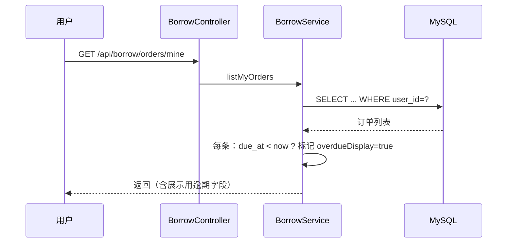
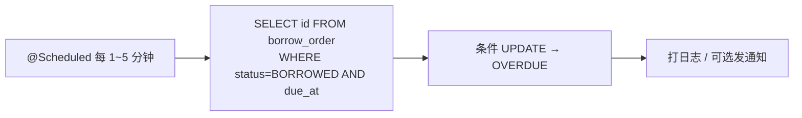
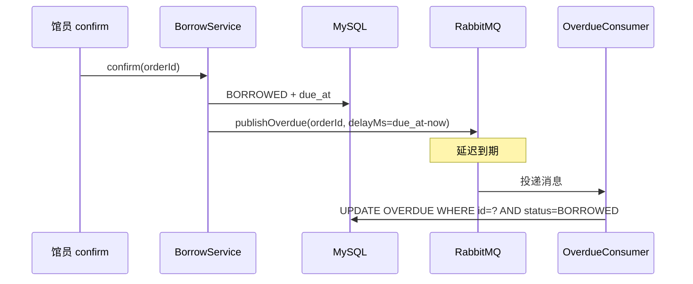
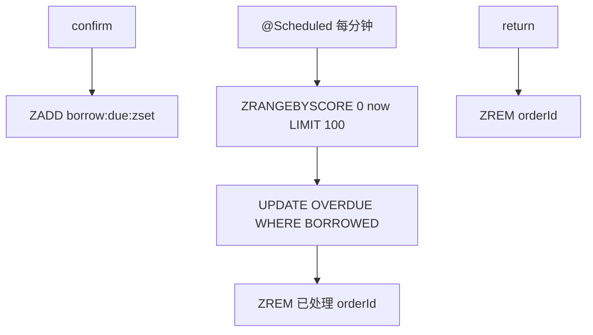

# 借阅逾期四种实现思路对比


> **项目**：smart_bookstore（智慧书城） · **文档类型**：学习文档  
> **关联**：`com.zx.bookstore.borrow` — 逾期方案选型  
> **索引**：[学习文档中心](./README.md)

> 适用项目：`smart_bookstore` 智慧书城 · 借还书模块（`com.zx.bookstore.borrow`）  
> 关联文档：[书城系统分阶段实施指南](./书城系统分阶段实施指南.md) · [书城系统功能规划](./书城系统功能规划.md) · [RabbitMQ使用指南学习文档](./RabbitMQ使用指南学习文档.md)

---

## 写在前面

借阅业务在馆员 **确认借出（confirm）** 时会写入 `due_at`（到期时间）。当用户超过 `due_at` 仍未还书，系统需要识别 **逾期**。

常见误解：

- ❌ 逾期 **必须** 用定时任务
- ❌ 定时任务 **必须** 全表扫描
- ❌ 必须把 `status` 改成 `OVERDUE` 才能做业务

实际上：**「是否逾期」是业务判断；「何时、如何触发判断」是工程选型。** 本文以借阅场景对比四种常见实现，并给出在本项目中的选型建议。

---

## 一、业务背景（本项目）

### 1.1 状态机

```text
APPLIED（线上已申请，待取书）
    ├─ confirm ──→ BORROWED（线下已借出，在借中）
    │                  ├─ return ──→ RETURNED（已还，终态）
    │                  └─ 逾期触发 ──→ OVERDUE（逾期，仍须还书）
    └─ cancel / reject / 超时 ──→ CANCELLED（终态）
```

| 状态 | 含义 | 触发方 |
|------|------|--------|
| `APPLIED` | 等待到馆取书 | 用户申请 |
| `BORROWED` | 在借中 | 馆员 confirm |
| `OVERDUE` | 已过 `due_at` 未还 | 逾期机制（可选） |
| `RETURNED` | 已还书 | 用户或馆员 return |
| `CANCELLED` | 取消/驳回/超时未取 | 用户/馆员/定时 |

### 1.2 关键字段与接口

表 `borrow_order` 核心字段：

| 字段 | 说明 |
|------|------|
| `status` | 借阅单状态 |
| `borrow_at` | 确认借出时间（confirm 写入） |
| `due_at` | 应还时间（confirm 时 `now + book.borrow_days`） |
| `return_at` | 实际还书时间 |

相关接口（已实现）：

| 接口 | 作用 |
|------|------|
| `POST /api/admin/borrow/orders/{id}/confirm` | 写 `borrow_at`、`due_at`，状态 → `BORROWED` |
| `POST /api/borrow/orders/{id}/return` | `BORROWED` / `OVERDUE` → `RETURNED` |
| `GET /api/borrow/orders/mine` | 我的借阅列表 |

当前代码在 confirm 时计算并持久化 `due_at`：

```java
LocalDateTime now = LocalDateTime.now();
int borrowDays = book.getBorrowDays() == null ? 30 : book.getBorrowDays();
LocalDateTime dueAt = now.plusDays(borrowDays);
borrowOrderRepository.updateToBorrowed(orderId, now, dueAt);
```

**P1 现状**：核心借还闭环已完成；`OVERDUE` 状态与状态机已预留，**逾期触发机制属于 P6 可选增强**。

### 1.3 逾期要解决什么问题？

| 需求层次 | 说明 | 是否必须改 `OVERDUE` 状态 |
|----------|------|---------------------------|
| L1 展示 | 列表/详情显示「已逾期 X 天」 | 否 |
| L2 筛选 | 管理端按 `status=OVERDUE` 查逾期单 | 是 |
| L3 通知 | 到期发短信/站内信提醒 | 需要可靠触发机制 |
| L4 规则 | 逾期罚息、冻结借阅权限 | 需要可靠触发 + 持久化状态 |

**结论**：仅 L1 时最简单；L2～L4 才需要额外的触发与状态变更方案。

---

## 二、四种实现思路总览

```mermaid
flowchart TB
    subgraph S1["方案一：查询时懒判断"]
        A1[读接口] --> A2["due_at < now ? 展示逾期"]
    end

    subgraph S2["方案二：定时任务 + 条件 UPDATE"]
        B1["@Scheduled 每分钟"] --> B2["WHERE status=BORROWED AND due_at<now"]
        B2 --> B3["UPDATE → OVERDUE"]
    end

    subgraph S3["方案三：延迟 MQ"]
        C1[confirm 借出] --> C2["发延迟消息 delay=due_at-now"]
        C2 --> C3[Consumer 改 OVERDUE]
    end

    subgraph S4["方案四：Redis ZSET"]
        D1[confirm 借出] --> D2["ZADD score=due_at_ts"]
        D2 --> D3["ZRANGEBYSCORE 取到期 id"]
        D3 --> D4[改 OVERDUE + ZREM]
    end
```



| 方案 | 一句话 | 是否持久化 OVERDUE | 额外依赖 |
|------|--------|-------------------|----------|
| **一、查询懒判断** | 读的时候算，不改库 | 否 | 无 |
| **二、定时任务** | 周期性批量改状态 | 是 | Spring `@Scheduled` |
| **三、延迟 MQ** | 借出时预约到期事件 | 是 | RabbitMQ 延迟插件 |
| **四、Redis ZSET** | 用有序集合做到期索引 | 是 | Redis（项目已有） |

---

## 三、方案一：查询时懒判断

### 3.1 思路

不在后台主动改状态。查询列表或详情时，根据 `due_at` 与当前时间比较，**计算展示字段**：

```text
isOverdue = (status == 'BORROWED' && due_at != null && due_at < now)
overdueDays = isOverdue ? daysBetween(due_at, now) : 0
```

数据库 `status` 保持 `BORROWED`，前端展示「已逾期」标签即可。

### 3.2 流程



### 3.3 示例代码（响应 DTO 扩展）

```java
// BorrowOrderResponse 增加展示字段（不必改 status）
private Boolean overdueDisplay;  // 是否展示为逾期
private Integer overdueDays;     // 逾期天数

private void fillOverdueDisplay(BorrowOrder order, BorrowOrderResponse resp) {
    if ("BORROWED".equals(order.getStatus())
            && order.getDueAt() != null
            && order.getDueAt().isBefore(LocalDateTime.now())) {
        resp.setOverdueDisplay(true);
        resp.setOverdueDays((int) ChronoUnit.DAYS.between(order.getDueAt(), LocalDateTime.now()));
    } else {
        resp.setOverdueDisplay(false);
        resp.setOverdueDays(0);
    }
}
```

### 3.4 还书与限制再借

还书接口已支持 `BORROWED` / `OVERDUE` → `RETURNED`，懒判断方案下 **仍用 `BORROWED` 还书即可**。

注意 `hasActiveBorrowByUser` 当前只查 `BORROWED` / `OVERDUE`：

```java
.in(BorrowOrder::getStatus, BORROWED, OVERDUE)
```

懒判断不改状态时，`BORROWED` 且已逾期的单子仍会被拦住，**禁止再借逻辑不受影响**。

### 3.5 优缺点

| 优点 | 缺点 |
|------|------|
| 零额外组件，实现最快 | 无法按 `status=OVERDUE` SQL 筛选 |
| 无定时/MQ 一致性问题 | 报表、逾期提醒需另做 |
| P1 演示完全够用 | 管理端「逾期列表」要改查询条件 |

**适用**：毕设/demo、只需前端展示逾期、P1 最小交付。

---

## 四、方案二：定时任务 + 条件 UPDATE

### 4.1 思路

Spring `@Scheduled` 周期性执行，**只更新已到期且在借的单**，不是全表扫描：

```sql
UPDATE borrow_order
SET status = 'OVERDUE'
WHERE status = 'BORROWED'
  AND due_at < NOW()
LIMIT 500;
```

建议索引：`(status, due_at)` 或 `(due_at, status)`，保证只扫「在借且已到期」的小集合。

### 4.2 流程



### 4.3 示例代码

```java
@Component
@RequiredArgsConstructor
public class BorrowOverdueScheduler {

    private final BorrowOrderRepository borrowOrderRepository;

    @Scheduled(cron = "0 */5 * * * ?")  // 每 5 分钟
    public void markOverdue() {
        int batch = 500;
        int total = 0;
        int updated;
        do {
            updated = borrowOrderRepository.updateOverdueBatch(batch);
            total += updated;
        } while (updated == batch);
        if (total > 0) {
            log.info("borrow overdue marked, count={}", total);
        }
    }
}
```

Repository 方法（条件 UPDATE，幂等）：

```java
// UPDATE borrow_order SET status='OVERDUE'
// WHERE status='BORROWED' AND due_at < NOW() LIMIT #{limit}
int updateOverdueBatch(int limit);
```

### 4.4 同类定时：APPLIED 超时未取

P1 文档还预留了另一条定时（与逾期独立）：

```text
APPLIED 超 48h 未取 → CANCELLED（释放占用名额）
```

可与逾期任务放在同一个 `Scheduler` 类，但 **SQL 条件不同**，不要混在一个 UPDATE 里。

### 4.5 优缺点

| 优点 | 缺点 |
|------|------|
| 实现简单，不依赖 MQ | 精度取决于 cron（如 5 分钟误差） |
| 有 `OVERDUE` 持久状态，便于筛选/报表 | 多实例需幂等（条件 UPDATE 可解决） |
| 书城借阅量下性能完全够用 | 空跑时也有轻微 DB 查询（可接受） |

**适用**：P6 逾期标记、管理端逾期列表、不想引入 MQ 的场景。

---

## 五、方案三：延迟 MQ（与购书超时同模式）

### 5.1 思路

馆员 **confirm 借出** 时，向 RabbitMQ 发送一条 **延迟消息**，延迟时间 = `due_at - now`。到期后 Consumer 消费，将 `BORROWED → OVERDUE`。

本项目购书未支付取消已采用相同模式：

- Exchange：`trade.delayed`（`x-delayed-message` 插件）
- Producer：`TradeMqProducer.publishOrderTimeout`
- Consumer：`TradeOrderTimeoutConsumer`

借阅逾期可平行设计：

```text
borrow.delayed  →  routing: borrow.order.overdue  →  borrow.order.overdue 队列
```

### 5.2 流程



### 5.3 示例代码

```java
// confirm 成功后
long delayMs = Duration.between(LocalDateTime.now(), dueAt).toMillis();
if (delayMs > 0) {
    borrowMqProducer.publishOverdue(new BorrowOverdueMessage(orderId), delayMs);
}

// Consumer
@RabbitListener(queues = BorrowMqConfig.BORROW_OVERDUE_QUEUE)
public void onOverdue(BorrowOverdueMessage msg) {
    int rows = borrowOrderRepository.updateToOverdue(msg.getOrderId());
    if (rows == 0) {
        log.info("overdue skipped: orderId={}, maybe returned", msg.getOrderId());
    }
}
```

还书时需考虑：**消息可能仍在队列中**。Consumer 用条件 UPDATE（`WHERE status='BORROWED'`）即可幂等；已还书的单子 UPDATE 影响行数为 0，直接忽略。

### 5.4 与购书超时的差异

| 维度 | 购书超时取消 | 借阅逾期 |
|------|-------------|----------|
| 触发点 | 创建订单 | confirm 借出 |
| 延迟时长 | 固定 15 分钟（可配置） | 每单不同（`borrow_days`） |
| 目标状态 | `CANCELLED` | `OVERDUE` |
| 典型延迟 | 分钟级 | **天级（如 30 天）** |

**注意**：延迟 **30 天** 的消息对 Broker 压力与可靠性要求更高，需确认 RabbitMQ 延迟插件对长延迟的支持；极端情况下可 **MQ + 定时对账** 双保险。

### 5.5 优缺点

| 优点 | 缺点 |
|------|------|
| 单订单精确触发，无需扫表 | 依赖 MQ 延迟插件 + 死信/对账 |
| 与 P4 购书超时技术栈统一，答辩好讲 | 长延迟（30 天）要评估 Broker 行为 |
| 到期可顺带发通知、写审计 | confirm 与发消息的一致性问题 |
| 还书后靠条件 UPDATE 幂等 | 改 `due_at`（续借）需取消旧消息（较难） |

**适用**：强调 MQ 异步架构、到期需触发下游（通知/罚息）、与 trade 模块风格统一。

---

## 六、方案四：Redis ZSET

### 6.1 思路

用 Redis 有序集合维护「待到期借阅单索引」：

- **Key**：`borrow:due:zset`
- **member**：`orderId`
- **score**：`due_at` 的 Unix 时间戳（秒）

```text
ZADD borrow:due:zset 1735689600 "1001"
ZADD borrow:due:zset 1735776000 "1002"
```

定时任务（或高频轮询）取 `score <= now` 的成员，批量改 MySQL 状态，并从 ZSET 移除。

### 6.2 生命周期

| 事件 | MySQL | Redis |
|------|-------|-------|
| confirm 借出 | `BORROWED` + `due_at` | `ZADD` |
| 还书 return | `RETURNED` | `ZREM` |
| 扫描到期 | `OVERDUE`（条件 UPDATE） | `ZREM` |

### 6.3 流程



### 6.4 示例代码

```java
public void scheduleDue(Long orderId, LocalDateTime dueAt) {
    double score = dueAt.atZone(ZoneId.systemDefault()).toEpochSecond();
    redis.opsForZSet().add("borrow:due:zset", String.valueOf(orderId), score);
}

public Set<String> fetchDueOrderIds(long nowEpoch, int limit) {
    return redis.opsForZSet().rangeByScore("borrow:due:zset", 0, nowEpoch, 0, limit);
}

public void removeDue(Long orderId) {
    redis.opsForZSet().remove("borrow:due:zset", String.valueOf(orderId));
}
```

扫描任务：

```java
@Scheduled(fixedDelay = 60_000)
public void processDueOrders() {
    long now = Instant.now().getEpochSecond();
    Set<String> ids = borrowDueRedisService.fetchDueOrderIds(now, 100);
    for (String id : ids) {
        int rows = borrowOrderRepository.updateToOverdue(Long.parseLong(id));
        borrowDueRedisService.removeDue(Long.parseLong(id)); // 成功或已还书都清理
    }
}
```

### 6.5 一致性与对账

| 场景 | 处理 |
|------|------|
| confirm 后 DB 成功、ZADD 失败 | 低频对账：`SELECT id,due_at FROM borrow_order WHERE status=BORROWED`，补 ZADD |
| 还书后 ZREM 失败 | 下次扫描 UPDATE 失败（已 RETURNED），再 ZREM 清理 |
| 多实例重复扫描 | 条件 UPDATE 幂等；进阶可用 Lua 原子 ZPOPMIN |
| Redis 数据丢失 | 对账 SQL 兜底 |

### 6.6 优缺点

| 优点 | 缺点 |
|------|------|
| 取到期单 O(log N + M)，不扫 MySQL 全表 | Redis + MySQL 双写，有一致性成本 |
| 项目已有 Redis，无需 MQ 插件 | 比方案二多一层组件与对账 |
| 批量拉取到期 id，适合量大 | 精度仍依赖轮询间隔 |
| 续借改 due_at 可 ZADD 覆盖 score | 实现复杂度高于纯定时 SQL |

**适用**：在借订单量较大、希望 MySQL 少扫、已有 Redis 且愿意做对账的中大型场景。书城 P6 规模下 **方案二通常更简单**。

---

## 七、四维对比表

### 7.1 能力与复杂度

| 维度 | 方案一 懒判断 | 方案二 定时 SQL | 方案三 延迟 MQ | 方案四 Redis ZSET |
|------|:------------:|:--------------:|:-------------:|:----------------:|
| 实现难度 | ⭐ | ⭐⭐ | ⭐⭐⭐ | ⭐⭐⭐ |
| 额外依赖 | 无 | `@Scheduled` | RabbitMQ 延迟插件 | Redis |
| 持久化 `OVERDUE` | ❌ | ✅ | ✅ | ✅ |
| 管理端按状态筛选 | ❌ | ✅ | ✅ | ✅ |
| 到期提醒/下游事件 | ❌ | 需另写 | ✅ 自然扩展 | 扫描后扩展 |
| 触发精度 | 实时（读时） | cron 粒度 | 单订单精确 | 轮询粒度 |
| 是否扫全表 | 否 | 否（索引条件） | 否 | 否 |
| 与现有代码改动 | 最小（DTO） | 小（Scheduler + SQL） | 中（MQ 全套） | 中（Redis + Scheduler） |
| 答辩亮点 | 简单够用 | 经典批处理 | 与购书超时统一 | Redis 数据结构应用 |

### 7.2 运维与可靠性

| 维度 | 方案一 | 方案二 | 方案三 | 方案四 |
|------|--------|--------|--------|--------|
| 多实例部署 | 无影响 | 条件 UPDATE 幂等 | Consumer 竞争 + 幂等 | 扫描竞争 + 幂等 |
| 故障恢复 | 无状态 | 下次 cron 补跑 | 需 DLQ + 对账 | Redis 丢数据需对账 |
| 长延迟（30 天） | N/A | 无压力 | 需验证 Broker | score 存储无压力 |
| 续借改 due_at | 自动（读 due_at） | 下次扫描自然覆盖 | 难（消息已发出） | ZADD 覆盖 score |

### 7.3 与本项目模块的契合度

| 方案 | 可复用的现有能力 |
|------|------------------|
| 方案一 | `BorrowService.buildResponse`、`due_at` 字段 |
| 方案二 | 与 P2 签到「时段结束定时任务」同类思路 |
| 方案三 | `TradeMqProducer` / `x-delayed-message` / DLQ 模式 |
| 方案四 | `StringRedisTemplate`（auth 模块已有用法） |

---

## 八、选型建议（按阶段）

### 8.1 决策树

```text
只需要列表展示「已逾期」？
  └─ 是 → 方案一（懒判断）

需要管理端 OVERDUE 列表 / 报表？
  └─ 是 → 方案二 或 方案三 或 方案四

希望技术栈与购书超时取消一致、讲 MQ 异步？
  └─ 是 → 方案三

在借单量大、希望减少 MySQL 扫描？
  └─ 是 → 方案四

默认推荐（书城 P6）？
  └─ 方案二（定时 + 条件 UPDATE + 索引）
```

### 8.2 分阶段推荐

| 阶段 | 推荐 | 理由 |
|------|------|------|
| **P1 最小交付** | 方案一或不做 | 文档已说明「P1 可先不做 OVERDUE」 |
| **P6 可选增强** | **方案二** | 成本低、够用、易测 |
| **答辩强调 MQ** | 方案三 | 与 `trade.order.timeout` 形成对称设计 |
| **答辩强调 Redis** | 方案四 | 可结合 [Redis缓存查询三种方案学习文档](./Redis缓存查询三种方案学习文档.md) 一起讲 |

### 8.3 不推荐的做法

| 做法 | 原因 |
|------|------|
| `SELECT * FROM borrow_order` 全表扫 | 数据量大时无效且慢 |
| 仅依赖前端判断逾期 | 管理端、再借限制、报表无法统一 |
| 不设 `(status, due_at)` 索引仍频繁定时 UPDATE | 可能退化为大量行扫描 |
| 长延迟 MQ 无 DLQ/对账 | 消息丢失后订单永远不变 OVERDUE |

---

## 九、组合方案（生产常见）

实际项目常 **主方案 + 对账**：

| 组合 | 说明 |
|------|------|
| 方案二 + 方案一 | DB 定时改 OVERDUE；读接口仍用 `due_at` 做展示兜底 |
| 方案三 + 方案二 | MQ 精确触发；每日低频 SQL 对账补漏 |
| 方案四 + 方案二 | ZSET 调度；每日 SQL 核对 ZSET 与 DB 一致 |

对书城毕设：**方案二为主 + 读接口懒判断展示** 即可覆盖 L1～L2；若做逾期提醒再加通知即可。

---

## 十、实施 Checklist（以方案二为例）

```text
□ 添加索引 KEY idx_borrow_status_due (status, due_at)
□ BorrowOrderRepository.updateOverdueBatch(limit)
□ BorrowOverdueScheduler @Scheduled
□ 条件 UPDATE：WHERE status='BORROWED' AND due_at < NOW()
□ 还书/幂等：已 RETURNED 的订单 UPDATE 影响行数 0
□ 管理端 GET /api/admin/borrow/orders?status=OVERDUE
□ 自测：confirm → 改 due_at 为过去 → 跑任务 → status=OVERDUE → return 成功
□ 可选：borrow.overdue 发 MQ 通知（见功能规划 topic borrow.overdue）
```

---

## 十一、相关链接

| 资源 | 路径 |
|------|------|
| 借阅状态机与 P1 步骤 | [书城系统分阶段实施指南.md](./书城系统分阶段实施指南.md) §三 |
| 借阅接口清单 | [接口文档.md](./接口文档.md) · [前端生成提示词.md](./前端生成提示词.md) |
| 购书延迟取消参考 | `TradeMqProducer` · `TradeOrderTimeoutConsumer` |
| Redis 用法参考 | `AuthRedisService` · [Redis缓存查询三种方案学习文档.md](./Redis缓存查询三种方案学习文档.md) |
| MQ 概念 | [RabbitMQ使用指南学习文档.md](./RabbitMQ使用指南学习文档.md) |

---

## 十二、面试 / 答辩一句话

> 借阅逾期本质是 **`due_at` 与当前时间的比较**；是否持久化 `OVERDUE`、是否用定时/MQ/ZSET，取决于要不要筛选、通知和下游规则。书城场景下 **定时任务 + 条件 UPDATE + 索引** 性价比最高；查询懒判断适合 P1 最小闭环；延迟 MQ 与购书超时对称；Redis ZSET 适合高并发到期调度。四种方案都 **不需要全表扫描**。
