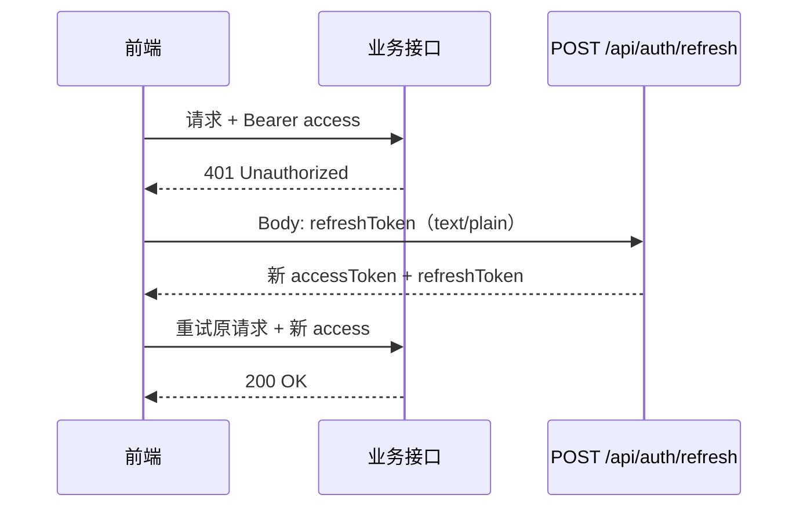
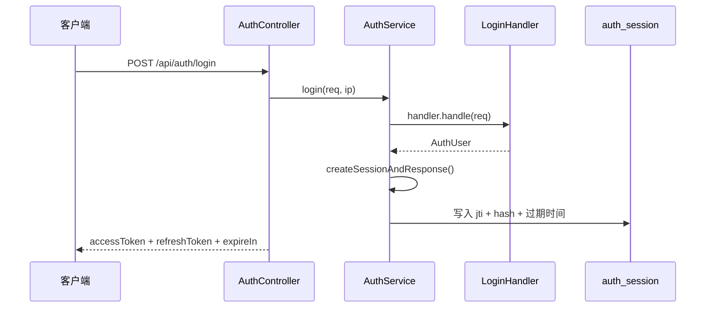

# JWT Access + Refresh 双令牌与会话轮换

> **项目**：smart_bookstore（智慧书城）  
> **文档类型**：学习文档 · 关联本仓库业务代码  
> **关联包 / 模块**：`com.zx.auth`  
> **建议前置**：[JWT-Refresh-Token 完整链路](./JWT-Refresh-Token完整链路.md)、[登录流程学习文档](./登录流程学习文档.md)

## 学习目标

1. 理解 Access / Refresh 职责划分与过期策略
2. 掌握 refresh 时会话轮换与吊销设计
3. 跟踪 Filter 解析 JWT 与会话校验流程

## 与本仓库的对应关系

| 路径 | 说明 |
| --- | --- |
| `src/main/java/com/zx/auth/service/JwtService.java` | 对照阅读 |
| `src/main/java/com/zx/auth/service/AuthService.java` | 对照阅读 |
| `src/main/java/com/zx/auth/entity/AuthSession.java` | 对照阅读 |
| `src/main/java/com/zx/auth/security/JwtAuthenticationFilter.java` | 对照阅读 |

读理论时请打开上表文件对照；改代码前先跑通 `docker compose up -d` 与 `local` profile。

---

## 导读
在做一个多登录方式的认证系统时，我陆续遇到这些问题：

- 单 Token 和双 Token 的 Access Token，时效是不是一回事？
- 双 Token 是不是就不会泄露了？
- `jti` 到底是什么？
- Refresh 怎么作废？
- `/api/auth/refresh` 到底什么时候才该调用？

本文把这些问题串成一条线，并结合 `smart_bookstore` 里的真实代码，讲清楚 **双 Token 登录的设计思路与实践要点**。

---

## 一、为什么不用「一个 Token 走到底」

前后端分离项目里，认证方案大致有三条路：

| 方案 | 做法 | 优点 | 痛点 |
|------|------|------|------|
| **Session + Cookie** | 服务端存会话，Cookie 带 SessionId | 成熟、易撤销 | 跨域麻烦，移动端不友好 |
| **单 JWT Token** | 只发一个 JWT，客户端长期保存 | 无状态、实现简单 | 难撤销、难踢人 |
| **双 Token** | Access 短期 + Refresh 长期 | 兼顾体验与安全 | 实现稍复杂 |

单 JWT 的两个典型问题：

1. **Token 一旦泄露，在过期前无法单方面作废**
2. **无法在服务端主动踢人、撤销登录**

因为 JWT 是自包含的：服务端验签通过就放行，除非维护黑名单，否则 **拿一张合法 Token 就能用到过期**。

---

## 二、双 Token 是什么

**双 Token = Access Token + Refresh Token**，各司其职：

| Token | 生命周期 | 用途 | 携带方式 |
|-------|----------|------|----------|
| **Access Token** | 短（15min～2h） | 访问受保护 API | 每次请求 `Authorization: Bearer ...` |
| **Refresh Token** | 长（7～30 天） | 仅用于换新 Access | 只在刷新接口使用 |

```text
         ┌─────────────┐
         │   客户端     │
         └──────┬──────┘
                │ Authorization: Bearer <accessToken>
                ▼
         ┌─────────────┐     access 过期      ┌─────────────┐
         │  业务 API    │ ◄────────────────── │  /refresh   │
         └─────────────┘   携带 refreshToken   └─────────────┘
                │                                    │
                │ 200 + 新 accessToken               │ 校验 session
                ▼                                    ▼
         ┌─────────────┐                      ┌─────────────┐
         │  继续访问    │                      │ auth_session │
         └─────────────┘                      └─────────────┘
```

**核心思想：**

- **Access 负责「安全」** — 短有效期，泄露窗口小
- **Refresh 负责「体验」** — 长期有效，避免频繁登录
- **Refresh 落库** — 服务端可控，能撤销

---

## 三、常见疑问：单 Token 1～2 小时，和 Access Token 不是差不多吗？

**是的，本质上一样。**

单 Token 若设 **1～2 小时**，和双 Token 里 Access Token 的 **1～2 小时**，在安全考量上是同一量级：都是让「访问凭证」尽快失效。

差别不在 Access 能设多长，而在 **过期之后怎么办**：

| | 单 Token（1～2h） | 双 Token（Access 1～2h） |
|--|-------------------|---------------------------|
| 过期后 | 用户必须 **重新登录** | 用 **Refresh Token** 静默换新 Access |
| 长期登录 | 只能把 Token 设很长（不安全） | Refresh 可以 7～30 天，Access 仍保持短 |

可以这么记：

```text
单 Token：  一张票既要安全（短）又要省事（长）→ 很难两全
双 Token：  Access 管安全 + Refresh 管体验
```

---

## 四、双 Token 也会泄露吗？

**会。双 Token 不是「不会泄露」，而是「泄露后的后果更可控」。**

| Token | 泄露后会怎样 | 能否撤销 |
|-------|--------------|----------|
| **Access Token** | 过期前（1～2h）可被冒充访问 API | 难（JWT 无状态），靠 **短过期** 缩小窗口 |
| **Refresh Token** | 过期前（7～30 天）可不断换新 Access | **能**，服务端撤销 session 即可 |

和单 Token 长 JWT 相比：

- 单 Token 设 7 天 → 泄露 = 7 天风险窗口，还很难作废
- 双 Token → Access 泄露最多 2 小时；Refresh 泄露虽危险，但 **可以登出、改密、踢下线**

**更准确的说法：**

- ❌ 双 Token 没有泄露问题
- ✅ Access 泄露仍有短期风险，靠 **短过期** 控制
- ✅ Refresh 泄露更危险，但靠 **服务端撤销** 控制

---

## 五、关键概念：jti 是什么

**jti = JWT ID**，JWT 标准声明之一，表示 **「这是哪一张 Token」** 的唯一标识。

| 声明 | 含义 | 类比 |
|------|------|------|
| `sub` | 属于谁（userId） | 姓名 |
| `exp` | 什么时候过期 | 有效期 |
| `jti` | 哪一张 Token | 身份证号 |

同一用户可以在手机、电脑各登录一次 → **同一个 `sub`，不同的 `jti`**。

### 在本项目中的用法

Refresh Token 格式为 `{jti}:{randomSecret}`：

```java
String jti = UUID.randomUUID().toString();
String refresh = jti + ":" + UUID.randomUUID();
```

登录时写入数据库：

```java
s.setRefreshTokenJti(jti);                    // 用来查找 session
s.setRefreshTokenHash(sha256Hex(refresh));     // 只存哈希，不存明文
```

**为什么需要 jti？**

- 撤销时：`WHERE refresh_token_jti = ?` 精确定位 session
- 刷新时：从 Refresh Token 解析 jti → 查库校验
- 审计时：关联「哪次登录、哪台设备」

---

## 六、Refresh 怎么作废

Refresh Token 发给客户端后是字符串，**没法远程把它「变无效」**。  
作废的本质是：**让服务端不再承认这条 session**。

### 6.1 核心手段：revoked_at

`auth_session` 表预留了 `revoked_at` 字段。刷新时会检查：

```java
if (s.getRevokedAt() != null) return null;
if (s.getRefreshExpiresAt().isBefore(LocalDateTime.now())) return null;
if (!s.getRefreshTokenHash().equals(sha256Hex(refreshToken))) return null;
```

只要 `revoked_at` 不为空，即使客户端还拿着 Refresh Token，也会返回 **2001 invalid or expired refresh token**。

```sql
UPDATE auth_session
SET revoked_at = NOW()
WHERE refresh_token_jti = '某个jti';
```

### 6.2 常见作废场景

| 场景 | 做法 |
|------|------|
| **用户登出（单设备）** | 当前 session 设 `revoked_at` |
| **改密码 / 安全事件** | 该用户所有 session 设 `revoked_at` |
| **Refresh Rotation** | 刷新时作废旧 jti，签发新 Refresh |
| **自然过期** | `refresh_expires_at` 到期，无需主动操作 |

### 6.3 一个重要细节

**撤销 Refresh ≠ 立刻让 Access 失效。**

Access 若在有效期内，仍可能被使用（直到过期）。因此：

- Access 必须 **短**（1～2h）
- 敏感操作可要求 **二次验证**
- 可选：Redis 黑名单存已撤销的 Access `jti`

---

## 七、/refresh 接口什么时候才该调用

这是最容易搞混的点：**refresh 不是登录接口，也不是每次请求都要调。**

### 7.1 调用时机

| 时机 | 是否调 refresh |
|------|----------------|
| 登录成功 | ❌ 用 login 返回的双 Token |
| access 有效，正常调业务 API | ❌ 只带 Access |
| 业务 API 返回 401（token expired） | ✅ |
| 打开 App，access 过期但 refresh 有效 | ✅ |
| 定时器发现 access 快过期 | ✅（可选，主动刷新） |
| refresh 返回 2001 | ❌ → 重新 login |
| 用户退出 | ❌ → logout |

### 7.2 典型流程



### 7.3 接口细节

```java
@PostMapping(value = "refresh", consumes = MediaType.TEXT_PLAIN_VALUE)
public ApiResponse<LoginResponse> refresh(@RequestBody String refreshToken) {
    var resp = authService.refresh(refreshToken.trim());
    if (resp == null) return ApiResponse.error(2001, "invalid or expired refresh token");
    return ApiResponse.ok(resp);
}
```

注意：

- **Content-Type：`text/plain`**
- **Body 直接是 Refresh 字符串**，不是 JSON
- **不需要带 Access Token**（已经过期了）

### 7.4 前端防并发刷新

多个请求同时 401 时，应 **只发一次 refresh**，其余请求排队等待：

```javascript
let isRefreshing = false;
let pendingQueue = [];

async function request(url, options) {
  options.headers = { ...options.headers, Authorization: `Bearer ${accessToken}` };
  let resp = await fetch(url, options);
  if (resp.status !== 401) return resp;

  if (!isRefreshing) {
    isRefreshing = true;
    try {
      const data = await refresh(refreshToken);
      accessToken = data.accessToken;
      pendingQueue.forEach(cb => cb(accessToken));
      pendingQueue = [];
    } catch {
      redirectToLogin();
      return resp;
    } finally {
      isRefreshing = false;
    }
  } else {
    await new Promise(resolve => pendingQueue.push(resolve));
  }

  options.headers.Authorization = `Bearer ${accessToken}`;
  return fetch(url, options);
}
```

---

## 八、项目中的完整登录链路

`smart_bookstore` 在多种登录方式（密码 / 邮箱验证码 / 手机验证码）之上，统一走双 Token 会话管理。

### 8.1 登录：签发双 Token



核心代码：

```java
private LoginResponse createSessionAndResponse(AuthUser user, boolean rememberMe) {
    String access = "access:" + UUID.randomUUID();
    String jti = UUID.randomUUID().toString();
    String refresh = jti + ":" + UUID.randomUUID();
    LocalDateTime now = LocalDateTime.now();
    LocalDateTime accessExp = now.plusHours(2);
    LocalDateTime refreshExp = now.plusDays(rememberMe ? 30 : 7);

    AuthSession s = new AuthSession();
    s.setUser(user);
    s.setRefreshTokenJti(jti);
    s.setRefreshTokenHash(sha256Hex(refresh));
    s.setAccessExpiresAt(accessExp);
    s.setRefreshExpiresAt(refreshExp);
    s.setRememberMe(rememberMe);
    sessionRepo.save(s);

    LoginResponse resp = new LoginResponse();
    resp.setAccessToken(access);
    resp.setRefreshToken(refresh);
    resp.setExpireIn(7200);
    resp.setUserInfo(new LoginResponse.UserInfo(user.getId(), user.getUsername()));
    return resp;
}
```

**时效策略：**

| 配置 | Access | Refresh |
|------|--------|---------|
| `rememberMe=false` | 2 小时 | 7 天 |
| `rememberMe=true` | 2 小时 | 30 天 |

### 8.2 刷新：校验 Refresh，换新 Access

```java
public LoginResponse refresh(String refreshToken) {
    String[] parts = refreshToken.split(":", 2);
    if (parts.length != 2) return null;

    String jti = parts[0];
    Optional<AuthSession> so = sessionRepo.findByRefreshTokenJti(jti);
    if (so.isEmpty()) return null;

    AuthSession s = so.get();
    if (s.getRevokedAt() != null) return null;
    if (s.getRefreshExpiresAt().isBefore(LocalDateTime.now())) return null;
    if (!s.getRefreshTokenHash().equals(sha256Hex(refreshToken))) return null;

    // 签发新 Access，Refresh 复用（Rotation 为后续增强项）
    String access = "access:" + UUID.randomUUID();
    LoginResponse resp = new LoginResponse();
    resp.setAccessToken(access);
    resp.setRefreshToken(refreshToken);
    resp.setExpireIn(7200);
    resp.setUserInfo(new LoginResponse.UserInfo(s.getUser().getId(), s.getUser().getUsername()));
    return resp;
}
```

### 8.3 时间轴示意

```text
|---- login ----|---- refresh ----|---- refresh ----| ... |---- refresh 失败 ----|
   拿双 token      access 过期续命     再次续命              refresh 7/30 天到期
                  ↑                    ↑
            每 ~2h 可能触发一次      不是每次请求都触发
```

---

## 九、当前实现与完整 JWT 链路的差距

项目已完成 **Refresh 服务端校验闭环**，Access 目前为演示占位符：

| 环节 | 现状 | 目标 |
|------|------|------|
| 登录签发双 Token | ✅ | — |
| Refresh 校验（jti + hash + 过期 + 撤销） | ✅ | — |
| Access 格式 | `access:UUID` 占位符 | 标准 JWT（HS256 签名） |
| 鉴权拦截器 | ❌ 待实现 | Bearer Token 校验 |
| 登出接口 | ❌ 待实现 | `POST /logout` + `revoked_at` |
| Refresh Rotation | ❌ 待实现 | 刷新生成新 Refresh，作废旧 jti |

演进路线详见 [JWT-Refresh-Token 完整链路](./JWT-Refresh-Token完整链路.md)。

---

## 十、安全实践 checklist

| 项 | 要求 |
|----|------|
| Refresh 存库 | 只存 **SHA-256 哈希**，不存明文 |
| Access 有效期 | 短（≤ 2h） |
| HTTPS | 生产环境必须 |
| Refresh 存储 | 优先 HttpOnly Cookie，避免 XSS 窃取 |
| 撤销能力 | `revoked_at` + 登出接口 |
| 防暴力刷新 | 对 `/refresh` 做 IP / 用户限流 |
| 用户禁用 | 登录 / 刷新 / 鉴权时检查 `auth_user.status` |

---

## 十一、面试常问速答

**1. 为什么用双 Token，不用单 Token？**  
Access 短期无状态校验高效；Refresh 长期有状态可撤销；兼顾安全与体验。

**2. 单 Token 1～2 小时和 Access Token 有什么区别？**  
时长思路一样；双 Token 多了 Refresh 静默续期，不用频繁登录。

**3. 双 Token 还会泄露吗？**  
会。Access 靠短过期控风险，Refresh 靠服务端撤销控风险。

**4. jti 是干什么的？**  
Token 的唯一 ID，用于查 session、撤销、防重放。

**5. Refresh 怎么作废？**  
数据库 `auth_session.revoked_at = NOW()`，刷新校验时拒绝。

**6. refresh 接口什么时候调？**  
Access 过期或即将过期时，不是登录时，也不是每次请求时。

**7. 撤销 Refresh 后 Access 还能用吗？**  
在 Access 过期前仍可能可用，所以 Access 必须设短。

---

## 十二、总结

```text
双 Token 登录 = Access（短、访问 API）+ Refresh（长、续期）+ Session 落库（可撤销）

记住四句话：
1. Access 和单 Token 一样要短（1～2h）
2. 双 Token 也会泄露，但 Refresh 可撤销
3. jti 是 Refresh 在服务端的主键
4. /refresh 只在 Access 失效时调用，不是每次请求都调
```

`smart_bookstore` 已在多登录方式之上搭好了双 Token 会话骨架。下一步接入真实 JWT、鉴权拦截器和登出接口，就是一条完整、能写进简历、能讲清设计的认证链路了。

---

## 相关文档

- [JWT-Refresh-Token 完整链路](./JWT-Refresh-Token完整链路.md) — 技术细节与演进清单  
- [接口文档](./接口文档.md) — login / refresh 请求响应格式  
- [工厂模式学习文档](./工厂模式学习文档.md) — 多登录方式架构  
- [大二项目规划指南](./大二项目规划指南.md) — 项目深化方向  
