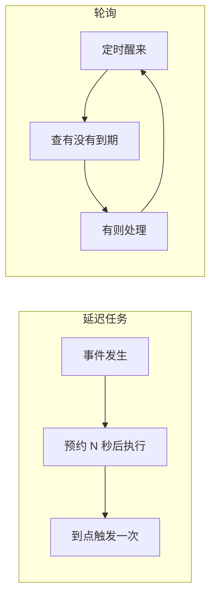

# 定时任务频率与延迟任务 / 轮询选型指南


> **项目**：smart_bookstore（智慧书城） · **文档类型**：学习文档  
> **关联**：`borrow.scheduler / trade MQ` — 调度选型  
> **索引**：[学习文档中心](./README.md)

> 适用项目：`smart_bookstore` 智慧书城  
> 典型场景：借阅逾期（ZSET + `@Scheduled`）、购书未支付取消（RabbitMQ 延迟消息）、预约爽约（待扩展）  
> 关联文档：[借阅逾期四种实现思路对比](./借阅逾期四种实现思路对比.md) · [RabbitMQ使用指南学习文档](./RabbitMQ使用指南学习文档.md) · [书城系统分阶段实施指南](./书城系统分阶段实施指南.md)

---

## 写在前面

业务里常遇到一类问题：**某件事要在未来某个时间点发生**（订单超时取消、借阅到期标记逾期、预约结束自动完成等）。

实现方式通常两类：

| 模式 | 代表 |
|------|------|
| **延迟任务** | 事件发生时预约一次执行（RabbitMQ `x-delayed-message`、Redis 键 TTL + 回调等） |
| **轮询** | 定时醒来查「有没有到期的」（`@Scheduled` + SQL / Redis ZSET） |

本文说明：**Scheduled 任务频率怎么设**、**两种模式怎么选**，并结合本项目已有实现举例。

---

## 一、Scheduled 任务频率怎么设？

### 1.1 核心原则：频率 ≤ 业务容忍误差

先问：**晚处理一会儿，业务能不能接受？**

| 业务场景 | 典型容忍误差 | 建议频率 |
|----------|--------------|----------|
| 借阅逾期标记 | 1～5 分钟 | `poll-interval-ms: 60000`～`300000` |
| 未支付订单取消 | 秒～分钟级 | 延迟 MQ 精确触发，或 30s～1min 轮询 |
| 借阅申请超时未取（APPLIED→CANCELLED） | 小时级 | 每小时或每 30 分钟 |
| 预约时段结束 / 爽约 | 分钟级 | 1～5 分钟 |
| 报表、对账 | 小时～天级 | 每小时 / 每天凌晨 |
| 缓存预热、统计 | 不敏感 | 5～30 分钟 |

**不要**把频率设得比业务需要的精度更高：越快 = 空跑越多、DB/Redis 压力越大，收益却有限。

---

### 1.2 用「批次 + 频率」估算能否消化峰值

本项目借阅逾期配置（`application.yaml`）：

```yaml
bookstore:
  borrow:
    overdue:
      enabled: true
      poll-interval-ms: 60000   # 每次 tick 间隔 60 秒（fixedDelay）
      batch-size: 100           # Lua / SQL 每批最多 100 条
```

**单次 tick 的处理能力**（当前实现每 tick 只 Lua pop 一次）：

```text
吞吐 ≈ batchSize / pollInterval
默认：100 条 / 60 秒 ≈ 100 条/分钟
```

若某时刻 **500 条同时到期**：

- 仅靠 Lua pop：约 5 个 tick ≈ **5 分钟** 处理完（fixedDelay 从上次结束计时）
- 对账 SQL `reconcileOverdueBatch` 可在同一 tick 内多批消化部分 backlog

**估算公式**：

```text
pollInterval ≤ 可接受最大延迟 / ceil(峰值条数 / batchSize)
```

**示例**：要求 2 分钟内处理完 500 条、batchSize=100  
→ 至少需要 5 批 → `pollInterval` 约 ≤ 24 秒，或 **同一 tick 内循环 pop 直到为空**。

---

### 1.3 为什么需要 batchSize（批次大小）？

`BorrowOverdueScheduler` 与 Lua 脚本 `borrow_due_pop.lua` 均使用 `batch-size` 限制单次处理量：

| 原因 | 说明 |
|------|------|
| Redis Lua 阻塞 | Lua 执行期间 Redis 单线程阻塞；一次 pop 上万条会卡顿 |
| 定时任务耗时 | N 条 = N 次 DB UPDATE，过长会拖住 Scheduler 线程 |
| 削峰 | 大量 `due_at` 相同时，分批摊平 |
| 失败隔离 | 单批失败影响面小 |

详见 [借阅逾期四种实现思路对比](./借阅逾期四种实现思路对比.md) 方案四章节。

---

### 1.4 fixedDelay vs fixedRate

| 类型 | 行为 | 推荐 |
|------|------|------|
| **fixedDelay** | 上次执行 **结束后** 再等待 N 毫秒 | ✅ 本项目 `BorrowOverdueScheduler` 使用 |
| **fixedRate** | 每 N 毫秒触发一次，不管上次是否跑完 | 易任务堆叠，慎用 |

```java
@Scheduled(fixedDelayString = "${bookstore.borrow.overdue.poll-interval-ms:60000}")
public void processOverdue() { ... }
```

若单次处理 30 秒、fixedDelay=60s → 实际约每 90 秒一轮；fixedRate=60s 则可能重叠执行。

---

### 1.5 环境与参数建议

| 环境 | poll-interval-ms | batch-size | 说明 |
|------|------------------|------------|------|
| 本地联调 | `10000`（10 秒） | 50～100 | 配合手动改 `due_at` 到过去 |
| 生产 / 答辩 | `60000`～`300000` | 100 | 借阅量小，1～5 分钟足够 |
| 压测 / 大量到期 | `30000` | 200 | 或 tick 内循环 pop |

其他实践：

- 参数放 `application.yaml`，支持环境变量覆盖
- 提供 `enabled: false` 开关（本项目已支持）
- 多个 Scheduler **错峰** cron，避免整点同时打 DB
- 日志记录每批 `marked` / `reconciled` 条数与耗时，便于调参

---

## 二、延迟任务 vs 轮询：两种触发模型



### 2.1 对比总表

| 维度 | 延迟任务（MQ / 延迟队列） | 轮询（@Scheduled / ZSET + Scheduler） |
|------|---------------------------|--------------------------------------|
| **触发精度** | 单事件较精确（秒级） | 取决于间隔（常见分钟级） |
| **延迟时长** | 短延迟（分钟）合适；**长延迟（30 天）** 需评估 Broker | 长短均可，只判断「是否到期」 |
| **实现复杂度** | MQ、延迟插件、DLQ、消费幂等 | Scheduler + SQL / Redis 即可 |
| **空闲时资源** | 无到期事件则不消费 | 定时空跑（ZSET 可减轻无效 SQL） |
| **批量同时到期** | 每单一条消息，量大时消息多 | 一次批量取，天然适合 |
| **改期（续借）** | 难（需取消/替换已发消息） | 易（改 `due_at` + ZADD 覆盖） |
| **多实例** | Consumer 竞争 + 业务幂等 | Lua 原子 pop / 条件 UPDATE |
| **故障恢复** | 死信队列 + 定时对账 | 下次轮询 + SQL 对账兜底 |

---

### 2.2 决策树

```text
需要秒级精确触发？
  └─ 是 → 倾向延迟 MQ（如未支付 15 分钟取消）

延迟是「每单不同、且很长」（如 30 天）？
  └─ 是 → 倾向轮询 / ZSET；慎用长延迟 MQ

大量订单会在同一时刻到期？
  └─ 是 → 倾向轮询 + 批量（ZSET / 条件 UPDATE）

到期后要触发很多下游（通知、罚息、审计）？
  └─ 是 → 延迟 MQ，或「轮询发现 + 发 MQ 异步」

只是改个状态、量不大、要求简单？
  └─ 是 → @Scheduled + 条件 UPDATE 最省事

已有 MQ 且希望技术栈统一（短延迟场景）？
  └─ 是 → 可优先延迟 MQ
```

---

## 三、本项目两个典型案例

### 3.1 购书未支付取消 → 延迟 MQ ✅

**实现**：`TradeMqProducer` + `x-delayed-message` + `TradeOrderTimeoutConsumer`

```yaml
bookstore:
  trade:
    unpaid-cancel-delay-minutes: 15
    # unpaid-cancel-delay-ms: 60000  # 联调可改为 1 分钟
```

**流程**：

```text
创建订单 → 发 delay=15min 的消息 → 到点 Consumer 取消订单
```

**为何选延迟任务**：

| 因素 | 说明 |
|------|------|
| 延迟固定、较短 | 15 分钟，Broker 友好 |
| 需要相对精确 | 超时后应尽快释放库存 |
| 每单一条消息 | 量级可控 |
| 基础设施已有 | 与秒杀 MQ 同一套 RabbitMQ |

---

### 3.2 借阅逾期 → ZSET + 轮询 ✅

**实现**：`BorrowDueRedisService` + `borrow_due_pop.lua` + `BorrowOverdueScheduler`

```yaml
bookstore:
  borrow:
    overdue:
      enabled: true
      poll-interval-ms: 60000
      batch-size: 100
```

**流程**：

```text
confirm → ZADD(due_at)
Scheduler 每 60s → Lua 原子 pop → UPDATE OVERDUE
         └─ reconcileOverdueBatch SQL 对账兜底
return → ZREM
```

**为何选轮询（+ ZSET）**：

| 因素 | 说明 |
|------|------|
| 延迟长且每单不同 | 如 30 天，不宜每单占一条长延迟 MQ |
| 精度要求低 | 分钟级标记 OVERDUE 即可 |
| 可能批量到期 | 同一批 confirm 的 `due_at` 接近 |
| 续借改期 | ZADD 覆盖 score 即可 |
| 多实例 | Lua 原子 pop 避免重复领任务 |

若强行用延迟 MQ：30 天 × 大量借阅 = 消息长期堆积、续借难撤消息、Broker 长延迟可靠性需单独验证。

---

### 3.3 对比小结

| 模块 | 选型 | 延迟特征 | 精度 |
|------|------|----------|------|
| 购书超时取消 | 延迟 MQ | 固定 15 分钟 | 较高 |
| 借阅逾期 | ZSET + 轮询 | 每单不同，天级 | 分钟级 |
| 借阅 APPLIED 超时未取（规划） | 定时 SQL | 固定 48 小时 | 小时级 |
| 预约爽约（规划） | 定时 SQL | 时段相关 | 分钟级 |

**结论**：两个模块选型不同，是 **按场景匹配**，不是随意混搭。

---

## 四、BorrowOverdueScheduler 逻辑速览

便于理解「轮询 + ZSET」如何与频率配置配合：

```java
@Scheduled(fixedDelayString = "${bookstore.borrow.overdue.poll-interval-ms:60000}")
public void processOverdue() {
    // 1. Lua：原子弹出 score <= now 的 orderId（最多 batchSize 条）
    List<Long> orderIds = borrowDueRedisService.popDueOrderIds(nowEpoch, batchSize);

    // 2. 同步 DB：BORROWED → OVERDUE（条件 UPDATE，幂等）
    for (Long orderId : orderIds) {
        borrowOrderRepository.updateToOverdue(orderId);
    }

    // 3. SQL 对账：ZADD 失败 / 历史数据未入 ZSET 的补漏
    reconcileOverdueBatch(batchSize);
}
```

| 步骤 | 作用 |
|------|------|
| Lua pop | 多实例下原子领任务，避免重复读 ZSET |
| 同步 UPDATE | 不依赖 MQ，借还闭环内完成状态变更 |
| reconcile | Redis 与 MySQL 不一致时的兜底 |

---

## 五、常见组合模式（生产实践）

| 模式 | 组成 | 适用 |
|------|------|------|
| **纯轮询** | `@Scheduled` + 条件 SQL | 小项目、只改状态 |
| **纯延迟 MQ** | 创建时发延迟消息 | 短延迟、单事件、高精度 |
| **ZSET + 轮询 + SQL 对账** | 本项目借阅逾期 | 长延迟、批量到期、要防多实例 |
| **延迟 MQ + 定时对账** | MQ 主路径 + 每日 SQL 补漏 | 对可靠性要求高 |
| **轮询 + 发 MQ** | Scheduler 只负责发现，通知走 MQ | 状态同步与通知解耦 |

---

## 六、选型速查表

| 你的需求 | 推荐 |
|----------|------|
| 15 分钟未支付取消 | **延迟 MQ**（已实现） |
| 30 天借阅逾期 | **ZSET + 轮询（1～5 分钟）**（已实现） |
| 只展示「是否逾期」、不改库 | **查询懒判断**，无需 Scheduler |
| 毕设求最简单 | **定时 SQL 条件 UPDATE**，无需 ZSET |
| 到期要发短信 / 站内信 | 在 OVERDUE 后 **同步或异步发 MQ**（规划 topic `borrow.overdue`） |
| 秒级触发 + 已有 MQ | 短延迟用 MQ；长延迟用轮询 |

---

## 七、面试 / 答辩参考话术

> 定时任务频率不是越快越好，而是看业务容忍误差。我们用 `fixedDelay` 避免任务堆叠，用 `batchSize` 控制单次 Redis Lua 和 DB 压力。  
>  
> 延迟任务适合「事件发生时就知道何时触发、延迟较短」的场景，比如购书 15 分钟未支付取消，用 RabbitMQ 延迟交换机精确触发。  
>  
> 轮询适合「到期时间分散、延迟很长、可能批量到期」的场景，比如借阅 30 天逾期，用 Redis ZSET 索引 + Scheduler 每分钟 pop，同步 UPDATE MySQL，并用 SQL 对账兜底。  
>  
> 两者可以组合：主路径 + 对账，保证最终一致。

---

## 八、相关链接

| 资源 | 路径 |
|------|------|
| 借阅逾期四种方案对比 | [借阅逾期四种实现思路对比.md](./借阅逾期四种实现思路对比.md) |
| 购书超时 MQ | `TradeMqProducer` · `TradeOrderTimeoutConsumer` |
| 借阅逾期 Scheduler | `BorrowOverdueScheduler` · `BorrowDueRedisService` |
| Lua 脚本 | `src/main/resources/lua/borrow_due_pop.lua` |
| 配置项 | `application.yaml` → `bookstore.borrow.overdue` / `bookstore.trade` |
| MQ 概念 | [RabbitMQ使用指南学习文档.md](./RabbitMQ使用指南学习文档.md) |
| 分阶段规划 | [书城系统分阶段实施指南.md](./书城系统分阶段实施指南.md) |
