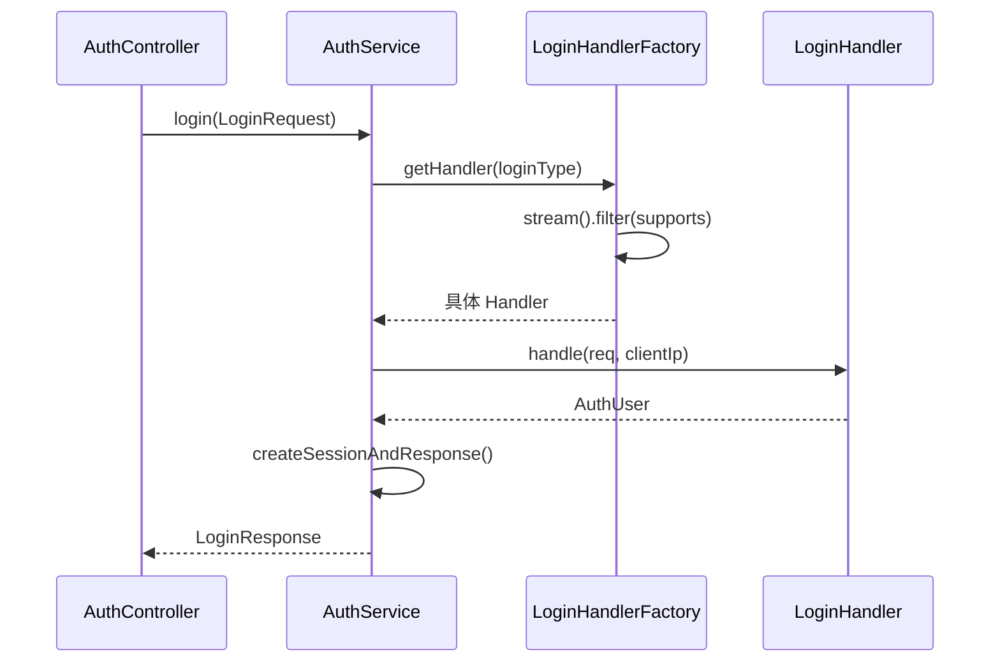

# 用 Spring Boot 实战工厂模式：一个多登录方式认证系统的设计思路

> 项目仓库：`Factory_Test_Demo`  
> 技术栈：Spring Boot 4.1 · Java 21 · MyBatis-Plus · MySQL  
> 核心设计：工厂模式 + 策略模式

---

## 一、为什么需要工厂模式？

在认证系统中，「登录」和「发验证码」往往不是单一流程，而是多种方式并存：

| loginType       | 说明           |
|-----------------|----------------|
| `password`      | 账号密码登录   |
| `qq_email_code` | 邮箱验证码登录 |
| `phone_code`    | 手机验证码登录 |

如果把这些逻辑全部堆在一个 `AuthService` 里，用 `if-else` / `switch` 分支处理，很快会遇到这些问题：

1. **违反开闭原则**：每新增一种登录方式，都要改核心服务类
2. **职责不清**：发码、验码、查用户、建会话混在一起
3. **难以测试**：一个方法里分支太多，单元测试成本高
4. **协作冲突**：多人同时改同一个大类，合并冲突频繁

`Factory_Test_Demo` 的解法是：**把每种登录/发码逻辑拆成独立 Handler，再用 Factory 按 `loginType` 选择具体实现。**

---

## 二、整体架构：工厂 + 策略

这个项目并不是教科书里那种「`new ProductA()` / `new ProductB()`」的简单工厂，而是更贴近工程实践的 **Spring 注册式工厂**：

```text
Controller
    ↓
AuthService（统一入口，不关心具体实现）
    ↓
LoginHandlerFactory / SendCodeHandlerFactory（工厂：按类型选对象）
    ↓
LoginHandler / SendCodeHandler（策略接口）
    ↓
PasswordLoginHandler / EmailCodeLoginHandler / PhoneCodeLoginHandler ...
```

用 Mermaid 表示调用链：



这里有两个设计模式在配合：

- **策略模式（Strategy）**：`LoginHandler` 定义统一行为 `handle()`，不同登录方式各自实现
- **工厂模式（Factory）**：`LoginHandlerFactory` 负责「创建/选择」合适的策略对象

---

## 三、策略接口：统一行为，隔离变化

登录侧的策略接口非常简洁：

```java
public interface LoginHandler {
    /** 是否支持该 loginType */
    boolean supports(String loginType);

    /** 执行登录，成功返回用户，失败返回 null */
    AuthUser handle(LoginRequest req, String clientIp);
}
```

发验证码侧同理：

```java
public interface SendCodeHandler {
    boolean supports(String loginType);
    Map<String, Object> handle(SendCodeRequest req, String clientIp);
}
```

关键点在于：

- 上层只依赖接口，不依赖具体实现
- `supports()` 让每个实现自己声明「我处理哪种类型」
- `handle()` 封装完整业务，Factory 和 Service 都不需要知道细节

---

## 四、具体策略：一种登录方式，一个类

### 4.1 密码登录

```java
@Component
@RequiredArgsConstructor
public class PasswordLoginHandler implements LoginHandler {

    private final AuthUserRepository userRepo;

    @Override
    public boolean supports(String loginType) {
        return "password".equals(loginType);
    }

    @Override
    public AuthUser handle(LoginRequest req, String clientIp) {
        if (req.getAccount() == null || req.getPassword() == null) return null;
        Optional<AuthUser> uo = userRepo.findByUsername(req.getAccount());
        if (uo.isEmpty()) return null;
        AuthUser u = uo.get();
        if (u.getPasswordHash() == null) return null;
        if (!u.getPasswordHash().equals(AuthService.sha256Hex(req.getPassword()))) return null;
        return u;
    }
}
```

### 4.2 邮箱验证码登录

```java
@Component
@RequiredArgsConstructor
public class EmailCodeLoginHandler implements LoginHandler {

    @Override
    public boolean supports(String loginType) {
        return "qq_email_code".equals(loginType);
    }

    @Override
    public AuthUser handle(LoginRequest req, String clientIp) {
        // 1. 查有效验证码
        // 2. 校验 codeHash
        // 3. 标记验证码已使用
        // 4. 查找或自动注册用户
        // ...
    }
}
```

### 4.3 手机验证码登录

`PhoneCodeLoginHandler` 与邮箱版结构几乎一致，只是 `identityType` 和 `loginType` 不同。  
这正是策略模式的价值：**相似流程可以复制模板，互不影响。**

---

## 五、工厂类：Spring 帮你完成「注册表」

项目里的工厂实现非常精炼：

```java
@Component
@RequiredArgsConstructor
public class LoginHandlerFactory {
    private final List<LoginHandler> handlers;

    public LoginHandler getHandler(String loginType) {
        return handlers.stream()
                .filter(h -> h.supports(loginType))
                .findFirst()
                .orElseThrow(() -> new IllegalArgumentException("unsupported loginType"));
    }
}
```

`SendCodeHandlerFactory` 写法完全一致。

### 这里最值得学习的点

传统工厂模式需要手写：

```java
Map<String, LoginHandler> map = new HashMap<>();
map.put("password", new PasswordLoginHandler());
map.put("qq_email_code", new EmailCodeLoginHandler());
// 每加一个就要改工厂...
```

而 Spring 提供了更优雅的方式：

1. 所有 Handler 标注 `@Component`
2. 工厂注入 `List<LoginHandler>`
3. Spring 自动把所有实现收集进 List
4. 新增 Handler 时 **只加类，不改工厂**

这是一种 **「自动注册式工厂」**，在 Spring 项目里非常常见，也常被称作 *Factory + Strategy + DI* 组合。

---

## 六、业务入口：Service 层保持干净

`AuthService` 不再关心具体登录逻辑，只做编排：

```java
@Service
@RequiredArgsConstructor
public class AuthService {

    private final LoginHandlerFactory handlerFactory;
    private final SendCodeHandlerFactory sendCodeHandlerFactory;

    public Map<String, Object> sendCode(SendCodeRequest req, String clientIp) {
        var handler = sendCodeHandlerFactory.getHandler(req.getLoginType());
        return handler.handle(req, clientIp);
    }

    public LoginResponse login(LoginRequest req, String clientIp) {
        String type = req.getLoginType();
        if (type == null) throw new IllegalArgumentException("loginType required");

        var handler = handlerFactory.getHandler(type);
        AuthUser user = handler.handle(req, clientIp);
        if (user == null) return null;

        return createSessionAndResponse(user, req.getRememberMe());
    }
}
```

注意职责划分：

| 层级 | 职责 |
|------|------|
| `AuthController` | 接收 HTTP 请求、返回统一响应 |
| `AuthService` | 流程编排（选 Handler → 登录 → 建 Session） |
| `XxxHandlerFactory` | 按类型选择实现 |
| `XxxHandler` | 具体业务逻辑 |
| Repository | 数据访问 |

Session 创建、Token 刷新等「与登录方式无关」的逻辑，统一留在 `AuthService`，避免每个 Handler 重复实现。

---

## 七、对比：不用工厂模式会怎样？

### ❌ 反例：巨型 if-else

```java
public LoginResponse login(LoginRequest req) {
    if ("password".equals(req.getLoginType())) {
        // 50 行密码登录逻辑
    } else if ("qq_email_code".equals(req.getLoginType())) {
        // 60 行邮箱验证码逻辑
    } else if ("phone_code".equals(req.getLoginType())) {
        // 60 行手机验证码逻辑
    } else {
        throw new IllegalArgumentException("unsupported loginType");
    }
    // 再统一建 session...
}
```

问题显而易见：类越来越长，改邮箱逻辑可能误伤密码登录。

### ✅ 正例：当前项目结构

```text
auth/service/
├── AuthService.java
├── login/
│   ├── LoginHandler.java
│   ├── LoginHandlerFactory.java
│   ├── PasswordLoginHandler.java
│   ├── EmailCodeLoginHandler.java
│   └── PhoneCodeLoginHandler.java
└── sendcode/
    ├── SendCodeHandler.java
    ├── SendCodeHandlerFactory.java
    ├── EmailSendCodeHandler.java
    └── PhoneSendCodeHandler.java
```

每个文件职责单一，阅读和维护成本都更低。

---

## 八、如何扩展：新增「微信扫码登录」

假设要新增 `wechat_scan` 登录，步骤如下：

**Step 1：新增 Handler**

```java
@Component
@RequiredArgsConstructor
public class WechatScanLoginHandler implements LoginHandler {

    @Override
    public boolean supports(String loginType) {
        return "wechat_scan".equals(loginType);
    }

    @Override
    public AuthUser handle(LoginRequest req, String clientIp) {
        // 微信扫码登录逻辑
        return user;
    }
}
```

**Step 2：无需修改 Factory**

Spring 会自动把它加入 `List<LoginHandler>`。

**Step 3：Controller / Service 无需改动**

前端传 `loginType=wechat_scan` 即可走新逻辑。

这就是 **开闭原则（对扩展开放，对修改关闭）** 的实际体现。

---

## 九、项目中的演进痕迹：从通用 Handler 到专用 Handler

项目中还保留了一个已废弃的 `CodeLoginHandler`：

```java
@Override
public boolean supports(String loginType) {
    // 通用 Handler 已被专用 Handler 替代
    return false;
}
```

这说明设计经历过一次演进：

1. 最初：一个 `CodeLoginHandler` 处理所有验证码登录
2. 后来：邮箱、手机逻辑分化，拆成 `EmailCodeLoginHandler` 和 `PhoneCodeLoginHandler`
3. 旧类保留但 `supports()` 返回 `false`，避免误用

这是真实项目里常见的重构路径：**先抽象，再拆分，而不是一开始过度设计。**

---

## 十、工厂模式的适用场景与边界

### 适合使用的场景

- 同一接口有多种实现，运行时按参数选择
- 新增类型频繁，希望少改核心代码
- 各类实现依赖不同外部资源（邮件服务、短信网关、第三方 OAuth）

### 不必使用的场景

- 只有 1～2 种固定分支，且几乎不会扩展
- 逻辑极短，拆类反而增加跳转成本

本项目有 3 种登录 + 2 种发码，且未来很可能继续扩展 OAuth、扫码等，**使用工厂模式是合理选择。**

---

## 十一、测试建议

得益于策略拆分，可以对每个 Handler 单独测试：

```java
@Test
void passwordLogin_success() {
    when(userRepo.findByUsername("admin")).thenReturn(Optional.of(user));
    AuthUser result = handler.handle(request, "127.0.0.1");
    assertNotNull(result);
}

@Test
void passwordLogin_wrongPassword() {
    when(userRepo.findByUsername("admin")).thenReturn(Optional.of(user));
    request.setPassword("wrong");
    assertNull(handler.handle(request, "127.0.0.1"));
}
```

Factory 也可以单独测：

```java
@Test
void factory_shouldReturnEmailHandler() {
    LoginHandler handler = factory.getHandler("qq_email_code");
    assertTrue(handler instanceof EmailCodeLoginHandler);
}
```

---

## 十二、总结

`Factory_Test_Demo` 用一个真实的认证模块展示了工厂模式在 Spring Boot 中的最佳实践：

1. **策略接口**定义统一行为（`LoginHandler` / `SendCodeHandler`）
2. **具体实现类**封装每种登录/发码逻辑
3. **工厂类**按 `loginType` 选择实现
4. **Spring DI** 自动注册所有 Handler，新增实现零侵入
5. **Service 层**只做流程编排，保持简洁

工厂模式的价值，不在于背出 UML 图，而在于：**当业务变化来临时，你可以只改一个类，而不是在 300 行的 `if-else` 里找 bug。**

---

## 附录：相关 API 速查

| 接口 | 方法 | 说明 |
|------|------|------|
| `/api/auth/code/send` | POST | 发送验证码 |
| `/api/auth/login` | POST | 登录 |
| `/api/auth/refresh` | POST | 刷新 Token |

请求示例：

```json
{
  "loginType": "qq_email_code",
  "target": "user@qq.com",
  "code": "123456",
  "rememberMe": true
}
```

---

> 相关文档：[接口文档](./接口文档.md) · [前后端联调文档](./前后端联调文档.md)
