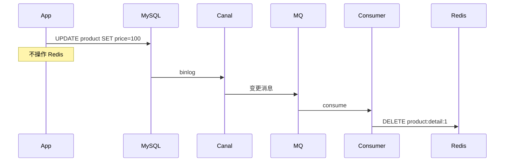

# 数据库与缓存高一致性：六种写路径实现方案


> **项目**：smart_bookstore（智慧书城） · **文档类型**：学习文档  
> **关联**：`bookstore.catalog / cache` — 一致性格局  
> **索引**：[学习文档中心](./README.md)

> 适用场景：MySQL + Redis · Java / 任意后端 · 读多写少详情、商品、用户信息等  
> 本文聚焦 **写路径**：DB 更新后，如何让 Redis 不长期返回旧值。六种方案由简到繁，每种均给出 **正确做法、典型错误、适用边界**。  
> 读路径（Cache-Aside、互斥锁、逻辑过期）见 [Redis缓存查询三种方案学习文档.md](./Redis缓存查询三种方案学习文档.md)。

---

## 写在前面

### 什么是「高一致」

缓存场景里 **很少做到分布式强一致**。更现实的目标是：

> **MySQL 是权威数据源；更新 DB 后，缓存不应长期返回旧值；关键业务（改价、下架、库存）不能出现可持续的脏读。**

### 两个不同的问题

| 问题 | 含义 | 本文是否覆盖 |
|------|------|--------------|
| **DB 与缓存一致** | 改 DB 后缓存何时同步 | ✅ 本文重点 |
| **并发写正确** | 两人抢同一库存只能一人成功 | ❌ 靠 DB 锁/乐观锁，与缓存策略无关 |

### 重要前提：`@Transactional` 只管 DB

```java
@Transactional
public void updateProduct(Long id, ...) {
    productMapper.update(...);   // ✅ 在事务内，失败会回滚
    redisTemplate.delete(key);   // ❌ 不在事务内，失败不会回滚 DB
}
```

Redis、MQ、HTTP **不会** 随 MySQL 事务一起回滚。所有方案都要假设：**DB 可能已成功，缓存操作可能失败**，需要补偿或兜底 TTL。

---

## 一、六种方案总览

| 方案 | 写路径概要 | 一致性 | 复杂度 | 典型场景 |
|------|------------|--------|--------|----------|
| **A 先写 DB 再删缓存** | UPDATE → DELETE | 准强一致 | ⭐ 低 | 默认首选 |
| **B 先写 DB 再更新缓存** | UPDATE → SET 新值 | 准强一致 | ⭐⭐ 中 | 改完立刻海量读 |
| **C 延迟双删** | A + 异步二次 DELETE | 准强一致 | ⭐⭐ 中 | 高并发同 key 读写 |
| **D 版本号（写侧 CAS）** | UPDATE version++ → 条件 SET | 准强一致 | ⭐⭐⭐ 中高 | 多写源、防旧值覆盖 |
| **E Binlog / MQ 异步失效** | 只写 DB，Canal 驱动删缓存 | 最终一致 | ⭐⭐⭐⭐ 高 | 多服务写同表 |
| **F 分布式事务** | 2PC / Seata 绑 DB+Redis | 理论强 | ⭐⭐⭐⭐⭐ 很高 | **一般不推荐** |

---

## 二、方案 A：先写 DB，再删缓存（Write-Invalidate）

### 2.1 流程

```text
1. UPDATE / INSERT MySQL（必要时 @Transactional）
2. COMMIT
3. DELETE redis:product:detail:{id}
4. 读请求 miss 时再查 DB 并 SET 回填（Cache-Aside）
```

### 2.2 正确示例

```java
@Transactional
public ProductDTO updateProduct(Long id, UpdateRequest req) {
    Product product = loadAndApply(id, req);
    productMapper.updateById(product);
    // 事务提交后再删缓存更稳（见 2.4）
    redisTemplate.delete("product:detail:" + id);
    return toDTO(product);
}
```

### 2.3 为什么默认用「删」而不是「直接更新缓存」

| 删缓存（evict） | 直接更新缓存（put） |
|-----------------|---------------------|
| 写路径只 DELETE，简单 | 要写完整 DTO、设 TTL |
| 回填逻辑只在读路径维护一处 | 写、读两套组装易不一致 |
| 新建/冷门数据不必预热 | 可能写入无人读的 key |
| 一个实体多个缓存 key 时好维护 | 漏更新某个 list key 会脏 |

**删缓存不是比 put 更安全**；两者在 Redis 失败时都可能脏读。删缓存胜在 **简单、懒加载**。

### 2.4 典型错误案例

#### 错误 1：先删缓存，再写 DB

```java
// ❌ 错误顺序
redisTemplate.delete(key);
productMapper.update(...);
```

```text
T1: 删缓存
T2: 读线程 miss → 查 DB（仍是旧值）→ 把旧值写回 Redis
T3: 写 DB 完成
结果：Redis 长期是旧值，直到 TTL 过期
```

**正确**：**先写 DB 并提交，再删缓存**。

---

#### 错误 2：以为 `@Transactional` 能回滚 Redis

```java
@Transactional
public void update(...) {
    productMapper.update(...);
    redisTemplate.delete(key);  // 若这里抛异常
}
// DB 已提交？取决于异常发生在 commit 前还是后
// Redis 删失败 → DB 不会回滚
```

**正确**：Redis 操作失败要 **日志 + 重试 + 告警**；或依赖 **短 TTL** 兜底。

---

#### 错误 3：更新多个相关 key 只删了一个

```java
// ❌ 只删详情，列表缓存仍是旧数据
redisTemplate.delete("product:detail:" + id);
// product:list:category:5 仍包含旧价格
```

**正确**：梳理所有衍生 key，按前缀删或列表用短 TTL。

---

### 2.5 仍存在的极小脏读窗口

```text
T1: 线程 A UPDATE DB 成功（新价 100）
T2: 线程 A 尚未 DELETE
T3: 线程 B 读 miss → 若读到未提交或只读从库延迟 → 拿到旧价 80 → SET 回 Redis
T4: 线程 A DELETE
T5: 若 T3 在 T4 之后完成 SET → Redis 又是 80
```

**缓解**：方案 C（延迟双删）或方案 D（version 写侧 CAS）。

---

## 三、方案 B：先写 DB，再更新缓存（Write-Through）

### 3.1 流程

```text
1. UPDATE MySQL
2. SET redis:product:detail:{id} = 新 JSON（带 TTL）
3. 后续读直接 hit，无 miss 窗口
```

### 3.2 正确示例

```java
@Transactional
public ProductDTO updateProduct(Long id, UpdateRequest req) {
    Product product = loadAndApply(id, req);
    productMapper.updateById(product);
    ProductDTO dto = toDTO(product);
    redisTemplate.opsForValue().set(
            "product:detail:" + id,
            JSON.toJSONString(dto),
            Duration.ofMinutes(30));
    return dto;
}
```

### 3.3 与方案 A 的对比

| 维度 | A 删缓存 | B 更新缓存 |
|------|----------|------------|
| 更新后第一次读 | miss，多一次 DB | 直接 hit ✅ |
| 写路径复杂度 | 低 | 中（需拼完整 DTO） |
| DB 成功 + Redis 失败 | 旧缓存仍在 → 脏读 | 旧缓存仍在 → 脏读 |
| DB 失败 + Redis 成功 | 不会发生（先 DB） | 若顺序错了才会 |

### 3.4 典型错误案例

#### 错误 1：DB 与 Redis 组装逻辑不一致

```java
// 读路径：join 分类表、过滤下架商品
// 写路径：只 put 了 product 表字段，缺少 categoryName
redisTemplate.set(key, simpleProductJson);  // ❌ 缺字段
```

**正确**：写路径 **复用同一套** `toDTO()` / 组装方法。

---

#### 错误 2：认为 put 一定比 evict 更安全

```text
Redis SET 失败 → 旧缓存仍在 → 用户仍看到旧价
```

**正确**：put 解决的是 **miss 窗口**，不解决 **Redis 失败**；失败仍需重试或改 evict。

---

#### 错误 3：在事务未提交时 put

```java
@Transactional
public void update(...) {
    productMapper.update(...);
    redisTemplate.set(key, newJson);  // ❌ 事务可能回滚，缓存已是新值
}
```

**正确**：在 **`afterCommit` 回调** 里再 SET Redis，或先 commit 再操作缓存。

---

## 四、方案 C：延迟双删（Delayed Double Delete）

### 4.1 解决什么问题

方案 A 在 **高并发** 下，仍可能出现「旧值被读线程写回 Redis」（见 2.5）。  
延迟双删：在一段时间后 **再删一次**，清掉被误写回的脏缓存。

### 4.2 流程

```text
1. DELETE cache（第一次，可选，见注）
2. UPDATE DB
3. COMMIT
4. 提交异步任务：延迟 N ms（如 500ms）
5. DELETE cache（第二次）
6. 接口立即返回，不 sleep
```

> **注**：业界有两种顺序：「先删再写 DB」或「先写 DB 再删」。本文推荐 **先写 DB 再删 + 延迟再删**；若用「先删再写」，需更仔细评估窗口。

### 4.3 正确示例（异步第二次删除）

```java
@Transactional
public ProductDTO updateProduct(Long id, UpdateRequest req) {
    Product product = loadAndApply(id, req);
    productMapper.updateById(product);

    String key = "product:detail:" + id;
    redisTemplate.delete(key);  // 第一次删

    TransactionSynchronizationManager.registerSynchronization(
            new TransactionSynchronization() {
                @Override
                public void afterCommit() {
                    scheduleDelayedEvict(key, 500);
                }
            });
    return toDTO(product);
}

private void scheduleDelayedEvict(String key, long delayMs) {
    scheduler.schedule(() -> redisTemplate.delete(key), delayMs, TimeUnit.MILLISECONDS);
}
```

### 4.4 典型错误案例

#### 错误 1：在接口里同步 `Thread.sleep(500)`

```java
productMapper.update(...);
redisTemplate.delete(key);
Thread.sleep(500);  // ❌ 占用 Tomcat 线程，接口变慢
redisTemplate.delete(key);
```

**正确**：**异步任务** 延迟删；主线程立刻返回。

---

#### 错误 2：延迟时间随意写 50ms

```text
读 DB + 写回缓存 耗时 200ms
50ms 就二次删除 → 旧值还没写回就删了 → 之后旧值又写回 → 仍脏
```

**正确**：延迟 ≥ 「读请求查 DB + 回填缓存」的 **P99 耗时**；有主从时还要考虑复制延迟。

---

#### 错误 3：事务回滚了仍执行延迟删

```java
// ❌ update 失败回滚，但延迟任务仍删了缓存
redisTemplate.delete(key);
productMapper.update(...);  // 抛异常回滚
scheduleDelayedEvict(key, 500);
```

**正确**：延迟删放在 **`afterCommit`**，仅提交成功后调度。

---

## 五、方案 D：版本号 / 写侧 CAS（乐观控制）

### 5.1 解决什么问题

并发下 **慢读线程** 把 **旧数据写回 Redis**，覆盖管理员刚写入的新缓存：

```text
T1: 管理员更新 DB price=100, version=13，Redis 已是 100/v13
T2: 慢读线程仍拿着 price=80, version=12
T3: 慢读线程 SET Redis → 若无保护，80 覆盖 100 ❌
```

**版本号的核心**：写 Redis 时 **只允许新版本覆盖旧版本**，不是每次读都去查 DB 验 version。

### 5.2 数据结构

**MySQL**：

```sql
ALTER TABLE product ADD COLUMN version BIGINT NOT NULL DEFAULT 0;
-- UPDATE ... SET version=13 WHERE id=1 AND version=12
```

**Redis**：

```json
{
  "version": 13,
  "data": { "id": 1, "price": 100.00, "title": "..." }
}
```

### 5.3 写路径：DB 乐观锁 + Redis 条件写

```java
@Transactional
public ProductDTO updateProduct(Long id, UpdateRequest req) {
    Product p = productMapper.selectById(id);
    long oldVer = p.getVersion();
    applyUpdate(p, req);
    p.setVersion(oldVer + 1);

    int rows = productMapper.updateWithVersion(p, oldVer);
    if (rows == 0) {
        throw new ConcurrentUpdateException("请重试");
    }

    ProductDTO dto = toDTO(p);
    cacheService.putIfNewer(id, dto, p.getVersion());  // 见 5.4
    return dto;
}
```

### 5.4 Redis Lua：仅当 newVersion ≥ 当前 version 才 SET

```java
// 语义：拒绝旧版本覆盖新版本
public boolean putIfNewer(Long id, ProductDTO dto, long newVersion) {
    String key = "product:detail:" + id;
    String json = wrapVersion(newVersion, dto);
    Long ok = redisTemplate.execute(PUT_IF_NEWER_SCRIPT, List.of(key), json, String.valueOf(newVersion), "1800");
    return ok != null && ok == 1L;
}
```

```lua
-- KEYS[1]=key  ARGV[1]=json  ARGV[2]=newVersion  ARGV[3]=ttl
local old = redis.call('GET', KEYS[1])
if not old then
  redis.call('SET', KEYS[1], ARGV[1], 'EX', ARGV[3])
  return 1
end
local oldVer = tonumber(cjson.decode(old).version)
if tonumber(ARGV[2]) >= oldVer then
  redis.call('SET', KEYS[1], ARGV[1], 'EX', ARGV[3])
  return 1
end
return 0
```

### 5.5 读路径：命中仍只读 Redis（不每次查 DB）

```java
public ProductDTO getProduct(Long id) {
    Optional<ProductDTO> cached = cacheService.get(id);
    if (cached.isPresent()) {
        return cached.get();  // ✅ 不查 DB
    }
    Product p = productMapper.selectById(id);
    ProductDTO dto = toDTO(p);
    cacheService.putIfNewer(id, dto, p.getVersion());  // miss 回填也走 CAS
    return dto;
}
```

### 5.6 典型错误案例

#### 错误 1：每次读 Redis 再 SELECT version 对账

```java
// ❌ 缓存失去意义
ProductCacheEntry entry = getFromRedis(id);
Long dbVersion = productMapper.selectVersion(id);
if (entry.getVersion() < dbVersion) { ... }
```

**正确**：version 用在 **写侧防覆盖**；读路径 hit 直接返回。必要时 **抽检 / 异步对账**，不是每次读都对账。

---

#### 错误 2：有 version 但仍用 plain SET

```java
// ❌ 慢线程 v12 照样覆盖 v13
redisTemplate.set(key, oldJson);
```

**正确**：更新与 miss 回填都走 **`putIfNewer` / Lua CAS**。

---

#### 错误 3：update 用 version，evict 与 put 混用无规则

```text
有时 evict，有时 putIfNewer
evict 后慢线程第一个 plain SET 旧值 → 仍脏
```

**正确**：定规则——要么 **统一 putIfNewer**，要么 evict 后回填 **必须 CAS**。

---

#### 错误 4：列表缓存带 version

```text
product:list:cat:5 包含 20 个商品
其中一个改了 version → 整页列表 version 无法表达
```

**正确**：version 适合 **单实体单 key**；列表用短 TTL 或不缓存。

---

## 六、方案 E：Binlog / MQ 异步删缓存（Canal）

### 6.1 流程

```text
业务服务：只 UPDATE MySQL（代码里不碰 Redis）
     ↓
Canal 订阅 binlog → 解析变更
     ↓
发送 MQ：{ table: "product", id: 1, op: "UPDATE" }
     ↓
消费者：DELETE product:detail:1（或 SET 新值）
```



### 6.2 适用场景

- **多个服务 / Job** 都会改同一张表，应用内 evict 容易漏
- 缓存 key 规则复杂（详情 + 列表 + 搜索），希望 **集中** 在消费者维护
- 业务与缓存 **解耦**

### 6.3 一致性：最终一致

```text
T1: DB 更新成功，接口返回
T2: 用户立刻读 → Redis 仍是旧值（MQ 未消费完）
T3: 数百 ms ~ 数秒后，消费者删缓存
T4: 下次读 miss → DB 新值
```

**不是**「改完立刻一致」，是 **最终一致**。

### 6.4 典型错误案例

#### 错误 1：以为上了 Canal 就强一致

```text
改价后 100ms 内用户仍可能看到旧价
```

**正确**：接受延迟窗口；或关键读 **降级查 DB**；或消费者 **直接 PUT 新值**。

---

#### 错误 2：MQ 消费失败无重试

```text
DB 已是新价，Redis 永远旧价，直到 TTL
```

**正确**：MQ **重试 + 死信队列 + 监控告警**。

---

#### 错误 3：每个服务仍各自 evict + Canal 也删

```text
逻辑重复、顺序难控、排查困难
```

**正确**：选定 **单一失效来源**——要么应用内 evict，要么 Canal，不要两套并行 unless 有明确分工。

---

#### 错误 4：消费者删错 key

```java
// ❌ binlog 里是 id=1，删成 product:detail:2
```

**正确**：单元测试 + 对账任务；消息体带 **主键、表名、变更字段**。

---

## 七、方案 F：分布式事务（2PC / Seata）— 一般不推荐

### 7.1 设想

```text
全局事务：UPDATE MySQL + SET Redis
任一步失败 → 全部回滚
```

### 7.2 为何不推荐

| 问题 | 说明 |
|------|------|
| Redis 非 XA 参与者 | 与 JDBC 同一 2PC 链路工程化难 |
| 性能差 | 两阶段提交拖慢写接口 |
| 运维复杂 | Seata TC、网络分区、超时补偿 |
| 收益有限 | 方案 A/B + 重试往往够用 |

### 7.3 典型错误案例

#### 错误 1：为「面试好看」强行上 Seata 绑 Redis

```text
复杂度爆炸，Redis 抖动导致全局事务阻塞
```

**正确**：默认 **先 DB 后缓存 + 失败补偿**；真正跨库强一致用 **业务幂等 + 对账**，不是 2PC 绑 Redis。

---

#### 错误 2：把 Redis 当库存扣减的唯一真相

```text
Seata 保证 Redis 与 MySQL 同时扣减
Redis 宕机 → 全链路不可用
```

**正确**：**库存、占座以 DB 为准**；Redis 不承载强一致库存（或不缓存余量）。

---

## 八、六种方案对比与选型

### 8.1 对比表

| 方案 | DB 成功后缓存失败 | 旧值写回 Redis | 多服务写同表 | 读路径是否加 DB |
|------|-------------------|----------------|--------------|-----------------|
| A 删缓存 | 可能脏读到 TTL | 可能 | 每服务都要 evict | 否 |
| B 更新缓存 | 可能脏读 | 可能 | 每服务都要 put | 否 |
| C 延迟双删 | 同 A，二次删缓解写回 | 缓解 | 同 A | 否 |
| D version CAS | 同 A/B | **拒绝旧覆盖** ✅ | 配合 evict/put | **否**（写侧防护） |
| E Canal+MQ | 消费延迟 | 删后仍可能写回* | **统一捕获** ✅ | 否 |
| F 分布式事务 | 理论一起失败 | 少 | 复杂 | 否 |

\* E 删缓存后，若读线程仍 plain SET 旧值，还需 D 或 C 配合。

### 8.2 选型决策树

```text
是否多个服务写同一张表？
├─ 是 → 优先考虑 E（Canal+MQ），或 D（version）
└─ 否 ↓

同一 key 高并发读写，evict 仍偶发脏读？
├─ 是 → C（延迟双删）或 D（version CAS）
└─ 否 ↓

更新后是否立刻海量读、要避免 miss？
├─ 是 → B（写时更新），失败要重试
└─ 否 → A（写时删）✅ 默认

是否考虑 Seata 绑 Redis？
└─ 一般否 → F 仅作了解
```

### 8.3 组合建议（常见生产组合）

| 业务 | 推荐组合 |
|------|----------|
| 普通商品详情 | **A** + TTL 抖动 + 空值防穿透 |
| 改价后瞬间热点读 | **B** 或 A + 异步 warming |
| 大促同 SKU 高并发 | **C** 或 **D** |
| 微服务多写商品表 | **E** + 短 TTL 兜底 |
| 库存 / 秒杀 / 占座 | **不缓存余量**，DB 锁 + 唯一约束 |

---

## 九、失败补偿清单

| 失败 | 后果 | 补偿 |
|------|------|------|
| DB 成功，DELETE 失败 | 脏读 | 重试删；短 TTL；告警 |
| DB 成功，SET 失败 | 脏读或 miss | 重试 put/evict |
| 延迟双删任务丢失 | 旧值写回未清 | 监控队列；TTL |
| Canal/MQ 积压 | 长时间脏读 | 扩容消费者；降级读 DB |
| version CAS 拒绝写入 | 无缓存，下次读 DB | 可接受；或 evict 后由新读回填 |
| 误用先删后写 | 长期脏读 | 改顺序为先写后删 |

---

## 十、面试口述模板（约 1 分钟）

> MySQL 是权威源，缓存是加速层。写路径我熟悉六种方案：  
> 默认 **先写 DB 再删缓存**，简单，回填只在读 miss 时发生；  
> 若改完立刻大量读，用 **写时更新缓存**，但要注意 Redis 失败补偿和 afterCommit；  
> 高并发同 key 若出现旧值写回，用 **延迟双删**，第二次删除必须异步，且在事务提交后调度；  
> **版本号**主要用在写侧 Lua CAS，防止慢线程用旧 version 覆盖新缓存，读路径命中不必每次查 DB version；  
> 多服务写同表用 **Canal 订阅 binlog + MQ 异步删缓存**，是最终一致，要有重试和死信；  
> **分布式事务绑 Redis** 一般不推荐，库存类强一致应直接走 DB 锁，不缓存余量。

---

## 十一、延伸阅读

| 文档 | 内容 |
|------|------|
| [Redis缓存查询三种方案学习文档.md](./Redis缓存查询三种方案学习文档.md) | 读路径：Cache-Aside、互斥锁、逻辑过期 |

---

*文档说明：通用方案梳理，不绑定具体项目；示例以「商品详情 product:detail:{id}」为抽象场景。*
