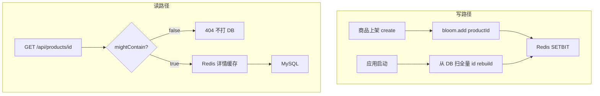
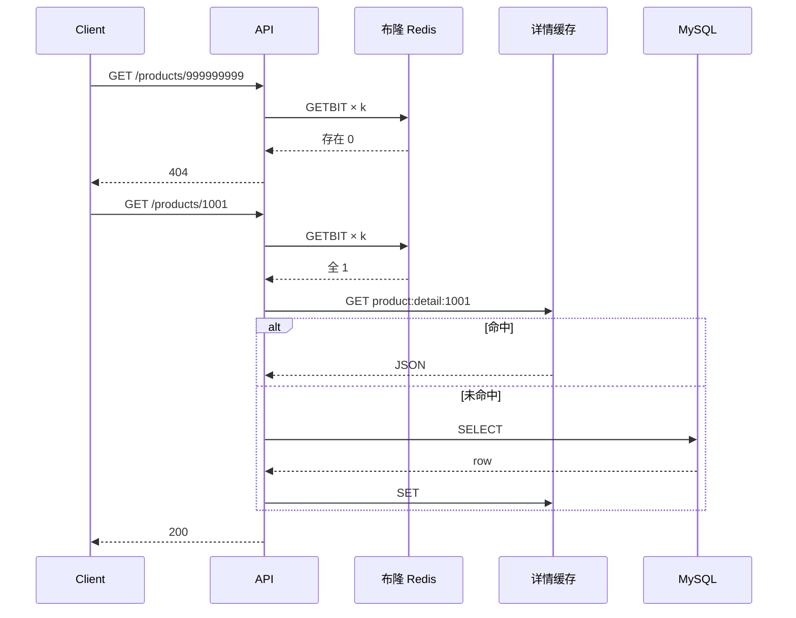

# Redis Bitmap 布隆过滤器防图书详情穿透

> **项目**：smart_bookstore（智慧书城）  
> **文档类型**：学习文档 · 关联本仓库业务代码  
> **关联包 / 模块**：`com.zx.bookstore.catalog`  
> **建议前置**：[布隆过滤器](./learning/布隆过滤器.md)、[Redis 布隆过滤器 Bitmap 实现原理](./Redis布隆过滤器Bitmap实现原理.md)

## 学习目标

1. 理解布隆「无假阴性、可假阳性」语义
2. 掌握 n / p 推算 bit 数与 hash 个数
3. 了解预热、新书 add 与读路径 fail-open

## 与本仓库的对应关系

| 路径 | 说明 |
| --- | --- |
| `src/main/java/com/zx/bookstore/catalog/service/BookBloomRedisService.java` | 对照阅读 |
| `src/main/java/com/zx/bookstore/catalog/support/BloomFilterSpec.java` | 对照阅读 |
| `src/main/java/com/zx/bookstore/catalog/config/BookBloomWarmupRunner.java` | 对照阅读 |

读理论时请打开上表文件对照；改代码前先跑通 `docker compose up -d` 与 `local` profile。

---

## 导读
如果你已经上了 **Cache-Aside**（先查 Redis，未命中再查 DB），大概率还会遇到 **缓存穿透**：

```text
GET /api/products/999999999   ← DB 里根本没有这个 id
  → Redis miss
  → MySQL SELECT
  → 404
  → 攻击者重复刷 10 万次
  → DB 被打满
```

**空值缓存**能挡一部分，但对 **海量随机 id** 仍力不从心（每个恶意 id 都要先打一次 DB 才知道不存在）。

**布隆过滤器（Bloom Filter）** 适合挡在缓存和 DB **之前**：

| 返回值 | 含义 | 能否继续查 DB |
|--------|------|---------------|
| **不存在** | 一定没插入过 | ❌ 直接 404 |
| **可能存在** | 也许有，也许误判 | ✅ 继续 Cache-Aside |

本文分享一套在真实 Spring 项目里跑通的方案：**用 Redis Bitmap 存布隆位图**，多实例共享、可配置、可预热、Redis 挂了也不拖垮业务。

---

## 一、先搞清楚：布隆过滤器承诺什么

### 1.1 数据结构

一个长度为 **m** 的位数组 + **k** 个哈希函数：

```text
插入 productId=1001：
  hash1(1001) → bit[234] = 1
  hash2(1001) → bit[8910] = 1
  ...
  hashk(1001) → bit[45678] = 1

查询 productId=1001：
  k 个 bit 全是 1 → 可能存在
  任一是 0       → 一定不存在
```

### 1.2 两个必背性质

- **无假阴性**：说「不存在」，就真不存在（只要之前 add 过且没丢数据）
- **有假阳性**：说「可能存在」，可能是别的 id 把同几位都置 1 了

所以 API 必须叫 `mightContain`，不能叫 `contains`。

### 1.3 和空值缓存怎么选

| 手段 | 优点 | 缺点 |
|------|------|------|
| 空值缓存 | 实现极简 | 每个恶意 id 仍可能先打一次 DB |
| 布隆过滤器 | 拦截「一定不存在」，内存极小 | 有误判；经典版不支持删 |
| **组合使用** | 生产最常见 | 略增复杂度 |

**推荐**：布隆挡明显不存在的 id；布隆说「可能存在」但 DB 也没有时，再 **空值短 TTL 缓存**。

---

## 二、生产选型：为什么用 Redis Bitmap

企业里常见三种做法：

| 方案 | 适合 |
|------|------|
| Guava `BloomFilter`（JVM 内存） | 单体、实例少；多 Pod 要每台预热 |
| RedisBloom 模块 `BF.ADD`/`BF.EXISTS` | 已上 Redis Stack、运维能装模块 |
| **Redis Bitmap `SETBIT`/`GETBIT`** | **标准 Redis 即可**、多实例共享、零新依赖 |

本文采用第三种：**不引 Redisson、不装模块**，Spring 项目里通常已有 `StringRedisTemplate`。

```text
Redis Key:  product:bloom:ids
类型:       String（底层按位存储）
命令:       SETBIT key offset 1
            GETBIT key offset
```

---

## 三、整体架构



**三层分工**：

| 层 | 职责 |
|----|------|
| 布隆 | 拦截一定不存在的 id |
| Redis 详情缓存 | 合法 id 重复查询减负 |
| MySQL | 权威数据源 |

---

## 四、Step 1：根据业务规模算 m 和 k

给定：

- **n** = 预期商品数（如 10 万）
- **p** = 可接受误判率（如 1%）

```text
m = ceil( -n × ln(p) / (ln 2)² )    // 位数组长度
k = round( (m / n) × ln 2 )           // 哈希次数
```

`n=100000, p=0.01` 时：`m ≈ 958506 bit`（约 117KB），`k ≈ 7`。

```java
public final class BloomFilterSpec {

    private final long bitSize;      // m
    private final int hashFunctions; // k

    public static BloomFilterSpec of(long expectedElements, double falsePositiveRate) {
        long n = Math.max(1, expectedElements);
        double p = (falsePositiveRate <= 0 || falsePositiveRate >= 1) ? 0.01 : falsePositiveRate;

        long m = (long) Math.ceil(-n * Math.log(p) / (Math.log(2) * Math.log(2)));
        m = Math.max(m, 64);

        int k = (int) Math.round((double) m / n * Math.log(2));
        k = Math.max(1, Math.min(k, 16)); // 限制 k，避免每次查询 k 次 GETBIT 过慢

        return new BloomFilterSpec(m, k);
    }

    public long bitSize() { return bitSize; }
    public int hashFunctions() { return hashFunctions; }
}
```

**生产建议**：

- `n` 取 **峰值商品量的 1.2～2 倍**，留余量
- `p=0.01`（1%）对详情接口通常够用；要求更准就降到 `0.001`，内存会略增
- **不要把 k 设得过大**；每次查询要打 k 次 Redis

---

## 五、Step 2：哈希 —— 把 productId 映射到 bit 偏移

不必写 k 个哈希函数，用 **双重哈希** 派生：

```text
offset(i) = (h1 + i × h2) mod m,   i = 0..k-1
```

`h1、h2` 由 64 位 mix 函数生成，避免连续 id（1、2、3…）挤在同一小段 bit 上：

```java
public final class RedisBloomHash {

    private static final long SEED_1 = 0x9E3779B97F4A7C15L;
    private static final long SEED_2 = 0xBF58476D1CE4E5B9L;

    public static long offset(long value, int index, long bitSize) {
        long h1 = mix64(value ^ SEED_1);
        long h2 = mix64(value ^ SEED_2 ^ ((long) index << 32));
        long combined = h1 + (long) index * h2;
        return Long.remainderUnsigned(combined, bitSize);
    }

    /** 类似 MurmurHash3 finalizer，打散位模式 */
    private static long mix64(long z) {
        z = (z ^ (z >>> 33)) * 0xff51afd7ed558ccdL;
        z = (z ^ (z >>> 33)) * 0xc4ceb9fe1a85ec53L;
        return z ^ (z >>> 33);
    }
}
```

---

## 六、Step 3：核心服务 —— add / mightContain / rebuild

```java
@Slf4j
@Service
@RequiredArgsConstructor
public class ProductBloomRedisService {

    private static final String BLOOM_KEY = "product:bloom:ids";

    private final StringRedisTemplate redis;
    private final BloomFilterProperties properties;
    private BloomFilterSpec spec;

    @PostConstruct
    void init() {
        spec = BloomFilterSpec.of(
                properties.getExpectedElements(),
                properties.getFalsePositiveRate()
        );
        log.info("bloom initialized, bitSize={}, k={}, fpp={}",
                spec.bitSize(), spec.hashFunctions(), properties.getFalsePositiveRate());
    }

    /** 上架成功后调用 */
    public void add(Long productId) {
        if (!properties.isEnabled() || productId == null) return;
        try {
            for (int i = 0; i < spec.hashFunctions(); i++) {
                long offset = RedisBloomHash.offset(productId, i, spec.bitSize());
                redis.opsForValue().setBit(BLOOM_KEY, offset, true);
            }
        } catch (Exception e) {
            log.warn("bloom add failed, id={}", productId, e);
        }
    }

    /**
     * @return false = 一定不存在；true = 可能存在（含误判）
     */
    public boolean mightContain(Long productId) {
        if (!properties.isEnabled() || productId == null) {
            return true;
        }
        try {
            for (int i = 0; i < spec.hashFunctions(); i++) {
                long offset = RedisBloomHash.offset(productId, i, spec.bitSize());
                if (!Boolean.TRUE.equals(redis.opsForValue().getBit(BLOOM_KEY, offset))) {
                    return false;
                }
            }
            return true;
        } catch (Exception e) {
            // 生产关键：fail-open，Redis 挂了不能全站 404
            log.warn("bloom check failed, id={}, fail-open", productId, e);
            return true;
        }
    }

    /** 启动预热或运维补偿：DEL 后全量重建 */
    public void rebuild(Collection<Long> productIds) {
        if (!properties.isEnabled()) return;
        redis.delete(BLOOM_KEY);
        if (productIds == null) return;
        productIds.forEach(this::add);
        log.info("bloom rebuild done, count={}", productIds.size());
    }
}
```

### 6.1 读路径接入（Cache-Aside 之前）

```java
public ProductDetail getProductDetail(Long id) {
    // ① 布隆：一定不存在则短路
    if (!productBloomRedisService.mightContain(id)) {
        throw new NotFoundException();
    }
    // ② 详情缓存
    Optional<ProductDetail> cached = productRedisCache.get(id);
    if (cached.isPresent()) {
        return cached.get();
    }
    // ③ DB
    ProductDetail detail = productRepository.findOnSaleById(id)
            .orElseThrow(NotFoundException::new);
    productRedisCache.put(detail);
    return detail;
}
```

**注意**：管理后台详情一般 **不走布隆**，方便排查下架/草稿商品。

### 6.2 写路径：增量 + 全量预热

```java
// 上架
@Transactional
public Product createProduct(CreateProductRequest req) {
    Product p = productRepository.save(toEntity(req));
    productBloomRedisService.add(p.getId());  // 增量
    return p;
}

// 启动预热
@Component
@RequiredArgsConstructor
public class ProductBloomWarmupRunner implements ApplicationRunner {

    private final ProductBloomRedisService bloom;
    private final ProductRepository productRepository;

    @Override
    public void run(ApplicationArguments args) {
        if (!bloom.isWarmupEnabled()) return;
        bloom.rebuild(productRepository.listAllIds());
    }
}
```

**为什么必须预热？**

- Redis 重启后位图为空 → 所有 id 都会被判「不存在」→ **线上事故**
- 历史数据在接入布隆之前已存在 → 必须扫 DB 灌入

---

## 七、生产配置示例

```yaml
product:
  cache:
    bloom:
      enabled: true
      expected-elements: 100000      # n
      false-positive-rate: 0.01      # p = 1%
      warmup-on-startup: true
```

```java
@ConfigurationProperties(prefix = "product.cache.bloom")
@Data
public class BloomFilterProperties {
    private boolean enabled = true;
    private long expectedElements = 100_000L;
    private double falsePositiveRate = 0.01;
    private boolean warmupOnStartup = true;
}
```

| 环境 | 建议 |
|------|------|
| 生产 | `warmup-on-startup: true`，`p=0.01` |
| 联调 | 可关布隆或调小 n |
| 压测 | 观察 `GETBIT` 延迟与误判带来的多余 DB 查询 |

---

## 八、生产必须处理的五个问题

### 8.1 Redis 故障：fail-open

`mightContain` 异常时 **返回 true**，放行查 DB。

- **可用性优先**：宁可多查 DB，不能误杀全部请求
- 若安全场景要求 fail-close，需单独评估（大多数详情接口用 fail-open）

### 8.2 不支持删除

经典布隆 **不能删元素**（清 bit 会影响其他 id）。

| 业务 | 影响 |
|------|------|
| 商品下架 | id 仍在布隆 → 多查一次 DB → 最终 404，**结果正确** |
| 商品物理删除 | 同上，仅多一次 DB |

若必须删除能力：考虑 **Counting Bloom**、**定期 rebuild**，或换 RedisBloom 模块。

### 8.3 数据一致性

| 时机 | 动作 |
|------|------|
| 新建商品 | `add(id)` |
| 应用启动 | `rebuild(全量 id)` |
| add 失败 | 依赖下次启动 rebuild；可告警 |

**不要**只在启动预热、不在 create 时增量 add —— 否则重启前新建的商品会被误判不存在。

### 8.4 多实例

Redis 位图 **全集群一份**，所有 Pod 共享，无需每台 JVM 各自维护（Guava 的痛点）。

### 8.5 误判（假阳性）可接受吗

布隆说「可能存在」，DB 查不到：

- **不会返回假数据**，只是多一次 Redis + DB
- 调低 `p` 或增大 `n` 可减小概率

---

## 九、和 RedisBloom 模块的对比

| 维度 | Bitmap 自实现（本文） | RedisBloom `BF.*` |
|------|----------------------|-------------------|
| Redis 要求 | 标准版 | 需模块 / Redis Stack |
| 依赖 | 已有 Spring Redis | 运维安装 |
| 扩容 | 改 n 需 rebuild | 模块支持更好 |
| 命令 | SETBIT / GETBIT | BF.ADD / BF.EXISTS |
| 适合 | 中小规模、快速落地 | 大规模、专业运维 |

**结论**：没有 RedisBloom 模块时，Bitmap 方案是 **生产可用** 的务实选择；量级上亿再评估模块或 Redisson。

---

## 十、自测清单

```text
□ 启动日志：bloom initialized, bitSize=..., k=...
□ 启动日志：bloom rebuild done, count=N
□ 查存在 id → 200
□ 查不存在 id（如 999999999）→ 404，且 MySQL 慢查询不应飙升
□ 新建商品后无需重启即可查到
□ redis-cli：GETBIT product:bloom:ids 0；BITCOUNT product:bloom:ids
□ 临时停 Redis：详情仍可查（fail-open 生效）
```

**redis-cli 示例**：

```bash
GETBIT product:bloom:ids 12345
BITCOUNT product:bloom:ids
```

---

## 十一、完整读链路时序



---

## 十二、面试 / 答辩怎么讲（30 秒版）

> 我们在商品详情 Cache-Aside 前加了一层 Redis Bitmap 布隆过滤器。根据 10 万商品量和 1% 误判率算出位数组长度和哈希次数，每个 productId 双重哈希映射到 k 个 bit，插入 SETBIT、查询 GETBIT，说不存在直接 404 防穿透。新建商品增量 add，启动全量 rebuild 防 Redis 清空。经典布隆不支持删，下架只会多查一次 DB。Redis 异常 fail-open 保可用。没引 RedisBloom 模块，标准 Redis 就能跑。

---

## 十三、小结

| 要点 | 内容 |
|------|------|
| 解决什么 | 缓存穿透（恶意/随机不存在 id） |
| 实现 | Redis Bitmap + 双重哈希 + Spring Service |
| 生产必备 | 启动预热、增量 add、fail-open、可配置 n/p |
| 代价 | 少量误判多查 DB；不支持删 |
| 组合 | 布隆 + 空值缓存 + Cache-Aside 更稳 |

按本文代码结构接入后，你得到的是 **多实例共享、可运维、可降级** 的布隆方案，而不是只能跑在单机内存里的 demo。

---

## 附录：依赖与替代

**Maven**（通常项目已有）：

```xml
<dependency>
    <groupId>org.springframework.boot</groupId>
    <artifactId>spring-boot-starter-data-redis</artifactId>
</dependency>
```

**若想少写代码**：Redisson `RBloomFilter`、Guava `BloomFilter`（单机）、Redis Stack `BF.ADD` 均可替代，选型见第二节表格。
