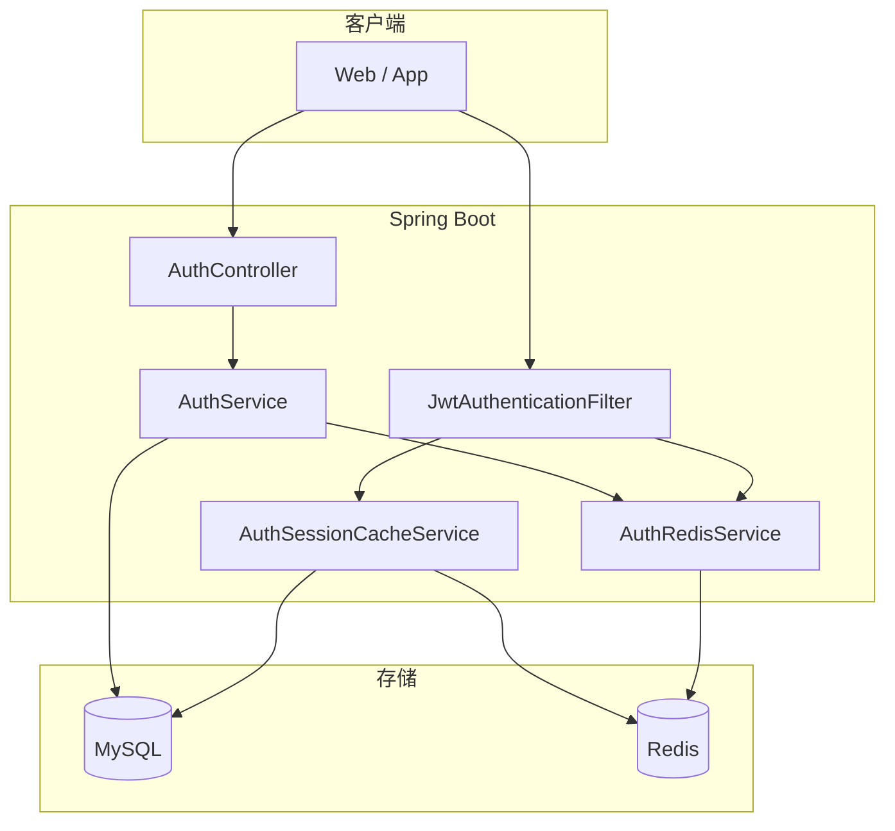
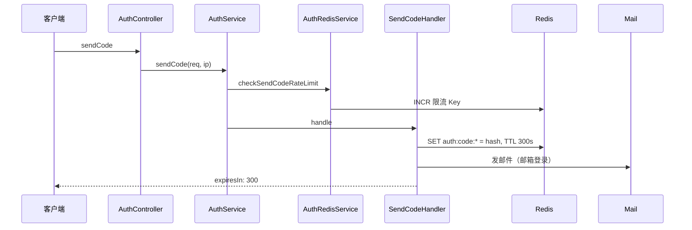
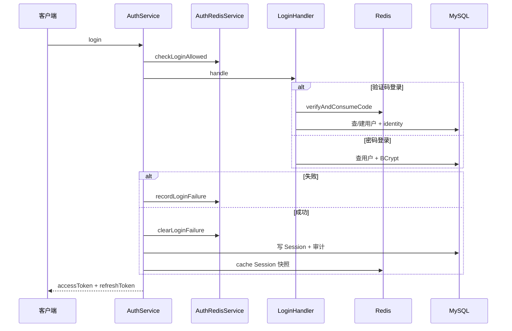
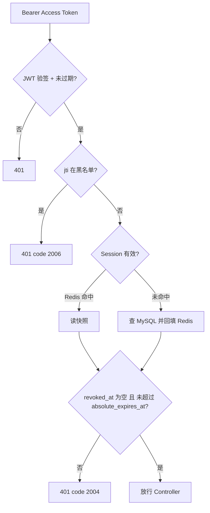
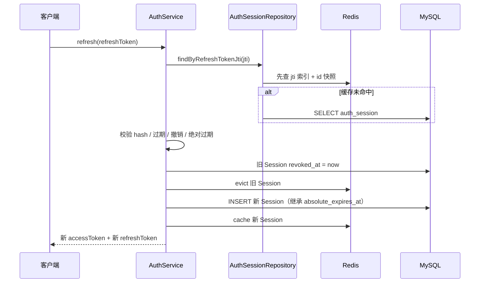

# 智慧书城统一登录流程：验证码 / 密码 / OAuth

> **项目**：smart_bookstore（智慧书城）  
> **文档类型**：学习文档 · 关联本仓库业务代码  
> **关联包 / 模块**：`com.zx.auth`  
> **建议前置**：[项目介绍](./项目介绍.md)、[工厂模式学习文档](./工厂模式学习文档.md)

## 学习目标

1. 跟踪 sendCode → login → createSession 时序
2. 理解发码限流、登录失败锁定与审计
3. 掌握多登录类型经 Factory 路由的扩展模型

## 与本仓库的对应关系

| 路径 | 说明 |
| --- | --- |
| `src/main/java/com/zx/auth/controller/AuthController.java` | 对照阅读 |
| `src/main/java/com/zx/auth/service/AuthService.java` | 对照阅读 |
| `src/main/java/com/zx/auth/service/login/LoginHandlerFactory.java` | 对照阅读 |

读理论时请打开上表文件对照；改代码前先跑通 `docker compose up -d` 与 `local` profile。

---

## 导读
做一个支持**多种登录方式**的认证系统，很容易陷入「接口能跑就行」的状态：登录返回 Token，前端存起来，似乎就结束了。

但真正上线前，至少要回答这些问题：

- 验证码存哪？Refresh Token 怎么撤销？
- logout 之后，Access Token 还没过期怎么办？
- 每次请求都要查数据库吗？
- Redis 和 MySQL 各存什么，要不要强一致？

本文以 `smart_bookstore` 为例，**按时间顺序走一遍完整登录流程**，列出用到的技术，并重点讲清楚 **Redis 在每一步的作用**。

---

## 一、技术栈一览

### 1.1 框架与语言

| 技术 | 版本/说明 | 在登录流程中的职责 |
|------|-----------|-------------------|
| **Java** | 21 | 运行环境 |
| **Spring Boot** | 4.1 | Web 容器、依赖注入、配置管理 |
| **Spring MVC** | — | REST 接口（`AuthController` / `UserController`） |
| **Spring Security** | — | 过滤器链、无状态会话、`@PreAuthorize` RBAC |
| **Lombok** | — | 简化实体与 Service 样板代码 |

### 1.2 认证与安全

| 技术 | 说明 | 职责 |
|------|------|------|
| **JJWT** | 0.12.6 | 签发与解析 Access Token（JWT） |
| **BCrypt** | Spring Security 内置 | 密码哈希存储与校验 |
| **SHA-256** | JDK 内置 | 验证码、Refresh Token 哈希 |

### 1.3 数据存储

| 技术 | 说明 | 职责 |
|------|------|------|
| **MySQL 8** | 关系型数据库 | 用户、Session、角色、审计等**权威持久化** |
| **MyBatis-Plus** | 3.5.9 | ORM / Repository 数据访问 |
| **Redis** | Spring Data Redis | 验证码、限流、Access 黑名单、Session 读缓存 |
| **HikariCP** | 连接池 | MySQL 连接管理 |

### 1.4 其他

| 技术 | 职责 |
|------|------|
| **Spring Mail** | 邮箱验证码发送（SMTP） |
| **工厂 + 策略模式** | 按 `loginType` 路由到不同 LoginHandler / SendCodeHandler |

### 1.5 架构分层

```text
Controller（AuthController / UserController）
    ↓
Service（AuthService / JwtService / AuthRedisService / AuthSessionCacheService）
    ↓
Repository + Mapper（MyBatis-Plus）
    ↓
MySQL（权威）          Redis（缓存 / 临时 / 限流）
```

---

## 二、整体登录架构



**设计核心：**

- **Access Token（JWT）**：短期、无状态验签，适合高频 API 请求
- **Refresh Token + Session（MySQL）**：长期、可撤销，服务端可控
- **Redis**：不做权威数据源，负责**加速**和**短期临时数据**

---

## 三、MySQL 与 Redis 分工（先建立全局观）

| 数据 | MySQL | Redis | 说明 |
|------|:-----:|:-----:|------|
| 用户 / 密码 / 身份 | ✅ | ❌ | 持久化 |
| Session / Refresh hash | ✅ 权威 | ✅ 缓存 | Cache-Aside |
| 验证码 | ❌ | ✅ 唯一 | TTL 300s |
| 发码 / 登录限流 | ❌ | ✅ | 计数 + 过期 |
| Access 黑名单 | ❌ | ✅ | logout 后至 JWT 自然过期 |
| 登录审计 / RBAC | ✅ | ❌ | 持久化 |

> **Redis 不是 Refresh Token 的存储位置**，Refresh 的权威数据在 MySQL 的 `auth_session` 表；Redis 里的是 Session **读缓存**和其他**辅助能力**。

---

## 四、完整登录流程（按时间顺序）

### 4.1 发送验证码

**接口：** `POST /api/auth/code/send`



**流程说明：**

1. `AuthService` 先调用 `AuthRedisService.checkSendCodeRateLimit()` —— **Redis 限流**
2. 工厂选择 `EmailSendCodeHandler` 或 `PhoneSendCodeHandler`
3. 生成 6 位验证码，**SHA-256 哈希后写入 Redis**，TTL 300 秒
4. 邮箱场景通过 SMTP 发邮件；**接口不返回验证码明文**

**Redis 作用（本步）：**

| Key 模式 | 作用 |
|----------|------|
| `auth:limit:send:target:min:{target}` | 60 秒内只能发 1 次 |
| `auth:limit:send:target:hour:{target}` | 1 小时最多 5 次 |
| `auth:limit:send:ip:{ip}` | 同一 IP 1 小时最多 10 次 |
| `auth:code:{loginType}:{scene}:{target}` | 存验证码哈希，5 分钟过期 |

---

### 4.2 登录

**接口：** `POST /api/auth/login`

支持三种 `loginType`：`password` / `qq_email_code` / `phone_code`，由 **LoginHandlerFactory** 路由。



**成功后的关键动作：**

1. 新建 `auth_session` 记录（MySQL）：`refresh_token_jti`、`refresh_token_hash`、`revoked_at=null`
2. 设置两种过期时间：
   - **滑动过期** `refresh_expires_at`：7 天 / 记住登录 30 天
   - **绝对过期** `absolute_expires_at`：首次登录起 **90 天**（refresh 不延长）
3. 签发 Access JWT（含 `userId`、`sid`、`roles`、`jti`）
4. 返回 Refresh 明文：`{jti}:{随机串}`（只给客户端，MySQL 只存 hash）

**Redis 作用（本步）：**

| 操作 | Key | 说明 |
|------|-----|------|
| 登录前 | `auth:limit:login:fail:{account/target}` | 失败 ≥5 次锁定 15 分钟 |
| 验证码登录 | `auth:code:*` | 校验哈希，成功则 **DELETE**（一次性） |
| 登录成功 | — | `clearLoginFailure` 删除失败计数 |
| 登录成功 | `auth:session:id:*` + `auth:session:jti:*` | 写入 Session 缓存 |

---

### 4.3 访问受保护 API（JWT 鉴权）

**接口：** `GET /api/user/me`（示例）

**链路：** `JwtAuthenticationFilter` → 验 JWT → 查 Redis/MySQL Session → 放行



**Redis 作用（本步）：**

| 能力 | Key | 为什么需要 |
|------|-----|-----------|
| **Access 黑名单** | `auth:blacklist:access:{jti}` | logout 后 JWT 未过期也能立即拒绝 |
| **Session 缓存** | `auth:session:id:{sessionId}` | 避免每次请求都查 MySQL |
| **jti 索引** | `auth:session:jti:{jti}` | Refresh 流程按 jti 反查 Session |

> 鉴权**不是**校验 Refresh Token，而是用 Access JWT 里的 `sid` 查 Session 是否仍有效。

---

### 4.4 刷新 Token（Rotation）

**接口：** `POST /api/auth/refresh`  
**Body：** Refresh Token 纯字符串（`text/plain`）



**Rotation 要点：**

- 旧 Refresh **立即作废**；返回**全新**的一对 Token
- 新 Session **继承**旧的 `absolute_expires_at`（90 天硬上限不延长）
- `refresh_expires_at = min(滑动 7/30 天, absolute_expires_at)`
- 若用**已撤销**的旧 Refresh 刷新 → 视为重放，**撤销该用户全部 Session**

**Redis 作用（本步）：**

- 读：通过 `auth:session:jti:*` 加速按 jti 找 Session
- 写：旧 Session `evict`，新 Session `cache`
- **Refresh Token 本身不在 Redis**，只在 MySQL 存 hash

---

### 4.5 登出

**接口：** `POST /api/auth/logout`

```text
1. 解析 Access JWT → blacklistAccessToken(jti)   → Redis 黑名单
2. revokeById(sessionId)                           → MySQL revoked_at
3. evict Session 缓存                              → Redis 删除
4. （可选）Body 带 Refresh → 再次 revokeById       → 兜底 Access 过期场景
```

**Redis 作用（本步）：**

| 操作 | 效果 |
|------|------|
| `auth:blacklist:access:{jti}` | Access 在剩余有效期内不可用 |
| `evict auth:session:*` | 清 Session 缓存，避免脏读 |

---

## 五、Redis 深度解析：五大职责

把 Redis 在登录流程中的角色浓缩为五类：

### 5.1 验证码仓库（唯一存储）

```text
Key:   auth:code:{loginType}:{scene}:{target}
Value: SHA-256(验证码)
TTL:   300 秒
```

- **为什么用 Redis 而不是 MySQL？** 临时数据、自带 TTL、读写快、验完即删
- 登录成功调用 `verifyAndConsumeCode`：**比对哈希 + DELETE**，保证一次性

### 5.2 限流计数器（发码 + 登录失败）

```text
发码：auth:limit:send:target:min:* / hour:* / ip:*
登录：auth:limit:login:fail:{account 或 target}
```

实现：`INCR` + 首次 `EXPIRE`（固定窗口计数）

- 发码：`allow()` —— 计数并当场判断是否放行
- 登录失败：`recordLoginFailure` + `checkLoginAllowed` —— 失败累加，成功清除

### 5.3 Access Token 黑名单（logout 后立即失效）

```text
Key:   auth:blacklist:access:{jti}
Value: "1"
TTL:   Access Token 剩余有效时间
```

JWT 无状态，logout 后若不做黑名单，2 小时内 Token 仍可用。黑名单补上这个缺口。

### 5.4 Session 读缓存（Cache-Aside）

```text
auth:session:id:{sessionId}   → Session 快照（序列化字符串）
auth:session:jti:{jti}        → sessionId（索引）
TTL: min(refresh 剩余, absolute 剩余)
```

- **MySQL 是权威**；Redis  miss 时回源 MySQL 并回填
- 撤销 / Rotation 时 `evict`；有效 Session `cache`
- 快照含 `revokedAt`、`absoluteExpiresAt`，读时校验过期

### 5.5 Redis 不做什么

| 不存储 | 原因 |
|--------|------|
| Refresh Token 明文 | 只在客户端；服务端 MySQL 存 hash |
| 用户 / 角色 | 持久化在 MySQL |
| Access JWT 全文 | JWT 自包含，只需 blacklist 的 jti |

---

## 六、两种过期时间：滑动 vs 绝对

本项目 Session 有两个「时钟」：

| 字段 | 含义 | Refresh 时 |
|------|------|-----------|
| `refresh_expires_at` | 滑动过期（7/30 天） | 每次 refresh **重算** |
| `absolute_expires_at` | 绝对上限（90 天） | **继承**，不延长 |

```text
首次登录（1月1日）
  refresh_expires_at  = 1月8日
  absolute_expires_at = 4月1日

3月30日 refresh
  refresh_expires_at  = 4月6日 → cap 为 4月1日
  absolute_expires_at = 4月1日（不变）

4月2日
  无论怎么 refresh → 必须重新登录
```

配置：`auth.jwt.session-absolute-expire-days: 90`

---

## 七、工厂模式：多种登录方式如何扩展

```text
loginType → LoginHandlerFactory → PasswordLoginHandler
                                 → EmailCodeLoginHandler
                                 → PhoneCodeLoginHandler

sendCode  → SendCodeHandlerFactory → EmailSendCodeHandler
                                    → PhoneSendCodeHandler
```

新增一种登录方式只需：

1. 实现 `LoginHandler` / `SendCodeHandler` 接口
2. 加 `@Component`，Spring 自动注入到 Factory 的 `List<>` 中
3. 在 `supports(loginType)` 里声明支持的类型

**验证码登录与 Redis 的衔接：** Handler 内调用 `AuthRedisService.verifyAndConsumeCode()`，与发码 Handler 写入的 Key 一一对应。

---

## 八、一次用户旅程串讲

```text
① 打开登录页
② 选「邮箱验证码」→ POST /code/send
     Redis：限流检查 → 写入 auth:code:* → 邮件发出
③ 输入验证码 → POST /login
     Redis：验码并删除 → 清登录失败计数
     MySQL：查/建用户 → INSERT auth_session
     Redis：cache Session
     返回 accessToken + refreshToken
④ 访问 /api/user/me
     Redis：查黑名单 → 查 Session 缓存（或回源 MySQL）
     放行，返回用户信息
⑤ 2 小时后 Access 过期 → POST /refresh
     MySQL：作废旧 Session，INSERT 新 Session（继承 absolute_expires_at）
     Redis：evict 旧 + cache 新
     返回新 Token 对
⑥ 点击退出 → POST /logout
     Redis：黑名单 + evict
     MySQL：revoked_at = now
```

---

## 九、Redis 与 MySQL 要不要强一致？

**不需要强一致。** 本项目采用 **Cache-Aside + MySQL 权威**：

| 场景 | 策略 |
|------|------|
| 读 Session | Redis miss → 查 MySQL → 回填 |
| 写 Session | 先 MySQL → 再 cache / evict Redis |
| 验证码 | 只 Redis，无 MySQL 一致性问题 |
| 短暂缓存不一致 | 有过期时间 + revoked / absolute 校验兜底 |

这是认证系统的常见做法：**最终一致即可，不必上分布式事务**。

---

## 十、配置速查

```yaml
auth:
  jwt:
    access-expire-seconds: 7200          # Access 2 小时
    refresh-expire-days: 7               # Refresh 滑动 7 天
    refresh-expire-days-remember: 30     # 记住登录 30 天
    session-absolute-expire-days: 90     # 绝对上限 90 天
  verification-code-ttl-seconds: 300     # 验证码 5 分钟
  rate-limit:
    send-code-per-target-seconds: 60
    send-code-per-target-hourly: 5
    send-code-per-ip-hourly: 10
    login-fail-max: 5
    login-fail-lock-minutes: 15
  session-cache:
    enabled: true
```

---

## 十一、总结

| 层次 | 技术 | 职责 |
|------|------|------|
| 接入 | Spring MVC + Security | 接口、过滤器、RBAC |
| 业务 | AuthService + 工厂策略 | 登录、刷新、登出编排 |
| 令牌 | JJWT + Session 表 | 双 Token + 可撤销 |
| 持久化 | MySQL + MyBatis-Plus | 用户、Session、审计、角色 |
| 加速与防护 | Redis | 验证码、限流、黑名单、Session 缓存 |

**Redis 在登录流程中的定位一句话：**

> 不存权威业务数据，而是做**验证码临时仓、限流计数器、logout 黑名单、Session 读缓存**——让登录既**安全**（可撤销、可限流），又**高效**（少查 MySQL）。

如果你正在做类似项目，建议至少实现：**双 Token + Session 撤销 + Refresh Rotation + Access 黑名单 + 验证码哈希存 Redis**。本项目的 Session 绝对 90 天上限，是在滑动 Refresh 之上多加的一道安全阀。

---

## 延伸阅读

- [接口文档](./接口文档.md) — 联调参数与错误码
- [项目流程图](./项目流程图.md) — Mermaid 全链路图
- [双Token登录学习文档](./双Token登录学习文档.md) — jti、Rotation 概念深入
- [四层架构学习文档](./四层架构学习文档.md) — Controller / Service / Repository 分层
