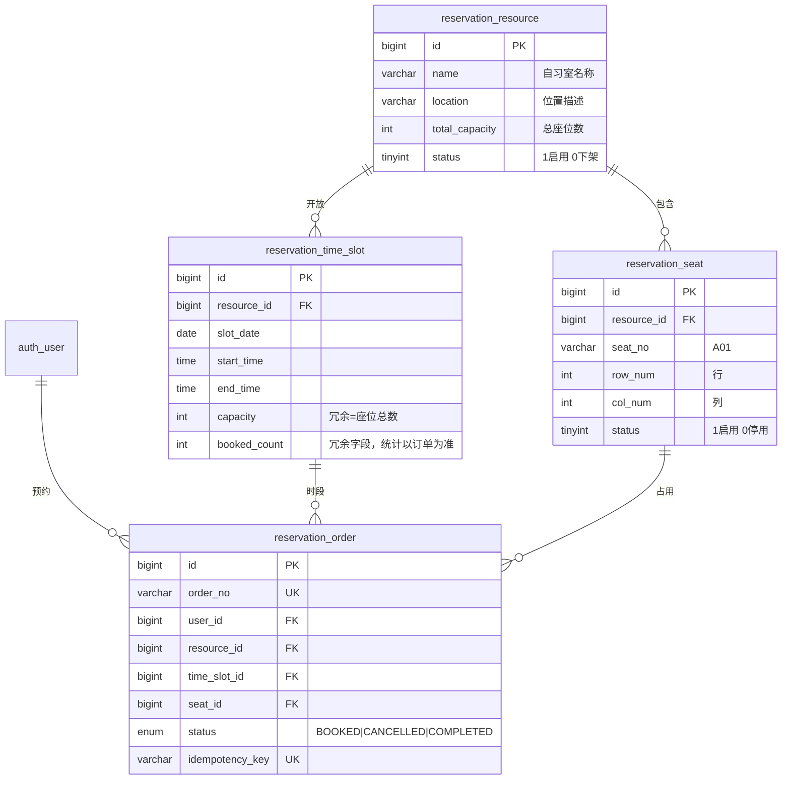
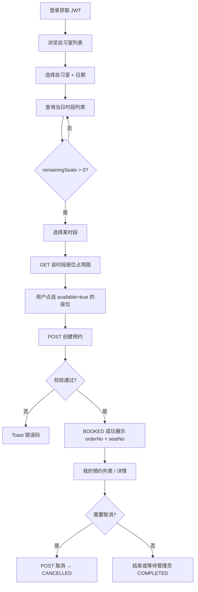
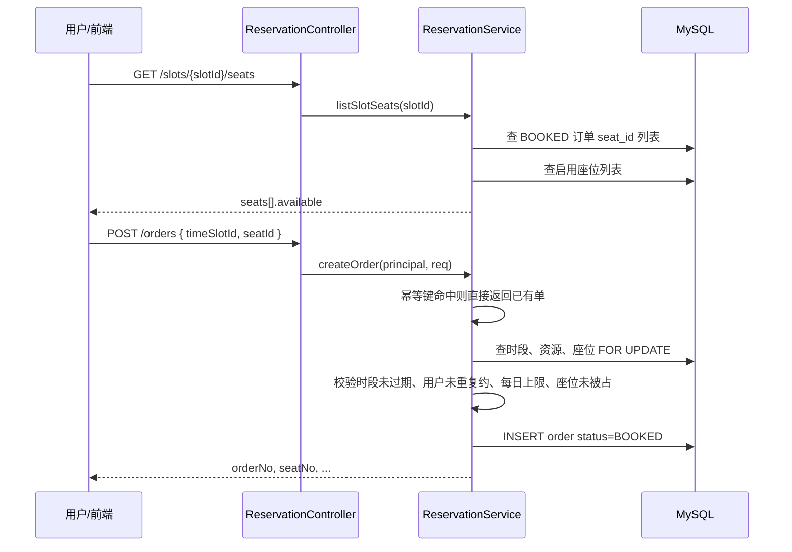
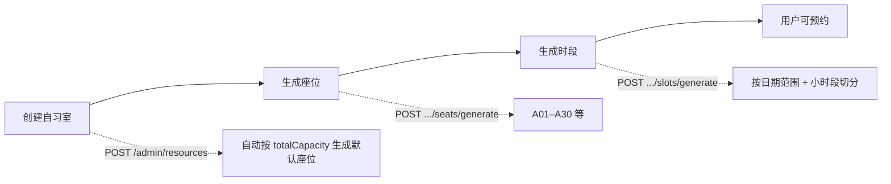

# 自习室座位预约 — 业务流程文档


> **项目**：smart_bookstore（智慧书城） · **文档类型**：学习文档  
> **关联**：`com.zx.reservation` — 占座主流程  
> **索引**：[学习文档中心](./README.md)

> 项目：`smart_bookstore`  
> 模块：统一认证平台 + 自习室座位预约  
> 粒度：**自习室（位置）→ 日期时段 → 具体座位**  
> 最后更新：2026-07

---

## 一、文档说明

本文档描述**已实现**的自习室预约业务全流程，面向产品、前端、测试与面试讲解使用。

与 [预约系统功能规划](./预约系统功能规划.md) 的区别：

| 文档 | 侧重 |
|------|------|
| 功能规划 | 需求范围、表设计草案、实施阶段 |
| **本文档** | 实际业务流程、状态机、校验规则、接口时序 |

---

## 二、业务概览

### 2.1 业务定义

用户登录后，在指定**自习室（位置）**中，选择**某一天、某一时段**的**某一个座位**进行预约；管理员负责维护自习室、批量生成座位与时段，并对预约单进行核销（标记完成）。

### 2.2 核心对象

```text
自习室 (reservation_resource)
  └── 座位 (reservation_seat)          ← 物理位置，如 A01，含 row/col 布局
  └── 时段 (reservation_time_slot)     ← 某日 08:00–10:00 等开放窗口
        └── 预约单 (reservation_order) ← 用户 + 时段 + 座位，状态 BOOKED/CANCELLED/COMPLETED
```

### 2.3 参与角色

| 角色 | 编码 | 典型账号 | 职责 |
|------|------|----------|------|
| 普通用户 | `USER` | 任意注册用户 | 浏览、选座、预约、取消自己的单 |
| 管理员 | `ADMIN` | `admin`（同时有 USER） | 资源/座位/时段维护、查看全部预约、标记完成、代取消 |

所有预约接口需 **JWT 登录**；管理接口额外要求 `ADMIN` 角色。

---

## 三、数据模型关系



**名额计算方式（当前实现）**

- 某时段剩余座位数 = 该自习室启用座位总数 − 该时段 `BOOKED` 订单数
- 某座位是否可约 = 该时段不存在 `(time_slot_id, seat_id)` 且 `status=BOOKED` 的订单

---

## 四、预约单状态机

```text
                    ┌─────────────┐
                    │   BOOKED    │  创建成功，占用座位
                    └──────┬──────┘
           用户/管理员取消  │  管理员标记完成
              ┌────────────┴────────────┐
              ▼                         ▼
       ┌─────────────┐           ┌─────────────┐
       │  CANCELLED  │           │  COMPLETED  │
       └─────────────┘           └─────────────┘
         释放座位占用               座位视为已消费
         （只读）                   （只读）
```

| 当前状态 | 允许操作 | 操作后状态 | 座位占用 |
|----------|----------|------------|----------|
| `BOOKED` | 用户取消 / 管理员取消 | `CANCELLED` | 释放 |
| `BOOKED` | 管理员标记完成 | `COMPLETED` | 仍占用（表示已使用） |
| `CANCELLED` | — | — | 已释放 |
| `COMPLETED` | — | — | 已消费 |

状态跳转由 `ReservationOrderStatus.canTransitTo()` 统一校验，非法操作返回 **3004**。

---

## 五、用户端业务流程

### 5.1 端到端主流程



### 5.2 分步说明

| 步骤 | 用户动作 | 接口 | 关键返回 |
|------|----------|------|----------|
| 1 | 登录 | `POST /api/auth/login` | `accessToken` |
| 2 | 进入预约页 | `GET /api/reservation/resources?page&size` | 自习室名称、位置、总容量 |
| 3 | 选日期 | `GET /api/reservation/resources/{id}/slots?date=` | 时段列表、`remainingSeats` |
| 4 | 选时段 | `GET /api/reservation/slots/{slotId}/seats` | 座位列表 + `available` |
| 5 | 选座并确认 | `POST /api/reservation/orders` | `{ timeSlotId, seatId }` |
| 6 | 查看记录 | `GET /api/reservation/orders/mine` | 含 `seatNo`、时段、状态 |
| 7 | 取消 | `POST /api/reservation/orders/{id}/cancel` | 可选 `{ reason }` |

**可选接口**：`GET /api/reservation/resources/{id}/seats` — 仅预览座位布局，不含 `available`。

### 5.3 前端选座交互建议

```text
1. 用 rowNum / colNum 渲染 Grid 座位图
2. available=true  → 可点击（绿色）
3. available=false → 已占用（灰色禁用）
4. status=0 的座位后端不返回，前端无需处理
5. 选中座位后高亮，确认时提交 seatId（非 seatNo）
6. 收到 3011 时刷新座位图（并发抢座失败）
```

### 5.4 用户端时序图（创建预约）



---

## 六、管理员业务流程

### 6.1 资源与数据准备流程



| 步骤 | 接口 | 说明 |
|------|------|------|
| 创建自习室 | `POST /api/reservation/admin/resources` | 创建后**自动**按 `totalCapacity` 生成 A 前缀座位 |
| 补充座位 | `POST /api/reservation/admin/resources/{id}/seats/generate` | `{ count, prefix, rows?, cols? }` |
| 生成时段 | `POST /api/reservation/admin/resources/{id}/slots/generate` | **须先有座位**；默认 8:00–22:00、每 2 小时一段 |
| 更新/下架 | `PUT` / `DELETE .../resources/{id}` | 下架后用户不可见 |

**时段生成规则**

- `date` ~ `endDate` 逐日循环
- 从 `startHour` 到 `endHour`，按 `durationHours` 切分
- 已存在相同时段则跳过（幂等）
- `capacity` = 当前启用座位总数

**座位生成规则**

- 方式一：`{ count: 30, prefix: "A" }` → A01, A02, …（自动算行列，最多 10 列）
- 方式二：`{ rows: 6, cols: 5, prefix: "A" }` → A01-01, A01-02, …（行列命名）
- 已存在相同 `seat_no` 则跳过

### 6.2 预约运营管理

| 操作 | 接口 | 前置条件 |
|------|------|----------|
| 查看全部预约 | `GET /api/reservation/admin/orders?status&page&size` | ADMIN |
| 标记完成（核销） | `POST /api/reservation/admin/orders/{id}/complete` | 订单 `BOOKED` |
| 代取消 | 用户取消接口同样可用 | ADMIN 可操作任意用户订单 |

### 6.3 启动时 Demo 数据

应用首次启动时 `ReservationDemoDataInitializer` 自动执行：

1. 若 `resource_id=1` 无座位 → 按 `totalCapacity` 生成 A 前缀座位
2. 若当日无时段 → 生成**今天起 7 天**的默认时段

示例数据：「图书馆 A 区 · 主楼 3 层东侧 · 30 座」。

---

## 七、创建预约 — 业务规则详解

`POST /api/reservation/orders` 在事务内按以下顺序校验：

| 序号 | 规则 | 失败码 | 说明 |
|------|------|--------|------|
| 1 | `timeSlotId`、`seatId` 必填 | 3001 | 参数缺失按时段不存在处理 |
| 2 | 幂等键已存在 | — | 直接返回已有订单（不重复创建） |
| 3 | 时段存在 | 3001 | |
| 4 | 自习室启用 | 3007 | |
| 5 | 座位存在且属于该自习室、status=1 | 3010 | 使用 `SELECT ... FOR UPDATE` 锁行 |
| 6 | 时段开始时间 > 当前时间 | 3009 | 已过期不可约 |
| 7 | 用户在该时段无其他 BOOKED 单 | 3003 | 同一用户同时段只能约 1 次（不论座位） |
| 8 | 用户当日 BOOKED+COMPLETED 订单数 < 2 | 3006 | 每日上限 2 次 |
| 9 | 该座位在该时段无 BOOKED 单 | 3011 | 防并发抢同一座 |
| 10 | 全部通过 | 0 | 插入订单，`status=BOOKED` |

**并发控制要点**

- 座位行级锁：`reservation_seat WHERE id = ? FOR UPDATE`
- 占用判定：查询 `(time_slot_id, seat_id, status=BOOKED)` 是否存在
- 同一事务内完成校验 + 插入，避免超卖

**幂等**

- 请求体可选 `idempotencyKey`（最长 64 字符，全局唯一）
- 重复提交相同 key → 返回首次创建的订单，不报错

---

## 八、取消预约 — 业务规则

| 规则 | 说明 |
|------|------|
| 权限 | 订单所属用户 **或** ADMIN |
| 状态 | 仅 `BOOKED` 可取消 |
| 效果 | `status → CANCELLED`，记录 `cancelled_at`、可选 `cancel_reason` |
| 座位 | 取消后该 `(时段, 座位)` 组合可再次被预约 |
| 名额 | `remainingSeats` 自动 +1（由订单计数推导，无需手动改 `booked_count`） |

---

## 九、标记完成 — 业务规则

| 规则 | 说明 |
|------|------|
| 权限 | 仅 ADMIN |
| 状态 | 仅 `BOOKED → COMPLETED` |
| 效果 | 记录 `completed_at` |
| 座位 | **不释放**占用（表示用户已到场使用） |
| 每日上限 | `COMPLETED` 计入当日预约次数 |

---

## 十、查询与展示规则

### 10.1 时段列表

`GET /api/reservation/resources/{id}/slots?date=`

| 字段 | 含义 |
|------|------|
| `totalSeats` | 该自习室启用座位总数 |
| `bookedSeats` | 该时段 BOOKED 订单数 |
| `remainingSeats` | 剩余可约座位数 |
| `remainingCapacity` | 同上（兼容旧字段名） |

仅返回 `status=1` 的自习室；时段按开始时间排序。

### 10.2 座位占用图

`GET /api/reservation/slots/{slotId}/seats`

| 字段 | 含义 |
|------|------|
| `seatNo` | 展示用，如 A01 |
| `rowNum` / `colNum` | Grid 布局坐标 |
| `available` | `true`=该时段可约，`false`=已被 BOOKED 占用 |

### 10.3 预约单详情

`GET /api/reservation/orders/{id}` / 列表接口

返回聚合信息：用户名、自习室名、日期、时段、`seatNo`、状态、各时间戳。

查看权限：本人或 ADMIN；否则 **3005**。

---

## 十一、错误码速查

| code | 含义 | 典型场景 |
|------|------|----------|
| 3001 | 时段不存在或已关闭 | 无效 timeSlotId |
| 3002 | 名额不足 | 预留（当前以座位粒度为主） |
| 3003 | 您已预约该时段 | 同用户同时段重复预约 |
| 3004 | 当前状态不允许该操作 | 对已取消/已完成单再操作 |
| 3005 | 无权操作他人预约 | 非本人且非 ADMIN |
| 3006 | 超过每日预约上限 | 当日已有 2 单 BOOKED 或 COMPLETED |
| 3007 | 自习室不存在或已下架 | resource status=0 |
| 3008 | 预约单不存在 | 无效 orderId |
| 3009 | 时段已过期，无法预约 | 开始时间 ≤ 当前时间 |
| 3010 | 座位不存在或已停用 | 无效 seatId 或跨自习室 |
| 3011 | 该座位在该时段已被预约 | 并发抢座失败 |

HTTP 层：未登录 **401**（code 2002 等）；无 ADMIN 角色 **403**（code 3001 鉴权层）。

---

## 十二、完整 API 清单

Base：`/api/reservation`，Header：`Authorization: Bearer <accessToken>`

### 用户端（`USER`）

| 方法 | 路径 | 说明 |
|------|------|------|
| GET | `/resources?page&size` | 自习室列表 |
| GET | `/resources/{id}/seats` | 座位布局（无 available） |
| GET | `/resources/{id}/slots?date=` | 某日时段 |
| GET | `/slots/{slotId}/seats` | 时段座位占用 |
| POST | `/orders` | 创建预约 `{ timeSlotId, seatId, idempotencyKey? }` |
| GET | `/orders/mine?status&page&size` | 我的预约 |
| GET | `/orders/{id}` | 预约详情 |
| POST | `/orders/{id}/cancel` | 取消 `{ reason? }` |

### 管理端（`ADMIN`）

| 方法 | 路径 | 说明 |
|------|------|------|
| POST | `/admin/resources` | 创建自习室 |
| PUT | `/admin/resources/{id}` | 更新 |
| DELETE | `/admin/resources/{id}` | 下架 |
| POST | `/admin/resources/{id}/seats/generate` | 批量生成座位 |
| POST | `/admin/resources/{id}/slots/generate` | 批量生成时段 |
| GET | `/admin/orders?status&page&size` | 全部预约 |
| POST | `/admin/orders/{id}/complete` | 标记完成 |

---

## 十三、典型业务场景示例

### 场景 A：正常预约

```text
用户 admin 登录 → 选「图书馆 A 区」→ 日期 2026-07-05
→ 时段 08:00–10:00（remainingSeats=28）
→ 座位图选 A03（available=true）
→ POST { timeSlotId: 12, seatId: 3 }
→ 成功 RS1720... orderNo，状态 BOOKED
```

### 场景 B：并发抢座

```text
用户 A、B 同时选 A03 同一时段提交
→ A 先完成事务：BOOKED
→ B 校验 existsBookedBySlotAndSeat → 3011
→ 前端刷新座位图，A03 变为 available=false
```

### 场景 C：取消后重新预约

```text
用户取消 BOOKED 单 → CANCELLED
→ A03 在该时段 available 恢复 true
→ 用户或他人可再次预约 A03
```

### 场景 D：每日上限

```text
用户当日已有 2 单（BOOKED 或 COMPLETED）
→ 第三次创建 → 3006
→ 取消其中一单后，若 BOOKED+COMPLETED < 2 则可再约
```

### 场景 E：管理员核销

```text
用户 BOOKED 到场自习
→ ADMIN POST .../complete
→ COMPLETED，座位仍标记为已使用
→ 该时段 remainingSeats 不增加
```

---

## 十四、与认证模块的衔接

```mermaid
flowchart LR
    subgraph 认证
        L[POST /api/auth/login] --> T[JWT Access Token]
        T --> F[JwtAuthenticationFilter]
    end

    subgraph 预约
        F --> C[ReservationController]
        C --> P[@PreAuthorize USER/ADMIN]
        P --> S[ReservationService]
        S --> AP[AuthPrincipal.userId / roles]
    end
```

| 衔接点 | 实现 |
|--------|------|
| 身份 | `AuthPrincipal` 从 JWT 解析 `userId`、`roles` |
| 用户端 | `@PreAuthorize("hasRole('USER')")` |
| 管理端 | `@PreAuthorize("hasRole('ADMIN')")` |
| 数据关联 | `reservation_order.user_id → auth_user.id` |

---

## 十五、演示路径（联调 / 答辩）

```text
1. 启动后端（8081）+ MySQL + Redis
2. admin / 123456 登录
3. GET /api/reservation/resources → 看到「图书馆 A 区」
4. GET .../resources/1/slots?date=今天 → 看到时段
5. GET .../slots/{slotId}/seats → 座位图
6. POST .../orders { timeSlotId, seatId } → 预约成功
7. GET .../orders/mine → 我的预约含 seatNo
8. POST .../orders/{id}/cancel → 取消
9. （ADMIN）GET .../admin/orders、POST .../complete
```

---

## 相关文档

- [预约系统业务价值点](./预约系统业务价值点.md)
- [预约系统功能规划](./预约系统功能规划.md)
- [前端生成提示词](./前端生成提示词.md)
- [接口文档](./接口文档.md)
- [前后端联调文档](./前后端联调文档.md)
