# smart_bookstore 项目流程图

> **项目**：smart_bookstore（智慧书城） · **文档类型**：学习文档  
> **关联**：`全仓库` — 用流程图串起预约 / 借阅 / 秒杀 / AI  
> **索引**：[学习文档中心](./README.md)

> 项目：`smart_bookstore`  
> 技术栈：Spring Boot 4.1 · Java 21 · MyBatis-Plus · MySQL · Redis · Spring Security · JWT  
> 关联文档：[接口文档](./接口文档.md) · [双Token登录学习文档](./双Token登录学习文档.md) · [JWT-Refresh-Token完整链路](./JWT-Refresh-Token完整链路.md)

---

## 一、整体架构

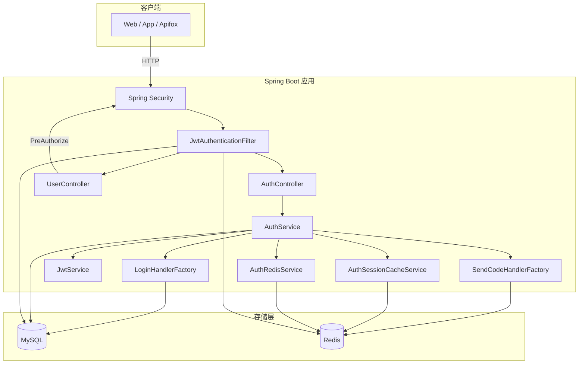

---

## 二、分层结构

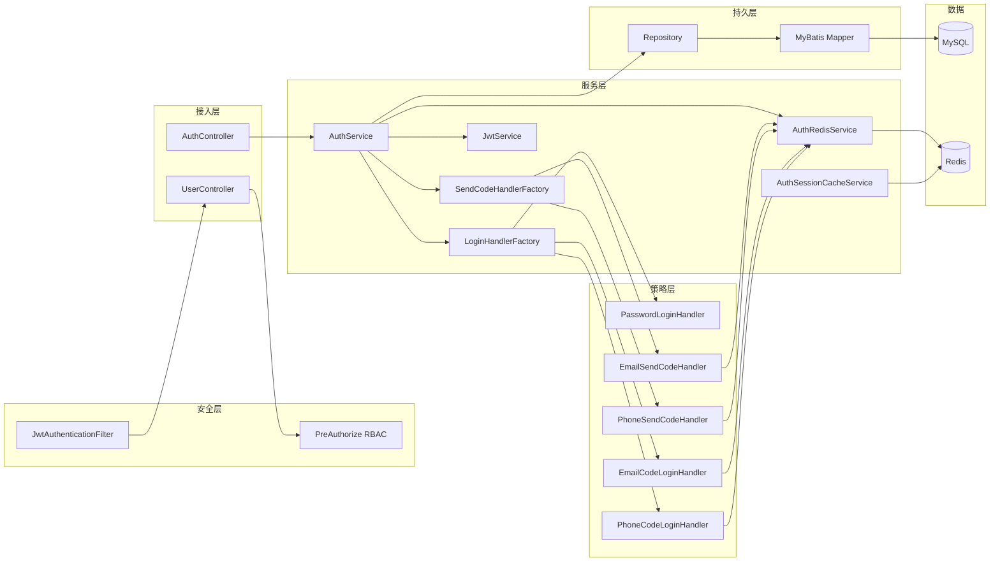

---

## 三、数据库与 Redis 职责

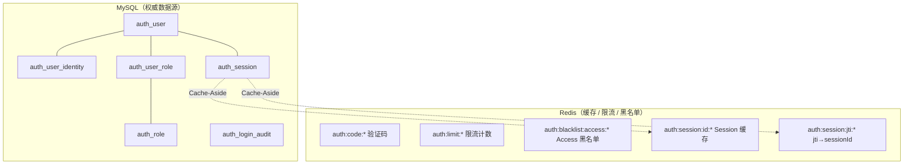

| 存储 | 内容 | 说明 |
|------|------|------|
| **MySQL** | 用户、身份、Session、角色、审计 | 持久化、可审计、可撤销 |
| **Redis** | 验证码、限流、Access 黑名单、Session 缓存 | 高性能、TTL 自动过期 |

---

## 四、工厂 + 策略模式（登录 / 发码）

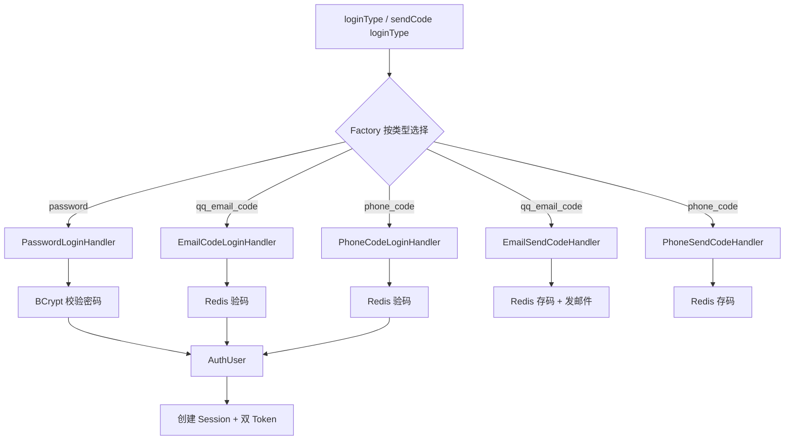

**Spring 注入：** `List<LoginHandler>` / `List<SendCodeHandler>` 自动收集所有 `@Component` 实现。

---

## 五、发送验证码流程

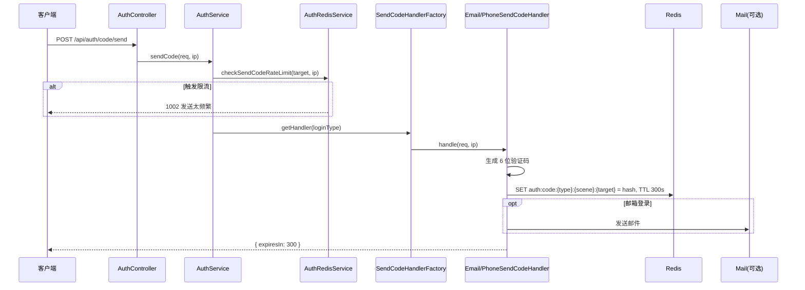

---

## 六、登录流程（统一入口）

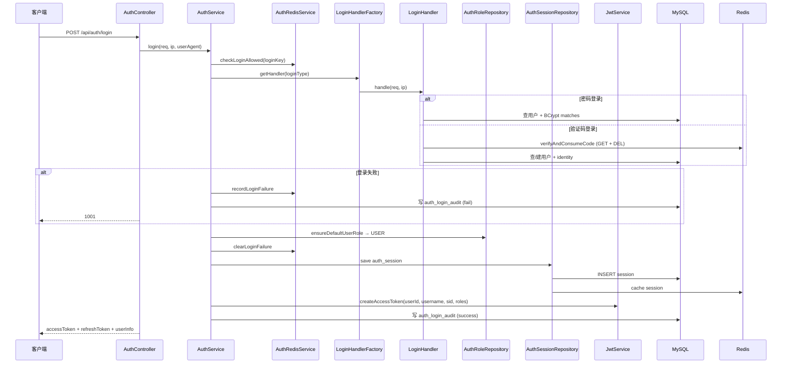

---

## 七、JWT 鉴权流程（受保护 API）

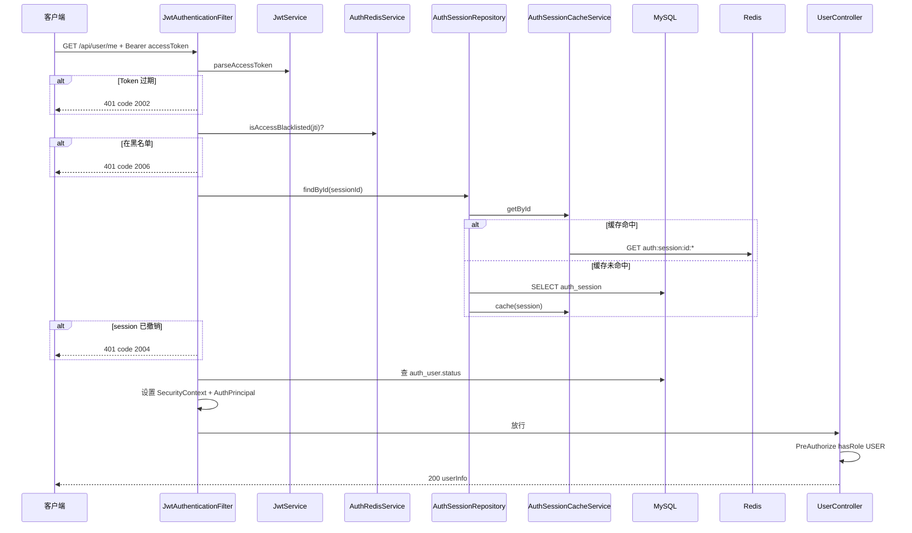

**公开接口（不过滤器）：** `/api/auth/login`、`/refresh`、`/code/send`、`/logout`

---

## 八、Refresh Token 刷新（Rotation）

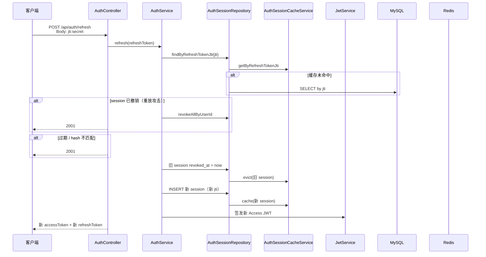

> **注意：** 每次刷新后 Refresh Token 会变化，前端必须覆盖保存。

---

## 九、登出流程

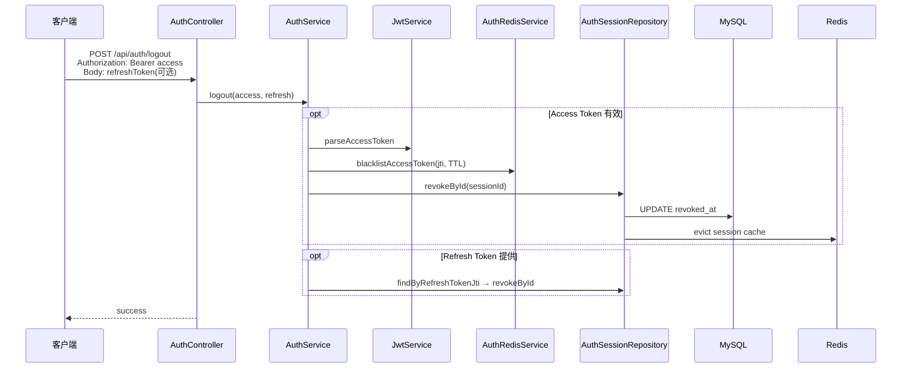

---

## 十、Session 缓存（Cache-Aside）

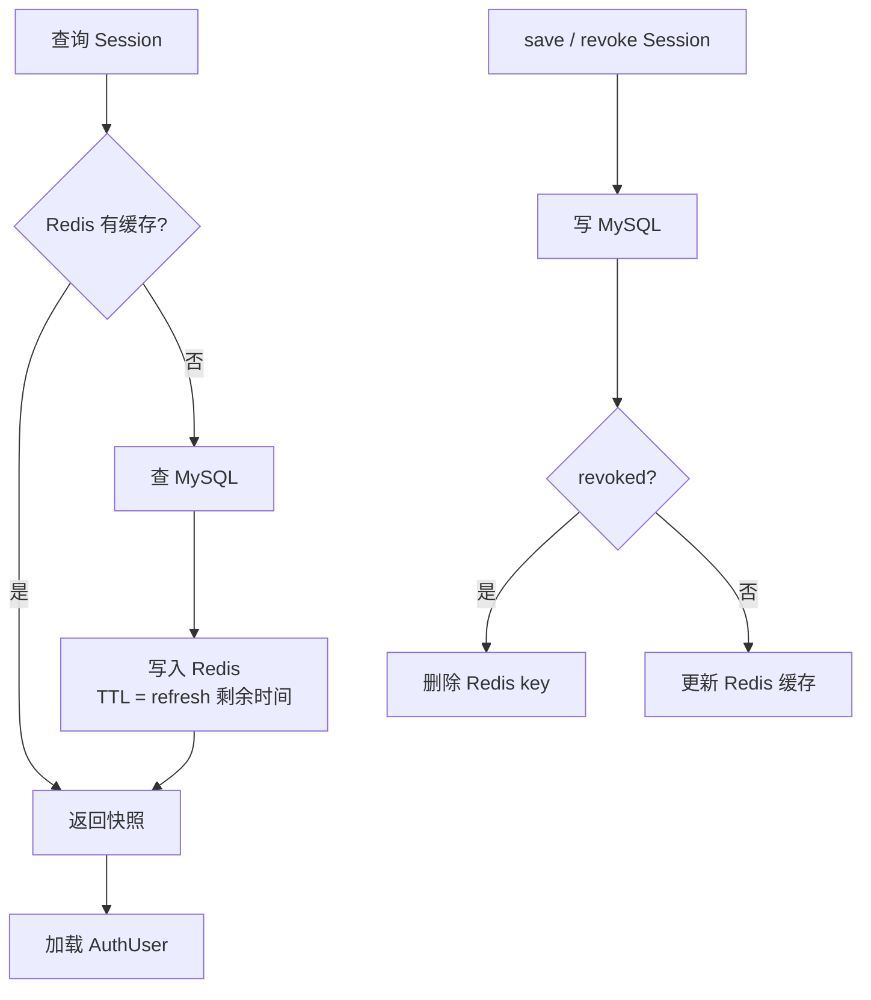

---

## 十一、RBAC 权限（当前仅 USER）

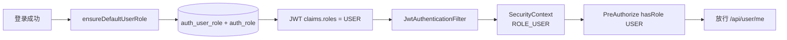

---

## 十二、API 总览

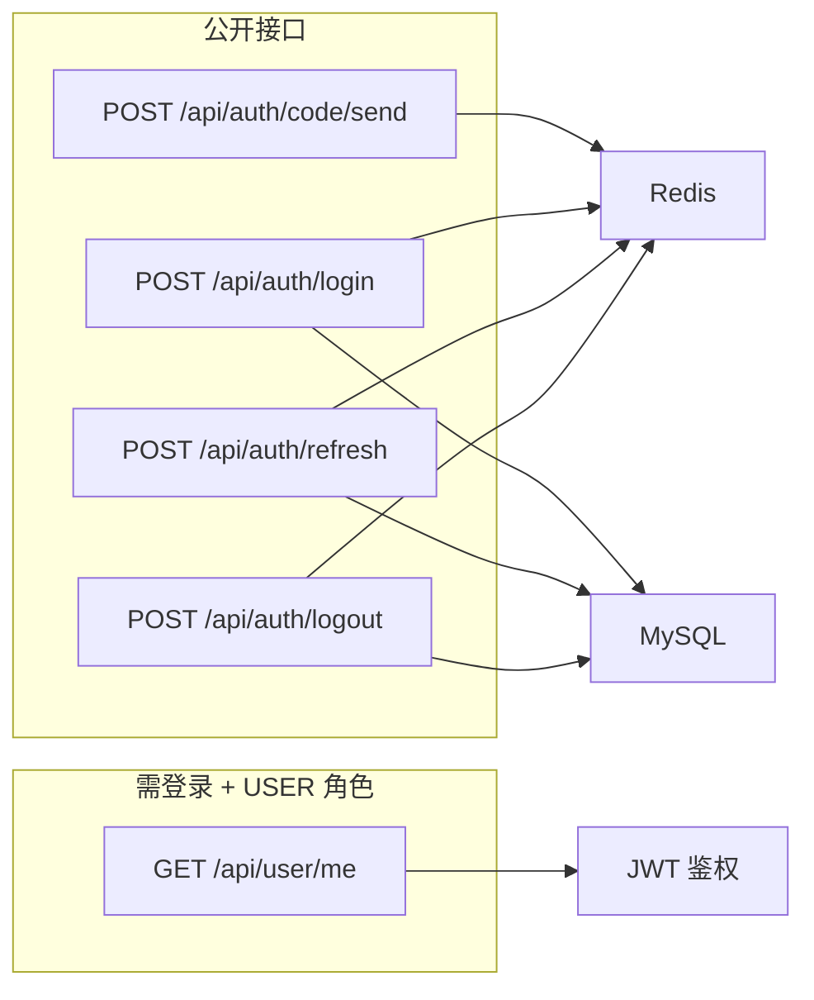

---

## 十三、端到端用户旅程

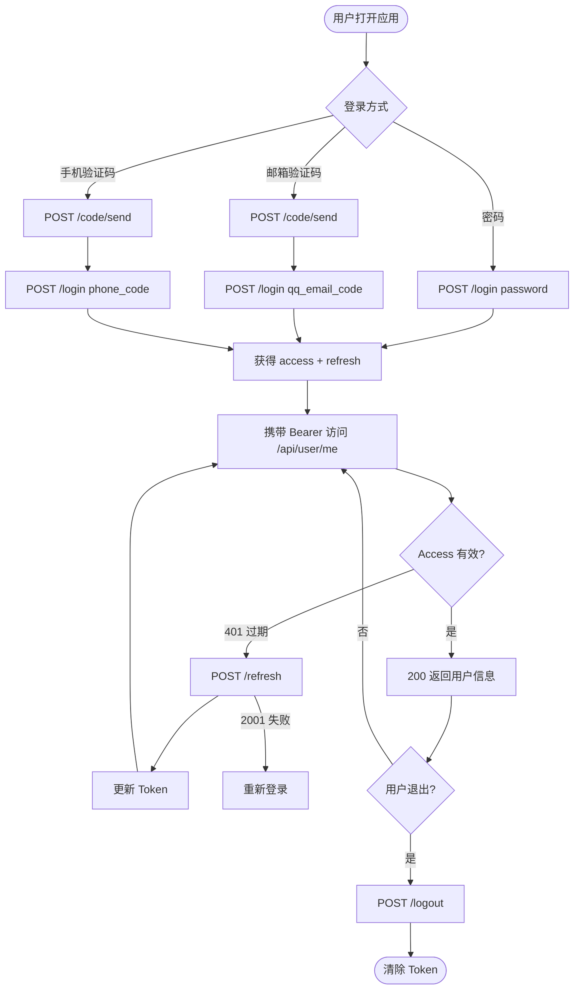

---

## 十四、错误码速查

| code | HTTP | 场景 |
|------|------|------|
| 0 | 200 | 成功 |
| 1001 | 200 | 登录凭证错误 |
| 1002 | 200 | 参数错误 / 限流 |
| 2001 | 200 | Refresh 无效 |
| 2002 | 401 | Access 过期 |
| 2003 | 401 | Token 无效 / 未授权 |
| 2004 | 401 | Session 已撤销 |
| 2005 | 401 | 用户禁用 |
| 2006 | 401 | Access 已拉黑（登出） |
| 3001 | 403 | 无权限 |

---

## 十五、相关文档

- [接口文档](./接口文档.md)
- [前后端联调文档](./前后端联调文档.md)
- [工厂模式学习文档](./工厂模式学习文档.md)
- [双Token登录学习文档](./双Token登录学习文档.md)
- [JWT-Refresh-Token完整链路](./JWT-Refresh-Token完整链路.md)
- [大二项目规划指南](./大二项目规划指南.md)
